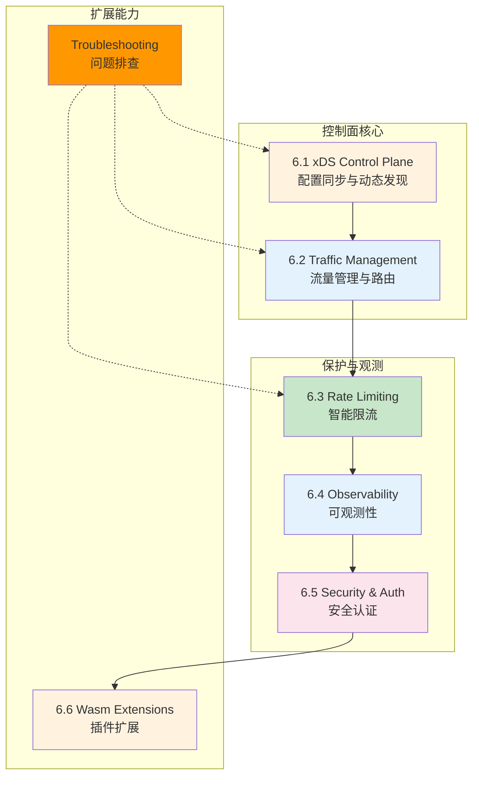
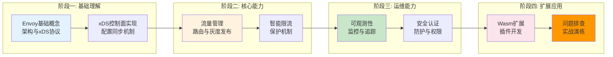
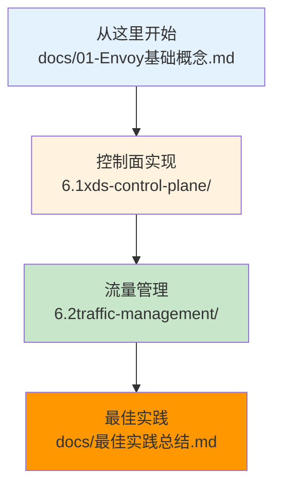

# Week 6: Envoy AI 网关控制面技术专题

> 系统学习 Envoy 在 AI 网关场景下的控制面技术，涵盖 xDS 协议、流量管理、限流、可观测性、安全认证与 Wasm 扩展。

---

## 学习系列总览

本项目涵盖 Envoy AI 网关的六大核心专题：



---

## 快速导航

| 文件 | 说明 |
|------|------|
| [docs/01-Envoy基础概念.md](docs/01-Envoy基础概念.md) | 📖 **理论基础** - Envoy 架构、xDS 协议、数据面/控制面分离 |
| [docs/02-流量管理与路由.md](docs/02-流量管理与路由.md) | 📖 **核心实践** - 虚拟服务、流量分割、镜像、超时重试 |
| [docs/03-负载均衡与限流.md](docs/03-负载均衡与限流.md) | 📖 **核心实践** - L4/L7 LB、局部/全局限流、AI 场景限流策略 |
| [docs/04-可观测性与监控.md](docs/04-可观测性与监控.md) | 📖 **运维能力** - 访问日志、Metrics、Tracing、AI 指标定制 |
| [docs/05-安全与认证.md](docs/05-安全与认证.md) | 📖 **安全防护** - mTLS、JWT/OIDC、RBAC、API Key 管理 |
| [docs/06-扩展与自定义.md](docs/06-扩展与自定义.md) | 📖 **扩展能力** - Wasm 插件、Lua 脚本、Filter 开发 |
| [docs/最佳实践总结.md](docs/最佳实践总结.md) | 📋 **实践总结** - 场景化配置建议、常见问题、性能优化 |

| 子项目 | 核心技术 | 学习文档 |
|------|----------|----------|
| [6.1xds-control-plane/](6.1xds-control-plane/) | xDS 控制面实现 | [docs/README.md](6.1xds-control-plane/docs/README.md) |
| [6.2traffic-management/](6.2traffic-management/) | AI 场景流量管理 | [docs/README.md](6.2traffic-management/docs/README.md) |
| [6.3rate-limiting/](6.3rate-limiting/) | 智能限流 | [docs/README.md](6.3rate-limiting/docs/README.md) |
| [6.4observability/](6.4observability/) | 可观测性与监控 | [docs/README.md](6.4observability/docs/README.md) |
| [6.5security-auth/](6.5security-auth/) | 安全与认证 | [docs/README.md](6.5security-auth/docs/README.md) |
| [6.6wasm-extensions/](6.6wasm-extensions/) | Wasm 插件扩展 | [docs/README.md](6.6wasm-extensions/docs/README.md) |

---

## 核心特性

```
┌─────────────────────────────────────────────────────────────────────────┐
│                    Envoy AI 网关核心能力                                  │
├─────────────────────────────────────────────────────────────────────────┤
│  ✅ xDS动态配置      - 控制面Server实现、配置快照与增量更新                │
│  ✅ AI流量管理       - 模型灰度发布、A/B测试、多模型路由                   │
│  ✅ 智能限流         - Token速率控制、并发限制、配额管理                   │
│  ✅ 可观测性         - TTFT/TPOT监控、分布式追踪、Grafana面板              │
│  ✅ 安全认证         - mTLS、JWT/OIDC、RBAC、API Key管理                  │
│  ✅ Wasm扩展        - Token计数、请求审计、自定义路由逻辑                  │
└─────────────────────────────────────────────────────────────────────────┘
```

---

## 项目结构

```
week6-envoy-ai-gateway/
│
├── docs/                              # 📖 详解层文档
│   ├── 01-Envoy基础概念.md             # Envoy架构与xDS协议
│   ├── 02-流量管理与路由.md            # 流量管理与路由策略
│   ├── 03-负载均衡与限流.md            # 负载均衡与限流机制
│   ├── 04-可观测性与监控.md            # 可观测性与AI指标
│   ├── 05-安全与认证.md               # 安全认证与权限控制
│   ├── 06-扩展与自定义.md              # Wasm插件与Filter开发
│   └── 最佳实践总结.md                 # 场景化配置与性能优化
│
├── 6.1xds-control-plane/              # 🔧 xDS控制面实现
│   ├── README.md                      # 概览：xDS Server架构
│   ├── docs/README.md                 # 详解：xDS协议与控制面实现
│   ├── pkg/                           # 核心代码
│   ├── config/                        # 配置文件
│   └── manifests/                     # 部署清单
│
├── 6.2traffic-management/             # 🔧 AI场景流量管理
│   ├── README.md                      # 概览：流量路由策略
│   ├── docs/README.md                 # 详解：灰度发布与A/B测试
│   ├── pkg/                           # 路由逻辑
│   ├── config/                        # 流量规则
│   └── manifests/                     # 部署示例
│
├── 6.3rate-limiting/                  # 🔧 智能限流
│   ├── README.md                      # 概览：限流策略
│   ├── docs/README.md                 # 详解：局部/全局限流
│   ├── pkg/                           # 限流实现
│   ├── config/                        # 限流配置
│   └── manifests/                     # 限流示例
│
├── 6.4observability/                  # 🔧 可观测性
│   ├── README.md                      # 概览：监控架构
│   ├── docs/README.md                 # 详解：指标与追踪
│   ├── pkg/                           # 指标采集
│   ├── config/                        # Stats配置
│   └── manifests/                     # 监控集成
│
├── 6.5security-auth/                  # 🔧 安全认证
│   ├── README.md                      # 概览：认证架构
│   ├── docs/README.md                 # 详解：mTLS与JWT
│   ├── pkg/                           # 认证实现
│   ├── config/                        # 认证策略
│   └── manifests/                     # 安全配置
│
├── 6.6wasm-extensions/                # 🔧 Wasm扩展
│   ├── README.md                      # 概览：Wasm插件
│   ├── docs/README.md                 # 详解：插件开发
│   ├── pkg/                           # 插件示例
│   ├── config/                        # 插件配置
│   └── manifests/                     # 扩展示例
│
└── troubleshooting/                   # 🔧 问题排查
    ├── README.md                      # 概览：排查框架
    ├── docs/README.md                 # 详解：分层排查
    └── scripts/                       # 诊断脚本
```

---

## 学习路线



---

## 前置知识

| 知识点 | 来源 | 在本专题中的应用 |
|--------|------|------------------|
| Gateway API | Week 5 | Envoy Gateway API 集成 |
| Envoy ext-proc | Week 5 | EPP 外部处理器回调 |
| Kubernetes 服务发现 | Week 1-2 | xDS EDS 动态端点 |
| 网络基础概念 | Week 3 | L4/L7 负载均衡 |

---

## 使用示例

### xDS 动态配置

```yaml
# ============================================================
# 示例: xDS Server 动态更新路由配置
# ============================================================
apiVersion: gateway.networking.k8s.io/v1
kind: HTTPRoute
metadata:
  name: model-router
spec:
  rules:
    - matches:
        - path:
            value: /v1/chat/completions
      backendRefs:
        - name: model-v1
          weight: 90    # 金丝雀发布：v1 90%
        - name: model-v2
          weight: 10    # v2 10%
```

### AI 场景限流

```yaml
# ============================================================
# 示例: 基于 Token 速率的限流配置
# ============================================================
# 免费用户：100 tokens/min
# VIP用户：1000 tokens/min

apiVersion: v1
kind: ConfigMap
metadata:
  name: ratelimit-config
data:
  config.yaml: |
    domain: ai-gateway
    descriptors:
      - key: user_tier
        value: free
        rate_limit:
          requests_per_unit: 100
          unit: minute
      - key: user_tier
        value: vip
        rate_limit:
          requests_per_unit: 1000
          unit: minute
```

---

## 核心收获

完成本专题学习后，你将掌握：

| 能力维度 | 具体收获 |
|----------|----------|
| **控制面理解** | xDS 协议原理、配置同步机制、增量更新 |
| **流量管理** | 灰度发布、A/B 测试、模型路由、故障转移 |
| **限流保护** | Token 速率控制、并发限制、配额管理 |
| **可观测性** | TTFT/TPOT 监控、分布式追踪、Grafana 面板 |
| **安全防护** | mTLS、JWT/OIDC、RBAC、API Key 管理 |
| **扩展开发** | Wasm 插件开发、自定义 Filter、热加载 |
| **排查能力** | 配置检查、xDS 同步调试、性能分析 |

---

## 推荐开源项目

| 项目 | 链接 | 研读重点 |
|------|------|----------|
| Envoy Proxy | https://github.com/envoyproxy/envoy | xDS 协议、Filter 链、扩展机制 |
| Envoy Gateway | https://github.com/envoyproxy/gateway | Kubernetes 集成、Gateway API 映射 |
| Gloo Gateway | https://github.com/solo-io/gloo | 企业级网关功能、Wasm 插件 |
| Istio | https://github.com/istio/istio | 控制面 (Pilot)、流量管理、mTLS |
| Envoy ratelimit | https://github.com/envoyproxy/ratelimit | 全局限流服务 |
| LiteLLM Proxy | https://github.com/BerriAI/litellm | 多模型统一网关、限流、监控 |
| Kserve | https://github.com/kserve/kserve | 推理网关、模型路由 |

---

## 扩展业务场景

完成本专题后，你将能够用 Envoy 技术解决以下业务问题：

| 场景 | Envoy 技术方案 |
|------|----------------|
| AI 模型成本优化路由 | Wasm 插件 + 自定义 LoadBalancer |
| 流式响应处理 (SSE) | Stream Filter + 实时指标采集 |
| 多租户配额管理 | JWT + RBAC + Global Rate Limit |
| 模型预热与缓存 | 健康检查 + EDS 动态权重 |
| 请求队列与优先级 | 自定义 Filter + 优先级队列 |
| 模型调用审计 | Wasm 插件异步发送审计日志 |
| 动态模型降级 | Outlier Detection + 路由规则 |
| 跨地域网关路由 | GeoIP + 地域优先路由 |

---

## 开始学习

**推荐路径：**



详见 **[docs/01-Envoy基础概念.md](docs/01-Envoy基础概念.md)** 开始学习。

---

> 本专题遵循 [AGENTS.md](../AGENTS.md) 中定义的风格规范。
