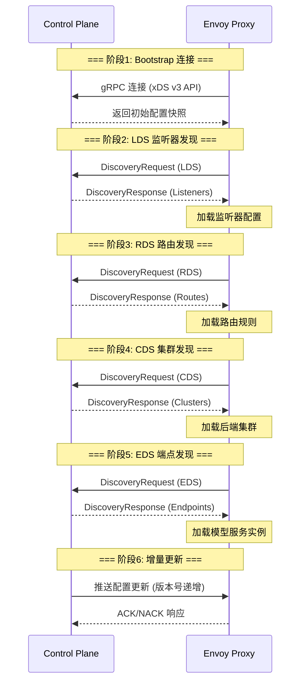
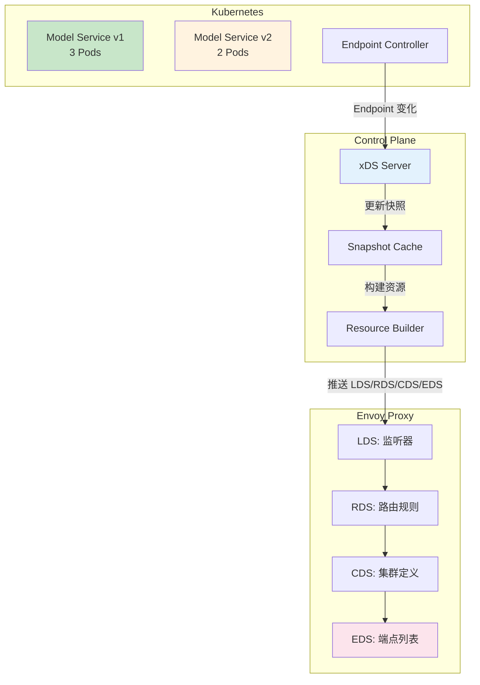

# 6.1 xDS 控制面实现

> 学习 Envoy xDS 协议原理，实现控制面 Server 动态配置同步与模型服务发现。

---

## 快速导航

| 文件 | 说明 |
|------|------|
| [docs/README.md](docs/README.md) | 📖 **完整学习文档** - xDS 协议详解、控制面实现、增量更新机制 |
| [pkg/controlplane/server.go](pkg/controlplane/server.go) | xDS Server 核心实现 |
| [pkg/snapshot/cache.go](pkg/snapshot/cache.go) | 配置快照缓存管理 |
| [pkg/resource/builder.go](pkg/resource/builder.go) | 资源构建器 (LDS/RDS/CDS/EDS) |
| [config/envoy-bootstrap.yaml](config/envoy-bootstrap.yaml) | Envoy 启动配置 |
| [manifests/01-control-plane-deploy.yaml](manifests/01-control-plane-deploy.yaml) | 控制面部署示例 |
| [manifests/02-envoy-proxy.yaml](manifests/02-envoy-proxy.yaml) | Envoy Proxy 部署示例 |

---

## 核心特性

```
┌─────────────────────────────────────────────────────────────┐
│                  xDS 控制面核心能力                           │
├─────────────────────────────────────────────────────────────┤
│  ✅ xDS协议理解   - LDS/RDS/CDS/EDS 协议流程与资源类型        │
│  ✅ 控制面实现    - gRPC Server、配置快照、增量推送           │
│  ✅ 动态服务发现  - AI 模型 Endpoint 自动注册与更新            │
│  ✅ 配置版本管理  - 版本号管理、灰度下发、故障回滚             │
│  ✅ AI场景集成    - 模型服务发现、健康检查、路由动态更新        │
└─────────────────────────────────────────────────────────────┘
```

---

## 项目结构

```
6.1xds-control-plane/
├── README.md                          # 本文档
├── docs/README.md                     # 详解：xDS协议与控制面实现
├── pkg/
│   ├── controlplane/
│   │   └── server.go                 # xDS gRPC Server 实现
│   ├── snapshot/
│   │   └── cache.go                  # 配置快照与版本管理
│   └── resource/
│       └── builder.go                # LDS/RDS/CDS/EDS 资源构建
├── config/
│   └── envoy-bootstrap.yaml          # Envoy Bootstrap 配置
└── manifests/
    ├── 01-control-plane-deploy.yaml  # 控制面 Deployment
    └── 02-envoy-proxy.yaml           # Envoy Proxy Sidecar
```

---

## xDS 协议流程



---

## AI 场景：模型服务动态发现



---

## 使用示例

### 控制面配置更新

```go
// === 步骤1: 创建控制面 Server ===
server := controlplane.NewServer()

// === 步骤2: 构建模型服务快照 ===
snapshot := snapshot.NewSnapshot(
    snapshot.WithVersion("v1.0.0"),
    snapshot.WithListeners(buildListeners()),
    snapshot.WithRoutes(buildRoutes()),
    snapshot.WithClusters(buildClusters()),
    snapshot.WithEndpoints(buildEndpoints()),
)

// === 步骤3: 更新快照缓存 ===
cache.UpdateSnapshot("ai-gateway-node-1", snapshot)

// === 步骤4: Envoy 自动拉取配置 ===
// Envoy 通过 gRPC 流接收配置更新
```

详见 **[docs/README.md](docs/README.md)** 获取 xDS 协议与控制面实现详解。
