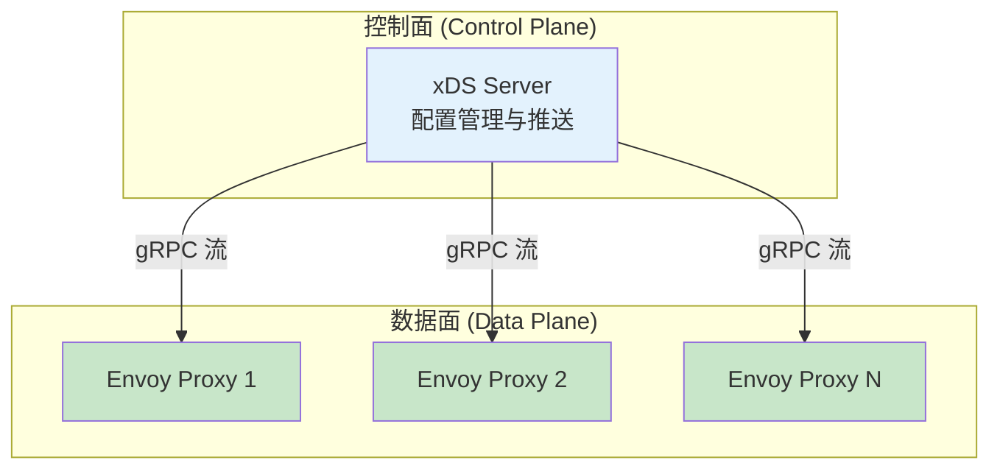
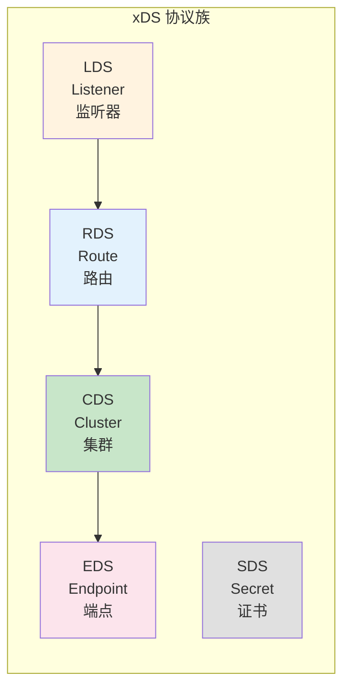
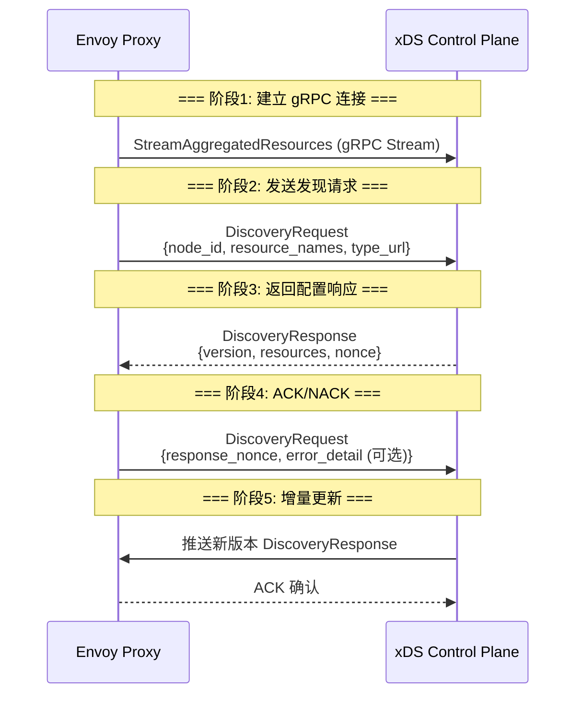
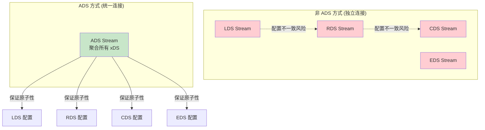
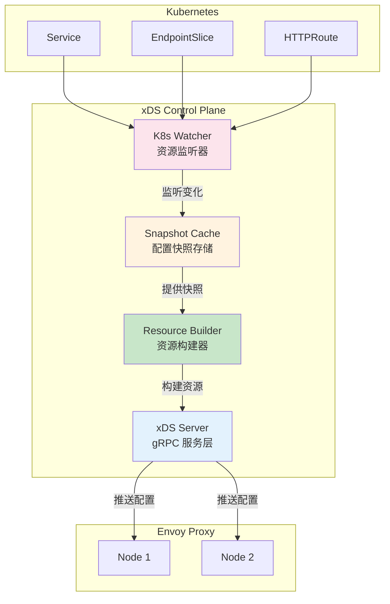
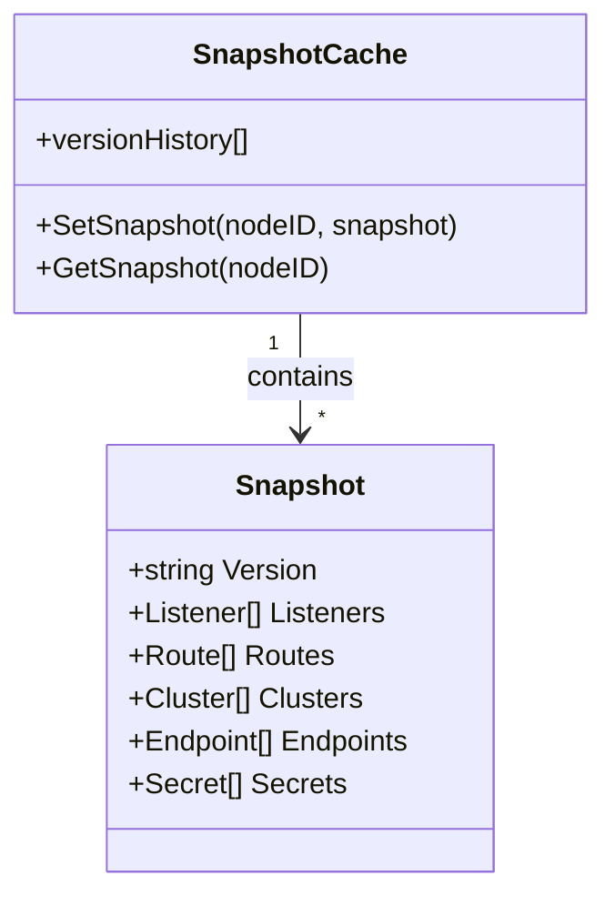
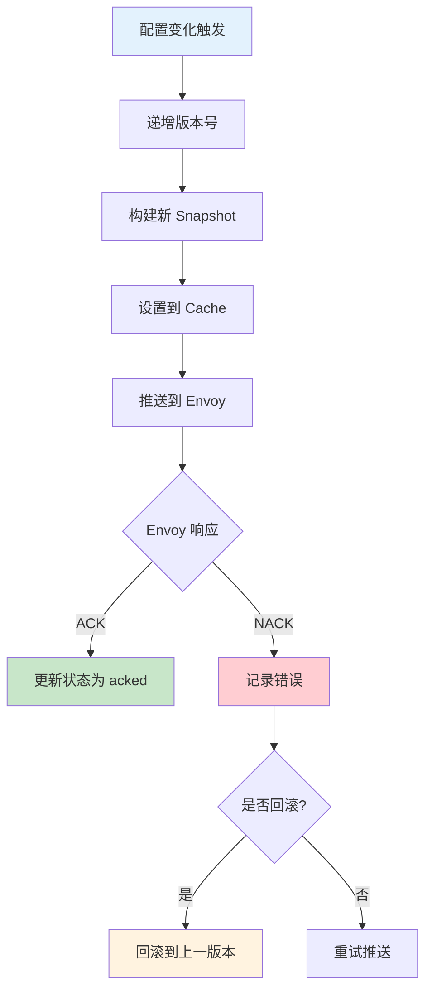
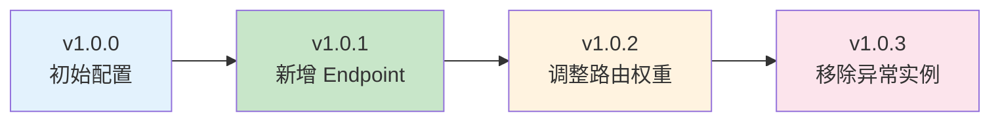
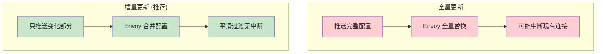
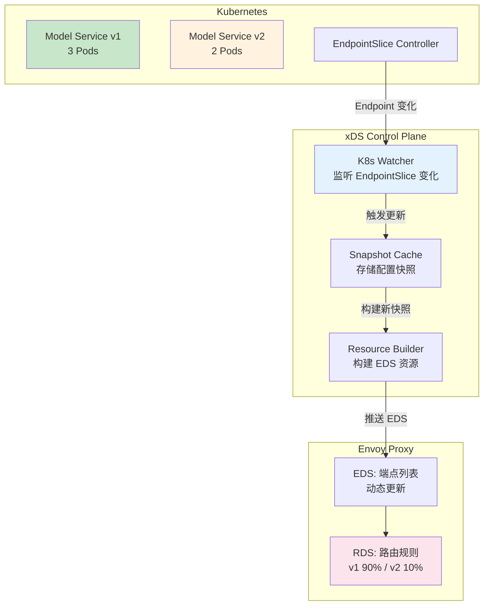

# xDS 控制面实现详解

> 深入理解 Envoy xDS 协议原理，掌握控制面 Server 实现与 AI 场景动态服务发现。

---

## 目录

- [1. 概述](#1-概述)
- [2. xDS 协议核心概念](#2-xds-协议核心概念)
- [3. 控制面架构设计](#3-控制面架构设计)
- [4. 资源类型详解](#4-资源类型详解)
- [5. 配置版本与增量更新](#5-配置版本与增量更新)
- [6. AI 场景：模型服务动态发现](#6-ai-场景模型服务动态发现)
- [7. 最佳实践](#7-最佳实践)

---

## 1. 概述

### 1.1 什么是 xDS

xDS 是 Envoy 的**动态配置发现协议** (Discovery Service)，允许控制面 (Control Plane) 向数据面 (Data Plane) 动态推送配置，无需重启 Envoy 进程。



**核心优势：**

| 特性 | 说明 |
|------|------|
| **动态更新** | 配置变化实时推送，无需重启 |
| **增量同步** | 只推送变化的配置部分 |
| **版本控制** | 支持配置版本管理与回滚 |
| **一致性保证** | 聚合发现 (ADS) 保证配置原子性 |

### 1.2 xDS 协议族



| 协议 | 资源类型 | 作用 | 依赖关系 |
|------|----------|------|----------|
| **LDS** | Listener | 定义监听地址、端口、Filter 链 | → 引用 RDS |
| **RDS** | RouteConfiguration | 定义路由规则、虚拟主机、权重分流 | → 引用 CDS |
| **CDS** | Cluster | 定义后端集群、负载均衡策略、健康检查 | → 引用 EDS |
| **EDS** | ClusterLoadAssignment | 定义具体端点列表 (IP:Port) | 最终目标 |
| **SDS** | Secret | 动态证书管理 (mTLS 场景) | 独立 |

---

## 2. xDS 协议核心概念

### 2.1 发现请求与响应流程



**关键字段说明：**

| 字段 | 说明 | 方向 |
|------|------|------|
| `node_id` | Envoy 节点唯一标识 | Request |
| `resource_names` | 请求的资源名称列表 | Request |
| `type_url` | 资源类型 (Listener/Route/Cluster/Endpoint) | Request |
| `version` | 配置版本号 (递增) | Response |
| `resources` | 实际资源配置 (Protobuf 序列化) | Response |
| `nonce` | 随机数，用于匹配 Request/Response | Both |
| `error_detail` | 应用配置失败时的错误信息 | Request (NACK) |

### 2.2 ADS 聚合发现服务

**为什么需要 ADS？**



| 方式 | 优点 | 缺点 | 适用场景 |
|------|------|------|----------|
| **独立连接** | 简单、资源隔离 | 配置可能不一致、连接数多 | 测试环境 |
| **ADS** | 配置原子性、连接数少 | 实现复杂 | **生产环境推荐** |

---

## 3. 控制面架构设计

### 3.1 核心组件



### 3.2 Snapshot 快照管理

**Snapshot 结构：**



**版本管理流程：**



---

## 4. 资源类型详解

### 4.1 LDS: Listener 监听器

**作用：** 定义 Envoy 如何接收流量 (地址、端口、Filter 链)

**AI 网关场景示例：**

```yaml
# ============================================================
# Listener: AI 网关监听器
# ============================================================
name: ai-gateway-listener
address: 0.0.0.0:8080
filter_chains:
  - filters:
      - name: envoy.filters.network.http_connection_manager
        typed_config:
          stat_prefix: ai_gateway
          rds:
            route_config_name: ai-gateway-routes  # → 引用 RDS
```

### 4.2 RDS: Route 路由

**作用：** 定义请求如何路由到后端集群 (路径匹配、权重分流)

**AI 模型路由示例 (金丝雀发布)：**

```yaml
# ============================================================
# Route: 模型路由 (v1 90%, v2 10%)
# ============================================================
name: ai-gateway-routes
virtual_hosts:
  - name: ai-gateway-vhost
    domains: ["*"]
    routes:
      - match:
          prefix: /v1/chat/completions
        route:
          weighted_clusters:
            clusters:
              - name: model-service-v1
                weight: 90    # → 引用 CDS
              - name: model-service-v2
                weight: 10    # → 引用 CDS
```

### 4.3 CDS: Cluster 集群

**作用：** 定义后端服务集群 (负载均衡策略、健康检查、连接池)

**模型服务集群示例：**

```yaml
# ============================================================
# Cluster: 模型服务 v1 集群
# ============================================================
name: model-service-v1
type: EDS                    # 端点从 EDS 动态获取
lb_policy: ROUND_ROBIN
connect_timeout: 5s
eds_cluster_config:
  eds_config:
    ads: {}                  # → 引用 EDS
```

### 4.4 EDS: Endpoint 端点

**作用：** 定义具体的服务实例列表 (IP:Port)

**模型服务端点示例：**

```yaml
# ============================================================
# Endpoint: 模型服务 v1 的 3 个实例
# ============================================================
cluster_name: model-service-v1
endpoints:
  - lb_endpoints:
      - endpoint:
          address: 10.0.1.10:8000
      - endpoint:
          address: 10.0.1.11:8000
      - endpoint:
          address: 10.0.1.12:8000
```

---

## 5. 配置版本与增量更新

### 5.1 版本号管理



**版本递增规则：**

| 触发条件 | 版本号变化 | 示例 |
|----------|------------|------|
| Endpoint 增减 | +1 | Pod 扩缩容 |
| 路由规则变更 | +1 | 灰度发布调整权重 |
| 集群配置变更 | +1 | 修改负载均衡策略 |
| 监听器变更 | +1 | 新增端口监听 |

### 5.2 增量更新 vs 全量更新



| 方式 | 优点 | 缺点 | 适用场景 |
|------|------|------|----------|
| **全量更新** | 实现简单 | 可能中断连接、资源浪费 | 初始化 |
| **增量更新** | 平滑过渡、资源节省 | 实现复杂 | **日常更新** |

---

## 6. AI 场景：模型服务动态发现

### 6.1 场景描述

在 AI 推理服务中，模型服务实例可能因以下原因动态变化：
- HPA 自动扩缩容
- 模型版本更新 (v1 → v2)
- 节点故障导致 Pod 迁移
- 金丝雀发布逐步调整流量

**需求：** Envoy 需要实时感知端点变化，无需重启即可路由到新实例。

### 6.2 实现架构



### 6.3 代码实现要点

**步骤 1: 监听 Kubernetes EndpointSlice**

```go
// === 步骤1: 创建 EndpointSlice Watcher ===
watcher := NewEndpointSliceWatcher(clientset)

// === 步骤2: 注册变化回调 ===
watcher.OnChange(func(serviceName string, endpoints []string) {
    // 端点变化时触发
    UpdateEndpoints(serviceName, endpoints)
})
```

**步骤 2: 更新 Snapshot**

```go
// === 步骤3: 构建新 Snapshot ===
snapshot := BuildSnapshot(
    WithEndpoints(serviceName, endpoints),
    WithVersion(currentVersion + 1),
)

// === 步骤4: 推送到 Envoy ===
cache.UpdateSnapshot(nodeID, snapshot)
```

---

## 7. 最佳实践

### 7.1 配置管理

| 场景 | 推荐做法 | 原因 |
|------|----------|------|
| **版本命名** | 使用递增整数 (1, 2, 3...) | 简单、易比较 |
| **快照缓存** | 保留最近 5 个版本 | 支持快速回滚 |
| **推送策略** | 增量更新 + 定期全量校验 | 平衡性能与一致性 |
| **错误处理** | NACK 时记录详细错误信息 | 便于排查 |

### 7.2 性能优化

| 优化点 | 方法 | 效果 |
|--------|------|------|
| **减少推送频率** | 批量更新 (5s 窗口合并) | 降低 gRPC 负载 |
| **按需订阅** | Envoy 只订阅需要的资源 | 减少内存占用 |
| **连接复用** | 使用 ADS 而非独立连接 | 减少连接数 |
| **资源过滤** | 只推送变化的资源 | 减少网络传输 |

### 7.3 故障排查

| 问题 | 排查思路 | 工具 |
|------|----------|------|
| **配置未生效** | 检查 Envoy 是否 ACK | `envoy admin /config_dump` |
| **版本不一致** | 对比控制面与数据面版本号 | 日志对比 |
| **NACK 频繁** | 查看 error_detail 字段 | 控制面日志 |
| **连接断开** | 检查 gRPC KeepAlive 配置 | 网络抓包 |

---

## 附录

### A. 参考资料

- [Envoy xDS 协议官方文档](https://www.envoyproxy.io/docs/envoy/latest/api-docs/xds_protocol)
- [go-control-plane SDK](https://github.com/envoyproxy/go-control-plane)
- [Envoy Bootstrap 配置](https://www.envoyproxy.io/docs/envoy/latest/start/start#quick-start-to-run-simple-example)
