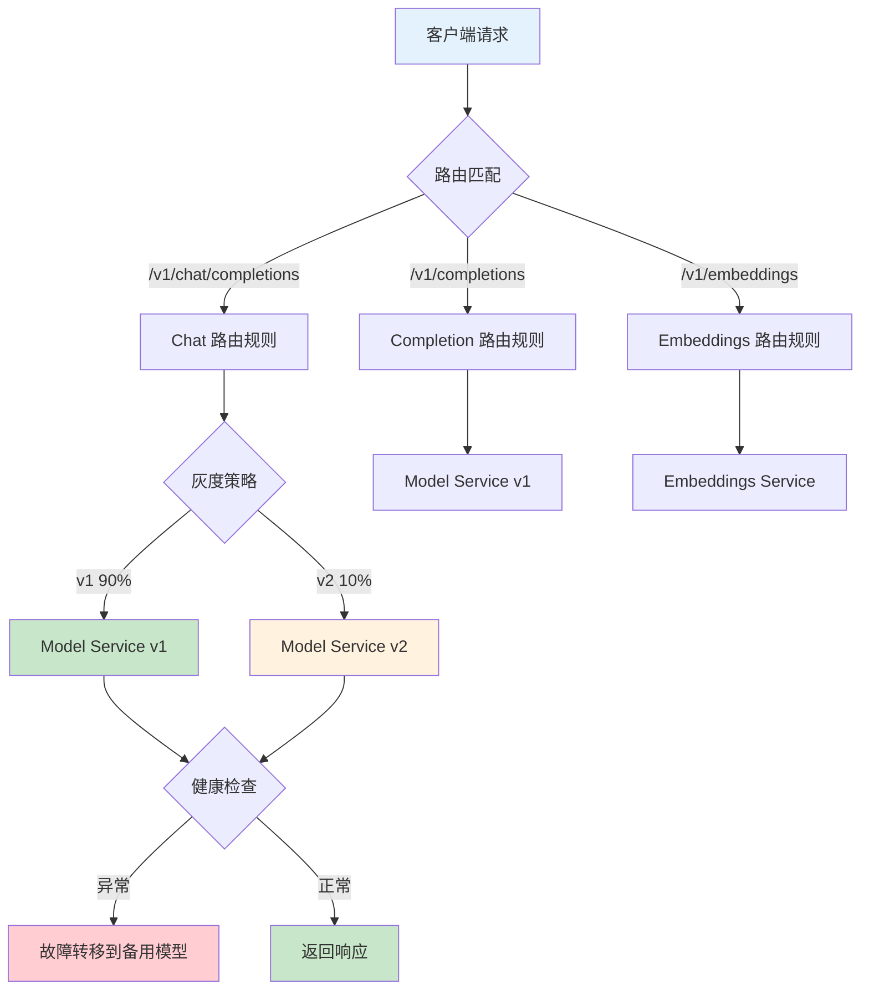

# 6.2 AI 场景流量管理

> 学习 Envoy 流量管理能力，掌握 AI 模型灰度发布、A/B 测试、多模型路由等场景实践。

---

## 快速导航

| 文件 | 说明 |
|------|------|
| [docs/README.md](docs/README.md) | 📖 **完整学习文档** - 流量路由、灰度发布、A/B 测试、故障转移 |
| [pkg/router/ai_router.go](pkg/router/ai_router.go) | AI 模型路由逻辑实现 |
| [config/traffic-rules.yaml](config/traffic-rules.yaml) | 流量规则配置示例 |
| [manifests/01-canary-deployment.yaml](manifests/01-canary-deployment.yaml) | 金丝雀发布示例 |
| [manifests/02-ab-testing.yaml](manifests/02-ab-testing.yaml) | A/B 测试示例 |
| [manifests/03-model-routing.yaml](manifests/03-model-routing.yaml) | 模型路由示例 |

---

## 核心特性

```
┌─────────────────────────────────────────────────────────────┐
│                  AI 流量管理核心能力                          │
├─────────────────────────────────────────────────────────────┤
│  ✅ 灰度发布      - 按权重分流流量，逐步验证新版本            │
│  ✅ A/B测试      - 根据Header/User-ID分流到不同模型           │
│  ✅ 多模型路由    - 按路径/域名路由到不同模型服务              │
│  ✅ 故障转移      - 主模型异常时自动切换到备用模型              │
│  ✅ 流量镜像      - 复制流量到测试环境，不影响生产              │
└─────────────────────────────────────────────────────────────┘
```

---

## 流量路由流程



---

## 使用示例

### 金丝雀发布配置

```yaml
# ============================================================
# 示例: 模型 v1 (90%) → v2 (10%) 灰度发布
# ============================================================
apiVersion: gateway.networking.k8s.io/v1
kind: HTTPRoute
metadata:
  name: model-canary
spec:
  rules:
    - matches:
        - path:
            value: /v1/chat/completions
      backendRefs:
        - name: model-v1
          weight: 90
        - name: model-v2
          weight: 10
```

详见 **[docs/README.md](docs/README.md)** 获取流量管理详解。
