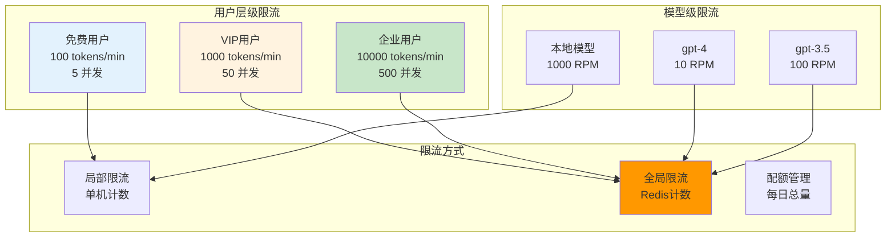

# 6.3 智能限流

> 学习 Envoy 局部限流与全局限流机制，掌握 AI 场景 Token 速率控制、并发限制、配额管理实践。

---

## 快速导航

| 文件 | 说明 |
|------|------|
| [docs/README.md](docs/README.md) | 📖 **完整学习文档** - 限流策略、Token 控制、配额管理、降级方案 |
| [pkg/ratelimit/local.go](pkg/ratelimit/local.go) | 局部限流实现 |
| [pkg/ratelimit/global.go](pkg/ratelimit/global.go) | 全局限流实现 (Redis) |
| [config/rate-limit-config.yaml](config/rate-limit-config.yaml) | 限流配置 (Token/并发/模型维度) |
| [manifests/01-local-ratelimit.yaml](manifests/01-local-ratelimit.yaml) | 局部限流示例 |
| [manifests/02-global-ratelimit.yaml](manifests/02-global-ratelimit.yaml) | 全局限流示例 |

---

## 核心特性

```
┌─────────────────────────────────────────────────────────────┐
│                  智能限流核心能力                              │
├─────────────────────────────────────────────────────────────┤
│  ✅ 局部限流      - 单节点限流，无需外部依赖                    │
│  ✅ 全局限流      - 多节点统一限流，基于 Redis                  │
│  ✅ Token控制     - 按 Token/分钟维度限流                      │
│  ✅ 并发限制      - 限制同时处理的请求数                        │
│  ✅ 配额管理      - 每日/每月配额控制，支持多租户                │
└─────────────────────────────────────────────────────────────┘
```

---

## AI 场景限流策略



---

## 使用示例

### Token 速率限流配置

```yaml
# ============================================================
# 示例: 按用户等级限流
# ============================================================
domain: ai-gateway
descriptors:
  - key: user_tier
    value: free
    rate_limit:
      requests_per_unit: 100
      unit: minute
  - key: user_tier
    value: vip
    rate_limit:
      requests_per_unit: 1000
      unit: minute
```

详见 **[docs/README.md](docs/README.md)** 获取限流策略详解。
