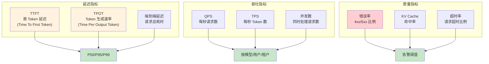

# 6.4 可观测性与监控

> 学习 Envoy 可观测性机制，掌握 AI 场景指标采集 (TTFT/TPOT)、分布式追踪、Grafana 面板配置。

---

## 快速导航

| 文件 | 说明 |
|------|------|
| [docs/README.md](docs/README.md) | 📖 **完整学习文档** - 访问日志、Metrics、Tracing、AI 指标定制 |
| [pkg/metrics/ai_metrics.go](pkg/metrics/ai_metrics.go) | AI 定制指标实现 |
| [pkg/tracing/span_processor.go](pkg/tracing/span_processor.go) | 追踪处理 |
| [config/envoy-stats-config.yaml](config/envoy-stats-config.yaml) | Stats 配置 |
| [manifests/01-prometheus-config.yaml](manifests/01-prometheus-config.yaml) | Prometheus 集成 |
| [manifests/02-jaeger-tracing.yaml](manifests/02-jaeger-tracing.yaml) | Jaeger 追踪 |
| [manifests/03-grafana-dashboard.yaml](manifests/03-grafana-dashboard.yaml) | Grafana 面板 |

---

## 核心特性

```
┌─────────────────────────────────────────────────────────────┐
│                  可观测性核心能力                              │
├─────────────────────────────────────────────────────────────┤
│  ✅ 访问日志      - 结构化日志，支持自定义字段                  │
│  ✅ Prometheus   - 定制 AI 指标 (TTFT/TPOT/Token 吞吐)        │
│  ✅ 分布式追踪    - OpenTelemetry/Jaeger 全链路追踪             │
│  ✅ Grafana面板  - QPS/延迟/错误率/Token 消耗可视化            │
│  ✅ 健康检查      - 模型服务就绪探测与性能监控                  │
└─────────────────────────────────────────────────────────────┘
```

---

## AI 监控指标体系



---

## 使用示例

### Prometheus 指标采集

```yaml
# ============================================================
# 示例: AI 定制指标配置
# ============================================================
stats_config:
  # 启用直方图统计
  histogram_bucket_settings:
    match:
      - "ai_gateway.*"
    buckets:
      - 10
      - 25
      - 50
      - 100
      - 250
      - 500
      - 1000
  
  # 自定义指标
  custom_metrics:
    - name: ai_ttft_ms
      type: histogram
      help: "Time To First Token (ms)"
    
    - name: ai_tpot_ms
      type: histogram
      help: "Time Per Output Token (ms)"
    
    - name: ai_tokens_total
      type: counter
      help: "Total tokens processed"
```

详见 **[docs/README.md](docs/README.md)** 获取可观测性详解。
