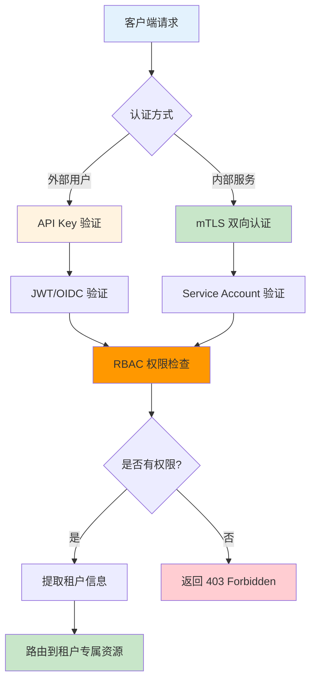

# 6.5 安全与认证

> 学习 Envoy 安全机制，掌握 mTLS、JWT/OIDC 认证、RBAC 权限控制、API Key 管理在 AI 网关场景的应用。

---

## 快速导航

| 文件 | 说明 |
|------|------|
| [docs/README.md](docs/README.md) | 📖 **完整学习文档** - mTLS、JWT/OIDC、RBAC、API Key 管理 |
| [pkg/auth/jwt_validator.go](pkg/auth/jwt_validator.go) | JWT 验证实现 |
| [pkg/rbac/policy_engine.go](pkg/rbac/policy_engine.go) | RBAC 策略引擎 |
| [config/auth-policy.yaml](config/auth-policy.yaml) | 认证策略配置 |
| [config/rbac-rules.yaml](config/rbac-rules.yaml) | RBAC 规则配置 |
| [manifests/01-mtls-config.yaml](manifests/01-mtls-config.yaml) | mTLS 配置示例 |
| [manifests/02-jwt-auth.yaml](manifests/02-jwt-auth.yaml) | JWT 认证示例 |
| [manifests/03-api-key-auth.yaml](manifests/03-api-key-auth.yaml) | API Key 认证示例 |

---

## 核心特性

```
┌─────────────────────────────────────────────────────────────┐
│                  安全认证核心能力                              │
├─────────────────────────────────────────────────────────────┤
│  ✅ mTLS         - 双向认证，服务间安全通信                   │
│  ✅ JWT/OIDC     - 集成外部身份提供商，统一认证                │
│  ✅ RBAC         - 路径/方法/Header 维度权限控制               │
│  ✅ API Key      - API Key 验证与管理                         │
│  ✅ 租户隔离      - 多租户场景下的资源隔离                      │
└─────────────────────────────────────────────────────────────┘
```

---

## AI 网关认证流程



---

## 使用示例

### JWT 认证配置

```yaml
# ============================================================
# 示例: JWT 认证 + RBAC 权限控制
# ============================================================
http_filters:
  - name: envoy.filters.http.jwt_authn
    typed_config:
      providers:
        - name: ai-gateway-provider
          issuer: https://auth.example.com
          audiences:
            - ai-gateway
          remote_jwks:
            uri: https://auth.example.com/.well-known/jwks.json
          forward: true  # 转发 JWT Payload 到后端

  - name: envoy.filters.http.rbac
    typed_config:
      rules:
        - name: "allow-chat-endpoint"
          match:
            request:
              paths:
                - /v1/chat/completions
          action: ALLOW
          condition:
            principal:
              jwt_claims:
                - claim: roles
                  values:
                    - ai_user
```

详见 **[docs/README.md](docs/README.md)** 获取安全认证详解。
