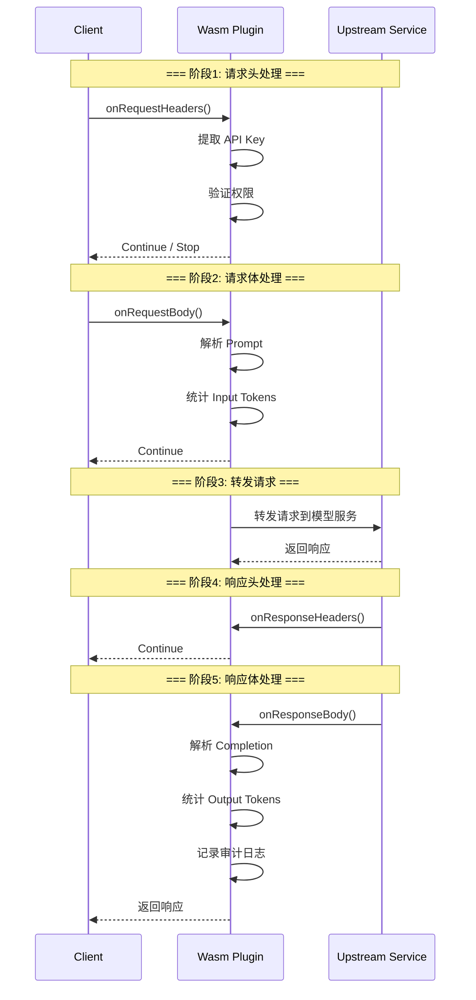

# 6.6 Wasm 插件扩展

> 学习 Envoy Wasm 运行时与插件开发，掌握 AI 场景 Token 计数、请求审计、自定义路由逻辑实现。

---

## 快速导航

| 文件 | 说明 |
|------|------|
| [docs/README.md](docs/README.md) | 📖 **完整学习文档** - Wasm SDK、插件开发、生命周期、热加载 |
| [pkg/wasm/plugin.go](pkg/wasm/plugin.go) | Wasm 插件示例 (Go) |
| [pkg/wasm/ai_token_counter.go](pkg/wasm/ai_token_counter.go) | Token 计数器实现 |
| [config/wasm-config.yaml](config/wasm-config.yaml) | Wasm 插件配置 |
| [manifests/01-wasm-extension.yaml](manifests/01-wasm-extension.yaml) | Wasm 扩展示例 |

---

## 核心特性

```
┌─────────────────────────────────────────────────────────────┐
│                  Wasm 扩展核心能力                             │
├─────────────────────────────────────────────────────────────┤
│  ✅ 插件开发      - TinyGo/Rust SDK，自定义 Filter             │
│  ✅ 生命周期      - onRequestHeaders/onResponseBody 拦截       │
│  ✅ Token计数    - 解析请求/响应 Body，统计 Token 消耗          │
│  ✅ 请求审计      - 异步发送调用日志到外部系统                  │
│  ✅ 动态决策      - 根据用户等级动态调整限流/路由                │
└─────────────────────────────────────────────────────────────┘
```

---

## Wasm 插件生命周期



---

## 使用示例

### Token 计数器插件

```go
// ============================================================
// Wasm 插件: AI Token 计数器
// ============================================================
// 拦截请求/响应，统计 Input/Output Tokens
// 上报到 Prometheus 指标

package main

import (
	"github.com/tetratelabs/proxy-wasm-go-sdk/proxywasm"
	"github.com/tetratelabs/proxy-wasm-go-sdk/proxywasm/types"
)

// onHttpRequestHeaders 请求头处理
func onHttpRequestHeaders(numHeaders int, endOfStream bool) types.Action {
	// === 步骤1: 提取 API Key ===
	apiKey, _ := proxywasm.GetHttpRequestHeader("x-api-key")
	
	// === 步骤2: 验证权限 ===
	if !isValidAPIKey(apiKey) {
		proxywasm.SendHttpResponse(403, nil, nil)
		return types.ActionPause
	}
	
	return types.ActionContinue
}

// onHttpResponseBody 响应体处理
func onHttpResponseBody(bodySize int, endOfStream bool) types.Action {
	// === 步骤1: 获取响应内容 ===
	body, _ := proxywasm.GetHttpResponseBody(0, bodySize)
	
	// === 步骤2: 统计 Output Tokens ===
	tokenCount := countTokens(body)
	
	// === 步骤3: 上报指标 ===
	proxywasm.LogInfof("Output tokens: %d", tokenCount)
	
	return types.ActionContinue
}
```

详见 **[docs/README.md](docs/README.md)** 获取 Wasm 插件开发详解。
