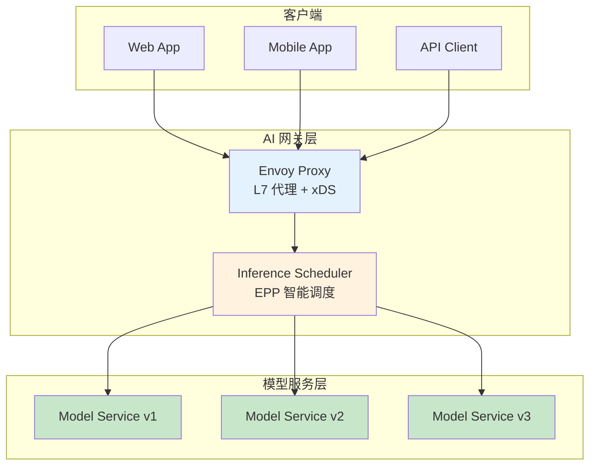
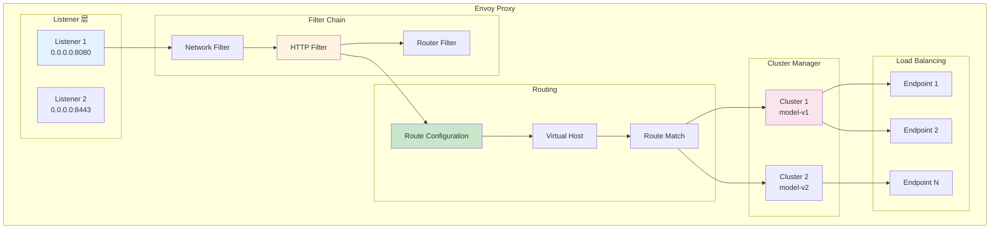
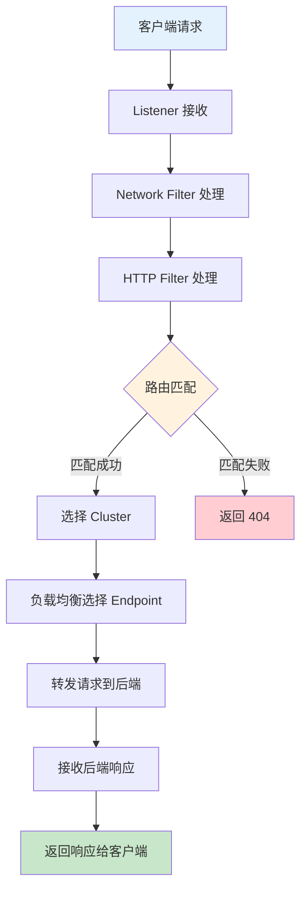
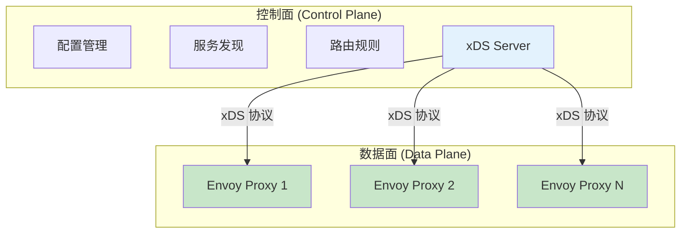
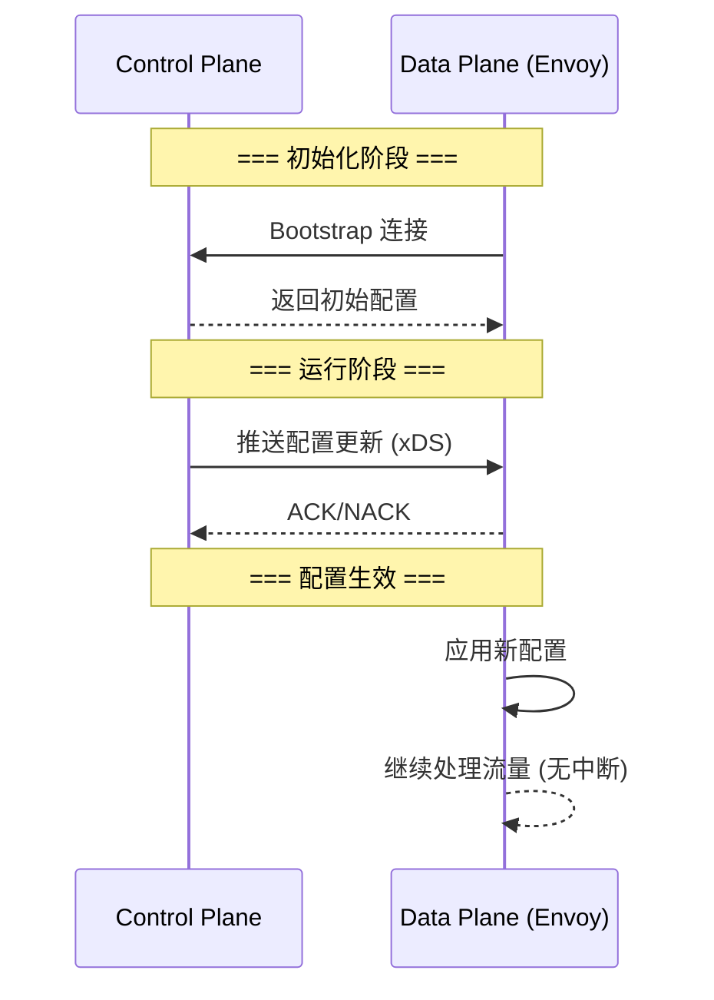
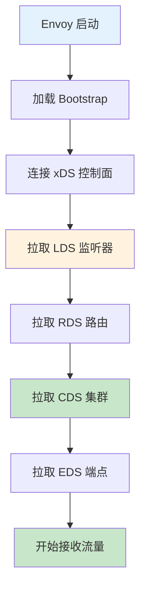
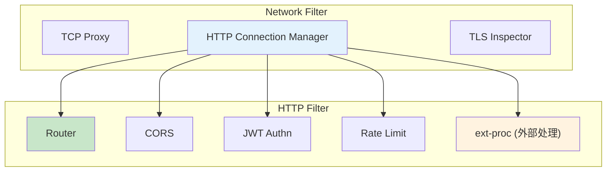
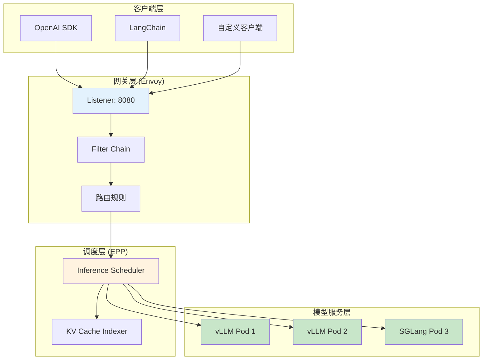

# Envoy 基础概念详解

> 深入理解 Envoy 架构设计、xDS 协议原理、数据面与控制面分离的核心思想。

---

## 目录

- [1. 概述](#1-概述)
- [2. Envoy 核心架构](#2-envoy-核心架构)
- [3. 数据面 vs 控制面](#3-数据面-vs-控制面)
- [4. xDS 协议详解](#4-xds-协议详解)
- [5. Filter 链机制](#5-filter-链机制)
- [6. AI 网关场景应用](#6-ai-网关场景应用)
- [7. 最佳实践](#7-最佳实践)

---

## 1. 概述

### 1.1 什么是 Envoy

Envoy 是一个**高性能、云原生的 L7 代理与 Service Mesh 数据面代理**，由 Lyft 开源，现为 CNCF 毕业项目。

**核心特性：**

| 特性 | 说明 | AI 场景应用 |
|------|------|-------------|
| **L4/L7 代理** | 同时支持 TCP/HTTP/gRPC 代理 | 代理 AI 模型 API (OpenAI 兼容) |
| **动态配置** | xDS 协议实现配置热更新 | 模型服务动态发现、路由调整 |
| **可观测性** | 内置 Metrics/Tracing/Logging | TTFT/TPOT 监控、调用审计 |
| **负载均衡** | 多种 L7 LB 策略 | 多模型实例流量分发 |
| **安全** | mTLS/JWT/RBAC | API Key 验证、租户隔离 |

### 1.2 Envoy 在 AI 网关中的定位



**Envoy 承担的职责：**

1. **流量入口**: 统一接收所有 AI API 请求
2. **路由分发**: 根据路径/Header 路由到不同模型服务
3. **限流保护**: Token 速率控制、并发限制
4. **安全认证**: API Key/JWT 验证
5. **可观测性**: 指标采集、分布式追踪

---

## 2. Envoy 核心架构

### 2.1 整体架构



### 2.2 请求处理流程



---

## 3. 数据面 vs 控制面

### 3.1 架构分离原理



**分离优势：**

| 维度 | 控制面职责 | 数据面职责 |
|------|------------|------------|
| **配置** | 生成与管理配置 | 接收并应用配置 |
| **性能** | 低频操作 (配置更新) | 高频操作 (请求转发) |
| **扩展** | 水平扩展控制面 | 独立扩展数据面 |
| **故障隔离** | 控制面故障不影响现有流量 | 数据面故障不影响配置管理 |

### 3.2 xDS 协议作用

xDS 是控制面与数据面的**通信协议**，实现动态配置推送。



---

## 4. xDS 协议详解

### 4.1 xDS 资源类型

| 资源 | 全称 | 作用 | 依赖 |
|------|------|------|------|
| **LDS** | Listener Discovery Service | 定义监听器 | → RDS |
| **RDS** | Route Discovery Service | 定义路由规则 | → CDS |
| **CDS** | Cluster Discovery Service | 定义后端集群 | → EDS |
| **EDS** | Endpoint Discovery Service | 定义端点列表 | - |
| **SDS** | Secret Discovery Service | 管理证书 | - |

### 4.2 配置加载顺序



---

## 5. Filter 链机制

### 5.1 Filter 类型



### 5.2 AI 场景 Filter 链

**典型 AI 网关 Filter 链配置：**

```yaml
# ============================================================
# Filter Chain: AI 网关完整处理链
# ============================================================
filters:
  # 步骤1: CORS 处理跨域
  - name: envoy.filters.http.cors
  
  # 步骤2: JWT 认证
  - name: envoy.filters.http.jwt_authn
    typed_config:
      providers:
        - issuer: https://auth.example.com
  
  # 步骤3: 限流
  - name: envoy.filters.http.local_ratelimit
  
  # 步骤4: 外部处理器 (EPP 调度器)
  - name: envoy.filters.http.ext_proc
    typed_config:
      processing_mode:
        request_body: BUFFERED
        response_body: STREAMED
  
  # 步骤5: 路由转发
  - name: envoy.filters.http.router
```

---

## 6. AI 网关场景应用

### 6.1 典型部署架构



### 6.2 核心配置示例

**Bootstrap 配置 (Envoy 启动配置)：**

```yaml
# ============================================================
# Bootstrap: Envoy 启动配置
# ============================================================
node:
  id: ai-gateway-node-1
  cluster: ai-gateway-cluster

dynamic_resources:
  lds_config:
    ads: {}
  cds_config:
    ads: {}

admin:
  address:
    socket_address:
      address: 127.0.0.1
      port_value: 9901
```

---

## 7. 最佳实践

### 7.1 架构设计

| 场景 | 推荐方案 | 原因 |
|------|----------|------|
| **控制面部署** | 独立 Deployment，与 Envoy 分离 | 故障隔离 |
| **xDS 推送** | 使用 ADS 聚合发现 | 保证配置一致性 |
| **Envoy 扩展** | 优先使用 ext-proc，其次 Wasm | 开发效率与性能平衡 |
| **证书管理** | SDS 动态加载，非静态文件 | 支持热更新 |

### 7.2 性能优化

| 优化点 | 方法 | 效果 |
|--------|------|------|
| **连接池** | 配置合理的 cluster 连接池 | 减少连接建立延迟 |
| **KeepAlive** | gRPC/xDS 连接启用 KeepAlive | 快速检测断连 |
| **资源订阅** | Envoy 只订阅需要的 xDS 资源 | 减少内存占用 |
| **日志级别** | 生产环境 info，调试时 debug | 平衡性能与可排查性 |

---

## 附录

### A. 参考资料

- [Envoy 官方文档](https://www.envoyproxy.io/docs)
- [Envoy 架构概览](https://www.envoyproxy.io/docs/envoy/latest/intro/arch_overview/how_it_works)
- [xDS 协议规范](https://www.envoyproxy.io/docs/envoy/latest/api-docs/xds_protocol)
