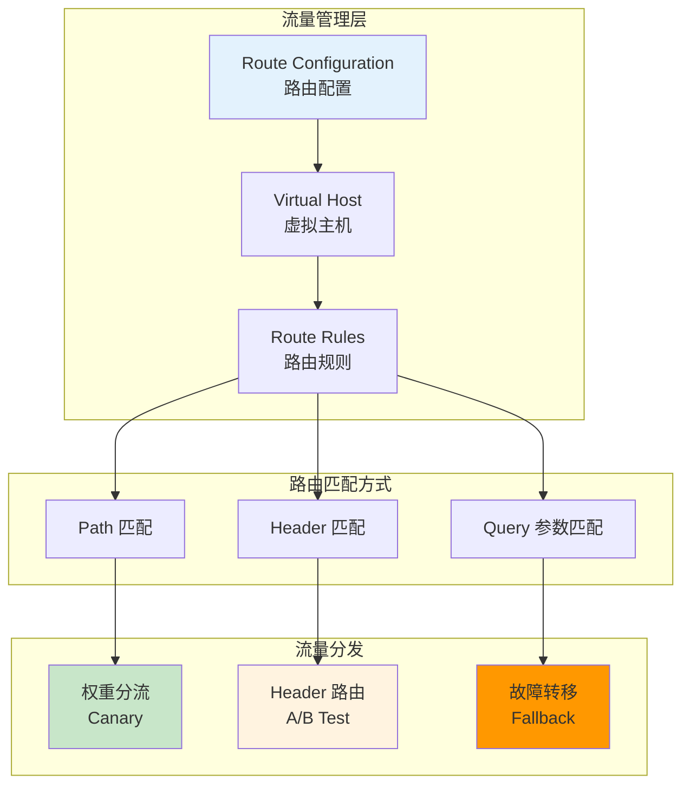
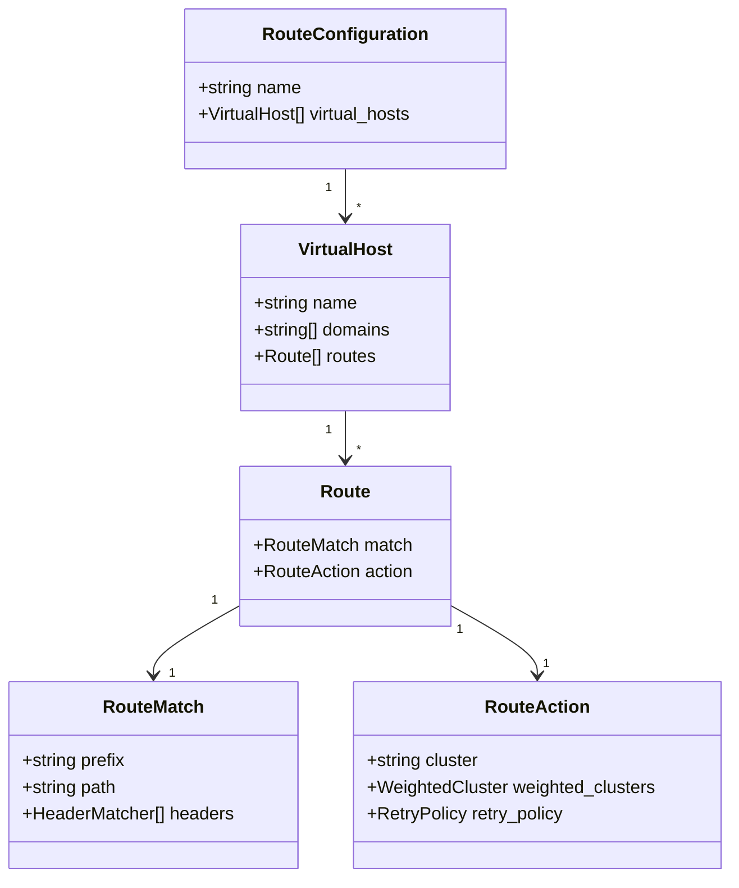
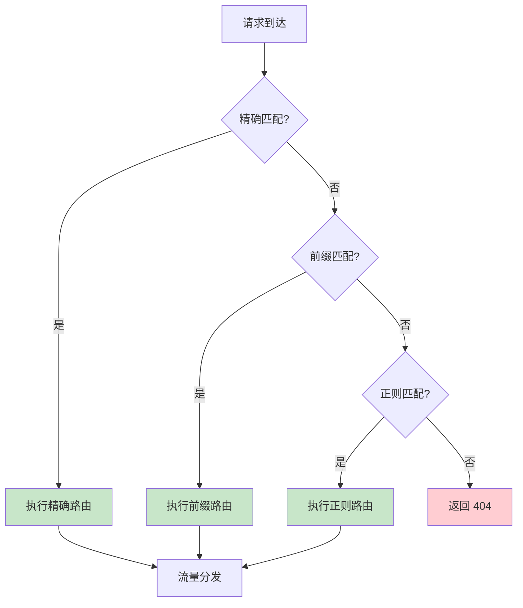
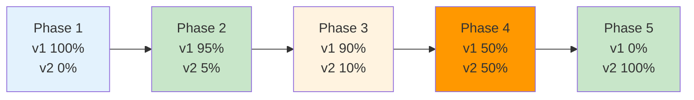
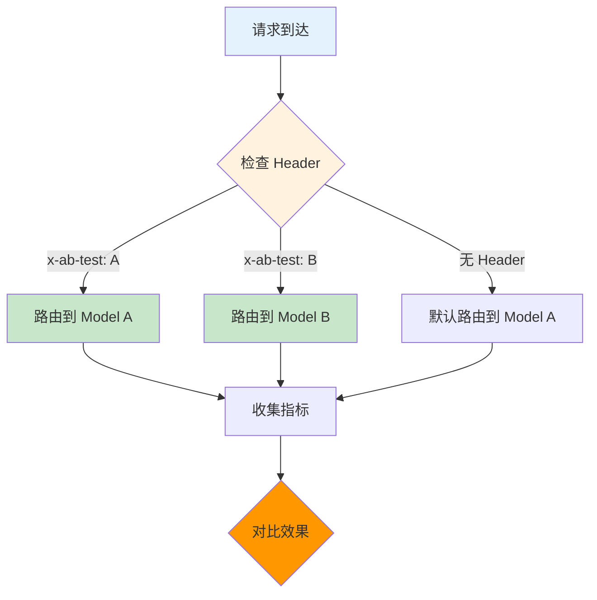
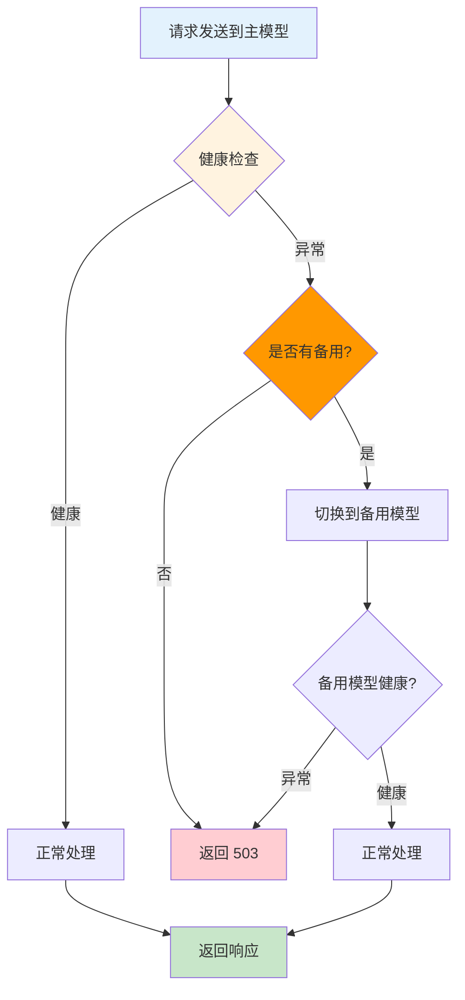
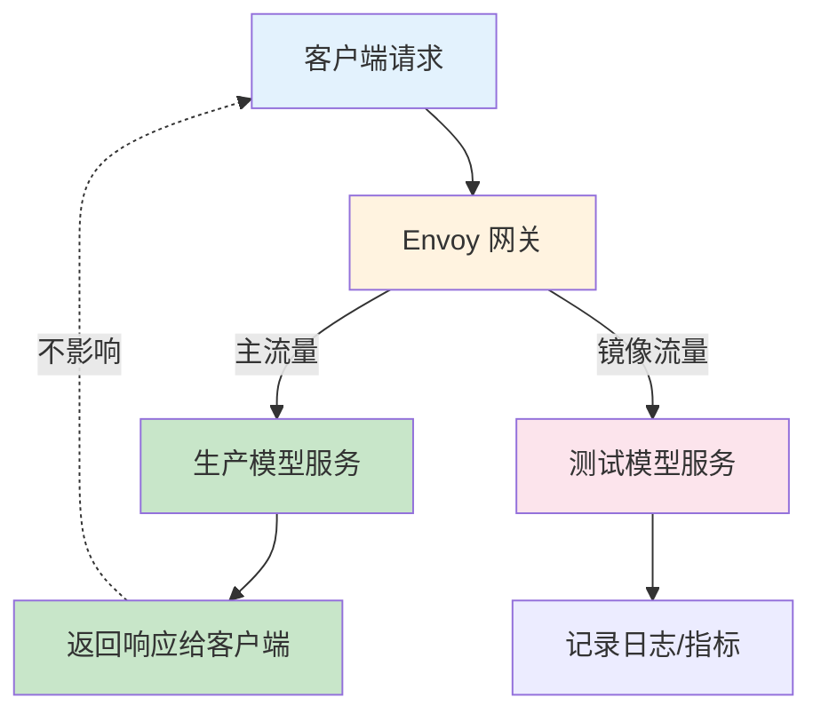

# 流量管理与路由详解

> 深入掌握 Envoy 流量管理能力，包括灰度发布、A/B 测试、多模型路由、故障转移等 AI 场景实践。

---

## 目录

- [1. 概述](#1-概述)
- [2. 路由核心概念](#2-路由核心概念)
- [3. 灰度发布实践](#3-灰度发布实践)
- [4. A/B 测试实现](#4-ab-测试实现)
- [5. 故障转移机制](#5-故障转移机制)
- [6. 流量镜像](#6-流量镜像)
- [7. AI 场景路由策略](#7-ai-场景路由策略)
- [8. 最佳实践](#8-最佳实践)

---

## 1. 概述

### 1.1 为什么需要流量管理

在 AI 推理服务中，流量管理解决以下核心问题：

| 问题 | 场景 | 解决方案 |
|------|------|----------|
| **新版本发布** | 模型 v2 上线，如何平滑过渡？ | 灰度发布 (Canary) |
| **模型对比** | 如何对比 v1 和 v2 的效果？ | A/B 测试 |
| **多模型路由** | 不同模型服务如何路由？ | 路径/域名路由 |
| **故障处理** | 主模型异常时如何降级？ | 故障转移 |
| **测试验证** | 如何在不影响生产的情况下测试？ | 流量镜像 |

### 1.2 Envoy 流量管理架构



---

## 2. 路由核心概念

### 2.1 Route Configuration 结构



### 2.2 路由匹配优先级



**匹配规则对比：**

| 匹配类型 | 示例 | 优先级 | 适用场景 |
|----------|------|--------|----------|
| **Exact** | `/v1/chat/completions` | 最高 | 精确 API 端点 |
| **Prefix** | `/v1/` | 中 | API 版本前缀 |
| **Regex** | `/v[0-9]+/.*` | 低 | 动态路径匹配 |

---

## 3. 灰度发布实践

### 3.1 场景描述

**目标：** 将模型从 v1 平滑升级到 v2，逐步增加 v2 流量比例，验证无误后完全切换。

### 3.2 灰度流程



### 3.3 Envoy 配置实现

```yaml
# ============================================================
# 灰度发布: 权重分流配置
# ============================================================
# Phase 3: v1 90%, v2 10%

routes:
  - match:
      prefix: /v1/chat/completions
    route:
      weighted_clusters:
        clusters:
          - name: model-service-v1
            weight: 90
            request_headers_to_add:
              - header:
                  key: x-model-version
                  value: v1
          - name: model-service-v2
            weight: 10
            request_headers_to_add:
              - header:
                  key: x-model-version
                  value: v2
```

**动态更新权重 (通过 xDS)：**

```go
// === 步骤1: 构建新路由配置 ===
routeConfig := &route.RouteConfiguration{
  VirtualHosts: []*route.VirtualHost{
    {
      Routes: []*route.Route{
        {
          Action: &route.Route_Route{
            Route: &route.RouteAction{
              ClusterSpecifier: &route.RouteAction_WeightedClusters{
                WeightedClusters: &route.WeightedCluster{
                  Clusters: []*route.WeightedCluster_ClusterWeight{
                    {Name: "model-v1", Weight: 80},  // 调整为 80%
                    {Name: "model-v2", Weight: 20},  // 调整为 20%
                  },
                },
              },
            },
          },
        },
      },
    },
  },
}

// === 步骤2: 更新 xDS 快照 ===
snapshot.SetResources(resource.RouteType, []types.Resource{routeConfig})
cache.SetSnapshot(nodeID, snapshot)
```

---

## 4. A/B 测试实现

### 4.1 场景描述

**目标：** 根据用户属性 (Header/User-ID) 将流量路由到不同模型，对比效果。

### 4.2 基于 Header 的 A/B 测试



### 4.3 Envoy 配置实现

```yaml
# ============================================================
# A/B 测试: 基于 Header 的路由
# ============================================================

routes:
  # 路由 A: 内部测试用户
  - match:
      prefix: /v1/chat/completions
      headers:
        - name: x-ab-test
          exact_match: A
    route:
      cluster: model-a
  
  # 路由 B: 实验组用户
  - match:
      prefix: /v1/chat/completions
      headers:
        - name: x-ab-test
          exact_match: B
    route:
      cluster: model-b
  
  # 默认路由: 普通用户
  - match:
      prefix: /v1/chat/completions
    route:
      cluster: model-a
```

---

## 5. 故障转移机制

### 5.1 场景描述

**目标：** 当主模型服务异常时，自动切换到备用模型，保障服务可用性。

### 5.2 故障转移流程



### 5.3 Envoy 配置实现

```yaml
# ============================================================
# 故障转移: 重试与备用集群
# ============================================================

clusters:
  - name: model-primary
    connect_timeout: 5s
    type: EDS
    lb_policy: ROUND_ROBIN
    #  outlier detection 配置
    outlier_detection:
      consecutive_5xx: 3        # 连续 3 次 5xx 标记异常
      interval: 10s
      base_ejection_time: 30s   # 隔离 30 秒
  
  - name: model-fallback
    connect_timeout: 5s
    type: EDS
    lb_policy: ROUND_ROBIN

routes:
  - match:
      prefix: /v1/chat/completions
    route:
      cluster: model-primary
      retry_policy:
        retry_on: 5xx           # 5xx 错误重试
        num_retries: 2
        host_selection_retry_max_attempts: 2
      fallback_policy: USE_FALLBACK  # 使用备用集群
      fallback_cluster: model-fallback
```

---

## 6. 流量镜像

### 6.1 场景描述

**目标：** 将生产流量复制到测试环境，用于验证新模型，不影响生产用户。

### 6.2 流量镜像架构



### 6.3 Envoy 配置实现

```yaml
# ============================================================
# 流量镜像: 复制流量到测试环境
# ============================================================

routes:
  - match:
      prefix: /v1/chat/completions
    route:
      cluster: model-production
      request_mirror_policy:
        - cluster: model-shadow-test
          percentage:
            numerator: 100      # 100% 流量镜像
            denominator: HUNDRED
```

---

## 7. AI 场景路由策略

### 7.1 多模型路由

```yaml
# ============================================================
# 多模型路由: 按路径区分模型类型
# ============================================================

routes:
  # Chat 模型
  - match:
      prefix: /v1/chat/completions
    route:
      weighted_clusters:
        clusters:
          - name: chat-model-v1
            weight: 90
          - name: chat-model-v2
            weight: 10
  
  # Completion 模型
  - match:
      prefix: /v1/completions
    route:
      cluster: completion-model-v1
  
  # Embedding 模型
  - match:
      prefix: /v1/embeddings
    route:
      cluster: embedding-model-v1
```

### 7.2 基于用户等级的路由

```yaml
# ============================================================
# 用户等级路由: VIP 用户使用高性能模型
# ============================================================

routes:
  # VIP 用户 → 高性能模型
  - match:
      prefix: /v1/chat/completions
      headers:
        - name: x-user-tier
          exact_match: vip
    route:
      cluster: model-premium
  
  # 普通用户 → 经济型模型
  - match:
      prefix: /v1/chat/completions
      headers:
        - name: x-user-tier
          exact_match: free
    route:
      cluster: model-economy
```

---

## 8. 最佳实践

### 8.1 路由配置

| 场景 | 推荐做法 | 原因 |
|------|----------|------|
| **路由顺序** | 精确匹配在前，前缀匹配在后 | 避免错误匹配 |
| **权重调整** | 通过 xDS 动态更新，非静态配置 | 无需重启 |
| **Header 传递** | 添加 x-model-version 等标识 | 便于后端识别 |
| **超时配置** | 不同模型设置不同超时 | 适配模型特性 |

### 8.2 灰度发布

| 阶段 | 权重 | 观察指标 | 持续时间 |
|------|------|----------|----------|
| Phase 1 | v1 100%, v2 0% | 基线指标 | - |
| Phase 2 | v1 95%, v2 5% | 错误率、延迟 | 15 分钟 |
| Phase 3 | v1 90%, v2 10% | 同上 + Token 吞吐 | 30 分钟 |
| Phase 4 | v1 50%, v2 50% | 全面对比 | 1 小时 |
| Phase 5 | v1 0%, v2 100% | 稳定性 | 持续 |

---

## 附录

### A. 参考资料

- [Envoy 路由配置官方文档](https://www.envoyproxy.io/docs/envoy/latest/intro/arch_overview/http/http_routing)
- [Envoy 权重分流](https://www.envoyproxy.io/docs/envoy/latest/api-v3/config/route/v3/route_components.proto#envoy-v3-api-msg-config-route-v3-weightedcluster)
