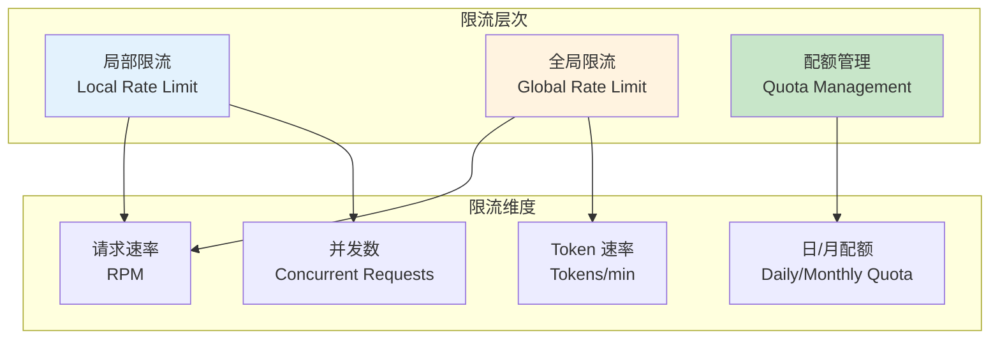
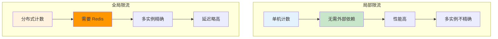
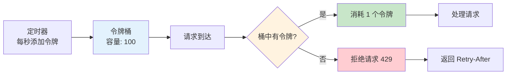
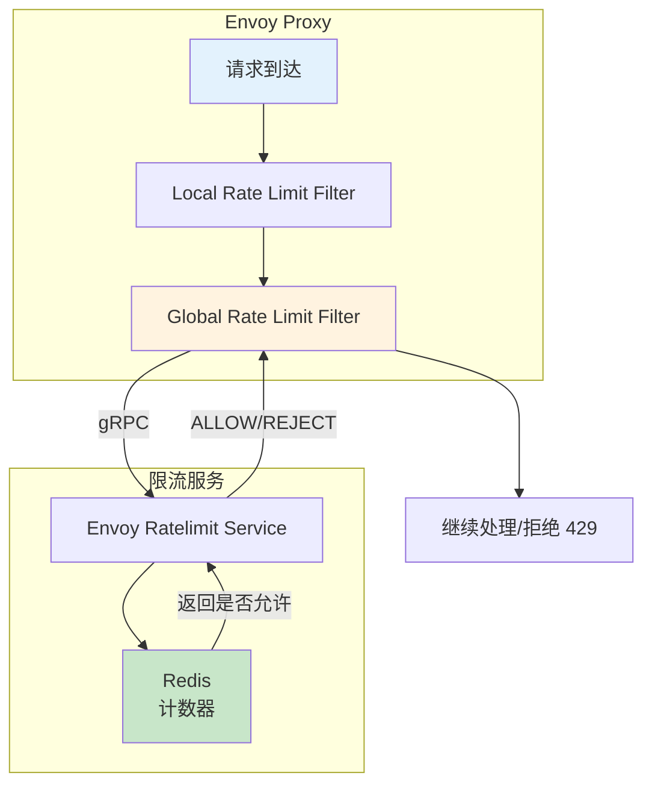
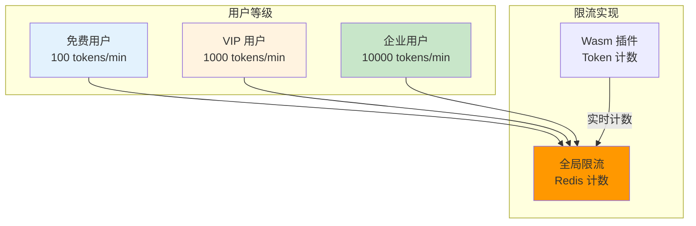
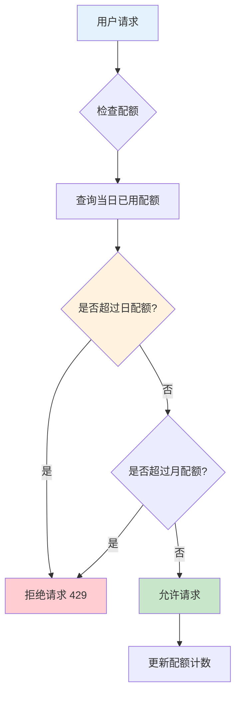

# 负载均衡与限流详解

> 深入掌握 Envoy 负载均衡策略、局部限流与全局限流机制，以及 AI 场景 Token 速率控制与配额管理。

---

## 目录

- [1. 概述](#1-概述)
- [2. 负载均衡策略](#2-负载均衡策略)
- [3. 限流核心概念](#3-限流核心概念)
- [4. 局部限流实现](#4-局部限流实现)
- [5. 全局限流实现](#5-全局限流实现)
- [6. AI 场景限流策略](#6-ai-场景限流策略)
- [7. 配额管理](#7-配额管理)
- [8. 最佳实践](#8-最佳实践)

---

## 1. 概述

### 1.1 为什么需要限流

在 AI 推理服务中，限流解决以下核心问题：

| 问题 | 场景 | 解决方案 |
|------|------|----------|
| **资源保护** | 突发流量导致 GPU 过载 | Token/并发限制 |
| **公平分配** | 多租户共享模型服务 | 按用户/租户限流 |
| **成本控制** | Token 消耗无限制导致成本飙升 | 配额管理 |
| **服务质量** | 高优先级用户被低优先级请求阻塞 | 优先级限流 |

### 1.2 Envoy 限流架构



---

## 2. 负载均衡策略

### 2.1 Envoy 支持的 LB 策略

| 策略 | 说明 | AI 场景适用 |
|------|------|-------------|
| **ROUND_ROBIN** | 轮询分发 | 通用场景 |
| **LEAST_REQUEST** | 选择请求数最少的实例 | 推理服务 (考虑负载) |
| **RANDOM** | 随机分发 | 测试环境 |
| **RING_HASH** | 一致性哈希 | 缓存亲和性 |
| **MAGLEV** | 快速一致性哈希 | 大规模端点 |

### 2.2 AI 场景推荐

```yaml
# ============================================================
# Cluster: AI 模型服务负载均衡配置
# ============================================================

clusters:
  # 场景1: 通用推理服务 - LEAST_REQUEST
  - name: model-service
    lb_policy: LEAST_REQUEST
    least_request_lb_config:
      choice_count: 2  # 选择负载最低的 2 个实例
  
  # 场景2: KV Cache 感知服务 - RING_HASH
  - name: model-with-cache
    lb_policy: RING_HASH
    hash_policy:
      - header:
          header_name: x-user-id
    # 同一用户路由到同一实例，提高缓存命中率
```

---

## 3. 限流核心概念

### 3.1 局部限流 vs 全局限流



| 维度 | 局部限流 | 全局限流 |
|------|----------|----------|
| **计数精度** | 单实例精确 | 全局精确 |
| **性能** | 高 (本地计数) | 中 (需访问 Redis) |
| **依赖** | 无 | Redis |
| **适用场景** | 单实例/测试 | 多实例/生产 |
| **配置复杂度** | 简单 | 中等 |

### 3.2 限流令牌桶算法



---

## 4. 局部限流实现

### 4.1 配置示例

```yaml
# ============================================================
# 局部限流: 单节点 RPM 限制
# ============================================================

http_filters:
  - name: envoy.filters.http.local_ratelimit
    typed_config:
      stat_prefix: http_local_rate_limiter
      token_bucket:
        max_tokens: 100        # 桶容量
        tokens_per_fill: 100   # 每次填充数量
        fill_interval: 60s     # 填充间隔 (1 分钟)
      filter_enabled:
        runtime_key: local_rate_limit.enabled
        default_value:
          numerator: 100
          denominator: HUNDRED
      filter_enforced:
        runtime_key: local_rate_limit.enforced
        default_value:
          numerator: 100
          denominator: HUNDRED
      
      # 响应头
      response_headers_to_add:
        - append: false
          header:
            key: x-ratelimit-limit
            value: "100"
        - append: false
          header:
            key: x-ratelimit-remaining
            value: "%LOCAL_RATE_LIMIT_REMAINING%"
```

### 4.2 Go 代码实现 (Mock)

```go
// Package ratelimit 提供局部限流实现
package ratelimit

import (
	"sync"
	"time"
)

// ============================================================
// LocalRateLimiter 局部限流器 (令牌桶算法)
// ============================================================
type LocalRateLimiter struct {
	mu           sync.Mutex
	tokens       int           // 当前令牌数
	maxTokens    int           // 桶容量
	tokensPerFill int          // 每次填充数量
	fillInterval time.Duration // 填充间隔
	lastFill     time.Time     // 上次填充时间
}

// NewLocalRateLimiter 创建局部限流器
func NewLocalRateLimiter(maxTokens, tokensPerFill int, fillInterval time.Duration) *LocalRateLimiter {
	return &LocalRateLimiter{
		tokens:        maxTokens,
		maxTokens:     maxTokens,
		tokensPerFill: tokensPerFill,
		fillInterval:  fillInterval,
		lastFill:      time.Now(),
	}
}

// Allow 检查是否允许请求
// 【返回】true 允许，false 拒绝
func (l *LocalRateLimiter) Allow() bool {
	l.mu.Lock()
	defer l.mu.Unlock()

	// === 步骤1: 填充令牌 ===
	now := time.Now()
	elapsed := now.Sub(l.lastFill)
	
	if elapsed >= l.fillInterval {
		// 计算应添加的令牌数
		tokensToAdd := (elapsed / l.fillInterval) * time.Duration(l.tokensPerFill)
		l.tokens = min(l.tokens+int(tokensToAdd), l.maxTokens)
		l.lastFill = now
	}

	// === 步骤2: 检查并消耗令牌 ===
	if l.tokens > 0 {
		l.tokens--
		return true
	}

	return false
}

// Remaining 获取剩余令牌数
func (l *LocalRateLimiter) Remaining() int {
	l.mu.RLock()
	defer l.mu.RUnlock()
	return l.tokens
}
```

---

## 5. 全局限流实现

### 5.1 架构设计



### 5.2 配置示例

```yaml
# ============================================================
# 全局限流: 基于 Redis 的多维度限流
# ============================================================

http_filters:
  - name: envoy.filters.http.ratelimit
    typed_config:
      domain: ai-gateway
      failure_mode_deny: true  # 限流服务不可用时拒绝请求
      rate_limit_service:
        grpc_service:
          target_uri: ratelimit-service.ai-gateway.svc:8081
          timeout: 10s

# 限流规则配置 (ConfigMap)
data:
  config.yaml: |
    domain: ai-gateway
    descriptors:
      # 规则1: 按用户等级限流
      - key: user_tier
        value: free
        rate_limit:
          requests_per_unit: 100
          unit: minute
      
      - key: user_tier
        value: vip
        rate_limit:
          requests_per_unit: 1000
          unit: minute
      
      # 规则2: 按模型限流
      - key: model_name
        value: gpt-4
        rate_limit:
          requests_per_unit: 10
          unit: minute
```

---

## 6. AI 场景限流策略

### 6.1 Token 速率限流



**Wasm 插件实现 Token 计数：**

```go
// ============================================================
// Wasm 插件: Token 计数器 + 限流检查
// ============================================================

func onHttpResponseBody(bodySize int, endOfStream bool) types.Action {
	// === 步骤1: 获取响应体 ===
	body, _ := proxywasm.GetHttpResponseBody(0, bodySize)
	
	// === 步骤2: 解析 Token 数 ===
	tokenCount := parseOutputTokens(body)
	
	// === 步骤3: 更新 Redis 计数 ===
	key := getUserAPIKey()
	currentTokens := redis.IncrBy(key, tokenCount)
	
	// === 步骤4: 检查是否超限 ===
	limit := getUserTokenLimit(key)
	if currentTokens > limit {
		// 记录日志，下次请求拒绝
		proxywasm.LogInfof("User %s exceeded token limit", key)
		markUserForRateLimit(key)
	}
	
	return types.ActionContinue
}
```

### 6.2 并发限制

```yaml
# ============================================================
# 并发限制: 限制同时处理的请求数
# ============================================================

clusters:
  - name: model-service
    circuit_breakers:
      thresholds:
        - priority: DEFAULT
          max_connections: 1000       # 最大连接数
          max_pending_requests: 1000  # 最大排队请求数
          max_retries: 3              # 最大重试数
          max_requests: 500           # 最大并发请求 (HTTP/2)
```

---

## 7. 配额管理

### 7.1 日/月配额控制



**配额表：**

| 用户等级 | 日配额 (Tokens) | 月配额 (Tokens) | 超额处理 |
|----------|-----------------|-----------------|----------|
| **免费** | 10,000 | 100,000 | 拒绝请求 |
| **VIP** | 100,000 | 1,000,000 | 拒绝请求 |
| **企业** | 1,000,000 | 10,000,000 | 按需计费 |

### 7.2 Redis 配额实现

```go
// ============================================================
// QuotaManager 配额管理器
// ============================================================

type QuotaManager struct {
	redis *redis.Client
}

// CheckQuota 检查用户配额
// 【参数】userID 用户 ID, dailyLimit 日配额, monthlyLimit 月配额
// 【返回】allowed 是否允许, remaining 剩余配额
func (qm *QuotaManager) CheckQuota(userID string, dailyLimit, monthlyLimit int64) (bool, int64) {
	// === 步骤1: 构建 Key ===
	today := time.Now().Format("2006-01-02")
	month := time.Now().Format("2006-01")
	
	dailyKey := fmt.Sprintf("quota:daily:%s:%s", userID, today)
	monthlyKey := fmt.Sprintf("quota:monthly:%s:%s", userID, month)
	
	// === 步骤2: 检查日配额 ===
	dailyUsed, _ := qm.redis.Get(dailyKey).Int64()
	if dailyUsed >= dailyLimit {
		return false, 0
	}
	
	// === 步骤3: 检查月配额 ===
	monthlyUsed, _ := qm.redis.Get(monthlyKey).Int64()
	if monthlyUsed >= monthlyLimit {
		return false, 0
	}
	
	// === 步骤4: 返回剩余配额 ===
	remaining := min(dailyLimit-dailyUsed, monthlyLimit-monthlyUsed)
	return true, remaining
}
```

---

## 8. 最佳实践

### 8.1 限流策略选择

| 场景 | 推荐策略 | 原因 |
|------|----------|------|
| **单实例测试** | 局部限流 | 简单、高性能 |
| **多实例生产** | 全局限流 + Redis | 精确控制 |
| **Token 计量** | Wasm 插件 + Redis | 实时计数 |
| **配额管理** | 外部配额服务 | 灵活可控 |

### 8.2 限流响应

| 响应头 | 说明 | 示例 |
|--------|------|------|
| `429 Too Many Requests` | 限流状态码 | - |
| `Retry-After` | 重试等待时间 (秒) | `Retry-After: 30` |
| `X-RateLimit-Limit` | 限流阈值 | `X-RateLimit-Limit: 100` |
| `X-RateLimit-Remaining` | 剩余配额 | `X-RateLimit-Remaining: 50` |
| `X-RateLimit-Reset` | 重置时间 (Unix 时间戳) | `X-RateLimit-Reset: 1714550400` |

### 8.3 限流调试

| 问题 | 排查思路 | 工具 |
|------|----------|------|
| **限流未生效** | 检查 Filter 配置与限流服务连接 | `curl localhost:9901/stats \| grep ratelimit` |
| **误限流** | 查看限流日志与 Redis 计数 | Redis `GET quota:*` |
| **配额不精确** | 检查 Redis Key 设计 | Key 格式 `quota:{type}:{user}:{date}` |

---

## 附录

### A. 参考资料

- [Envoy 局部限流](https://www.envoyproxy.io/docs/envoy/latest/intro/arch_overview/http/http_filters/local_rate_limit_filter)
- [Envoy 全局限流](https://www.envoyproxy.io/docs/envoy/latest/intro/arch_overview/http/http_filters/rate_limit_filter)
- [Envoy Ratelimit Service](https://github.com/envoyproxy/ratelimit)
