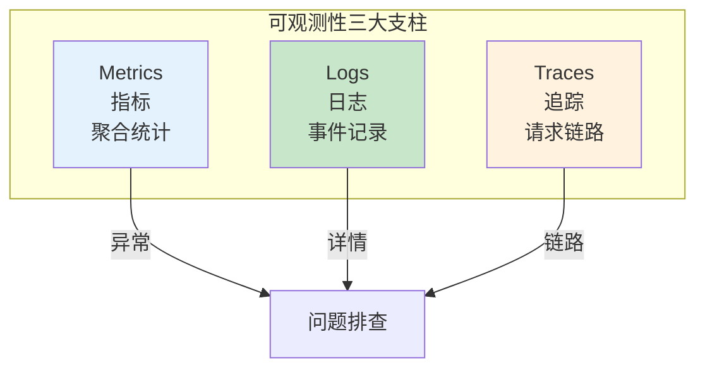
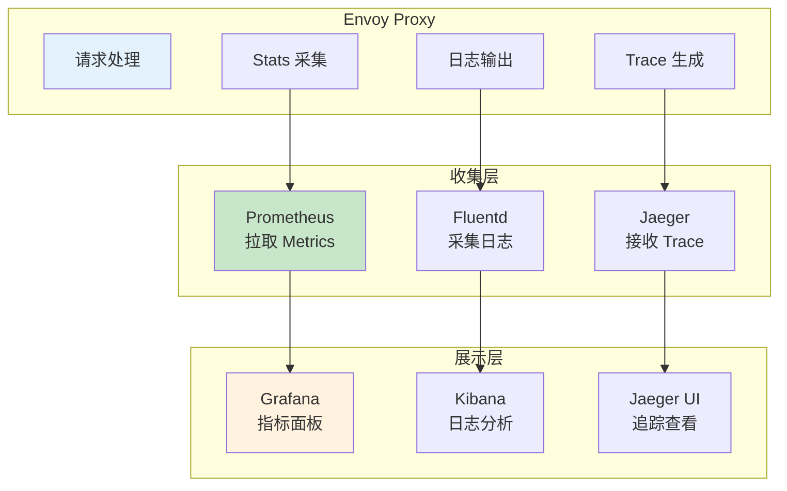
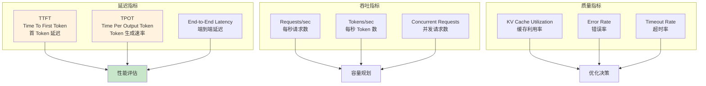
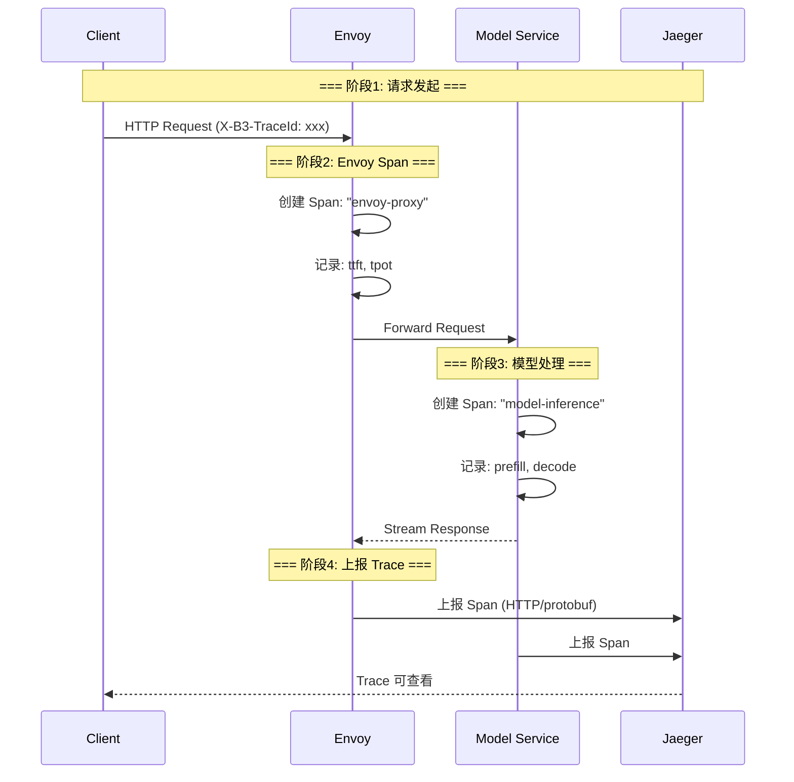

# 可观测性与监控详解

> 深入掌握 Envoy 可观测性机制，包括访问日志、Prometheus Metrics、分布式追踪，以及 AI 场景 TTFT/TPOT 指标定制。

---

## 目录

- [1. 概述](#1-概述)
- [2. 访问日志](#2-访问日志)
- [3. Prometheus Metrics](#3-prometheus-metrics)
- [4. AI 定制指标](#4-ai-定制指标)
- [5. 分布式追踪](#5-分布式追踪)
- [6. Grafana 面板](#6-grafana-面板)
- [7. 健康检查](#7-健康检查)
- [8. 最佳实践](#8-最佳实践)

---

## 1. 概述

### 1.1 可观测性三大支柱



| 支柱 | 说明 | AI 场景应用 |
|------|------|-------------|
| **Metrics** | 聚合统计 (QPS/延迟/错误率) | TTFT/TPOT/Token 吞吐 |
| **Logs** | 事件记录 (结构化日志) | 请求审计、错误详情 |
| **Traces** | 请求链路 (Span 追踪) | 全链路延迟分析 |

### 1.2 Envoy 可观测性架构



---

## 2. 访问日志

### 2.1 结构化日志配置

```yaml
# ============================================================
# 访问日志: 结构化 JSON 格式
# ============================================================

static_resources:
  listeners:
    - name: ai-gateway-listener
      access_log:
        - name: envoy.access_loggers.file
          typed_config:
            path: /var/log/envoy/access.log
            log_format:
              json_format:
                # 基础字段
                timestamp: "%START_TIME%"
                method: "%REQ(:METHOD)%"
                path: "%REQ(X-ENVOY-ORIGINAL-PATH?:PATH)%"
                protocol: "%PROTOCOL%"
                
                # 响应信息
                response_code: "%RESPONSE_CODE%"
                response_flags: "%RESPONSE_FLAGS%"
                bytes_received: "%BYTES_RECEIVED%"
                bytes_sent: "%BYTES_SENT%"
                
                # 延迟信息
                duration_ms: "%DURATION%"
                upstream_duration_ms: "%RESP(X-ENVOY-UPSTREAM-SERVICE-TIME)%"
                
                # AI 定制字段
                model_name: "%UPSTREAM_HOST%"
                user_id: "%REQ(X-USER-ID)%"
                api_key: "%REQ(X-API-KEY)%"
                
                # 路由信息
                upstream_cluster: "%UPSTREAM_CLUSTER%"
                route_name: "%ROUTE_NAME%"
```

### 2.2 日志字段说明

| 字段 | 来源 | 示例 |
|------|------|------|
| `timestamp` | 请求开始时间 | `2026-05-01T10:00:00.000Z` |
| `response_code` | HTTP 响应码 | `200`, `429`, `503` |
| `duration_ms` | 总处理时间 (ms) | `1523` |
| `upstream_duration_ms` | 后端处理时间 (ms) | `1480` |
| `model_name` | 上游服务地址 | `model-v1:8000` |
| `user_id` | 请求 Header | `user-123` |

---

## 3. Prometheus Metrics

### 3.1 Envoy 内置指标

```yaml
# ============================================================
# Stats 配置: 启用 Prometheus 格式
# ============================================================

admin:
  address:
    socket_address:
      address: 0.0.0.0
      port_value: 9901

# Stats 配置
stats_config:
  # 启用直方图统计
  histogram_bucket_settings:
    match:
      - "cluster.*upstream_rq_time"
    buckets:
      - 10
      - 25
      - 50
      - 100
      - 250
      - 500
      - 1000
      - 2500
      - 5000
```

**核心内置指标：**

| 指标名称 | 类型 | 说明 |
|----------|------|------|
| `envoy_cluster_upstream_rq_total` | Counter | 总请求数 |
| `envoy_cluster_upstream_rq_time` | Histogram | 上游请求延迟 |
| `envoy_cluster_upstream_rq_xx` | Counter | 响应码分布 (2xx/3xx/4xx/5xx) |
| `envoy_cluster_upstream_cx_total` | Counter | 连接数 |
| `envoy_cluster_upstream_cx_active` | Gauge | 活跃连接数 |

### 3.2 Prometheus 集成

```yaml
# ============================================================
# Prometheus 配置: 采集 Envoy 指标
# ============================================================

global:
  scrape_interval: 15s

scrape_configs:
  - job_name: envoy
    static_configs:
      - targets: ['envoy-proxy.ai-gateway.svc:9901']
    metrics_path: /stats/prometheus
```

---

## 4. AI 定制指标

### 4.1 AI 核心指标定义



### 4.2 Wasm 插件实现指标采集

```go
// ============================================================
// AI Metrics Collector: Wasm 插件采集 AI 指标
// ============================================================

package main

import (
	"github.com/tetratelabs/proxy-wasm-go-sdk/proxywasm"
)

// onRequestHeaders 记录请求开始时间
func onRequestHeaders(numHeaders int, endOfStream bool) types.Action {
	// 记录请求开始时间 (用于计算延迟)
	proxywasm.SetProperty([]string{"request_start_time"}, []string{time.Now().String()})
	return types.ActionContinue
}

// onResponseBody 解析响应并上报指标
func onResponseBody(bodySize int, endOfStream bool) types.Action {
	if !endOfStream {
		return types.ActionPause
	}
	
	// === 步骤1: 获取响应体 ===
	body, _ := proxywasm.GetHttpResponseBody(0, bodySize)
	
	// === 步骤2: 解析 Token 数 ===
	outputTokens := parseOutputTokens(body)
	
	// === 步骤3: 计算延迟 ===
	startTime := getProperty("request_start_time")
	ttft := calculateTTFT(startTime)  // 首 Token 延迟
	tpot := calculateTPOT(body)       // 平均 Token 生成速率
	
	// === 步骤4: 上报 Prometheus 指标 ===
	proxywasm.LogInfof("ai_ttft_ms=%.2f", ttft)
	proxywasm.LogInfof("ai_tpot_ms=%.2f", tpot)
	proxywasm.LogInfof("ai_output_tokens=%d", outputTokens)
	
	// 通过 Stats API 上报
	proxywasm.RecordMetric("ai_ttft", uint64(ttft), proxywasm.MetricTypeHistogram)
	proxywasm.RecordMetric("ai_tpot", uint64(tpot), proxywasm.MetricTypeHistogram)
	proxywasm.RecordMetric("ai_tokens_total", uint64(outputTokens), proxywasm.MetricTypeCounter)
	
	return types.ActionContinue
}
```

### 4.3 自定义 Stats 配置

```yaml
# ============================================================
# 自定义 Stats: AI 指标注册
# ============================================================

stats_config:
  # 定义直方图桶
  histogram_bucket_settings:
    match:
      - "ai_ttft"
      - "ai_tpot"
    buckets:
      - 10
      - 25
      - 50
      - 100
      - 250
      - 500
      - 1000
      - 2500
  
  # 定义新指标
  stats_matcher:
    inclusion_list:
      prefixes:
        - "ai_"
```

---

## 5. 分布式追踪

### 5.1 OpenTelemetry 集成



### 5.2 Envoy 追踪配置

```yaml
# ============================================================
# Tracing: OpenTelemetry 配置
# ============================================================

tracing:
  http:
    name: envoy.tracers.opentelemetry
    typed_config:
      grpc_service:
        target_uri: jaeger-collector.tracing.svc:4317
        timeout: 5s
      service_name: ai-gateway
      resource_detectors:
        - name: environment

# 采样配置
tracing:
  random_sampling:
    value: 100  # 100% 采样 (生产环境建议 10%)
```

### 5.3 自定义 Span 属性

```go
// ============================================================
// Span Processor: 添加 AI 定制属性
// ============================================================

func addAISpanAttributes(span Span, request *Request) {
	// 基础属性
	span.SetAttributes(
		attribute.String("http.method", request.Method),
		attribute.String("http.path", request.Path),
		attribute.String("user.id", request.UserID),
	)
	
	// AI 定制属性
	span.SetAttributes(
		attribute.String("ai.model.name", request.Model),
		attribute.Int("ai.input_tokens", request.InputTokens),
		attribute.Int("ai.output_tokens", request.OutputTokens),
		attribute.Float64("ai.ttft_ms", request.TTFT),
		attribute.Float64("ai.tpot_ms", request.TPOT),
	)
}
```

---

## 6. Grafana 面板

### 6.1 AI 网关监控面板

```yaml
# ============================================================
# Grafana Dashboard: AI 网关监控
# ============================================================

panels:
  # 面板1: 请求 QPS
  - title: "Requests/sec"
    type: graph
    targets:
      - expr: rate(envoy_cluster_upstream_rq_total[1m])
        legendFormat: "{{cluster}}"
  
  # 面板2: 延迟分布 (P50/P95/P99)
  - title: "Latency (ms)"
    type: graph
    targets:
      - expr: histogram_quantile(0.50, rate(envoy_cluster_upstream_rq_time_bucket[5m]))
        legendFormat: "P50"
      - expr: histogram_quantile(0.95, rate(envoy_cluster_upstream_rq_time_bucket[5m]))
        legendFormat: "P95"
      - expr: histogram_quantile(0.99, rate(envoy_cluster_upstream_rq_time_bucket[5m]))
        legendFormat: "P99"
  
  # 面板3: TTFT (首 Token 延迟)
  - title: "TTFT (ms)"
    type: graph
    targets:
      - expr: histogram_quantile(0.95, rate(ai_ttft_bucket[5m]))
        legendFormat: "TTFT P95"
  
  # 面板4: Token 吞吐量
  - title: "Tokens/sec"
    type: graph
    targets:
      - expr: rate(ai_tokens_total[1m])
        legendFormat: "{{model}}"
  
  # 面板5: 错误率
  - title: "Error Rate (%)"
    type: graph
    targets:
      - expr: >-
          sum(rate(envoy_cluster_upstream_rq_5xx[5m])) 
          / sum(rate(envoy_cluster_upstream_rq_total[5m])) * 100
        legendFormat: "5xx Rate"
  
  # 面板6: 并发请求数
  - title: "Concurrent Requests"
    type: graph
    targets:
      - expr: envoy_cluster_upstream_cx_active
        legendFormat: "{{cluster}}"
```

---

## 7. 健康检查

### 7.1 主动健康检查

```yaml
# ============================================================
# 健康检查: Cluster 配置
# ============================================================

clusters:
  - name: model-service-v1
    health_checks:
      - timeout: 5s
        interval: 10s
        unhealthy_threshold: 3     # 连续 3 次失败标记不健康
        healthy_threshold: 2       # 连续 2 次成功标记健康
        http_health_check:
          path: /health
          expected_statuses:
            - range:
                start: 200
                end: 300
```

### 7.2 就绪探测 vs 活跃探测

| 探测类型 | 作用 | 失败处理 | 适用场景 |
|----------|------|----------|----------|
| **Readiness** | 服务是否就绪接收流量 | 从负载均衡移除 | 启动完成、模型加载 |
| **Liveness** | 服务是否存活 | 重启容器 | 死锁、OOM |

---

## 8. 最佳实践

### 8.1 指标命名规范

| 前缀 | 说明 | 示例 |
|------|------|------|
| `envoy_` | Envoy 内置指标 | `envoy_cluster_upstream_rq_total` |
| `ai_` | AI 定制指标 | `ai_ttft`, `ai_tpot` |
| `http_` | HTTP 相关指标 | `http_requests_total` |

### 8.2 采样率控制

| 环境 | 采样率 | 原因 |
|------|--------|------|
| **开发** | 100% | 完整调试 |
| **测试** | 50% | 平衡 |
| **生产** | 10% | 降低存储成本 |

### 8.3 日志脱敏

| 字段 | 脱敏方式 | 示例 |
|------|----------|------|
| API Key | 仅保留前 4 位 | `sk-abc1****` |
| User ID | 哈希处理 | `md5(user-123)` |
| Request Body | 不记录或截断 | 前 100 字符 |

---

## 附录

### A. 参考资料

- [Envoy 可观测性官方文档](https://www.envoyproxy.io/docs/envoy/latest/operations/operations)
- [Prometheus Metrics](https://prometheus.io/docs/instrumenting/exposition_formats/)
- [OpenTelemetry](https://opentelemetry.io/)
