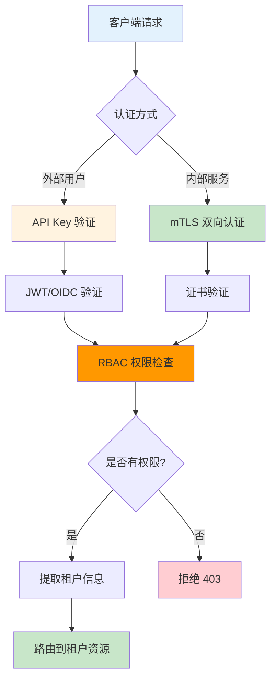
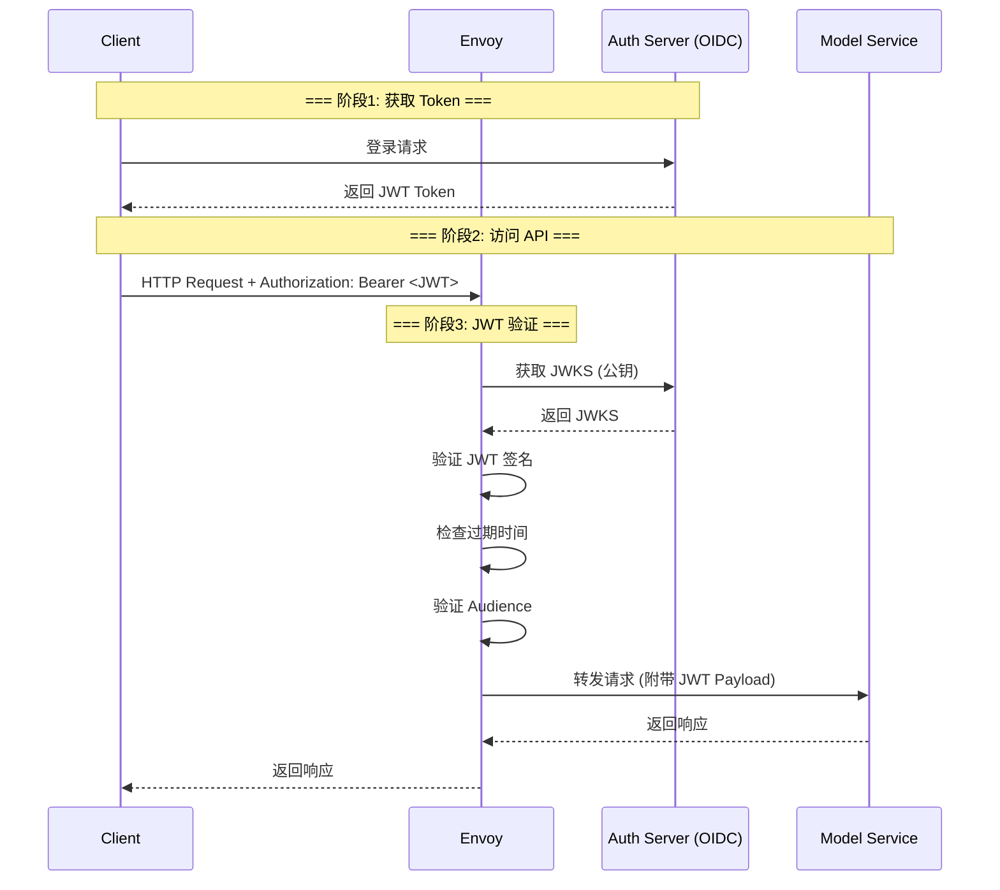
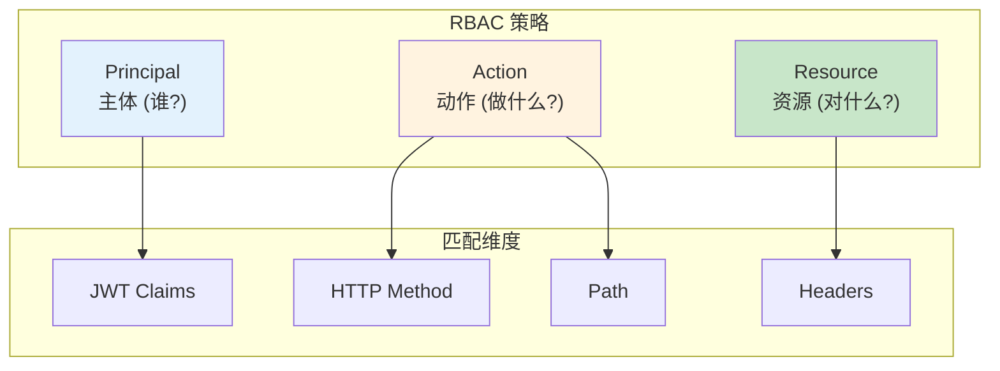
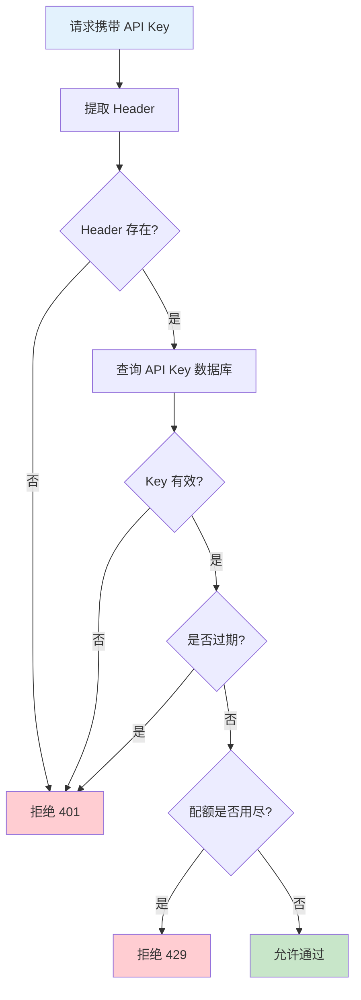
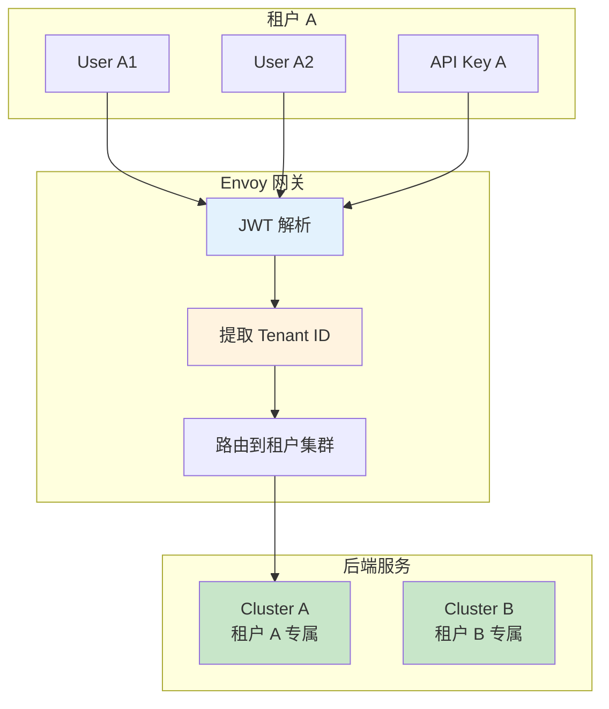

# 安全与认证详解

> 深入掌握 Envoy 安全机制，包括 mTLS 双向认证、JWT/OIDC 集成、RBAC 权限控制、API Key 管理在 AI 网关场景的应用。

---

## 目录

- [1. 概述](#1-概述)
- [2. mTLS 双向认证](#2-mtls-双向认证)
- [3. JWT/OIDC 认证](#3-jwtoidc-认证)
- [4. RBAC 权限控制](#4-rbac-权限控制)
- [5. API Key 管理](#5-api-key-管理)
- [6. 多租户隔离](#6-多租户隔离)
- [7. 安全最佳实践](#7-安全最佳实践)

---

## 1. 概述

### 1.1 AI 网关安全挑战

| 挑战 | 场景 | 解决方案 |
|------|------|----------|
| **服务间通信安全** | 网关与模型服务之间传输敏感数据 | mTLS |
| **用户身份验证** | 外部用户访问 API | JWT/OIDC |
| **权限控制** | 不同用户访问不同模型 | RBAC |
| **API 访问管理** | 第三方开发者调用 API | API Key |
| **多租户隔离** | 多租户共享模型服务 | 租户 ID + 路由隔离 |

### 1.2 安全架构总览



---

## 2. mTLS 双向认证

### 2.1 场景描述

**目标：** 确保 Envoy 网关与后端模型服务之间的通信加密，且双方互相验证身份。

### 2.2 mTLS 流程

```mermaid
sequenceDiagram
    participant E as Envoy Gateway
    participant M as Model Service

    Note over E,M: === 阶段1: TLS 握手 ===
    E->>M: ClientHello (支持的密码套件)
    M-->>E: ServerHello + 服务端证书
    
    Note over E,M: === 阶段2: 双向认证 ===
    M->>E: 请求客户端证书
    E-->>M: 客户端证书
    
    Note over E,M: === 阶段3: 证书验证 ===
    E->>E: 验证服务端证书 (CA 签名)
    M->>M: 验证客户端证书 (CA 签名)
    
    Note over E,M: === 阶段4: 建立加密通道 ===
    E->>M: 加密通信
    
    style E fill:#e3f2fd
    style M fill:#c8e6c9
```

### 2.3 Envoy mTLS 配置

```yaml
# ============================================================
# mTLS: 双向认证配置
# ============================================================

# === 步骤1: 配置 SDS 证书提供者 ===
transport_socket:
  name: envoy.transport_sockets.tls
  typed_config:
    common_tls_context:
      tls_certificate_sds_secret_configs:
        - name: "client_cert"
          sds_config:
            path: /etc/certs/client-cert.yaml
      
      validation_context_sds_secret_config:
        name: "validation_context"
        sds_config:
          path: /etc/certs/validation-context.yaml
      
      tls_params:
        tls_minimum_protocol_version: TLSv1_3

# === 步骤2: 配置集群 mTLS ===
clusters:
  - name: model-service
    transport_socket:
      name: envoy.transport_sockets.tls
      typed_config:
        common_tls_context:
          tls_certificate_sds_secret_configs:
            - name: client_cert
          validation_context_sds_secret_config:
            name: validation_context
```

### 2.4 证书管理

```yaml
# ============================================================
# Certificate: SDS 配置 (热更新证书)
# ============================================================

# 客户端证书
apiVersion: v1
kind: ConfigMap
metadata:
  name: client-cert-config
data:
  client-cert.yaml: |
    resources:
      - "@type": "type.googleapis.com/envoy.extensions.transport_sockets.tls.v3.Secret"
        name: client_cert
        tls_certificate:
          certificate_chain:
            filename: /etc/certs/tls.crt
          private_key:
            filename: /etc/certs/tls.key

# CA 证书 (验证对端)
  validation-context.yaml: |
    resources:
      - "@type": "type.googleapis.com/envoy.extensions.transport_sockets.tls.v3.Secret"
        name: validation_context
        validation_context:
          trusted_ca:
            filename: /etc/certs/ca.crt
```

---

## 3. JWT/OIDC 认证

### 3.1 认证流程



### 3.2 Envoy JWT 配置

```yaml
# ============================================================
# JWT 认证: Filter 配置
# ============================================================

http_filters:
  - name: envoy.filters.http.jwt_authn
    typed_config:
      # === 定义 JWT 提供者 ===
      providers:
        - name: ai-gateway-provider
          issuer: https://auth.example.com
          audiences:
            - ai-gateway
          
          # === JWKS 配置 (公钥) ===
          remote_jwks:
            uri: https://auth.example.com/.well-known/jwks.json
            cache_duration: 300s  # 缓存 5 分钟
          
          # === JWT 提取位置 ===
          from_headers:
            - name: Authorization
              value_prefix: "Bearer "
          
          # === 转发 JWT Payload 到后端 ===
          forward: true
          forward_payload_header: x-jwt-payload
      
      # === 认证规则 ===
      rules:
        - match:
            prefix: /v1/
          requires:
            provider_name: ai-gateway-provider
```

### 3.3 JWT 声明验证

```yaml
# ============================================================
# JWT Claims 验证: 确保 Token 包含必要信息
# ============================================================

providers:
  - name: ai-gateway-provider
    issuer: https://auth.example.com
    remote_jwks:
      uri: https://auth.example.com/.well-known/jwks.json
    
    # 验证 Claims
    claim_to_headers:
      - header_name: x-user-id
        claim_name: sub
      - header_name: x-user-tier
        claim_name: user_tier
      - header_name: x-tenant-id
        claim_name: tenant_id
    
    # 验证 Audience
    audiences:
      - ai-gateway
```

---

## 4. RBAC 权限控制

### 4.1 RBAC 架构



### 4.2 RBAC 配置示例

```yaml
# ============================================================
# RBAC: 基于角色的访问控制
# ============================================================

http_filters:
  - name: envoy.filters.http.rbac
    typed_config:
      # === 统计前缀 (用于监控) ===
      stat_prefix: rbac
      
      # === 规则定义 ===
      rules:
        # 规则1: 允许 AI 用户访问 Chat API
        - name: "allow-ai-user-chat"
          permissions:
            - and_rules:
                rules:
                  - header:
                      name: ":method"
                      exact_match: POST
                  - url_path:
                      path:
                        prefix: /v1/chat/completions
          
          principals:
            - or_ids:
                ids:
                  - header:
                      name: x-jwt-payload
                      string_match:
                        safe_regex:
                          regex: '.*"roles".*"ai_user".*'
        
        # 规则2: 允许 Admin 访问所有 API
        - name: "allow-admin-all"
          permissions:
            - any: true
          
          principals:
            - header:
                name: x-jwt-payload
                string_match:
                  safe_regex:
                    regex: '.*"roles".*"admin".*'
        
        # 默认拒绝
        - name: "deny-all"
          permissions:
            - any: true
          principals:
            - any: true
          action: DENY
```

### 4.3 RBAC 策略矩阵

| 角色 | /v1/chat | /v1/completions | /v1/embeddings | /admin |
|------|----------|-----------------|----------------|--------|
| **ai_user** | ✅ | ✅ | ❌ | ❌ |
| **admin** | ✅ | ✅ | ✅ | ✅ |
| **readonly** | ✅ (GET) | ❌ | ✅ | ❌ |

---

## 5. API Key 管理

### 5.1 API Key 验证流程



### 5.2 Lua 脚本实现 API Key 验证

```yaml
# ============================================================
# API Key 验证: Lua Filter 实现
# ============================================================

http_filters:
  - name: envoy.lua
    typed_config:
      inline_code: |
        function envoy_on_request(request_handle)
          -- === 步骤1: 提取 API Key ===
          local headers = request_handle:headers()
          local api_key = headers:get("x-api-key")
          
          if api_key == nil then
            request_handle:respond(
              {["status"] = "401", ["content-type"] = "application/json"},
              '{"error": "API Key required"}'
            )
            return
          end
          
          -- === 步骤2: 验证 API Key (调用外部服务) ===
          local validation_url = "http://api-key-service/validate?key=" .. api_key
          local response = http_call(validation_url)
          
          if response["valid"] == false then
            request_handle:respond(
              {["status"] = "403", ["content-type"] = "application/json"},
              '{"error": "Invalid API Key"}'
            )
            return
          end
          
          -- === 步骤3: 提取用户信息 ===
          headers:add("x-user-id", response["user_id"])
          headers:add("x-user-tier", response["user_tier"])
        end
```

---

## 6. 多租户隔离

### 6.1 租户隔离架构



### 6.2 租户路由配置

```yaml
# ============================================================
# 多租户路由: 按 Tenant ID 路由
# ============================================================

routes:
  # 租户 A 路由
  - match:
      prefix: /v1/chat/completions
      headers:
        - name: x-tenant-id
          exact_match: tenant-a
    route:
      cluster: model-tenant-a
  
  # 租户 B 路由
  - match:
      prefix: /v1/chat/completions
      headers:
        - name: x-tenant-id
          exact_match: tenant-b
    route:
      cluster: model-tenant-b
  
  # 默认租户
  - match:
      prefix: /v1/chat/completions
    route:
      cluster: model-default
```

---

## 7. 安全最佳实践

### 7.1 证书管理

| 实践 | 说明 |
|------|------|
| **证书轮换** | 每 90 天轮换一次，使用 SDS 热更新 |
| **CA 隔离** | 不同环境使用不同 CA (dev/staging/prod) |
| **私钥保护** | 私钥权限 600，禁止日志打印 |
| **TLS 版本** | 最低 TLSv1.3，禁用旧版本 |

### 7.2 JWT 安全

| 实践 | 说明 |
|------|------|
| **短过期时间** | Token 过期时间 ≤ 1 小时 |
| **Refresh Token** | 使用 Refresh Token 延长会话 |
| **Audience 验证** | 严格验证 Token 受众 |
| **JWKS 缓存** | 缓存 JWKS 5 分钟，减少 Auth Server 压力 |

### 7.3 常见安全问题

| 问题 | 原因 | 解决方案 |
|------|------|----------|
| **JWT 验证失败** | 签名不匹配/过期 | 检查 Issuer/Audience/过期时间 |
| **mTLS 握手失败** | 证书不匹配/CA 未信任 | 验证证书链 |
| **RBAC 拒绝** | 权限策略配置错误 | 检查 Principal/Permission 匹配 |
| **API Key 泄露** | Key 硬编码在代码中 | 使用环境变量/Secret 管理 |

---

## 附录

### A. 参考资料

- [Envoy JWT 认证](https://www.envoyproxy.io/docs/envoy/latest/intro/arch_overview/security/credential_providers)
- [Envoy RBAC](https://www.envoyproxy.io/docs/envoy/latest/intro/arch_overview/security/rbac)
- [mTLS 配置](https://www.envoyproxy.io/docs/envoy/latest/intro/arch_overview/security/external)
