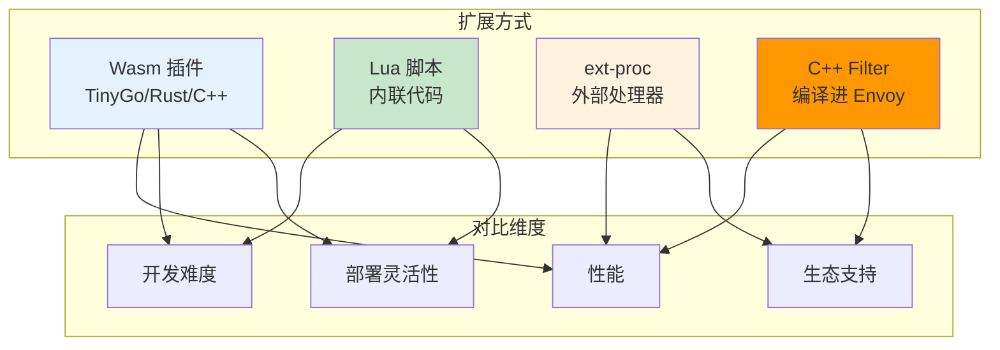
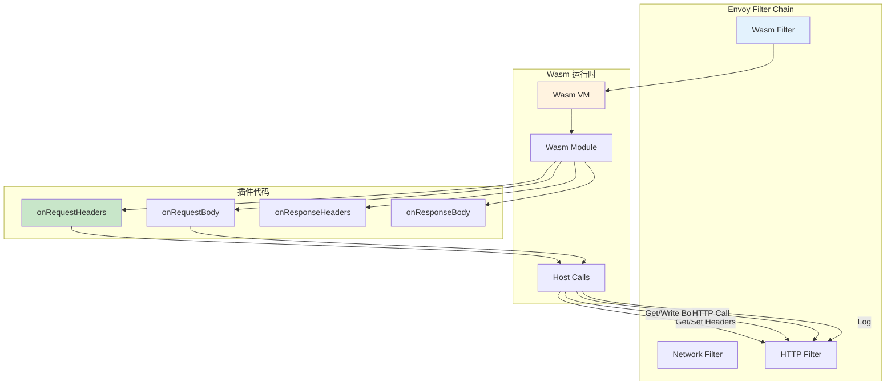
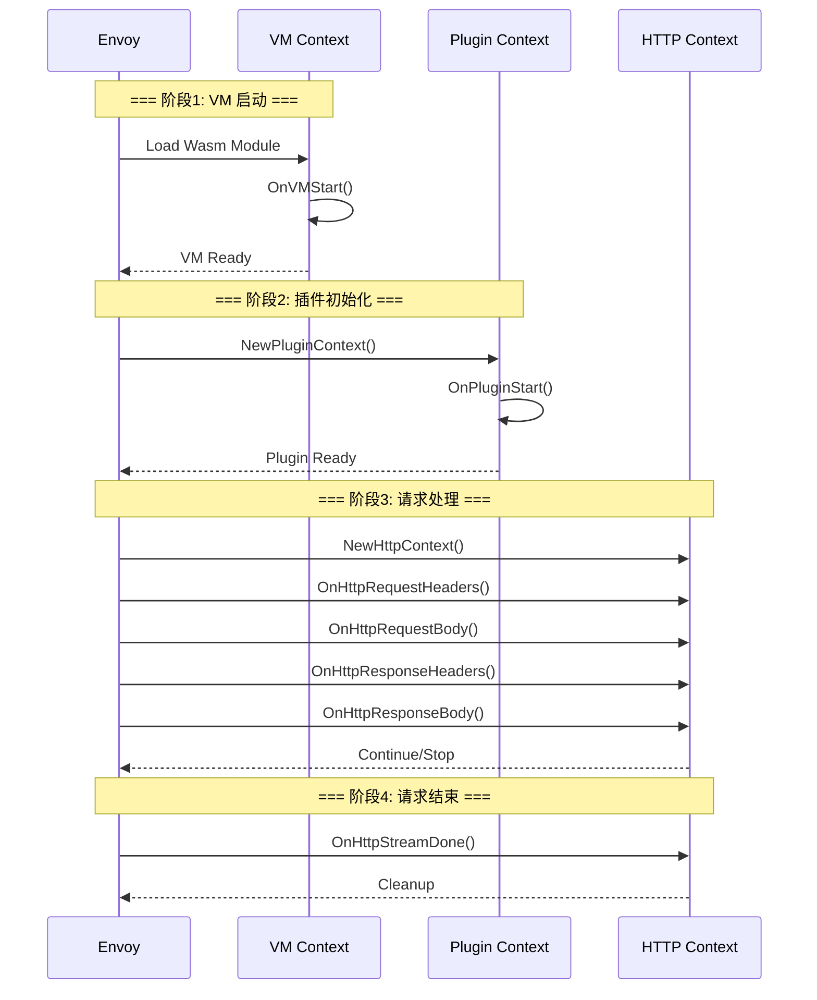
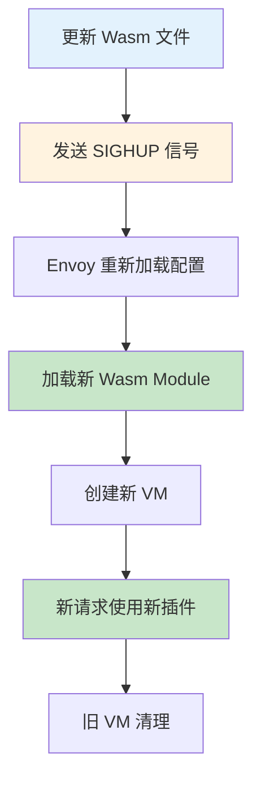

# 扩展与自定义详解

> 深入掌握 Envoy Wasm 运行时与插件开发，包括 TinyGo SDK、插件生命周期、AI 场景 Token 计数、请求审计、动态路由决策实现。

---

## 目录

- [1. 概述](#1-概述)
- [2. Wasm 运行时架构](#2-wasm-运行时架构)
- [3. Wasm SDK 使用](#3-wasm-sdk-使用)
- [4. 插件生命周期](#4-插件生命周期)
- [5. AI 场景插件开发](#5-ai-场景插件开发)
- [6. Lua 脚本扩展](#6-lua-脚本扩展)
- [7. 热加载与部署](#7-热加载与部署)
- [8. 最佳实践](#8-最佳实践)

---

## 1. 概述

### 1.1 为什么需要扩展

Envoy 内置功能覆盖常见场景，但 AI 网关有特殊需求：

| 需求 | 内置支持 | 扩展方案 |
|------|----------|----------|
| **Token 计数** | ❌ | Wasm 插件 |
| **请求审计** | ⚠️ (需定制) | Wasm/Lua 插件 |
| **动态路由** | ⚠️ (部分支持) | Wasm 插件 |
| **自定义限流** | ❌ | Wasm + Redis |
| **协议转换** | ✅ (部分) | 内置 Filter |

### 1.2 扩展方式对比



| 扩展方式 | 性能 | 开发难度 | 部署灵活性 | 适用场景 |
|----------|------|----------|------------|----------|
| **Wasm 插件** | 高 (接近原生) | 中 | 高 (热加载) | **AI 场景推荐** |
| **Lua 脚本** | 中 | 低 | 高 | 简单逻辑 |
| **ext-proc** | 中 (网络延迟) | 低 | 高 | 复杂外部服务 |
| **C++ Filter** | 最高 | 高 | 低 (需编译) | 核心功能 |

---

## 2. Wasm 运行时架构

### 2.1 Wasm 在 Envoy 中的位置



### 2.2 Wasm 与 Host 交互

**Host 提供给 Wasm 的 API：**

| API 类别 | 功能 | 示例 |
|----------|------|------|
| **Properties** | 读取/设置属性 | `GetProperty("request.path")` |
| **Headers** | 获取/修改 Header | `GetHttpRequestHeader("content-type")` |
| **Body** | 读取/修改 Body | `GetHttpResponseBody(0, 1024)` |
| **HTTP Call** | 发起外部 HTTP 调用 | `HttpCall("http://service/api")` |
| **Logging** | 输出日志 | `LogInfo("message")` |
| **Metrics** | 上报指标 | `RecordMetric("counter", 1)` |

---

## 3. Wasm SDK 使用

### 3.1 TinyGo SDK 快速开始

```go
// ============================================================
// Wasm 插件: 最小示例
// ============================================================

package main

import (
	"github.com/tetratelabs/proxy-wasm-go-sdk/proxywasm"
	"github.com/tetratelabs/proxy-wasm-go-sdk/proxywasm/types"
)

// main 函数: 注册插件入口
func main() {
	proxywasm.SetVMContext(&vmContext{})
}

// vmContext VM 上下文
type vmContext struct{}

// OnVMStart VM 启动时调用
func (*vmContext) OnVMStart(vmContext types.VMContext) types.OnVMStartStatus {
	proxywasm.LogInfo("Wasm plugin VM started")
	return types.OnVMStartStatusOK
}

// NewPluginContext 创建插件上下文
func (*vmContext) NewPluginContext(contextID uint32) types.PluginContext {
	return &pluginContext{}
}

// pluginContext 插件上下文
type pluginContext struct{}

// NewHttpContext 创建 HTTP 上下文
func (*pluginContext) NewHttpContext(contextID uint32) types.HttpContext {
	return &httpContext{}
}

// httpContext HTTP 请求上下文
type httpContext struct{}

// OnHttpRequestHeaders 请求头处理
func (*httpContext) OnHttpRequestHeaders(numHeaders int, endOfStream bool) types.Action {
	proxywasm.LogInfo("Request received")
	return types.ActionContinue
}
```

### 3.2 编译 Wasm 插件

```bash
# ============================================================
# 编译命令: TinyGo → Wasm
# ============================================================

# 安装 TinyGo
go install github.com/tetratelabs/proxy-wasm-go-sdk/proxywasm@latest

# 编译插件
tinygo build -o token-counter.wasm -scheduler=none -target=wasi ./token_counter.go

# 查看 Wasm 文件大小
ls -lh token-counter.wasm
```

---

## 4. 插件生命周期

### 4.1 完整生命周期流程



### 4.2 各阶段职责

| 阶段 | 调用方法 | 典型用途 |
|------|----------|----------|
| **VM 启动** | `OnVMStart` | 初始化全局配置、连接外部服务 |
| **插件初始化** | `OnPluginStart` | 加载插件配置、创建定时器 |
| **请求头** | `OnHttpRequestHeaders` | 认证、限流、提取 Header |
| **请求体** | `OnHttpRequestBody` | 解析 Body、Token 计数 (Input) |
| **响应头** | `OnHttpResponseHeaders` | 添加自定义 Header |
| **响应体** | `OnHttpResponseBody` | 解析 Body、Token 计数 (Output) |
| **流结束** | `OnHttpStreamDone` | 清理资源、汇总指标 |

---

## 5. AI 场景插件开发

### 5.1 Token 计数器插件

**功能：** 统计 Input/Output Tokens，上报到 Prometheus

```go
// ============================================================
// Wasm 插件: AI Token 计数器
// ============================================================
// 拦截请求/响应，解析 Token 数，上报指标

package main

import (
	"encoding/json"
	"github.com/tetratelabs/proxy-wasm-go-sdk/proxywasm"
	"github.com/tetratelabs/proxy-wasm-go-sdk/proxywasm/types"
)

// httpContext Token 计数器上下文
type httpContext struct {
	modelName     string
	inputTokens   int
	outputTokens  int
	requestStart  int64
	firstTokenAt  int64
}

// OnHttpRequestHeaders 请求头处理
func (ctx *httpContext) OnHttpRequestHeaders(numHeaders int, endOfStream bool) types.Action {
	// === 步骤1: 提取模型名称 ===
	model, _ := proxywasm.GetHttpRequestHeader("x-model-name")
	ctx.modelName = model
	
	// === 步骤2: 记录请求开始时间 ===
	ctx.requestStart = proxywasm.GetCurrentTimeInMilliseconds()
	
	// === 步骤3: 提取 API Key (用于限流) ===
	apiKey, _ := proxywasm.GetHttpRequestHeader("x-api-key")
	if apiKey == "" {
		proxywasm.SendHttpResponse(401, nil, nil)
		return types.ActionPause
	}
	
	return types.ActionContinue
}

// OnHttpRequestBody 请求体处理
func (ctx *httpContext) OnHttpRequestBody(bodySize int, endOfStream bool) types.Action {
	if !endOfStream {
		return types.ActionPause
	}
	
	// === 步骤1: 获取请求体 ===
	body, _ := proxywasm.GetHttpRequestBody(0, bodySize)
	
	// === 步骤2: 解析 Input Tokens ===
	var reqBody map[string]interface{}
	json.Unmarshal(body, &reqBody)
	
	if prompt, ok := reqBody["prompt"].(string); ok {
		ctx.inputTokens = countTokens(prompt)
	}
	
	return types.ActionContinue
}

// OnHttpResponseBody 响应体处理
func (ctx *httpContext) OnHttpResponseBody(bodySize int, endOfStream bool) types.Action {
	if !endOfStream {
		return types.ActionPause
	}
	
	// === 步骤1: 获取响应体 ===
	body, _ := proxywasm.GetHttpResponseBody(0, bodySize)
	
	// === 步骤2: 解析 Output Tokens ===
	var respBody map[string]interface{}
	json.Unmarshal(body, &respBody)
	
	if usage, ok := respBody["usage"].(map[string]interface{}); ok {
		if tokens, ok := usage["completion_tokens"].(float64); ok {
			ctx.outputTokens = int(tokens)
		}
	}
	
	// === 步骤3: 计算延迟 ===
	now := proxywasm.GetCurrentTimeInMilliseconds()
	e2eLatency := now - ctx.requestStart
	
	// === 步骤4: 上报指标 ===
	proxywasm.RecordMetric("ai_input_tokens_total", uint64(ctx.inputTokens), proxywasm.MetricTypeCounter)
	proxywasm.RecordMetric("ai_output_tokens_total", uint64(ctx.outputTokens), proxywasm.MetricTypeCounter)
	proxywasm.RecordMetric("ai_request_e2e_latency_ms", e2eLatency, proxywasm.MetricTypeHistogram)
	
	// 添加自定义 Header
	proxywasm.ReplaceHttpResponseHeader("X-Input-Tokens", fmt.Sprintf("%d", ctx.inputTokens))
	proxywasm.ReplaceHttpResponseHeader("X-Output-Tokens", fmt.Sprintf("%d", ctx.outputTokens))
	
	return types.ActionContinue
}

// countTokens 简单 Token 计数 (按空格分割)
func countTokens(text string) int {
	return len(strings.Fields(text))
}
```

### 5.2 请求审计插件

**功能：** 记录模型调用日志到外部系统 (异步，不阻塞请求)

```go
// ============================================================
// Wasm 插件: 请求审计日志
// ============================================================

// OnHttpStreamDone 流结束时异步发送审计日志
func (ctx *auditContext) OnHttpStreamDone() {
	// === 步骤1: 构建审计日志 ===
	auditLog := AuditLog{
		Timestamp:  time.Now(),
		ModelName:  ctx.modelName,
		UserID:     ctx.userID,
		InputTokens:  ctx.inputTokens,
		OutputTokens: ctx.outputTokens,
		LatencyMs:  ctx.latency,
	}
	
	// === 步骤2: 异步发送 (不阻塞) ===
	proxywasm.DispatchHttpCall(
		"audit-service",
		[]proxywasm.HttpHeader{
			{Key: ":method", Value: "POST"},
			{Key: ":path", Value: "/audit/log"},
		},
		auditLog.Serialize(),
		nil,
		5000,  // 5s 超时
		func(status int, headers proxywasm.HttpHeaders, body []byte) {
			// 回调: 记录发送结果
		},
	)
}
```

### 5.3 动态路由决策插件

**功能：** 根据用户等级动态选择模型

```go
// ============================================================
// Wasm 插件: 动态路由决策
// ============================================================

func (ctx *dynamicRoutingContext) OnHttpRequestHeaders(numHeaders int, endOfStream bool) types.Action {
	// === 步骤1: 提取用户等级 ===
	userTier, _ := proxywasm.GetHttpRequestHeader("x-user-tier")
	
	// === 步骤2: 动态设置路由 Cluster ===
	var targetCluster string
	switch userTier {
	case "vip":
		targetCluster = "model-premium"
	case "enterprise":
		targetCluster = "model-enterprise"
	default:
		targetCluster = "model-economy"
	}
	
	// === 步骤3: 修改路由 ===
	proxywasm.SetProperty([]string{"route", "cluster"}, []byte(targetCluster))
	
	proxywasm.LogInfof("Dynamic routing: user_tier=%s -> cluster=%s", userTier, targetCluster)
	
	return types.ActionContinue
}
```

---

## 6. Lua 脚本扩展

### 6.1 Lua vs Wasm

| 维度 | Lua | Wasm |
|------|-----|------|
| **性能** | 中 (解释执行) | 高 (编译执行) |
| **开发难度** | 低 (脚本语言) | 中 (Go/Rust) |
| **功能限制** | 有限 API | 完整 SDK |
| **适用场景** | 简单逻辑 | 复杂插件 |

### 6.2 Lua 示例: 简单限流

```lua
-- ============================================================
-- Lua Filter: 简单请求计数限流
-- ============================================================

function envoy_on_request(request_handle)
  -- 提取用户 IP
  local headers = request_handle:headers()
  local ip = headers:get("x-forwarded-for")
  
  -- 查询计数 (假设使用共享内存)
  local count = get_request_count(ip)
  
  -- 检查限流
  if count > 100 then
    request_handle:respond(
      {["status"] = "429", ["content-type"] = "application/json"},
      '{"error": "Rate limit exceeded"}'
    )
    return
  end
  
  -- 增加计数
  increment_request_count(ip)
end
```

---

## 7. 热加载与部署

### 7.1 Wasm 插件配置

```yaml
# ============================================================
# Wasm 插件: Envoy 配置
# ============================================================

http_filters:
  - name: envoy.filters.http.wasm
    typed_config:
      config:
        # === Wasm 配置 ===
        vm_config:
          runtime: "envoy.wasm.runtime.v8"
          code:
            local:
              filename: /etc/envoy/wasm/token-counter.wasm
          
          # === 插件配置 (传递给插件) ===
          configuration:
            "@type": "type.googleapis.com/google.protobuf.StringValue"
            value: |
              {
                "prometheus_endpoint": "http://prometheus:9090",
                "audit_enabled": true
              }
```

### 7.2 热加载流程



**热加载命令：**

```bash
# ============================================================
# 热加载 Wasm 插件
# ============================================================

# 方式1: 发送 SIGHUP 信号
kill -HUP $(pidof envoy)

# 方式2: 通过 Admin API 重载
curl -X POST http://localhost:9901/reload
```

---

## 8. 最佳实践

### 8.1 插件开发

| 实践 | 说明 |
|------|------|
| **错误处理** | 插件异常不应阻塞请求，使用 `Continue` 降级 |
| **性能优化** | 避免在 Body 处理中大量内存分配 |
| **日志级别** | 生产环境 `LogInfo`，调试 `LogDebug` |
| **指标命名** | 使用前缀 `ai_` 区分业务指标 |

### 8.2 部署策略

| 场景 | 推荐方式 | 原因 |
|------|----------|------|
| **单插件** | 本地文件 + 热加载 | 简单快速 |
| **多插件** | OCI 镜像 + 集中管理 | 版本控制 |
| **开发测试** | 本地编译 + 本地测试 | 快速迭代 |
| **生产部署** | CI/CD 编译 + 灰度下发 | 安全可靠 |

### 8.3 常见问题

| 问题 | 原因 | 解决方案 |
|------|------|----------|
| **Wasm 加载失败** | 运行时不兼容 | 检查 `runtime` 配置 |
| **插件性能差** | Body 处理慢 | 使用缓冲模式，减少分配 |
| **指标未上报** | 指标未注册 | 检查 `stats_config` |

---

## 附录

### A. 参考资料

- [Proxy-Wasm Go SDK](https://github.com/tetratelabs/proxy-wasm-go-sdk)
- [Envoy Wasm 官方文档](https://www.envoyproxy.io/docs/envoy/latest/intro/arch_overview/advanced/wasm)
- [Wasm 插件示例](https://github.com/envoyproxy/examples)
