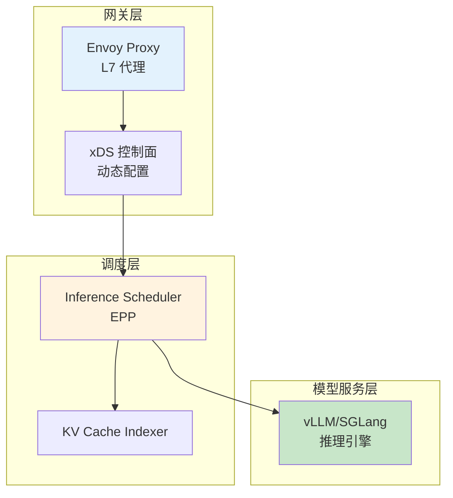
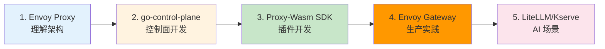
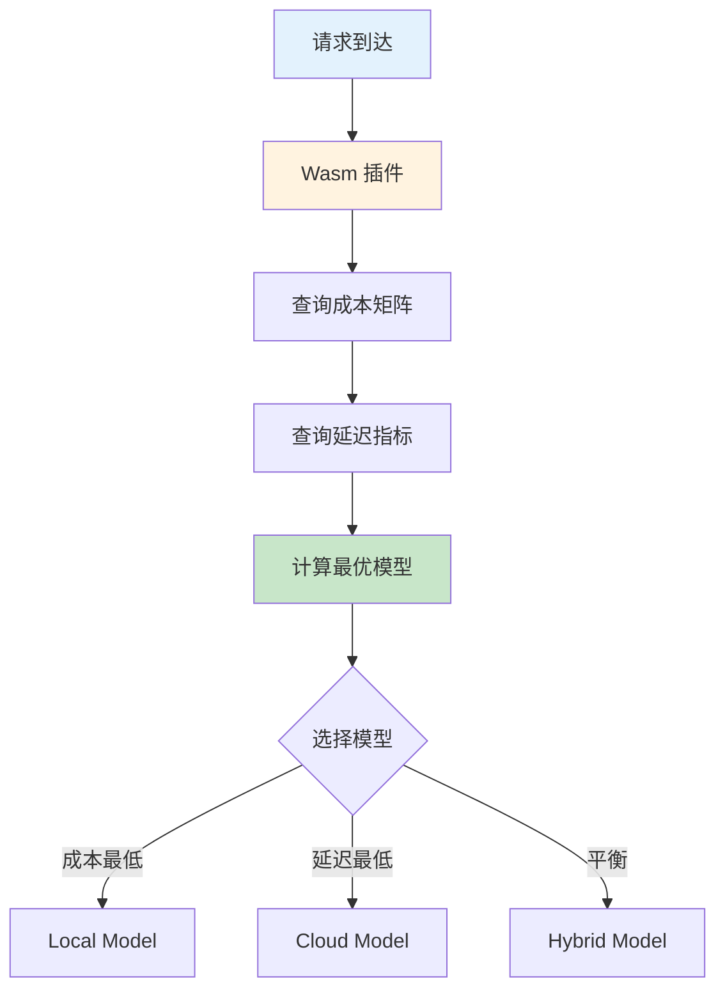
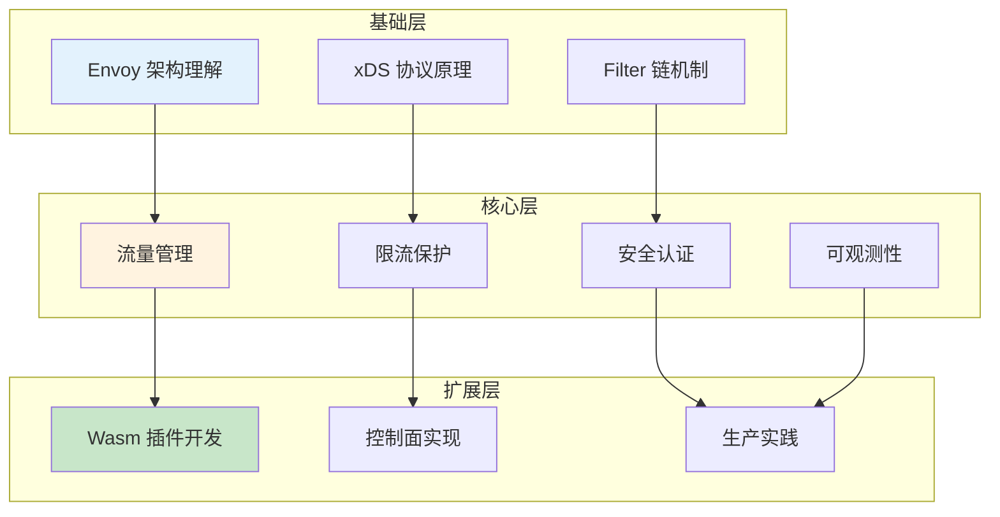

# Envoy AI 网关最佳实践总结

> 综合应用 Envoy 控制面技术，提供 AI 网关场景化配置建议、常见问题避坑指南、开源项目推荐与扩展业务场景解决方案。

---

## 目录

- [1. 场景化配置建议](#1-场景化配置建议)
- [2. 常见问题与避坑指南](#2-常见问题与避坑指南)
- [3. 性能优化建议](#3-性能优化建议)
- [4. 推荐开源项目](#4-推荐开源项目)
- [5. 扩展业务场景](#5-扩展业务场景)
- [6. 学习路线总结](#6-学习路线总结)

---

## 1. 场景化配置建议

### 1.1 AI 推理服务网关

**场景特征：**

- 流式响应 (SSE/gRPC-Stream)
- 高延迟敏感 (首 Token 延迟 TTFT)
- Token 计量计费
- 多模型路由

**推荐配置：**



**关键配置清单：**

| 配置项 | 推荐值 | 说明 |
|--------|--------|------|
| **连接超时** | `30s` | 模型推理延迟较高 |
| **流式超时** | `300s` (5min) | 流式响应总耗时 |
| **首字节超时** | `30s` | TTFT 超时 |
| **连接池** | `max_connections: 1000` | 支持高并发 |
| **负载均衡** | `LEAST_REQUEST` | 考虑后端负载 |
| **重试策略** | `num_retries: 2` | 避免过度重试 |

### 1.2 多租户 AI 平台

**场景特征：**

- 多租户共享模型服务
- 不同租户有不同配额
- 租户隔离与安全要求

**推荐配置：**

| 租户等级 | Token/分钟 | 日配额 | 模型权限 |
|----------|------------|--------|----------|
| **免费** | 100 | 10,000 | 基础模型 |
| **VIP** | 1,000 | 100,000 | 高级模型 |
| **企业** | 10,000 | 1,000,000 | 全量模型 |

**架构建议：**

```yaml
# ============================================================
# 多租户配置: 按租户 ID 路由
# ============================================================

# 步骤1: JWT 提取租户信息
jwt_authn:
  claim_to_headers:
    - header_name: x-tenant-id
      claim_name: tenant_id

# 步骤2: RBAC 控制访问权限
rbac:
  rules:
    - name: tenant-a-access
      permissions:
        - url_path: /v1/chat/completions
      principals:
        - header:
            name: x-tenant-id
            exact_match: tenant-a

# 步骤3: 限流保护配额
rate_limit:
  descriptors:
    - key: tenant_id
      value: tenant-a
      rate_limit:
        requests_per_unit: 1000
        unit: minute
```

### 1.3 模型灰度发布

**场景特征：**

- 新模型版本逐步上线
- 需要对比新旧模型效果
- 出现问题快速回滚

**灰度流程：**

| 阶段 | 新模型权重 | 观察指标 | 持续时间 |
|------|------------|----------|----------|
| **Phase 1** | 0% | - | - |
| **Phase 2** | 5% | 错误率、延迟 | 15 分钟 |
| **Phase 3** | 10% | 同上 + Token 吞吐 | 30 分钟 |
| **Phase 4** | 50% | 全面对比 | 1 小时 |
| **Phase 5** | 100% | 稳定性 | 持续 |

---

## 2. 常见问题与避坑指南

### 2.1 xDS 配置问题

| 问题 | 症状 | 根因 | 解决方案 |
|------|------|------|----------|
| **配置未生效** | Envoy 使用旧配置 | 控制面未推送或 Envoy NACK | 检查 `config_dump` 确认版本 |
| **版本不一致** | 不同 Envoy 实例配置不同 | xDS 推送不同步 | 使用 ADS 保证一致性 |
| **资源加载失败** | 启动报错 | 资源配置格式错误 | 检查 Protobuf 序列化 |
| **连接断开** | gRPC 连接频繁断开 | 未配置 KeepAlive | 添加 `grpc_keepalive` |

**排查命令：**

```bash
# 查看 Envoy 配置快照
curl localhost:9901/config_dump | jq '.configs[] | select(.["@type"] == "envoy.admin.v3.BootstrapConfigDump")'

# 查看 xDS 连接状态
curl localhost:9901/server_info | jq '.hot_restart_version'

# 查看限流统计
curl localhost:9901/stats | grep ratelimit
```

### 2.2 路由问题

| 问题 | 症状 | 根因 | 解决方案 |
|------|------|------|----------|
| **404 Not Found** | 请求未匹配路由 | 路由规则配置错误 | 检查 path/host 匹配 |
| **503 Service Unavailable** | 后端无健康实例 | 健康检查失败 | 检查 Cluster Endpoint |
| **流量未分流** | 权重配置未生效 | weighted_clusters 配置错误 | 检查权重总和 = 100 |
| **路由延迟高** | 请求处理慢 | 路由规则过多 | 优化路由匹配顺序 |

### 2.3 限流问题

| 问题 | 症状 | 根因 | 解决方案 |
|------|------|------|----------|
| **限流未生效** | 请求未被限制 | Filter 未启用 | 检查 `http_filters` 顺序 |
| **误限流** | 正常请求被拒绝 | 限流阈值过低 | 调整 `token_bucket` 配置 |
| **配额不精确** | 多实例计数不一致 | 使用局部限流 | 改用全局限流 + Redis |
| **限流服务不可用** | 全局限流返回错误 | Redis 连接失败 | 配置 `failure_mode_deny` |

### 2.4 安全问题

| 问题 | 症状 | 根因 | 解决方案 |
|------|------|------|----------|
| **JWT 验证失败** | 401 Unauthorized | 签名不匹配/过期 | 检查 Issuer/Audience |
| **mTLS 握手失败** | 连接被拒绝 | 证书不匹配 | 验证证书链 |
| **RBAC 拒绝** | 403 Forbidden | 权限策略错误 | 检查 Principal/Permission |
| **证书过期** | 连接中断 | 证书未轮换 | 配置 SDS 热更新 |

---

## 3. 性能优化建议

### 3.1 Envoy 性能调优

| 优化点 | 方法 | 效果 |
|--------|------|------|
| **连接池** | 配置合理的 `max_connections` | 减少连接建立延迟 |
| **KeepAlive** | gRPC/xDS 连接启用 KeepAlive | 快速检测断连 |
| **资源订阅** | Envoy 只订阅需要的 xDS 资源 | 减少内存占用 |
| **日志级别** | 生产环境 info，调试时 debug | 平衡性能与可排查性 |
| **统计采样** | 直方图统计配置桶 | 减少指标存储 |

### 3.2 限流性能

| 方式 | QPS (单核) | 延迟 | 适用场景 |
|------|------------|------|----------|
| **局部限流** | 100K+ | < 1ms | 单实例/测试 |
| **全局限流** | 10K+ | 5-10ms | 多实例/生产 |
| **Wasm 限流** | 50K+ | 2-5ms | 定制逻辑 |

### 3.3 Wasm 插件性能

| 操作 | 延迟开销 | 建议 |
|------|----------|------|
| **Header 处理** | < 0.1ms | 适合轻量逻辑 |
| **Body 解析** | 1-5ms | 避免大内存分配 |
| **HTTP 调用** | 10-50ms | 异步调用，不阻塞 |
| **指标上报** | < 0.5ms | 使用内置 API |

---

## 4. 推荐开源项目

### 4.1 核心项目

| 项目 | 链接 | 研读重点 | 解决问题 |
|------|------|----------|----------|
| **Envoy Proxy** | https://github.com/envoyproxy/envoy | xDS 协议、Filter 链、扩展机制 | 理解数据面核心架构 |
| **go-control-plane** | https://github.com/envoyproxy/go-control-plane | xDS Server 实现、Snapshot 管理 | 控制面开发 SDK |
| **Proxy-Wasm Go SDK** | https://github.com/tetratelabs/proxy-wasm-go-sdk | Wasm 插件开发 | 自定义 Filter |

### 4.2 AI 网关相关

| 项目 | 链接 | 研读重点 | 解决问题 |
|------|------|----------|----------|
| **Envoy Gateway** | https://github.com/envoyproxy/gateway | Kubernetes 集成、Gateway API 映射 | K8s 原生网关实现 |
| **Gloo Gateway** | https://github.com/solo-io/gloo | 企业级网关功能、Wasm 插件 | 生产级网关设计 |
| **Kserve** | https://github.com/kserve/kserve | 推理网关、模型路由 | 模型服务标准化 |
| **Bentoml** | https://github.com/bentoml/BentoML | AI 网关、流量管理 | AI 服务部署 |
| **LiteLLM Proxy** | https://github.com/BerriAI/litellm | 多模型统一网关、限流、监控 | 多厂商模型接入 |

### 4.3 限流与安全

| 项目 | 链接 | 研读重点 | 解决问题 |
|------|------|----------|----------|
| **Envoy Ratelimit** | https://github.com/envoyproxy/ratelimit | 全局限流服务 | Redis 限流实现 |
| **Istio** | https://github.com/istio/istio | 控制面 (Pilot)、流量管理、mTLS | 服务网格控制面 |
| **Opa** | https://github.com/open-policy-agent/opa | 策略引擎、RBAC | 细粒度权限控制 |

### 4.4 学习建议

**优先级：**



---

## 5. 扩展业务场景

### 5.1 AI 模型成本优化路由

**问题：** 多个模型提供商 (OpenAI/Azure/本地部署)，需要根据成本、延迟、可用性动态路由

**Envoy 技术方案：**



**实现要点：**

- Wasm 插件实现成本计算逻辑
- 自定义 LoadBalancer 根据实时成本权重分配
- EDS 动态更新 Endpoint 权重

### 5.2 流式响应处理 (SSE)

**问题：** AI 模型返回流式响应 (SSE)，需要统计完整响应指标、超时控制

**Envoy 技术方案：**

- Stream Filter 拦截流式响应
- 实时统计 Token 生成速率 (TPOT)
- 流式超时控制 (首个字节超时/总超时)

**配置示例：**

```yaml
# ============================================================
# 流式超时配置
# ============================================================

routes:
  - match:
      prefix: /v1/chat/completions
    route:
      cluster: model-service
      # 流式超时
      idle_timeout: 300s          # 总超时 5 分钟
      per_try_timeout: 30s        # 每次尝试超时
      # 重试策略
      retry_policy:
        retry_on: 5xx
        num_retries: 2
```

### 5.3 多租户配额管理

**问题：** 不同租户有不同的 Token 配额、模型访问权限、优先级

**Envoy 技术方案：**

- JWT 提取租户信息
- RBAC 控制模型访问权限
- Global Rate Limit 实现配额管理
- Wasm 插件实时查询配额状态

### 5.4 模型预热与缓存

**问题：** 冷启动模型加载慢，需要预加载到缓存、路由到已预热实例

**Envoy 技术方案：**

- 健康检查探测模型就绪状态
- EDS 动态标记预热/未预热实例
- 路由规则优先路由到预热实例
- 自定义 Header 强制路由到未预热实例 (测试场景)

### 5.5 请求队列与优先级调度

**问题：** 高峰期请求排队，VIP 用户需要优先处理

**Envoy 技术方案：**

- 自定义 Filter 实现请求队列
- 根据 Header/Token 设置优先级
- 优先级队列调度 (类似 EPP 的 FlowControl)
- 返回排队位置预估时间 (X-Queue-Position Header)

### 5.6 模型调用审计与合规

**问题：** 需要记录所有模型调用日志 (用户、模型、Token 消耗、时间) 用于审计

**Envoy 技术方案：**

- Wasm 插件拦截请求/响应
- 提取关键信息 (脱敏后)
- 异步发送到外部审计系统 (Kafka/HTTP)
- 不阻塞主请求流程

### 5.7 动态模型降级

**问题：** 主模型失败率升高时，自动降级到备用模型

**Envoy 技术方案：**

- outlier detection 检测异常 Endpoint
- 路由规则配置备用模型
- Wasm 插件实现降级逻辑 (记录降级原因)
- 返回 Header 标记降级状态 (X-Model-Fallback: true)

### 5.8 跨地域 AI 网关路由

**问题：** 多地域部署网关，需要就近路由 + 故障时跨地域切换

**Envoy 技术方案：**

- GeoIP 插件识别用户地域
- 地域优先路由 (Local → Regional → Global)
- 健康检查跨地域探测
- EDS 动态调整地域权重

---

## 6. 学习路线总结

### 6.1 知识体系



### 6.2 学习路径

| 阶段 | 学习内容 | 目标 |
|------|----------|------|
| **阶段 1** | 01-Envoy 基础概念 + 6.1 xDS 控制面 | 理解架构与协议 |
| **阶段 2** | 02-流量管理 + 6.2 流量示例 | 掌握路由能力 |
| **阶段 3** | 03-限流 + 6.3 限流实现 | 保护机制 |
| **阶段 4** | 04-可观测性 + 6.4 监控集成 | 运维能力 |
| **阶段 5** | 05-安全 + 6.5 认证实现 | 安全防护 |
| **阶段 6** | 06-Wasm 扩展 + 6.6 插件开发 | 扩展能力 |
| **总结** | 最佳实践总结 + 开源项目学习 | 综合应用 |

### 6.3 核心收获

完成本专题学习后，你将能够：

| 能力维度 | 具体收获 |
|----------|----------|
| **架构理解** | Envoy 数据面/控制面分离、xDS 协议流程 |
| **流量管理** | 灰度发布、A/B 测试、模型路由、故障转移 |
| **限流保护** | Token 速率控制、并发限制、配额管理 |
| **可观测性** | TTFT/TPOT 监控、分布式追踪、Grafana 面板 |
| **安全防护** | mTLS、JWT/OIDC、RBAC、API Key 管理 |
| **扩展开发** | Wasm 插件开发、自定义 Filter、热加载 |
| **问题解决** | 配置排查、性能优化、生产实践 |

---

## 附录

### A. 速查表

**常用命令：**

```bash
# 查看 Envoy 配置
curl localhost:9901/config_dump

# 查看统计指标
curl localhost:9901/stats/prometheus

# 重载配置
curl -X POST localhost:9901/reload

# 查看服务器信息
curl localhost:9901/server_info
```

**关键端口：**

| 端口 | 服务 | 说明 |
|------|------|------|
| `8080` | Envoy HTTP | 网关入口 |
| `9901` | Envoy Admin | 管理接口 |
| `18000` | xDS Server | 控制面 gRPC |

### B. 参考资料

- [Envoy 官方文档](https://www.envoyproxy.io/docs)
- [Envoy 最佳实践](https://www.envoyproxy.io/docs/envoy/latest/configuration/best_practices/best_practices)
- [Proxy-Wasm SDK](https://github.com/tetratelabs/proxy-wasm-go-sdk)
- [Envoy Gateway](https://gateway.envoyproxy.io/)
