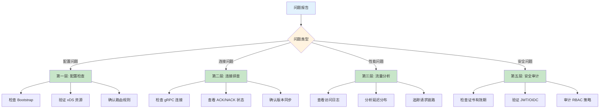

# Troubleshooting 问题排查

> 学习 Envoy AI 网关问题排查框架，掌握配置检查、xDS 同步调试、性能分析等实战技能。

---

## 快速导航

| 文件 | 说明 |
|------|------|
| [docs/README.md](docs/README.md) | 📖 **完整学习文档** - 分层排查模型、常见问题、诊断工具 |
| [scripts/check-envoy-config.sh](scripts/check-envoy-config.sh) | 配置检查脚本 |
| [scripts/debug-xds-sync.sh](scripts/debug-xds-sync.sh) | xDS 同步调试脚本 |

---

## 排查框架

```
┌─────────────────────────────────────────────────────────────┐
│              Envoy AI 网关分层排查模型                        │
├─────────────────────────────────────────────────────────────┤
│  ✅ 第一层: 配置检查    - Bootstrap/路由/限流配置验证          │
│  ✅ 第二层: 连接排查    - xDS 同步状态、gRPC 连接健康          │
│  ✅ 第三层: 流量分析    - 请求追踪、延迟分布、错误码统计        │
│  ✅ 第四层: 性能诊断    - CPU/内存分析、连接池、超时设置        │
│  ✅ 第五层: 安全审计    - 证书过期、权限校验、Token 泄露        │
└─────────────────────────────────────────────────────────────┘
```

---

## 排查流程



---

## 常见问题速查

| 问题 | 可能原因 | 排查命令 |
|------|----------|----------|
| **Envoy 启动失败** | Bootstrap 配置错误 | `envoy --config-path config.yaml --mode validate` |
| **xDS 配置未生效** | 控制面未推送/Envoy NACK | `curl localhost:9901/config_dump` |
| **路由 404** | 路由规则不匹配 | 检查 RDS 配置的 path/host |
| **限流未生效** | 限流服务未连接 | 检查 `ratelimit` 集群状态 |
| **mTLS 失败** | 证书过期/不匹配 | `openssl x509 -in cert.pem -text -noout` |
| **高延迟** | 连接池满/后端慢 | `curl localhost:9901/stats | grep cluster` |

---

## 使用示例

### 检查 xDS 同步状态

```bash
#!/bin/bash
# ============================================================
# 脚本: 调试 xDS 同步状态
# ============================================================
# 用途: 查看 Envoy 是否成功从控制面拉取配置
# 使用: ./debug-xds-sync.sh

ENVOY_ADMIN="localhost:9901"

echo "=== xDS 同步状态检查 ==="

# 步骤1: 查看 LDS 状态
echo -e "\n[LDS] 监听器配置:"
curl -s $ENVOY_ADMIN/config_dump | jq '.configs[] | select(.["@type"] == "envoy.admin.v3.ListenersConfigDump")'

# 步骤2: 查看 RDS 状态
echo -e "\n[RDS] 路由配置:"
curl -s $ENVOY_ADMIN/config_dump | jq '.configs[] | select(.["@type"] == "envoy.admin.v3.RoutesConfigDump")'

# 步骤3: 查看 CDS 状态
echo -e "\n[CDS] 集群配置:"
curl -s $ENVOY_ADMIN/config_dump | jq '.configs[] | select(.["@type"] == "envoy.admin.v3.ClustersConfigDump")'

# 步骤4: 查看 EDS 状态
echo -e "\n[EDS] 端点列表:"
curl -s $ENVOY_ADMIN/config_dump | jq '.configs[] | select(.["@type"] == "envoy.admin.v3.EndpointsConfigDump")'

echo -e "\n=== 检查完成 ==="
```

详见 **[docs/README.md](docs/README.md)** 获取问题排查详解。
