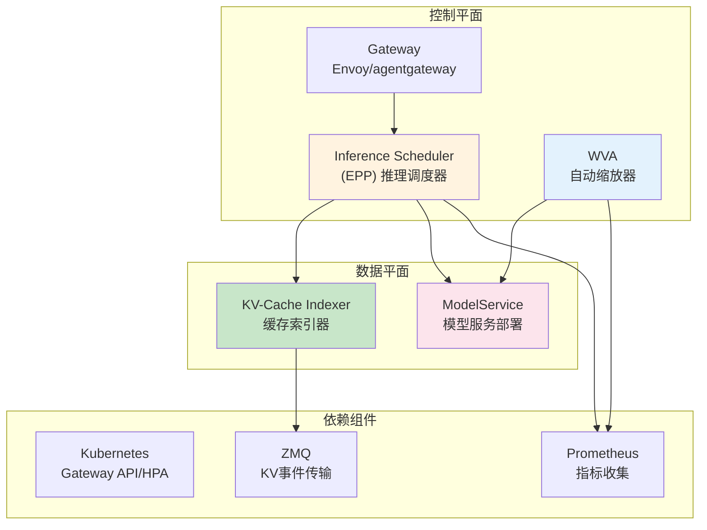
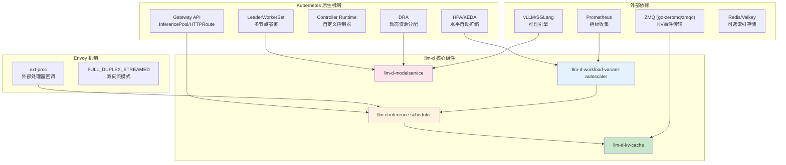
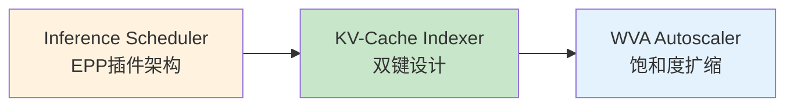

# Week 7: llm-d 推理服务部署调优

> 系统学习 llm-d 推理服务栈的核心组件、调度扩展与自动缩放最佳实践。

---

## 学习系列总览

本项目涵盖 llm-d 推理服务栈的四大核心组件：



---

## 快速导航

| 文件 | 说明 |
|------|------|
| [inference-scheduler/docs/README.md](inference-scheduler/docs/README.md) | 📖 **推理调度器详解** - EPP 插件架构、路由算法 |
| [autoscaler/docs/README.md](autoscaler/docs/README.md) | 📖 **自动缩放器详解** - WVA 饱和度驱动扩缩容 |
| [kv-cache/docs/README.md](kv-cache/docs/README.md) | 📖 **KV 缓存详解** - Indexer 双键设计、分层缓存 |
| [troubleshooting/docs/README.md](troubleshooting/docs/README.md) | 📖 **问题排查详解** - 分层排查模型 ⭐重点 |
| [architecture-summary/docs/README.md](architecture-summary/docs/README.md) | 📖 **架构总结详解** - 整体架构与关键原理 |

---

## 核心特性

```
┌─────────────────────────────────────────────────────────────┐
│                    llm-d 核心能力                            │
├─────────────────────────────────────────────────────────────┤
│  ✅ 智能路由   - EPP插件架构、前缀缓存感知、SLO感知调度       │
│  ✅ KV索引     - 双键设计、ZMQ事件订阅、分层缓存              │
│  ✅ 饱和度扩缩 - KV Cache+队列深度驱动、HPA/KEDA集成          │
│  ✅ P/D分离    - Prefill/Decode分离部署                      │
│  ✅ 多节点部署 - LeaderWorkerSet、Wide EP for MoE             │
└─────────────────────────────────────────────────────────────┘
```

---

## 项目结构

```
week5-llm-d-inference/
│
├── inference-scheduler/            # 推理调度器专题
│   ├── README.md                   # 概览：EPP 架构
│   ├── docs/                       # 详解：插件与路由算法
│   ├── pkg/                        # 插件示例代码
│   └── manifests/                  # 部署配置
│
├── autoscaler/                     # 自动缩放器专题
│   ├── README.md                   # 概览：WVA 架构
│   ├── docs/                       # 详解：饱和度扩缩容
│   └── manifests/                  # 部署配置
│
├── kv-cache/                       # KV 缓存专题
│   ├── README.md                   # 概览：Indexer 架构
│   ├── docs/                       # 详解：双键设计
│   └── manifests/                  # 配置示例
│
├── troubleshooting/                # 问题排查 ⭐重点
│   ├── README.md                   # 概览：排查框架
│   ├── docs/                       # 详解：分层排查
│   └── scripts/                    # 诊断脚本
│
├── architecture-summary/           # 架构总结
│   ├── README.md                   # 概览：整体架构
│   ├── docs/                       # 详解：关键原理
│
└── docs/                           # 通用文档
    ├── gateway-api-gie.md          # Gateway API Inference Extension
    └── best-practices.md           # 最佳实践
```

---

## 核心组件依赖关系



---

## 学习路线

### 阶段一：理解核心组件



### 阶段二：掌握部署与调优


### 阶段三：架构总结


---

## 核心收获

| 能力维度 | 收获 |
|----------|------|
| **调度器扩展** | EPP 插件架构（Filters/Scorers/Pickers）、自定义插件开发 |
| **KV 缓存索引** | 双键设计、ZMQ 事件订阅、分层缓存机制 |
| **自动缩放器** | WVA 饱和度驱动机制、与 EPP 阈值对齐、HPA/KEDA 集成 |
| **问题排查** | 分层排查方法（Gateway→EPP→模型服务→网络） |

---

## 源码项目

| 项目 | 链接 | 研读重点 |
|------|------|----------|
| llm-d-inference-scheduler | `llm-d/llm-d-inference-scheduler` | EPP 插件架构、路由流程 |
| llm-d-kv-cache | `llm-d/llm-d-kv-cache` | Indexer 实现、双键设计 |
| llm-d-workload-variant-autoscaler | `llm-d/llm-d-workload-variant-autoscaler` | 饱和度分析器、HPA 集成 |
| llm-d-modelservice | `llm-d/llm-d-modelservice` | Helm Chart 结构 |

---

> 开始学习：推荐从 [inference-scheduler/docs/README.md](inference-scheduler/docs/README.md) 开始。