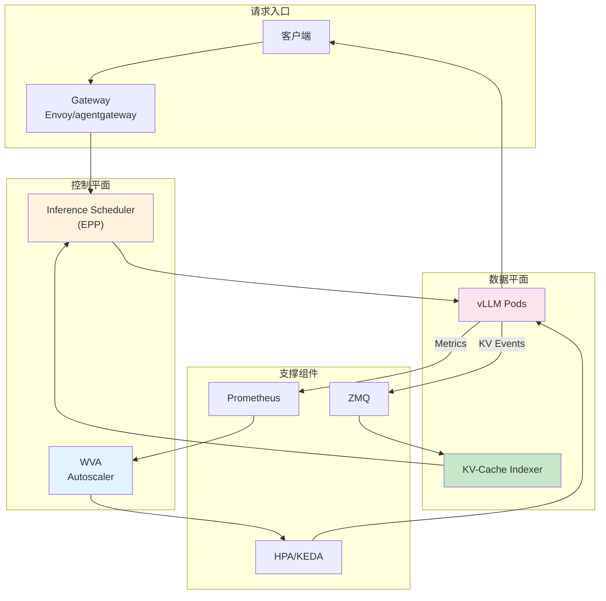
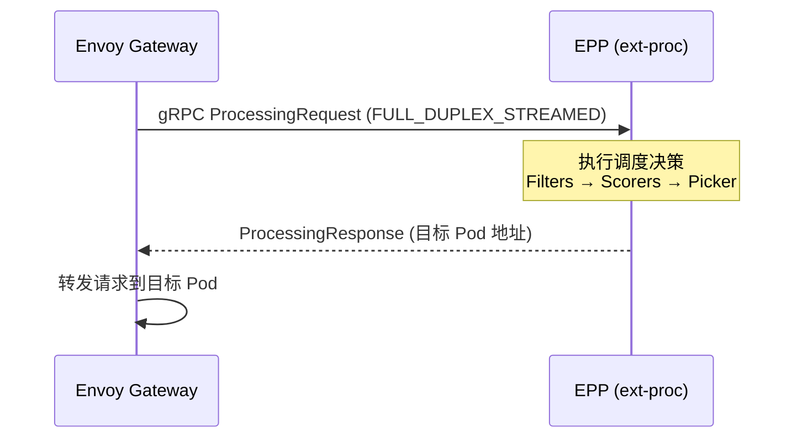
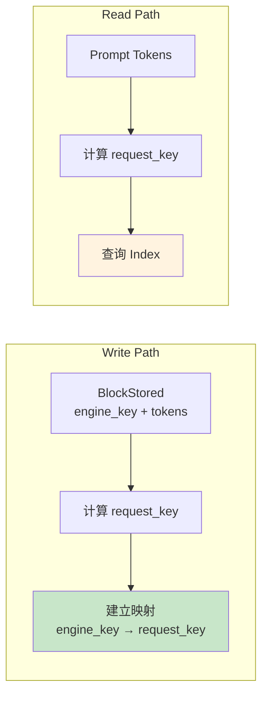
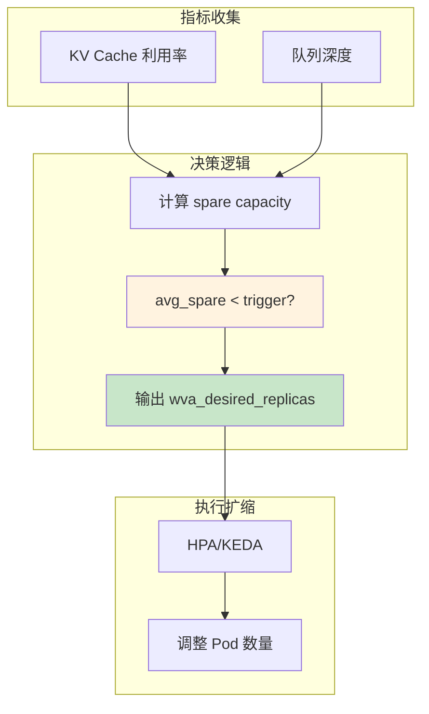

# Architecture Summary (架构总结)

> llm-d 整体架构、四大核心组件协作关系、关键实现原理。

---

## 快速导航

| 文件 | 说明 |
|------|------|
| [docs/README.md](docs/README.md) | 📖 **核心架构详解** - 关键实现原理 |

---

## 整体架构



---

## 四大核心组件

| 组件 | 核心职责 | 关键依赖 |
|------|----------|----------|
| **Inference Scheduler** | 推理请求智能路由 | Gateway API, ext-proc, KV Indexer |
| **KV-Cache Indexer** | 全局 KV 缓存状态索引 | ZMQ, vLLM KV Events |
| **WVA Autoscaler** | 饱和度驱动自动扩缩 | Prometheus, HPA/KEDA |
| **ModelService** | 模型服务声明式部署 | Helm, vLLM, LWS |

---

## 关键实现原理

### 1. ext-proc 回调机制



### 2. 双键索引设计



### 3. 饱和度驱动扩缩



---

## 项目结构

```
architecture-summary/
├── README.md                   # 本文档
├── docs/
│   ├── README.md               # 核心架构详解
│   ├── component-overview.md   # 组件协作关系
│   ├── key-implementations.md  # 关键实现原理
│   └── comparison.md           # 与其他方案对比
```

---

详见 **[docs/README.md](docs/README.md)** 获取核心架构详解。