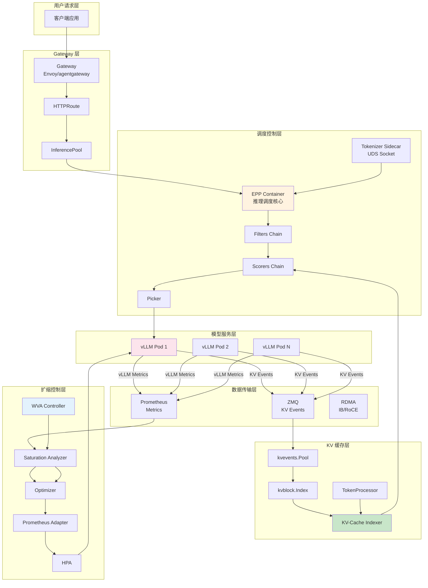
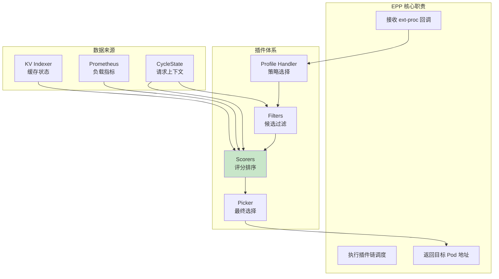
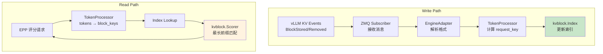
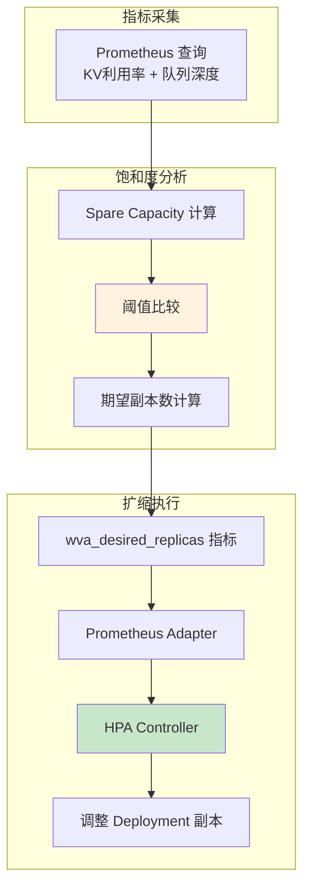
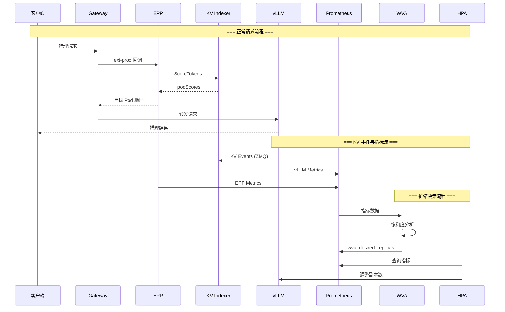
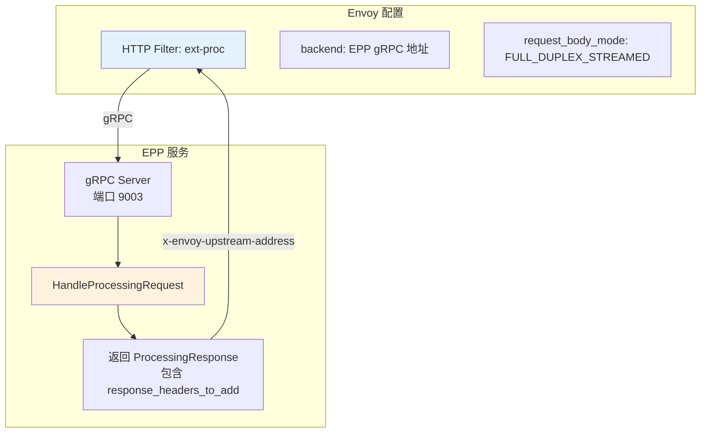
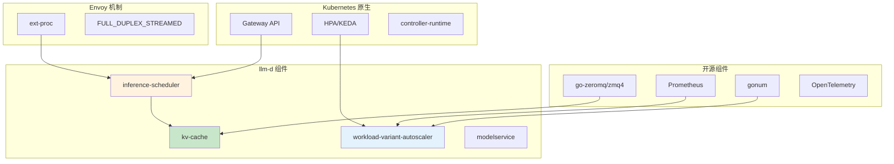

# Architecture Summary 详解

> llm-d 整体架构、组件协作、关键实现原理总结。

---

## 目录

- [1. 整体架构](#1-整体架构)
- [2. 四大核心组件协作](#2-四大核心组件协作)
- [3. 关键实现原理](#3-关键实现原理)
- [4. 与其他方案对比](#4-与其他方案对比)
- [5. 学习收获总结](#5-学习收获总结)

---

## 1. 整体架构

### 1.1 架构全景图



### 1.2 核心数据流

| 数据流 | 方向 | 作用 |
|--------|------|------|
| **请求流** | Client → Gateway → EPP → vLLM | 推理请求处理 |
| **KV 事件流** | vLLM → ZMQ → Indexer | 缓存状态同步 |
| **指标流** | vLLM/EPP → Prometheus → WVA | 饱和度分析数据源 |
| **扩缩决策流** | WVA → Prometheus Adapter → HPA → vLLM | 副本数调整 |

---

## 2. 四大核心组件协作

### 2.1 Inference Scheduler (EPP)



### 2.2 KV-Cache Indexer



### 2.3 WVA Autoscaler



### 2.4 组件协作关系



---

## 3. 关键实现原理

### 3.1 ext-proc 回调机制

**原理：** Envoy 通过 gRPC 调用 EPP，让 EPP 决定请求路由目标。



**关键点：**
- 唯一支持 `FULL_DUPLEX_STREAMED` 模式
- 响应 header 包含目标 Pod 地址
- EPP 无需修改请求 body

### 3.2 双键索引设计

**原理：** 评分查询需要 request_key，驱逐事件只有 engine_key，通过 BlockStored 建立映射。

| 场景 | 可用信息 | 解决方案 |
|------|----------|----------|
| **评分** | Prompt tokens | 计算 request_key，直接查 Index |
| **驱逐** | engine_key (from Event) | 查 engine_key → request_key 映射，再驱逐 Index |

**Hash 算法：**

```go
// request_key 计算
blockKey[i] = FNV64a(CBOR([parentHash[i-1], tokenChunk[i], extra]))

// 初始化
initialHash = FNV64a(hashSeed + modelName)
```

### 3.3 饱和度驱动扩缩

**原理：** 不等副本完全饱和，当平均 spare capacity 低于阈值时提前扩容。

**公式：**

```
spare_kv[i] = kvCacheThreshold - current_kv_usage[i]
avg_spare_kv = mean(spare_kv for non-saturated replicas)

if avg_spare_kv < kvSpareTrigger:
    trigger_scale_up()
```

### 3.4 最长连续前缀匹配评分

**原理：** KV 块因果链，只有连续前缀可复用。

```
Block keys:   B0    B1    B2    B3    B4

Pod A:        ✓     ✓     ✓     ✓     ✗    → score = 4
Pod B:        ✓     ✓     ✗     -     -    → score = 2 (链断)
Pod C:        ✗     -     -     -     -    → score = 0
```

**评分公式：**

```
score = Σ weight(block) for consecutive blocks starting from B0
weight(block) = tier_weight[device_tier]  // GPU=1.0, CPU=0.8
```

---

## 4. 与其他方案对比

### 4.1 vs. 原生 Kubernetes HPA

| 维度 | llm-d WVA | 原生 HPA |
|------|-----------|----------|
| **指标来源** | KV Cache + 队列深度（推理特有） | CPU/Memory（通用） |
| **决策机制** | Spare Capacity Model | 直接阈值比较 |
| **Scale-to-Zero** | ✅ 支持 | ❌ 不支持（需 KEDA） |
| **多变体** | ✅ 支持异构硬件 | ❌ 单一配置 |

### 4.2 vs. vLLM 原生路由

| 维度 | llm-d EPP | vLLM 原生 |
|------|-----------|-----------|
| **路由位置** | Gateway 层（解耦） | vLLM 内部 |
| **缓存感知** | ✅ 精确全局索引 | ❌ 本地启发式 |
| **P/D 分离** | ✅ 支持 | ❌ 单进程 |
| **可扩展性** | ✅ 插件架构 | ❌ 固定逻辑 |

### 4.3 vs. 其他推理框架

| 维度 | llm-d | Triton Inference Server | TorchServe |
|------|-------|-------------------------|------------|
| **KV 缓存感知路由** | ✅ | ❌ | ❌ |
| **P/D 分离** | ✅ | ❌ | ❌ |
| **Kubernetes 集成** | ✅ 原生 | ❌ 需适配 | ⚠️ 部分支持 |
| **自动扩缩** | ✅ WVA | ⚠️ 基础 | ⚠️ 基础 |

---

## 5. 学习收获总结

### 5.1 核心能力清单

```
┌─────────────────────────────────────────────────────────────┐
│                Week 5 学习收获                               │
├─────────────────────────────────────────────────────────────┤
│  ✅ EPP 插件架构   - Filters/Scorers/Pickers 扩展机制        │
│  ✅ KV 索引设计    - 双键设计、ZMQ 事件订阅、最长前缀匹配     │
│  ✅ 饱和度扩缩     - Spare Capacity Model、阈值对齐          │
│  ✅ 分层排查       - Gateway→EPP→模型服务→网络               │
│  ✅ 关键依赖       - Gateway API、ext-proc、ZMQ、Prometheus  │
└─────────────────────────────────────────────────────────────┘
```

### 5.2 关键配置要点

| 配置点 | 必须对齐 | 说明 |
|--------|----------|------|
| **blockSize** | EPP ↔ vLLM | 精确前缀缓存评分生效 |
| **hashSeed** | EPP ↔ vLLM | PYTHONHASHSEED 环境变量 |
| **modelName** | EPP ↔ vLLM | Tokenizer 加载正确模型 |
| **kvCacheThreshold** | WVA ↔ EPP | 防止请求丢弃 |

### 5.3 源码研读建议

| 项目 | 研读重点 | 目录 |
|------|----------|------|
| **llm-d-inference-scheduler** | EPP 插件框架 | `pkg/epp/framework/`, `pkg/epp/scheduling/` |
| **llm-d-kv-cache** | 双键设计实现 | `pkg/kvcache/`, `pkg/kvevents/` |
| **llm-d-workload-variant-autoscaler** | 饱和度分析器 | `pkg/analyzer/` |

---

## 附录

### A. 依赖关系图



### B. 术语表

| 术语 | 全称 | 说明 |
|------|------|------|
| **EPP** | Endpoint Picker | 推理调度核心组件 |
| **GIE** | Gateway API Inference Extension | Kubernetes 上游项目 |
| **WVA** | Workload Variant Autoscaler | 饱和度驱动扩缩器 |
| **ext-proc** | External Processing | Envoy 外部处理器回调 |
| **KV Block** | Key-Value Block | 推理缓存块 |
| **Spare Capacity** | - | 阈值与当前值之差 |