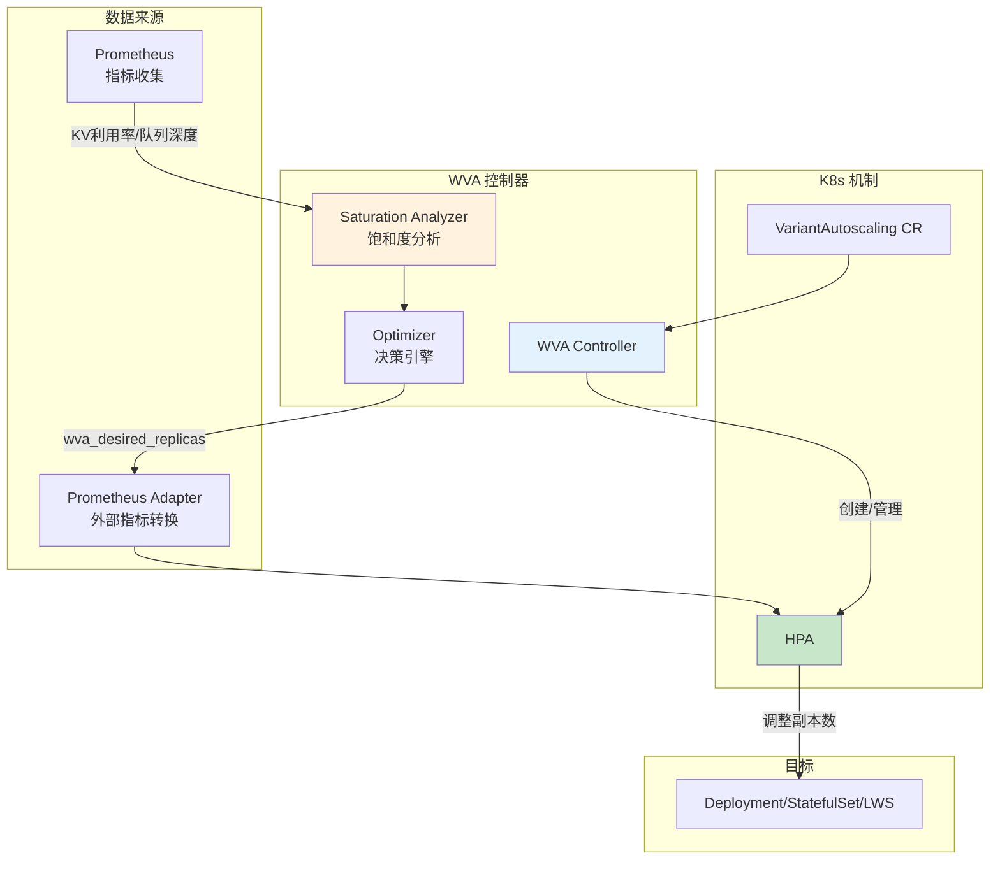

# Autoscaler (自动缩放器)

> WVA (Workload Variant Autoscaler) 饱和度驱动自动扩缩容组件。

---

## 快速导航

| 文件 | 说明 |
|------|------|
| [docs/README.md](docs/README.md) | 📖 **WVA 详解** - 饱和度扩缩容机制 |
| [docs/epp-alignment.md](docs/epp-alignment.md) | 📖 **阈值对齐** - 与 EPP 阈值协调 |

---

## 核心特性

```
┌─────────────────────────────────────────────────────────────┐
│                WVA 核心能力                                  │
├─────────────────────────────────────────────────────────────┤
│  ✅ 饱和度驱动 - KV Cache利用率 + 队列深度触发扩缩           │
│  ✅ HPA/KEDA集成 - 通过 Prometheus Adapter 提供自定义指标    │
│  ✅ Scale-to-zero - 支持缩容至零副本                         │
│  ✅ 多变体支持 - 异构硬件上多模型工作负载扩缩                │
│  ✅ 成本优化 - variantCost 驱动最优实例选择                  │
└─────────────────────────────────────────────────────────────┘
```

---

## 关键依赖

| 依赖 | 类型 | 用途 |
|------|------|------|
| **HPA/KEDA** | K8s 原生 | 执行扩缩容动作 |
| **Prometheus** | 开源组件 | 指标收集（KV利用率、队列深度） |
| **Prometheus Adapter** | 开源组件 | 外部指标转换，提供 wva_desired_replicas |
| **GIE** | 开源组件 | EPP 指标获取 |
| **LWS** | 开源组件 | LeaderWorkerSet 支持（多节点部署） |

---

## 核心架构



---

## 项目结构

```
autoscaler/
├── README.md                   # 本文档
├── docs/
│   ├── README.md               # 饱和度扩缩详解
│   ├── epp-alignment.md        # 与 EPP 阈值对齐
│   └── hpa-integration.md      # HPA 集成机制
├── manifests/
│   ├── variant-autoscaling.yaml # VariantAutoscaling CR 示例
│   ├── saturation-config.yaml   # 饱和度配置 ConfigMap
│   └── prometheus-adapter.yaml  # Prometheus Adapter 配置
└── scripts/
    └── verify-wva.sh           # WVA 验证脚本
```

---

## 核心概念

### VariantAutoscaling CR

| 字段 | 说明 | 必需 |
|------|------|------|
| **scaleTargetRef** | 目标 Deployment/StatefulSet/LWS | ✅ 必需 |
| **modelID** | OpenAI API 兼容模型 ID | ✅ 必需 |
| **variantCost** | 每副本成本（用于成本优化） | 可选，默认 "10.0" |

### 饱和度指标

| 指标 | 来源 | 用途 |
|------|------|------|
| **KV Cache 利用率** | vLLM → Prometheus | 检测 GPU 内存压力 |
| **队列深度** | EPP → Prometheus | 检测请求排队情况 |

---

## 源码关键目录

```
llm-d-workload-variant-autoscaler/
├── api/v1alpha1/                # VariantAutoscaling CRD
├── pkg/analyzer/                # 饱和度分析器
│   ├── queueanalyzer.go         # 队列模型分析
│   ├── queuemodel.go            # M/M/1/k 队列模型
│   └── saturation.go            # 饱和度检测
├── pkg/config/                  # 配置管理
├── pkg/manager/                 # 控制器管理
├── charts/                      # Helm Chart
└── docs/user-guide/             # 用户指南
```

---

## 关键依赖 (go.mod)

```go
// K8s 原生机制
sigs.k8s.io/controller-runtime v0.22.5    // 控制器框架
k8s.io/client-go v0.34.5                   // K8s API

// 外部扩缩器
github.com/kedacore/keda/v2 v2.18.0        // KEDA 支持
sigs.k8s.io/gateway-api-inference-extension v1.2.1  // EPP 指标
sigs.k8s.io/lws v0.8.0                     // LeaderWorkerSet

// 数值计算
gonum.org/v1/gonum v0.17.0                 // 数值库
github.com/llm-inferno/kalman-filter       // Kalman 滤波

// 监控
github.com/prometheus/client_golang        // Prometheus 指标
```

---

详见 **[docs/README.md](docs/README.md)** 获取饱和度扩缩容详解。