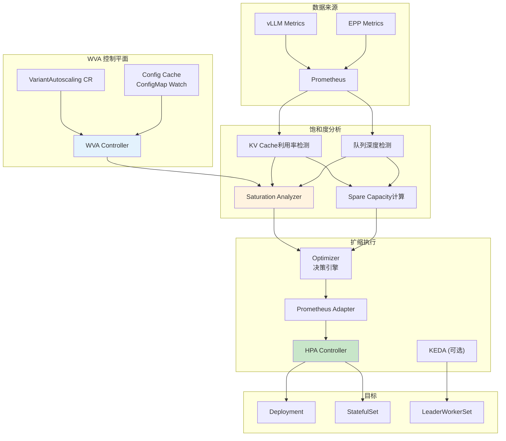
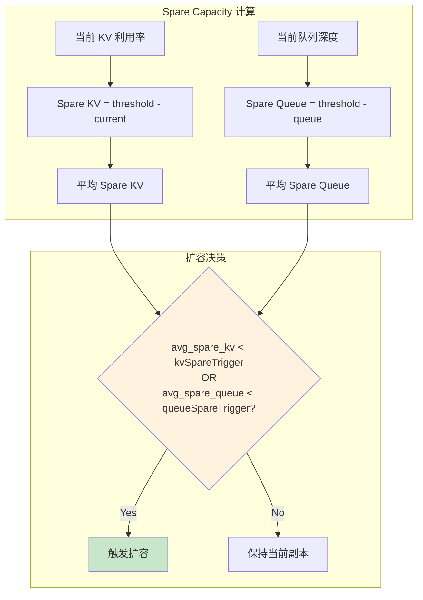
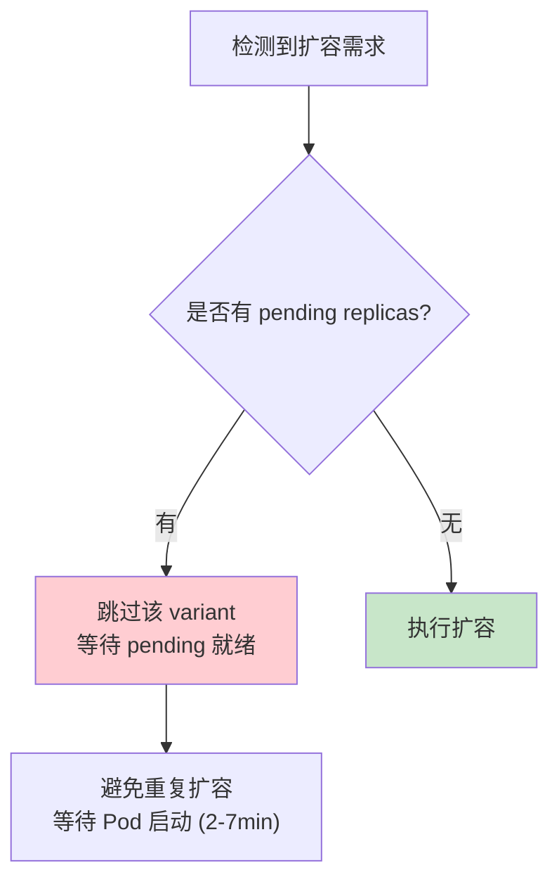
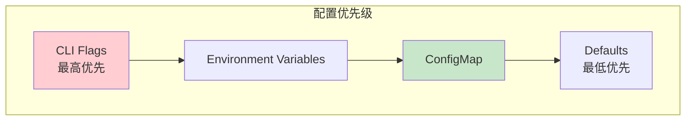

# Autoscaler 详解

> WVA 饱和度驱动自动扩缩容机制、与 EPP 阈值对齐。

---

## 目录

- [1. 架构概览](#1-架构概览)
- [2. 饱和度驱动机制](#2-饱和度驱动机制)
- [3. 与 EPP 阈值对齐](#3-与-epp-阈值对齐)
- [4. HPA/KEDA 集成](#4-hpakeda-集成)
- [5. 配置详解](#5-配置详解)
- [6. 关键依赖与 K8s 原生机制](#6-关键依赖与-k8s-原生机制)

---

## 1. 架构概览

### 1.1 整体架构



### 1.2 数据流

```mermaid
sequenceDiagram
    participant WVA as WVA Controller
    participant PROM as Prometheus
    participant SAT as Saturation Analyzer
    participant OPT as Optimizer
    participant ADAPTER as Prometheus Adapter
    participant HPA as HPA
    participant DEPLOY as Deployment
    
    Note over WVA,DEPLOY: === 指标收集 ===
    DEPLOY->>PROM: vLLM 指标 (KV利用率、队列深度)
    EPP->>PROM: 路由指标
    
    Note over WVA,DEPLOY: === 饱和度分析 ===
    WVA->>PROM: 查询指标
    PROM-->>WVA: 返回指标
    WVA->>SAT: 分析饱和度
    SAT->>SAT: 计算 spare capacity
    SAT-->>WVA: 饱和状态 + 期望副本
    
    Note over WVA,DEPLOY: === 扩缩决策 ===
    WVA->>OPT: 优化决策
    OPT-->>WVA: wva_desired_replicas
    WVA->>ADAPTER: 暴露指标
    
    Note over WVA,DEPLOY: === 执行扩缩 ===
    HPA->>ADAPTER: 查询 wva_desired_replicas
    ADAPTER-->>HPA: 返回期望副本
    HPA->>DEPLOY: 调整副本数
```

---

## 2. 饱和度驱动机制

### 2.1 Spare Capacity Model

**核心原理：** WVA 不等待副本完全饱和，而是当平均 spare capacity 低于阈值时触发扩容。



### 2.2 阈值参数

| 参数 | 说明 | 推荐值 |
|------|------|--------|
| **kvCacheThreshold** | KV 利用率饱和阈值 | 0.80 |
| **queueLengthThreshold** | 队列深度饱和阈值 | 5 |
| **kvSpareTrigger** | KV spare 容量触发扩容 | 0.10 |
| **queueSpareTrigger** | Queue spare 容量触发扩容 | 3 |

### 2.3 防止级联扩容



---

## 3. 与 EPP 阈值对齐

### 3.1 为什么需要对齐

**问题：** 如果 WVA 和 EPP 阈值不一致：
- WVA 认为某副本饱和（0.80），触发扩容
- EPP 却认为该副本未饱和（0.85），继续路由请求
- 结果：请求被路由到即将饱和的副本，可能被丢弃

### 3.2 阈值映射关系

| 概念 | WVA 字段 | EPP 字段 | 对齐默认值 |
|------|----------|----------|------------|
| KV 饱和阈值 | `kvCacheThreshold` | `kvCacheUtilThreshold` | **0.80** |
| 队列饱和阈值 | `queueLengthThreshold` | `queueDepthThreshold` | **5** |

### 3.3 配置对齐示例

**WVA ConfigMap：**

```yaml
apiVersion: v1
kind: ConfigMap
metadata:
  name: wva-saturation-scaling-config
data:
  default: |
    kvCacheThreshold: 0.80      # 必须等于 EPP kvCacheUtilThreshold
    queueLengthThreshold: 5     # 必须等于 EPP queueDepthThreshold
    kvSpareTrigger: 0.10
    queueSpareTrigger: 3
```

**EPP 配置：**

```yaml
saturationDetector:
  kvCacheUtilThreshold: 0.8     # 必须等于 WVA kvCacheThreshold
  queueDepthThreshold: 5        # 必须等于 WVA queueLengthThreshold
```

### 3.4 模型级覆盖

```yaml
# WVA ConfigMap 支持模型级覆盖
data:
  default: |
    kvCacheThreshold: 0.80
    queueLengthThreshold: 5
    
  # 覆盖特定模型
  "ibm/granite-13b#production": |
    kvCacheThreshold: 0.85      # 更激进
    queueLengthThreshold: 3
```

---

## 4. HPA/KEDA 集成

### 4.1 HPA 集成架构

```mermaid
graph LR
    subgraph "WVA"
        WVA["WVA Controller"]
    end
    
    subgraph "指标层"
        PROM["Prometheus"]
        ADAPTER["Prometheus Adapter"]
        METRIC["wva_desired_replicas<br/>自定义指标"]
    end
    
    subgraph "HPA"
        HPA["HPA Controller"]
        MIN["minReplicas: 1"]
        MAX["maxReplicas: 16"]
    end
    
    subgraph "目标"
        DEPLOY["Deployment"]
    end
    
    WVA -->|"计算期望副本"| METRIC --> ADAPTER
    ADAPTER -->|"提供外部指标"| HPA
    HPA -->|"调整副本"| DEPLOY
    
    style METRIC fill:#c8e6c9
    style HPA fill:#e3f2fd
```

### 4.2 HPA 配置示例

```yaml
apiVersion: autoscaling/v2
kind: HorizontalPodAutoscaler
metadata:
  name: llama-8b-hpa
spec:
  scaleTargetRef:
    apiVersion: apps/v1
    kind: Deployment
    name: llama-8b
  minReplicas: 1
  maxReplicas: 16
  metrics:
    - type: External
      external:
        metric:
          name: wva_desired_replicas
          selector:
            matchLabels:
              model_id: meta/llama-3.1-8b
        target:
          type: Value
          value: "1"               # 直接使用 WVA 计算值
```

### 4.3 Scale-to-Zero 支持

**前提条件：**
1. `WVA_SCALE_TO_ZERO: true` 环境变量
2. HPA `minReplicas: 0`
3. `scaleTargetRef` 必须正确配置

**机制：**
- WVA 设置 `wva_desired_replicas = 0` 时，HPA 缩容至零
- 有请求时通过 InferencePool 机制唤醒

---

## 5. 配置详解

### 5.1 VariantAutoscaling CR

```yaml
apiVersion: llmd.ai/v1alpha1
kind: VariantAutoscaling
metadata:
  name: llama-8b-autoscaler
  namespace: llm-inference
spec:
  scaleTargetRef:                 # 必需：扩缩目标
    kind: Deployment
    name: llama-8b
  modelID: "meta/llama-3.1-8b"    # 必需：模型 ID
  variantCost: "15.5"             # 可选：成本因子
```

### 5.2 ConfigMap 配置层级



### 5.3 Namespace-Local Override

```yaml
# Global ConfigMap (控制器命名空间)
apiVersion: v1
kind: ConfigMap
metadata:
  name: wva-saturation-scaling-config
  namespace: workload-variant-autoscaler-system
data:
  default: |
    kvCacheThreshold: 0.80
    
---
# Namespace-Local Override (目标命名空间)
apiVersion: v1
kind: ConfigMap
metadata:
  name: wva-saturation-scaling-config
  namespace: production         # 覆盖此命名空间的配置
data:
  default: |
    kvCacheThreshold: 0.70      # 更激进的生产配置
```

---

## 6. 关键依赖与 K8s 原生机制

### 6.1 Kubernetes 原生机制

| 机制 | 用途 | WVA 使用方式 |
|------|------|--------------|
| **HPA** | 水平自动扩缩 | WVA 通过 Prometheus Adapter 提供指标给 HPA |
| **Custom Resource Definition** | VariantAutoscaling | 定义扩缩配置 |
| **controller-runtime** | 控制器框架 | 监控 CR 并执行饱和度分析 |
| **ConfigMap Watch** | 配置热更新 | 自动检测配置变更，无需重启 |
| **Leader Election** | HA 支持 | 多副本控制器选举 |

### 6.2 外部开源组件

| 组件 | 用途 | 关键特性 |
|------|------|----------|
| **KEDA** | 事件驱动扩缩 | 支持 Scale-to-Zero |
| **Prometheus Adapter** | 外部指标转换 | 将 WVA 指标暴露给 HPA |
| **gonum** | 数值计算 | 队列模型分析 |
| **Kalman filter** | 状态估计 | 平滑指标波动 |

### 6.3 内部组件依赖

| 组件 | 用途 |
|------|------|
| **GIE** | 获取 EPP 指标（队列深度等） |
| **LWS** | LeaderWorkerSet 扩缩支持 |

---

## 附录

### A. 源码目录映射

| 源码目录 | 功能 |
|----------|------|
| `pkg/analyzer/` | 饱和度分析器 |
| `pkg/analyzer/queueanalyzer.go` | 队列模型分析 |
| `pkg/config/` | 配置管理（ConfigMap 缓存） |
| `pkg/manager/` | 控制器管理 |
| `api/v1alpha1/` | VariantAutoscaling CRD |
| `charts/` | Helm Chart |

### B. 常见问题排查

| 问题 | 检查方法 | 解决方案 |
|------|----------|----------|
| HPA 无法获取指标 | `kubectl get hpa` 检查 TARGETS | 验证 Prometheus Adapter |
| WVA 无法连接 Prometheus | 检查 PROMETHEUS_BASE_URL | 配置 CA 证书 |
| 阈值不生效 | 检查 ConfigMap key 格式 | 使用 `{modelID}#{namespace}` 格式 |
| Scale-to-Zero 失效 | 检查 scaleTargetRef | 必须正确配置 |

### C. 参考资料

- [WVA 论文](https://arxiv.org/abs/2603.09730)
- [饱和度配置文档](../../../llm-d/llm-d-workload-variant-autoscaler/docs/saturation-scaling-config.md)