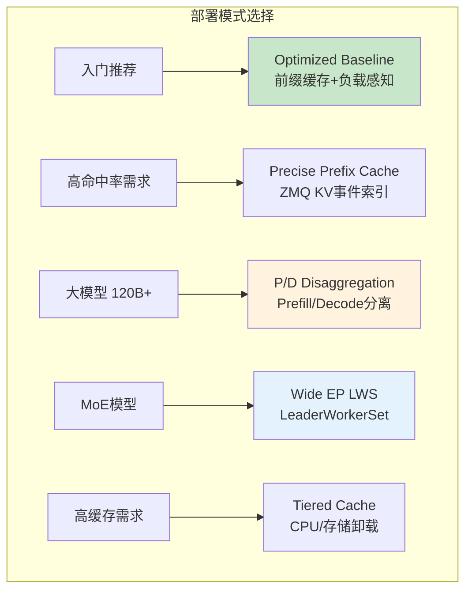

# Deployment Modes (部署模式)

> llm-d 5种部署模式概览与配置指南。

---

## 快速导航

| 文件 | 说明 |
|------|------|
| [docs/README.md](docs/README.md) | 📖 **部署模式详解** - 模式对比与选择指南 |

---

## 5种部署模式概览



---

## 模式对比

| 模式 | 适用场景 | 硬件要求 | 核心技术 |
|------|----------|----------|----------|
| **Optimized Baseline** | 入门推荐 | 2+ GPU | 前缀缓存 + 负载感知路由 |
| **Precise Prefix Cache** | 高命中率需求 | 8+ GPU | ZMQ KV 事件索引 |
| **P/D Disaggregation** | 大模型 120B+ | RDMA 网络 | NIXL KV 传输 |
| **Wide EP LWS** | MoE模型 DeepSeek | 32 H200/B200 | LeaderWorkerSet |
| **Tiered Prefix Cache** | 高缓存需求 | 大内存节点 | CPU/存储卸载 |

---

## 项目结构

```
deployment-modes/
├── README.md                   # 本文档
├── docs/
│   ├── README.md               # 模式详解
│   ├── optimized-baseline.md   # 优化基线
│   ├── pd-disaggregation.md    # P/D分离
│   ├── wide-ep-lws.md          # Wide EP
│   └── tiered-cache.md         # 分层缓存
├── manifests/
│   ├── baseline/               # 基线配置
│   ├── pd/                     # P/D配置
│   ├── wide-ep/                # Wide EP配置
│   └── tiered/                 # 分层缓存配置
└── scripts/
    ├── deploy-baseline.sh
    └── benchmark.sh
```

---

详见 **[docs/README.md](docs/README.md)** 获取部署模式详解。