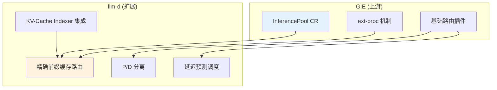

# Gateway API Inference Extension (GIE)

> llm-d Inference Scheduler 的上游基础项目。

---

## 概述

Gateway API Inference Extension (GIE) 是 Kubernetes SIGs 项目，为 LLM 推理提供智能路由能力。llm-d Inference Scheduler 基于 GIE 扩展。

---

## 核心概念

| 术语 | 说明 |
|------|------|
| **Inference Gateway (IGW)** | 与 EPP 配合的代理/负载均衡器 |
| **Inference Scheduler** | 根据指标和能力做出最优端点决策的可扩展组件 |
| **Endpoint Picker (EPP)** | Inference Scheduler 的实现，包含路由、流程控制层 |
| **Body Based Router (BBR)** | 解析推理请求 HTTP body 提取模型名称 |

---

## llm-d 与 GIE 的关系

**协作策略：**
- 成熟且广泛适用的功能逐步上游到 GIE
- llm-d 特有功能（如 P/D 分离）保留在 llm-d
- 两项目紧密协作，API 兼容

---

## 关键 API 资源

| 资源 | 说明 |
|------|------|
| **InferencePool** | 推理服务池，定义目标 Pod 集合 |
| **EndpointPickerConfig** | EPP 插件配置 |
| **HTTPRoute** | 路由规则，指向 InferencePool |

---

## 参考链接

- [GIE GitHub](https://github.com/kubernetes-sigs/gateway-api-inference-extension)
- [GIE 官方文档](https://gateway-api-inference-extension.sigs.k8s.io/)