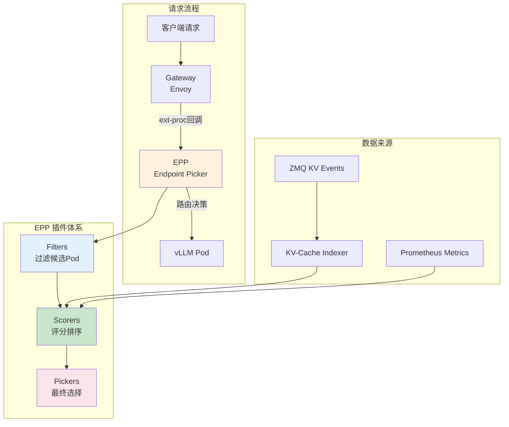

# Inference Scheduler (推理调度器)

> 基于 Gateway API Inference Extension 扩展的 EPP 推理调度组件。

---

## 快速导航

| 文件 | 说明 |
|------|------|
| [docs/README.md](docs/README.md) | 📖 **EPP 插件架构详解** - Filters/Scorers/Pickers |
| [docs/routing-algorithms.md](docs/routing-algorithms.md) | 📖 **路由算法详解** - 前缀缓存/负载感知/SLO感知 |

---

## 核心特性

```
┌─────────────────────────────────────────────────────────────┐
│                Inference Scheduler 核心能力                  │
├─────────────────────────────────────────────────────────────┤
│  ✅ 插件架构   - Filters过滤、Scorers评分、Pickers选择        │
│  ✅ 路由算法   - 精确前缀缓存、负载感知、SLO感知、延迟预测     │
│  ✅ P/D分离    - Prefill/Decode disaggregation 支持          │
│  ✅ 扩展机制   - 基于 GIE 扩展，支持自定义插件                │
└─────────────────────────────────────────────────────────────┘
```

---

## 关键依赖

| 依赖 | 类型 | 用途 |
|------|------|------|
| **Gateway API** | K8s 原生 | InferencePool/HTTPRoute 资源 |
| **Envoy ext-proc** | Envoy 机制 | 外部处理器回调，实现路由决策 |
| **GIE** | 开源组件 | Gateway API Inference Extension 基础 |
| **llm-d-kv-cache** | 内部组件 | 精确前缀缓存评分 |
| **ZMQ** | 开源组件 | KV 事件订阅 (go-zeromq/zmq4) |
| **Prometheus** | 开源组件 | 指标收集，负载感知评分 |

---

## 核心架构



---

## 项目结构

```
inference-scheduler/
├── README.md                   # 本文档
├── docs/
│   ├── README.md               # 插件架构详解
│   ├── routing-algorithms.md   # 路由算法详解
│   └── plugin-development.md   # 自定义插件开发
├── pkg/
│   ├── filters/                # Filter 插件示例
│   ├── scorers/                # Scorer 插件示例
│   └── pickers/                # Picker 插件示例
└── manifests/
    ├── epp-deployment.yaml     # EPP 部署配置
    ├── inference-pool.yaml     # InferencePool 配置
    └── plugins-config.yaml     # 插件配置示例
```

---

## 核心概念

### EPP (Endpoint Picker)

EPP 是 Inference Scheduler 的核心组件，负责为每个推理请求选择最优的目标 Pod。

| 概念 | 说明 |
|------|------|
| **ext-proc** | Envoy 外部处理器回调机制，EPP 通过此接口介入路由决策 |
| **FULL_DUPLEX_STREAMED** | 唯一支持的请求模式，双向流式处理 |
| **SchedulingProfile** | 调度策略组合，定义使用哪些插件 |

### 插件类型

| 类型 | 作用 | 示例 |
|------|------|------|
| **Filters** | 过滤不符合条件的 Pod | decode-filter, by-label |
| **Scorers** | 为候选 Pod 评分排序 | precise-prefix-cache-scorer, load-aware-scorer |
| **Pickers** | 从评分结果中选择最终 Pod | max-score-picker |
| **Profile Handlers** | 决定使用哪个调度策略 | single-profile-handler, disagg-profile-handler |

---

## 源码关键目录

```
llm-d-inference-scheduler/
├── pkg/epp/                    # EPP 核心实现
│   ├── backend/                # 后端 Pod 管理
│   ├── config/                 # 插件配置解析
│   ├── datalayer/              # 数据层（指标采集）
│   ├── framework/              # 插件框架接口
│   ├── scheduling/             # 调度逻辑实现
│   └── server/                 # ext-proc 服务端
├── docs/
│   ├── architecture.md         # 架构文档
│   ├── disaggregation.md       # P/D 分离详解
│   └── create_new_filter.md    # 插件开发指南
└── go.mod                      # 依赖管理
```

---

## 关键依赖 (go.mod)

```go
// K8s 原生机制
sigs.k8s.io/gateway-api v1.5.1           // Gateway API
sigs.k8s.io/gateway-api-inference-extension v1.5.0  // GIE 基础
k8s.io/controller-runtime v0.23.3        // 控制器框架

// Envoy 机制
github.com/envoyproxy/go-control-plane/envoy v1.37.0  // Envoy API

// 内部组件
github.com/llm-d/llm-d-kv-cache v0.7.1   // KV 缓存索引

// 外部组件
github.com/go-zeromq/zmq4 v0.17.0        // ZMQ 事件订阅
github.com/prometheus/client_golang      // Prometheus 指标
go.opentelemetry.io/otel                 // 分布式追踪
```

---

详见 **[docs/README.md](docs/README.md)** 获取插件架构详解。