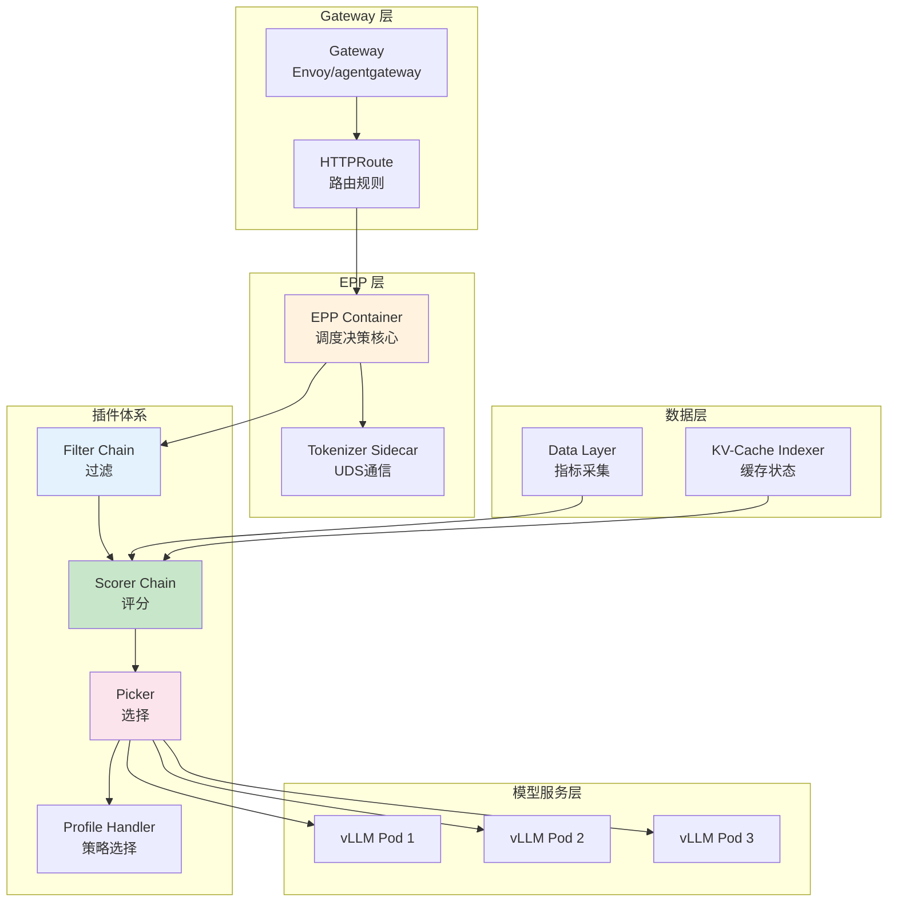
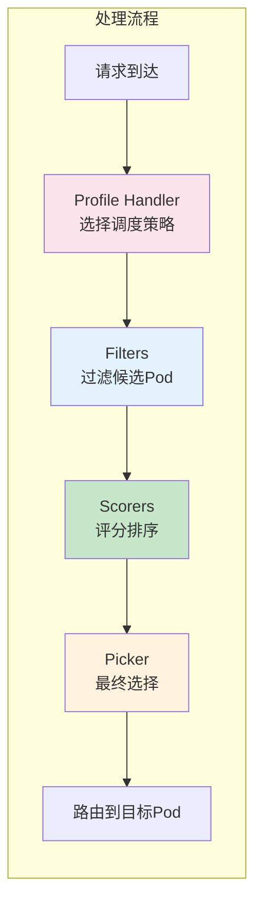
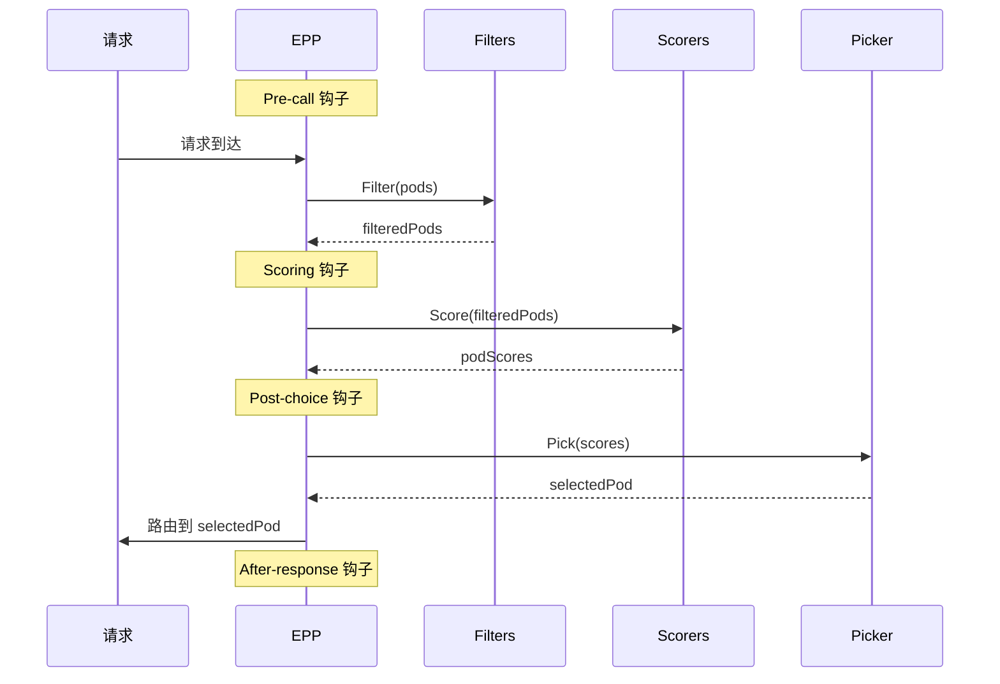
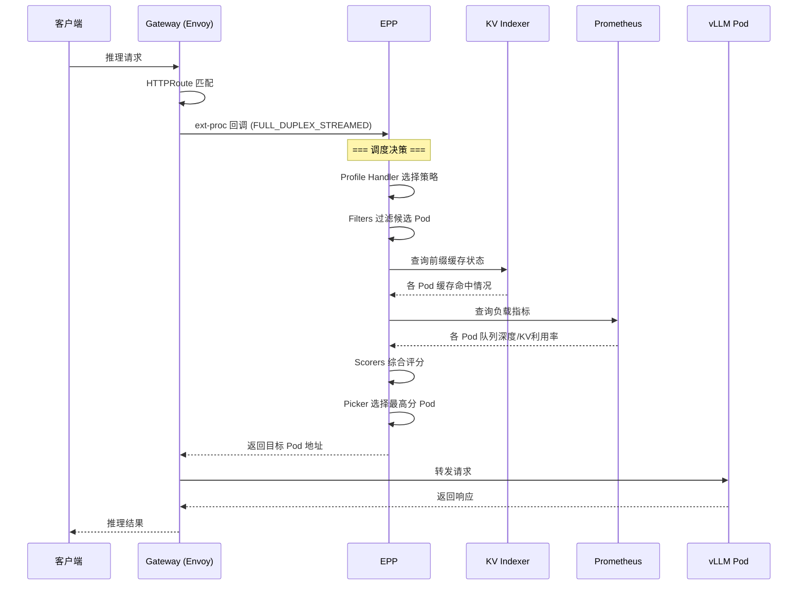
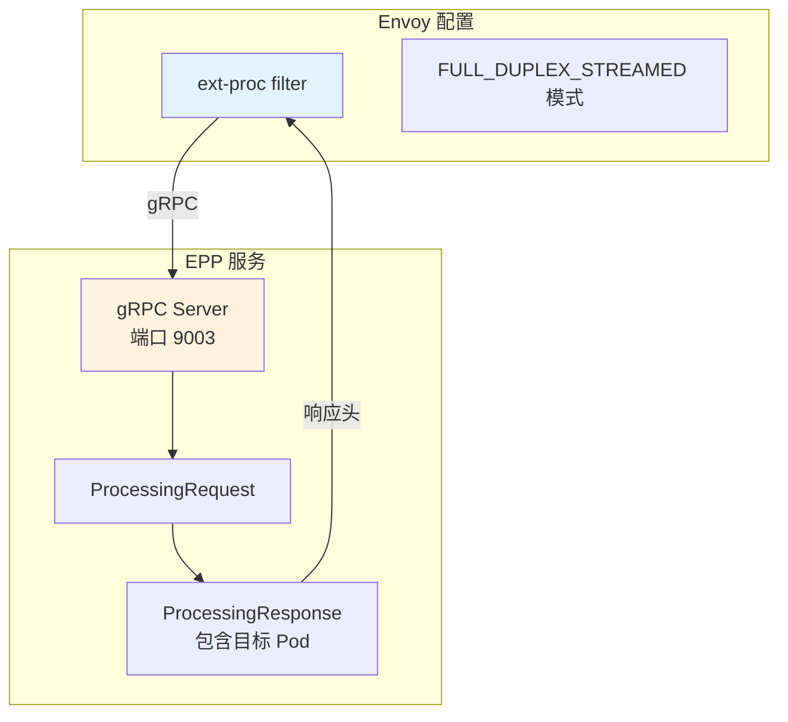
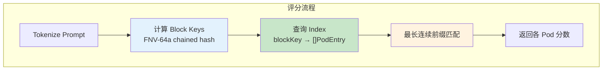

# Inference Scheduler 详解

> EPP (Endpoint Picker) 插件架构、路由流程与核心实现原理。

---

## 目录

- [1. 架构概览](#1-架构概览)
- [2. 插件体系](#2-插件体系)
- [3. 路由流程](#3-路由流程)
- [4. 核心插件详解](#4-核心插件详解)
- [5. 配置机制](#5-配置机制)
- [6. 关键依赖与 K8s/Envoy 原生机制](#6-关键依赖与-k8senvoy-原生机制)

---

## 1. 架构概览

### 1.1 整体架构



### 1.2 与 GIE 的关系

| 关系 | 说明 |
|------|------|
| **扩展基础** | llm-d EPP 扩展 GIE (Gateway API Inference Extension) 项目 |
| **上游机制** | GIE 提供 API 资源和调度机制（InferencePool、ext-proc 回调） |
| **llm-d 特有** | P/D 分离、精确前缀缓存路由等高级特性 |
| **上游策略** | 成熟且广泛适用的功能逐步上游到 GIE |

---

## 2. 插件体系

### 2.1 插件类型与职责



| 插件类型 | 职责 | 接口 |
|----------|------|------|
| **Profile Handler** | 决定使用哪个 SchedulingProfile | `PickProfile()` |
| **Filters** | 过滤不符合条件的 Pod | `Filter(pods) → filteredPods` |
| **Scorers** | 为候选 Pod 计算 0-1 分数 | `Score(pod) → float64` |
| **Pickers** | 从评分结果中选择最终 Pod | `Pick(scores) → pod` |
| **Scrapers** | 采集 Pod 指标数据 | 定期抓取 Prometheus 指标 |

### 2.2 生命周期钩子



---

## 3. 路由流程

### 3.1 请求处理完整流程



### 3.2 ext-proc 回调机制



**关键点：**
- EPP 通过 gRPC 接收 Envoy 的 ext-proc 回调
- 唯一支持 `FULL_DUPLEX_STREAMED` 模式
- 响应中包含目标 Pod 的地址信息

---

## 4. 核心插件详解

### 4.1 Filters (过滤器)

| 插件 | 类型 | 功能 | 参数 |
|------|------|------|------|
| **decode-filter** | `decode-filter` | 过滤出 decode 角色 Pod | 无 |
| **prefill-filter** | `prefill-filter` | 过滤出 prefill 角色 Pod | 无 |
| **by-label** | `by-label` | 按 label 值过滤 | `label`, `validValues` |
| **by-label-selector** | `by-label-selector` | K8s label selector 过滤 | `matchLabels` |

**示例配置：**

```yaml
plugins:
  - type: decode-filter
  - type: by-label
    parameters:
      label: "hardware-type"
      validValues: ["H100", "A100"]
```

### 4.2 Scorers (评分器)

#### 4.2.1 precise-prefix-cache-scorer (精确前缀缓存评分)

**核心原理：**
- 使用 `llm-d-kv-cache` Indexer 查询各 Pod 的 KV 块驻留状态
- 计算最长连续前缀匹配，返回 0-1 分数
- 需要配置 blockSize 和 hashSeed 与 vLLM 匹配



**配置示例：**

```yaml
plugins:
  - type: precise-prefix-cache-scorer
    parameters:
      tokenProcessorConfig:
        blockSize: 64              # 必须匹配 vLLM --block-size
        hashSeed: "42"             # 必须匹配 vLLM PYTHONHASHSEED
      indexerConfig:
        tokenizersPoolConfig:
          modelName: "Qwen/Qwen3-32B"
        kvBlockIndexConfig:
          enableMetrics: true
      kvEventsConfig:
        topicFilter: "kv@"
        discoverPods: true         # 多副本 EPP 自动发现
```

#### 4.2.2 load-aware-scorer (负载感知评分)

**核心原理：**
- 基于 Prometheus 指标计算 Pod 负载
- 空队列 Pod 得 0.5 分，有队列 Pod 得 0-0.5 分
- threshold 参数定义过载阈值

| Pod 状态 | 分数范围 |
|----------|----------|
| 队列空 | 0.5 |
| 队列有请求但未过载 | 0.5 → 0 |
| 队列过载 (≥threshold) | 0 |

**配置示例：**

```yaml
plugins:
  - type: load-aware-scorer
    parameters:
      threshold: 10               # 队列深度阈值
```

#### 4.2.3 其他 Scorers

| 插件 | 功能 |
|------|------|
| **active-request-scorer** | 按活跃请求数评分（少请求高分数） |
| **session-affinity-scorer** | 会话亲和性，相同 session 优先路由到同一 Pod |
| **no-hit-lru-scorer** | 冷请求 LRU 分发，均匀分布缓存增长 |
| **context-length-aware** | 按上下文长度路由到不同配置的 Pod |

### 4.3 Pickers (选择器)

| 插件 | 功能 |
|------|------|
| **max-score-picker** | 选择最高分 Pod（同分随机选） |
| **random-picker** | 随机选择（测试用） |

### 4.4 Profile Handlers (策略处理器)

| 插件 | 功能 |
|------|------|
| **single-profile-handler** | 单一策略，直接使用 default profile |
| **disagg-profile-handler** | P/D 分离策略，根据 decider 决定是否启用 prefill |

---

## 5. 配置机制

### 5.1 EndpointPickerConfig 结构

```yaml
apiVersion: inference.networking.x-k8s.io/v1alpha1
kind: EndpointPickerConfig
plugins:
  - name: my-filter              # 可选，引用名
    type: decode-filter          # 插件类型
    parameters:                  # 可选参数
      ...
      
schedulingProfiles:
  - name: default
    plugins:
      - pluginRef: my-filter     # 引用插件
      - pluginRef: my-scorer
        weight: 50               # Scorer 权重
```

### 5.2 SchedulingProfile 配置

```yaml
schedulingProfiles:
  - name: decode
    plugins:
      - pluginRef: decode-filter
      - pluginRef: precise-prefix-cache-scorer
        weight: 100              # 高权重
      - pluginRef: load-aware-scorer
        weight: 50               # 较低权重
      - pluginRef: max-score-picker

  - name: prefill
    plugins:
      - pluginRef: prefill-filter
      - pluginRef: max-score-picker
```

### 5.3 完整配置示例

```yaml
apiVersion: inference.networking.x-k8s.io/v1alpha1
kind: EndpointPickerConfig

plugins:
  # Filters
  - type: decode-filter
  
  # Scorers  
  - type: precise-prefix-cache-scorer
    parameters:
      tokenProcessorConfig:
        blockSize: 64
        hashSeed: "42"
      indexerConfig:
        tokenizersPoolConfig:
          modelName: "Qwen/Qwen3-32B"
          
  - type: load-aware-scorer
    parameters:
      threshold: 10
      
  # Pickers
  - type: max-score-picker
  
  # Profile Handler
  - type: single-profile-handler

schedulingProfiles:
  - name: default
    plugins:
      - pluginRef: decode-filter
      - pluginRef: precise-prefix-cache-scorer
        weight: 100
      - pluginRef: load-aware-scorer
        weight: 50
      - pluginRef: max-score-picker
```

---

## 6. 关键依赖与 K8s/Envoy 原生机制

### 6.1 Kubernetes 原生机制

| 机制 | 用途 | llm-d 使用方式 |
|------|------|----------------|
| **Gateway API** | InferencePool 定义模型服务池 | EPP 通过 InferencePool 发现目标 Pod |
| **HTTPRoute** | 定义路由规则 | 请求从 Gateway → HTTPRoute → InferencePool |
| **controller-runtime** | 自定义控制器框架 | EPP 控制器管理配置和 Pod 发现 |
| **Custom Resource Definition** | EndpointPickerConfig | 插件配置通过 CRD 或文件传递 |

### 6.2 Envoy 原生机制

| 机制 | 用途 | llm-d 使用方式 |
|------|------|----------------|
| **ext-proc** | 外部处理器回调 | EPP 通过 gRPC 接收路由决策请求 |
| **FULL_DUPLEX_STREAMED** | 双向流模式 | 唯一支持的 ext-proc 模式 |
| **go-control-plane** | Envoy API 定义 | 解析 ProcessingRequest/Response |

### 6.3 外部开源组件

| 组件 | 用途 | 关键特性 |
|------|------|----------|
| **go-zeromq/zmq4** | ZMQ 纯 Go 实现 | KV 事件订阅，无需 libzmq |
| **Prometheus client_golang** | 指标收集 | 负载感知评分数据源 |
| **OpenTelemetry** | 分布式追踪 | 端到端请求追踪 |
| **google/cel-go** | CEL 表达式 | 灵活的过滤条件表达 |

### 6.4 内部组件依赖

| 组件 | 用途 |
|------|------|
| **llm-d-kv-cache** | 精确前缀缓存评分的核心数据源 |

---

## 附录

### A. 源码目录映射

| 源码目录 | 功能 |
|----------|------|
| `pkg/epp/server/` | ext-proc gRPC 服务端 |
| `pkg/epp/scheduling/` | 调度逻辑实现 |
| `pkg/epp/framework/` | 插件框架接口定义 |
| `pkg/epp/config/` | 配置解析 |
| `pkg/epp/datalayer/` | Prometheus 指标采集 |
| `pkg/sidecar/` | Tokenizer UDS Sidecar |

### B. 参考资料

- [GIE 官方文档](https://gateway-api-inference-extension.sigs.k8s.io/)
- [Envoy ext-proc 文档](https://www.envoyproxy.io/docs/envoy/latest/configuration/http/http_filters/ext_proc_filter)
- [llm-d-inference-scheduler 源码](../../../llm-d/llm-d-inference-scheduler/)