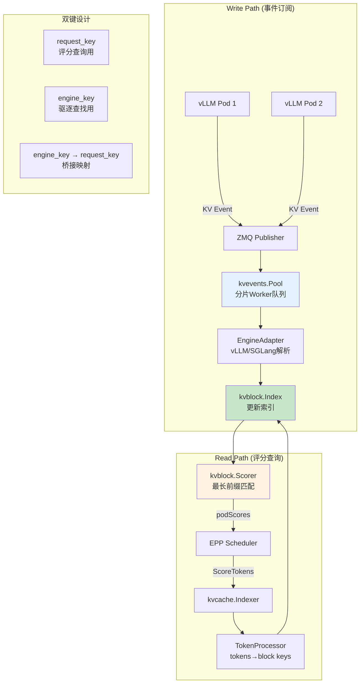

# KV-Cache (KV 缓存索引器)

> 维护全局近实时 KV 块驻留视图，支持精确前缀缓存感知路由。

---

## 快速导航

| 文件 | 说明 |
|------|------|
| [docs/README.md](docs/README.md) | 📖 **Indexer 详解** - 双键设计、分层缓存 |

---

## 核心特性

```
┌─────────────────────────────────────────────────────────────┐
│                KV-Cache Indexer 核心能力                     │
├─────────────────────────────────────────────────────────────┤
│  ✅ 双键设计   - request keys(评分) + engine keys(驱逐)      │
│  ✅ ZMQ 事件订阅 - 实时接收 vLLM KV 块事件                   │
│  ✅ 最长前缀匹配 - 评分基于连续块命中                        │
│  ✅ 分层缓存   - GPU HBM → CPU RAM → 共享存储               │
│  ✅ 多引擎支持 - vLLM、SGLang EngineAdapter                  │
└─────────────────────────────────────────────────────────────┘
```

---

## 关键依赖

| 依赖 | 类型 | 用途 |
|------|------|------|
| **ZMQ (go-zeromq/zmq4)** | 开源组件 | KV 事件订阅，纯 Go 实现 |
| **Ristretto** | 开源组件 | 成本感知内存缓存 |
| **Redis/Valkey** | 可选外部 | 外部索引存储 |
| **controller-runtime** | K8s 框架 | Pod 发现与管理 |
| **gRPC** | 通信机制 | 内部组件通信 |

---

## 核心架构



---

## 项目结构

```
kv-cache/
├── README.md                   # 本文档
├── docs/
│   ├── README.md               # Indexer 详解
│   ├── dual-key-design.md      # 双键设计详解
│   └── tiered-cache.md         # 分层缓存配置
├── manifests/
│   └── kv-events-config.yaml   # KV 事件配置示例
└── scripts/
    └── check-kv-events.sh      # KV 事件验证脚本
```

---

## 核心概念

### 双键设计

| 键类型 | 用途 | 来源 |
|--------|------|------|
| **request_key** | 评分时查询，从 prompt tokens 计算 | TokenProcessor FNV-64a chained hash |
| **engine_key** | 驱逐时查找，来自 KV Event | vLLM 内部 content-addressing |

**关键机制：**
- BlockStored 事件携带 tokens，可计算 request_key 并建立映射
- BlockRemoved 事件只有 engine_key，通过映射找到 request_key 执行驱逐

### KV 事件类型

| 事件 | 说明 | 触发时机 |
|------|------|----------|
| **BlockStored** | 块被创建 | vLLM 分配 KV 块时 |
| **BlockRemoved** | 块被驱逐 | vLLM 缓存淘汰时 |
| **AllBlocksCleared** | 清空缓存 | Pod 重置时 |

### 分层缓存权重

| 层级 | 默认权重 | 说明 |
|------|----------|------|
| **GPU HBM** | 1.0 | 最高优先级 |
| **CPU RAM** | 0.8 | 次级缓存 |
| **共享存储** | 0.5 | 远程缓存 |

---

## 源码关键目录

```
llm-d-kv-cache/
├── pkg/kvcache/                 # Indexer 核心
│   ├── indexer.go               # 主协调器
│   ├── kvblock_scorer.go        # 评分算法
│   └── kvblock/                 # Block 处理
│       ├── token_processor.go   # tokens → block keys
│       └── index.go             # 索引存储接口
├── pkg/kvevents/                # 事件处理
│   ├── pool.go                  # 分片 Worker Pool
│   ├── zmq_subscriber.go        # ZMQ 订阅
│   └── engineadapter/           # 引擎适配器
├── kv_connectors/               # 存储后端
│   └── llmd_fs_backend/         # 文件系统后端
└── api/                         # API 定义
```

---

## 关键依赖 (go.mod)

```go
// ZMQ 事件
github.com/go-zeromq/zmq4 v0.17.0           // 纯 Go ZMQ

// 缓存存储
github.com/dgraph-io/ristretto/v2 v2.3.0   // 成本感知缓存
github.com/hashicorp/golang-lru/v2         // LRU 缓存
github.com/redis/go-redis/v9               // Redis 客户端（可选）

// 序列化
github.com/fxamacker/cbor/v2               // CBOR 编码
github.com/vmihailenco/msgpack/v5          // Msgpack 解析

// K8s
k8s.io/client-go                            // Pod 发现
sigs.k8s.io/controller-runtime              // 控制器框架

// 监控
github.com/prometheus/client_golang         // 指标
go.opentelemetry.io/otel                   // 追踪
```

---

详见 **[docs/README.md](docs/README.md)** 获取 Indexer 双键设计详解。