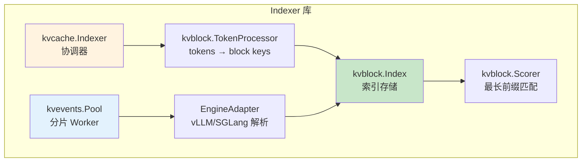
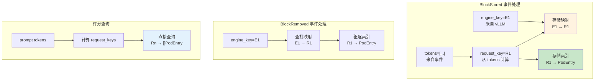
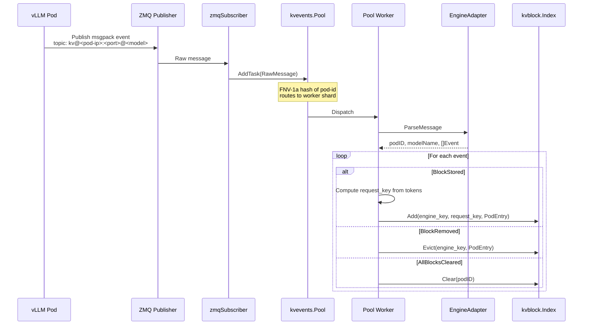
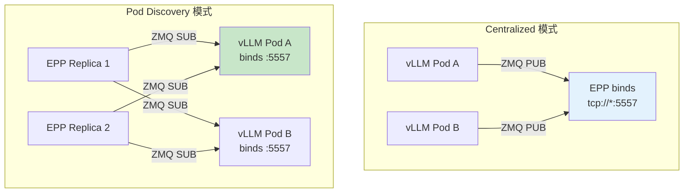
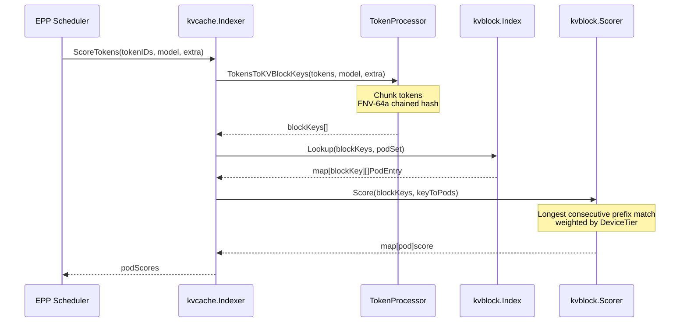
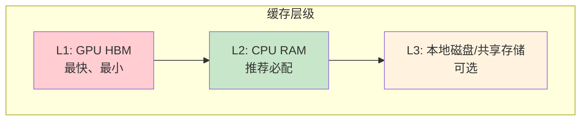

# KV-Cache Indexer 详解

> 双键设计、ZMQ 事件订阅、分层缓存机制详解。

---

## 目录

- [1. 架构概览](#1-架构概览)
- [2. 双键设计](#2-双键设计)
- [3. Write Path (事件订阅)](#3-write-path-事件订阅)
- [4. Read Path (评分查询)](#4-read-path-评分查询)
- [5. 分层缓存](#5-分层缓存)
- [6. 关键依赖与实现原理](#6-关键依赖与实现原理)

---

## 1. 架构概览

### 1.1 Indexer 核心组件



### 1.2 模块职责

| 模块 | 职责 | 默认实现 |
|------|------|----------|
| **Indexer** | 协调 block key 计算、索引查询、评分 | - |
| **TokenProcessor** | tokens → block keys (FNV-64a chained hash) | - |
| **Scorer** | 最长连续前缀匹配评分，按设备层加权 | - |
| **Index** | 存储 block key → Pod 映射 | 两级 LRU 内存缓存 |
| **Pool** | 分片 ZMQ Worker 队列 | FNV-1a pod ID 分片 |
| **EngineAdapter** | 解析引擎特定消息格式 | vLLM/SGLang msgpack |

---

## 2. 双键设计

### 2.1 为什么需要双键

**问题：**
- 评分时：只有 prompt tokens，需要快速查询哪些 Pod 有缓存
- 逐时：只有 engine key (vLLM 内部 hash)，不知道对应的 request key

**解决：** 两个独立的 hash 空间，通过 BlockStored 建立映射。



### 2.2 Request Key 计算

**算法：** FNV-64a chained hash over CBOR

```
block_key[i] = FNV-64a(
    CBOR([parent_hash[i-1], token_chunk[i], extra[i]])
)
```

**参数：**
- `blockSize`: 分块大小（默认 64，必须匹配 vLLM）
- `hashSeed`: hash 初始化种子（必须匹配 PYTHONHASHSEED）
- `extra`: LoRA ID、multimodal hash 等额外特征

### 2.3 Engine Key 来源

- vLLM/SGLang 内部 content-addressing hash
- 通过 KV Event 的 `block_hash` 字段传递
- Indexer 不需要知道 engine key 的计算方式

---

## 3. Write Path (事件订阅)

### 3.1 KV 事件类型

| 事件 | Payload | 处理方式 |
|------|---------|----------|
| **BlockStored** | engine_key, tokens, tier, LoRA | 计算 request_key，建立映射，更新索引 |
| **BlockRemoved** | engine_key, tier | 查找映射获取 request_key，驱逐索引 |
| **AllBlocksCleared** | pod ID | 清除该 Pod 所有索引条目 |

### 3.2 ZMQ 事件流



### 3.3 分片保序机制

**问题：** 同一 Pod 的事件必须按序处理

**解决：**
- 使用 `EngineAdapter.ShardingKey()` 提取 pod ID
- FNV-1a hash pod ID 选择 Worker shard
- 每个 Pod 的所有事件进入同一个 Worker 队列

### 3.4 Pod 发现模式

**两种事件传递模式：**

| 模式 | 说明 | 适用场景 |
|------|------|----------|
| **Centralized** | 所有 vLLM Pod 连接到单一 Endpoint | 单副本 EPP |
| **Pod Discovery** | EPP 发现 Pod 并创建 per-pod subscriber | 多副本 EPP (HA) |



---

## 4. Read Path (评分查询)

### 4.1 评分流程



### 4.2 最长连续前缀匹配

**原理：** KV 块形成因果链，只有连续前缀可复用

```
Block keys:   B0    B1    B2    B3    B4

Pod A:        ✓     ✓     ✓     ✓     ✗    → score = 4 blocks
Pod B:        ✓     ✓     ✗     -     -    → score = 2 blocks (链断在 B2)
Pod C:        ✗     -     -     -     -    → score = 0 blocks (无前缀)
```

**即使 Pod C 有 B3、B4，也无用，因为缺少 B0-B2 链。**

### 4.3 分层加权评分

| 设备层 | 默认权重 | 说明 |
|--------|----------|------|
| **GPU HBM** | 1.0 | 最高优先级 |
| **CPU RAM** | 0.8 | 次级缓存 |
| **共享存储** | 0.5 | 远程缓存 |

**评分规则：** 同一块在多层缓存时，取最高权重

---

## 5. 分层缓存

### 5.1 缓存层级



### 5.2 Index 后端选项

| 后端 | 存储 | 适用场景 |
|------|------|----------|
| **In-Memory LRU** | 两级 LRU（默认） | 大多数部署 |
| **Ristretto** | 成本感知缓存 | multimodal/LoRA 变长元数据 |
| **Redis/Valkey** | 外部 TCP 存储 | 需持久化或超大索引（罕见） |

**推荐：** In-Memory 通常最优，低延迟、简单运维。

---

## 6. 关键依赖与实现原理

### 6.1 ZMQ 依赖

| 特性 | 说明 |
|------|------|
| **纯 Go 实现** | go-zeromq/zmq4，无需 libzmq |
| **消息格式** | msgpack 编码 |
| **Topic 格式** | `kv@<pod-ip>:<port>@<model-name>` |

### 6.2 Hash 算法

| 算法 | 用途 |
|------|------|
| **FNV-64a** | request_key 计算（CBOR chained） |
| **FNV-1a** | Pod ID 分片（Worker 选择） |

### 6.3 序列化

| 格式 | 用途 |
|------|------|
| **CBOR** | block key 计算的输入编码 |
| **Msgpack** | KV Event payload 编码 |

### 6.4 Tokenization 位置

> **重要：** 新集成应在外部 tokenize（EPP 或 sidecar），直接调用 `ScoreTokens`。
> 内部 tokenization.Pool 已废弃。

---

## 附录

### A. 配置示例

```yaml
# precise-prefix-cache-scorer 配置
tokenProcessorConfig:
  blockSize: 64              # 必须匹配 vLLM --block-size
  hashSeed: "42"             # 必须匹配 PYTHONHASHSEED
  
kvEventsConfig:
  topicFilter: "kv@"
  discoverPods: true         # 多副本 EPP
  
indexerConfig:
  kvBlockIndexConfig:
    enableMetrics: true
  tokenizersPoolConfig:
    modelName: "Qwen/Qwen3-32B"
```

### B. vLLM KV Events 配置

```bash
vllm serve ... \
  --block-size 64 \
  --kv-events-config '{
    "publisher": "zmq",
    "endpoint": "tcp://*:5556",
    "topic": "kv@${POD_IP}@Qwen/Qwen3-32B"
  }'
  
export PYTHONHASHSEED=42    # 必须与 scorer hashSeed 匹配
```

### C. 源码目录映射

| 源码目录 | 功能 |
|----------|------|
| `pkg/kvcache/indexer.go` | Indexer 协调器 |
| `pkg/kvcache/kvblock_scorer.go` | 评分算法 |
| `pkg/kvevents/pool.go` | 分片 Worker Pool |
| `pkg/kvevents/zmq_subscriber.go` | ZMQ 订阅实现 |
| `pkg/kvevents/engineadapter/` | vLLM/SGLang 解析器 |
| `kv_connectors/llmd_fs_backend/` | 文件系统卸载后端 |