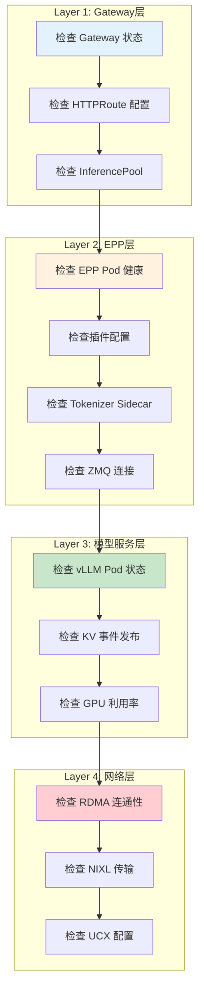

# Troubleshooting (问题排查) ⭐重点

> llm-d 核心组件分层排查模型、常见问题修复与优化配置指南。

---

## 快速导航

| 文件 | 说明 |
|------|------|
| [docs/README.md](docs/README.md) | 📖 **分层排查详解** - Gateway→EPP→模型服务→网络 |
| [docs/scheduler-issues.md](docs/scheduler-issues.md) | 📖 **EPP 问题排查** - 插件配置、KV事件 |
| [docs/autoscaler-issues.md](docs/autoscaler-issues.md) | 📖 **WVA 问题排查** - 阈值对齐、HPA集成 |
| [docs/kv-cache-issues.md](docs/kv-cache-issues.md) | 📖 **KV 缓存问题** - 索引状态、命中率 |
| [docs/network-issues.md](docs/network-issues.md) | 📖 **网络传输问题** - RDMA/NIXL |

---

## 核心排查框架

```
┌─────────────────────────────────────────────────────────────┐
│                    分层排查模型                              │
├─────────────────────────────────────────────────────────────┤
│  Layer 1: Gateway层     → HTTPRoute、InferencePool配置      │
│  Layer 2: EPP层         → 插件配置、KV事件订阅、Tokenizer    │
│  Layer 3: 模型服务层    → vLLM Pod状态、KV事件发布           │
│  Layer 4: 网络层        → RDMA连通、NIXL传输                 │
└─────────────────────────────────────────────────────────────┘
```

---

## 常见问题速查表

| 问题 | 检查方法 | 根因 | 修复方案 |
|------|----------|------|----------|
| EPP 无法获取 KV 事件 | ZMQ 连接状态 | KV_EVENTS_ENDPOINT 配置错误 | 检查 vLLM ZMQ topic 格式 |
| 前缀缓存命中率低 | blockSize/hashSeed | EPP 与 vLLM 配置不一致 | 同步 blockSize=64, hashSeed="42" |
| RDMA 回退到 TCP | UCX_PROTO_INFO=y | IB_GID_INDEX 配置错误 | 调整 UCX_IB_GID_INDEX |
| WVA 扩缩容失效 | HPA TARGETS 列 | Prometheus Adapter 未安装 | 验证外部指标服务 |
| P/D KV 传输失败 | NIXL 日志 | 缺少 IPC_LOCK capability | 添加 RDMA pinned memory 权限 |
| 阈值不对齐导致请求丢弃 | EPP/WVA 配置对比 | kvCacheThreshold ≠ kvCacheUtilThreshold | 对齐阈值配置 |

---

## 分层排查流程



---

## 项目结构

```
troubleshooting/
├── README.md                   # 本文档
├── docs/
│   ├── README.md               # 分层排查详解
│   ├── scheduler-issues.md     # EPP 问题排查
│   ├── autoscaler-issues.md    # WVA 问题排查
│   ├── kv-cache-issues.md      # KV 缓存问题
│   ├── network-issues.md       # 网络传输问题
│   └── optimization-guide.md   # 性能优化指南
└── scripts/
    ├── check-epp-health.sh     # EPP 健康检查
    ├── check-kv-events.sh      # KV 事件验证
    ├── diagnose-network.sh     # 网络诊断
    └── check-wva-alignment.sh  # WVA/EPP 阈值对齐检查
```

---

## 核心诊断命令

### Gateway 层

```bash
# 检查 Gateway 状态
kubectl get gateway -n ${NAMESPACE}

# 检查 HTTPRoute
kubectl get httproute -n ${NAMESPACE} -o yaml

# 检查 InferencePool
kubectl get inferencepool -n ${NAMESPACE} -o yaml
```

### EPP 层

```bash
# 检查 EPP Pod
kubectl get pods -n ${NAMESPACE} -l app=epp

# 检查 EPP 日志
kubectl logs -n ${NAMESPACE} deployment/${EPP_NAME} | grep -i "error\|warn"

# 检查插件配置
kubectl get cm ${EPP_CONFIG} -n ${NAMESPACE} -o yaml

# 检查 ZMQ 连接
kubectl exec -n ${NAMESPACE} ${EPP_POD} -- netstat -an | grep 5556
```

### 模型服务层

```bash
# 检查 vLLM Pod 状态
kubectl get pods -n ${NAMESPACE} -l app=vllm

# 检查 KV 事件发布（vLLM 日志）
kubectl logs -n ${NAMESPACE} ${VLLM_POD} | grep "kv_events"

# 检查 GPU 利用率
kubectl exec -n ${NAMESPACE} ${VLLM_POD} -- nvidia-smi
```

### 网络层

```bash
# 检查 RDMA 设备
kubectl exec -n ${NAMESPACE} ${POD} -- ibv_devices

# 检查 RDMA 连通性
kubectl exec -n ${NAMESPACE} ${POD} -- ib_write_bw -d mlx5_0 -a

# 检查 UCX 配置
kubectl exec -n ${NAMESPACE} ${POD} -- env | grep UCX
```

---

详见 **[docs/README.md](docs/README.md)** 获取分层排查详解。