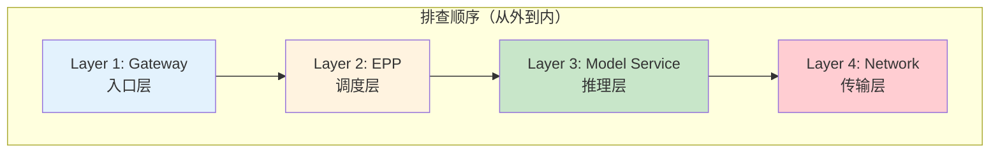
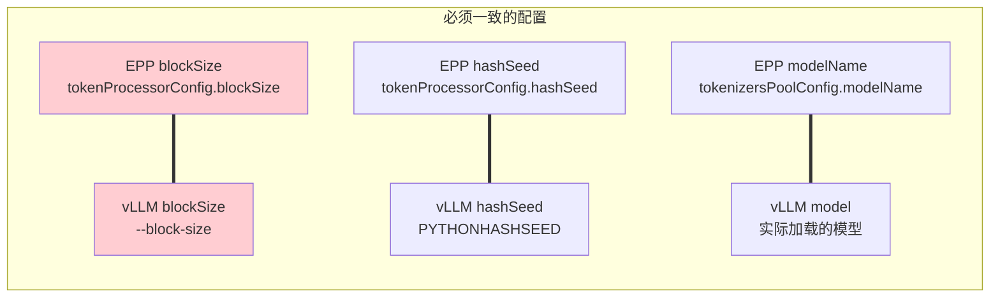
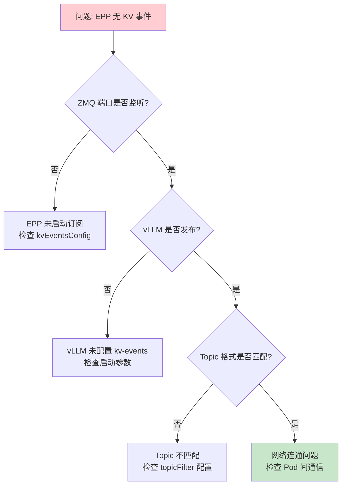
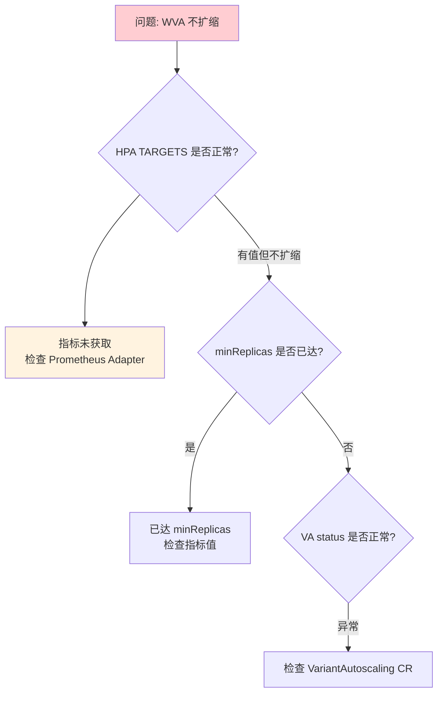

# Troubleshooting 详解

> 分层排查模型、常见问题根因分析、优化配置指南。

---

## 目录

- [1. 分层排查模型](#1-分层排查模型)
- [2. Gateway 层排查](#2-gateway-层排查)
- [3. EPP 层排查](#3-epp-层排查)
- [4. 模型服务层排查](#4-模型服务层排查)
- [5. 网络层排查](#5-网络层排查)
- [6. 常见问题速查](#6-常见问题速查)
- [7. 性能优化配置](#7-性能优化配置)

---

## 1. 分层排查模型

### 1.1 排查顺序



### 1.2 各层核心检查点

| 层级 | 核心检查点 | 关键命令 |
|------|------------|----------|
| **Gateway** | Gateway 状态、HTTPRoute、InferencePool | `kubectl get gateway/httproute/inferencepool` |
| **EPP** | Pod 健康、插件配置、ZMQ 连接、Tokenizer | `kubectl logs`, `kubectl get cm` |
| **模型服务** | vLLM Pod、KV 事件发布、GPU 利用率 | `kubectl logs`, `nvidia-smi` |
| **网络** | RDMA 设备、连通性、UCX 配置 | `ibv_devices`, `ib_write_bw` |

---

## 2. Gateway 层排查

### 2.1 检查 Gateway 状态

```bash
# 检查 Gateway 是否 Ready
kubectl get gateway -n ${NAMESPACE}

# 检查 Gateway 地址
kubectl get gateway ${GW_NAME} -n ${NAMESPACE} \
  -o jsonpath='{.status.addresses[0].value}'
```

**常见问题：**

| 状态 | 问题 | 修复 |
|------|------|------|
| `NotReady` | Gateway 控制器未运行 | 检查 Istio/agentgateway |
| 无地址 | Gateway 未分配 IP | 检查 LoadBalancer 服务 |

### 2.2 检查 HTTPRoute

```bash
# 检查 HTTPRoute 配置
kubectl get httproute -n ${NAMESPACE} -o yaml

# 检查路由规则
kubectl describe httproute ${ROUTE_NAME} -n ${NAMESPACE}
```

**关键检查点：**

```yaml
# HTTPRoute 关键配置
spec:
  parentRefs:
    - name: ${GW_NAME}        # ← 必须匹配 Gateway 名称
  rules:
    - backendRefs:
        - group: inference.networking.x-k8s.io
          kind: InferencePool
          name: ${POOL_NAME}   # ← 必须匹配 InferencePool 名称
```

### 2.3 检查 InferencePool

```bash
# 检查 InferencePool
kubectl get inferencepool -n ${NAMESPACE} -o yaml

# 检查 EPP 关联
kubectl get inferencepool ${POOL_NAME} -n ${NAMESPACE} \
  -o jsonpath='{.spec.endpointPickerConfig}'
```

---

## 3. EPP 层排查

### 3.1 EPP Pod 健康

```bash
# 检查 EPP Pod 状态
kubectl get pods -n ${NAMESPACE} -l app=epp

# 检查 EPP 日志（错误和警告）
kubectl logs -n ${NAMESPACE} deployment/${EPP_NAME} --tail=100 | grep -i "error\|warn"

# 检查 EPP 容器状态
kubectl describe pod ${EPP_POD} -n ${NAMESPACE}
```

### 3.2 插件配置检查

```bash
# 检查插件配置 ConfigMap
kubectl get cm ${EPP_CONFIG} -n ${NAMESPACE} -o yaml

# 关键配置验证
# 1. blockSize 必须匹配 vLLM --block-size
# 2. hashSeed 必须匹配 vLLM PYTHONHASHSEED
# 3. modelName 必须匹配 vLLM 使用的模型
```

**配置一致性检查：**



### 3.3 ZMQ 连接检查

```bash
# 检查 ZMQ 端口监听
kubectl exec -n ${NAMESPACE} ${EPP_POD} -- netstat -an | grep 5556

# 检查 ZMQ 连接状态（EPP 日志）
kubectl logs -n ${NAMESPACE} ${EPP_POD} | grep -i "zmq\|subscriber"

# 检查 vLLM ZMQ 发布配置
kubectl logs -n ${NAMESPACE} ${VLLM_POD} | grep "kv-events-config"
```

**ZMQ Topic 格式：**

```
kv@<pod-ip>:<port>@<model-name>

示例: kv@10.0.0.1:5556@Qwen/Qwen3-32B
```

### 3.4 Tokenizer Sidecar 检查

```bash
# 检查 Tokenizer Sidecar
kubectl get pods -n ${NAMESPACE} ${EPP_POD} -o jsonpath='{.spec.containers[*].name}'

# 检查 UDS Socket
kubectl exec -n ${NAMESPACE} ${EPP_POD} -c tokenizer-sidecar -- \
  ls -la /tmp/tokenizer/

# 检查 Tokenizer 日志
kubectl logs -n ${NAMESPACE} ${EPP_POD} -c tokenizer-sidecar
```

---

## 4. 模型服务层排查

### 4.1 vLLM Pod 状态

```bash
# 检查 vLLM Pod
kubectl get pods -n ${NAMESPACE} -l app=vllm

# 检查 vLLM 日志
kubectl logs -n ${NAMESPACE} ${VLLM_POD} --tail=200

# 检查 GPU 分配
kubectl describe pod ${VLLM_POD} -n ${NAMESPACE} | grep -A5 "Limits:"
```

### 4.2 KV 事件发布检查

```bash
# 检查 KV 事件配置
kubectl exec -n ${NAMESPACE} ${VLLM_POD} -- env | grep "kv-events\|PYTHONHASHSEED"

# 检查 vLLM 是否发布 KV 事件（日志）
kubectl logs -n ${NAMESPACE} ${VLLM_POD} | grep -i "kv_event\|block_store"
```

**vLLM KV 事件配置：**

```yaml
# vLLM 启动参数
vllm serve ... \
  --block-size 64 \
  --kv-events-config '{
    "publisher": "zmq",
    "endpoint": "tcp://*:5556",
    "topic": "kv@${POD_IP}@${MODEL_NAME}"
  }'

# 环境变量
env:
  - name: PYTHONHASHSEED
    value: "42"              # 必须与 EPP hashSeed 一致
```

### 4.3 GPU 利用率检查

```bash
# 检查 GPU 使用情况
kubectl exec -n ${NAMESPACE} ${VLLM_POD} -- nvidia-smi

# 检查 GPU 内存
kubectl exec -n ${NAMESPACE} ${VLLM_POD} -- nvidia-smi --query-gpu=memory.used,memory.total --format=csv
```

---

## 5. 网络层排查

### 5.1 RDMA 设备检查

```bash
# 检查 RDMA 设备列表
kubectl exec -n ${NAMESPACE} ${POD} -- ibv_devices

# 检查 RDMA 设备详情
kubectl exec -n ${NAMESPACE} ${POD} -- ibv_devinfo -v

# 检查链路状态
kubectl exec -n ${NAMESPACE} ${POD} -- ibstat
```

### 5.2 RDMA 连通性测试

```bash
# 测试 RDMA 写带宽（双节点）
# 在节点1执行：
kubectl exec -n ${NAMESPACE} ${POD1} -- ib_write_bw -d mlx5_0 -a

# 在节点2执行：
kubectl exec -n ${NAMESPACE} ${POD2} -- ib_write_bw -d mlx5_0 -a ${POD1_IP}

# 测试 RDMA 延迟
kubectl exec -n ${NAMESPACE} ${POD} -- ib_write_lat -d mlx5_0 -a
```

### 5.3 UCX 配置检查

```bash
# 检查 UCX 环境变量
kubectl exec -n ${NAMESPACE} ${POD} -- env | grep UCX

# 验证 UCX 是否使用 RDMA
kubectl exec -n ${NAMESPACE} ${POD} -- env UCX_PROTO_INFO=y
```

**关键 UCX 配置：**

| 环境变量 | 说明 | 推荐值 |
|----------|------|--------|
| `UCX_IB_GID_INDEX` | IB GID 紜引 | 3 (RoCE V2) |
| `UCX_NET_DEVICES` | 网络设备 | `mlx5_0:1` |
| `UCX_TLS` | 传输层 | `rdma,sm,self` |
| `UCX_PROTO_INFO` | 协议信息（调试） | `y` |

---

## 6. 常见问题速查

### 6.1 EPP 无法获取 KV 事件



### 6.2 前缀缓存命中率低

| 检查项 | 验证方法 | 修复 |
|--------|----------|------|
| **blockSize 不一致** | 对比 EPP config 和 vLLM --block-size | 统一为 64 |
| **hashSeed 不一致** | 对比 EPP config 和 vLLM PYTHONHASHSEED | 统一为 "42" |
| **modelName 不一致** | 对比 EPP modelName 和 vLLM 实际模型 | 统一模型名 |

### 6.3 WVA 扩缩容失效



### 6.4 阈值不对齐导致请求丢弃

**根因：** WVA 的 `kvCacheThreshold` ≠ EPP 的 `kvCacheUtilThreshold`

**表现：**
- WVA 认为某副本饱和（KV > 0.80），触发扩容
- EPP 却认为该副本未饱和（KV < 0.85），继续路由请求
- 结果：请求被路由到"饱和"副本，可能被丢弃

**修复：**

```yaml
# WVA ConfigMap
kvCacheThreshold: 0.80

# EPP 配置（必须对齐）
kvCacheUtilThreshold: 0.80
```

---

## 7. 性能优化配置

### 7.1 前缀缓存优化

| 配置项 | 优化建议 |
|--------|----------|
| **blockSize** | 较小值 (16-64) 提高命中率，较大值降低索引开销 |
| **maxPrefixBlocksToMatch** | 256-1024，平衡命中率与查询性能 |
| **cacheSize** | 根据模型大小调整，建议覆盖常见前缀 |

### 7.2 负载均衡优化

| 配置项 | 优化建议 |
|--------|----------|
| **loadAwareScorer threshold** | 低于饱和阈值，提前分流 |
| **weight 配置** | 前缀缓存 scorer 权重高，负载均衡权重适中 |

### 7.3 WVA 扩缩优化

| 配置项 | 优化建议 |
|--------|----------|
| **kvSpareTrigger** | 设为 kvCacheThreshold - 0.1~0.2 |
| **GLOBAL_OPT_INTERVAL** | 60s-120s，避免频繁扩缩 |
| **HPA stabilizationWindowSeconds** | ≥120s，平滑扩缩 |

---

## 附录

### A. 诊断脚本

```bash
#!/bin/bash
# check-epp-health.sh

NAMESPACE=${1:-llm-d-inference}
EPP_NAME=${2:-gaie-epp}

echo "=== EPP Pod Status ==="
kubectl get pods -n ${NAMESPACE} -l app=epp

echo "=== EPP Logs (Errors) ==="
kubectl logs -n ${NAMESPACE} deployment/${EPP_NAME} --tail=50 | grep -i "error\|warn"

echo "=== ZMQ Connections ==="
kubectl exec -n ${NAMESPACE} deployment/${EPP_NAME} -- netstat -an | grep 5556

echo "=== Plugin Config ==="
kubectl get cm -n ${NAMESPACE} -o yaml | grep -A20 "blockSize\|hashSeed\|modelName"
```

### B. 参考链接

- [llm-d-inference-scheduler docs](../../../llm-d/llm-d-inference-scheduler/docs/)
- [llm-d-kv-cache docs](../../../llm-d/llm-d-kv-cache/docs/)
- [WVA saturation scaling config](../../../llm-d/llm-d-workload-variant-autoscaler/docs/saturation-scaling-config.md)