# KServe + Knative 推理部署详解

> KServe 提供模型服务抽象,Knative 提供自动缩放和流量路由,两者组合构建完整的云原生 AI 推理平台。

---

## 目录

- [1. 概述](#1-概述)
  - [1.1 什么是 KServe](#11-什么是-kserve)
  - [1.2 什么是 Knative](#12-什么是-knative)
  - [1.3 为什么需要组合使用](#13-为什么需要组合使用)
- [2. KServe 解决的业务需求](#2-kserve-解决的业务需求)
  - [2.1 模型部署复杂性抽象](#21-模型部署复杂性抽象)
  - [2.2 预测器标准化](#22-预测器标准化)
  - [2.3 模型格式自动适配](#23-模型格式自动适配)
- [3. Knative 解决的业务需求](#3-knative-解决的业务需求)
  - [3.1 自动扩缩容 Scale-to-Zero](#31-自动扩缩容-scale-to-zero)
  - [3.2 流量路由与灰度发布](#32-流量路由与灰度发布)
  - [3.3 Revision 版本管理](#33-revision-版本管理)
- [4. KServe + Knative 组合架构](#4-kserve--knative-组合架构)
  - [4.1 架构集成原理](#41-架构集成原理)
  - [4.2 完整部署流程](#42-完整部署流程)
- [5. 核心业务场景实战](#5-核心业务场景实战)
  - [5.1 场景一简单模型部署](#51-场景一简单模型部署)
  - [5.2 场景二Canary 灰度发布](#52-场景二canary-灰度发布)
  - [5.3 场景三A/B 测试对比](#53-场景三ab-测试对比)
  - [5.4 场景四高并发弹性伸缩](#54-场景四高并发弹性伸缩)
- [6. 对比分析](#6-对比分析)
  - [6.1 KServe vs 传统 Deployment](#61-kserve-vs-传统-deployment)
  - [6.2 Knative vs 手动 HPA](#62-knative-vs-手动-hpa)
  - [6.3 适用场景矩阵](#63-适用场景矩阵)
- [7. 最佳实践](#7-最佳实践)
- [附录参考资料](#附录参考资料)

---

## 1. 概述

### 1.1 什么是 KServe

KServe 是 Kubernetes 上的云原生模型服务框架,提供标准化的 AI 模型部署接口。

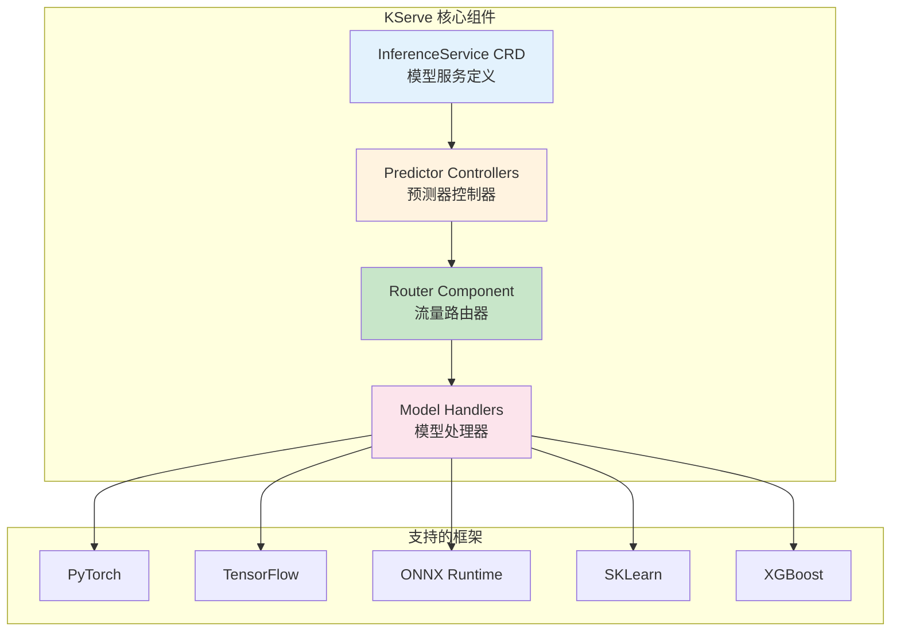

**核心特性:**

| 特性 | 说明 |
|------|------|
| **统一接口** | 所有框架使用相同的 InferenceService API |
| **自动注入** | 根据模型类型自动选择推理容器 |
| **存储抽象** | 支持本地/云存储/S3 等多种模型来源 |
| **批量推理** | 支持批量预测任务调度 |

### 1.2 什么是 Knative

Knative 是基于 Kubernetes 的 Serverless 工作负载平台,专注于自动缩放和流量管理。

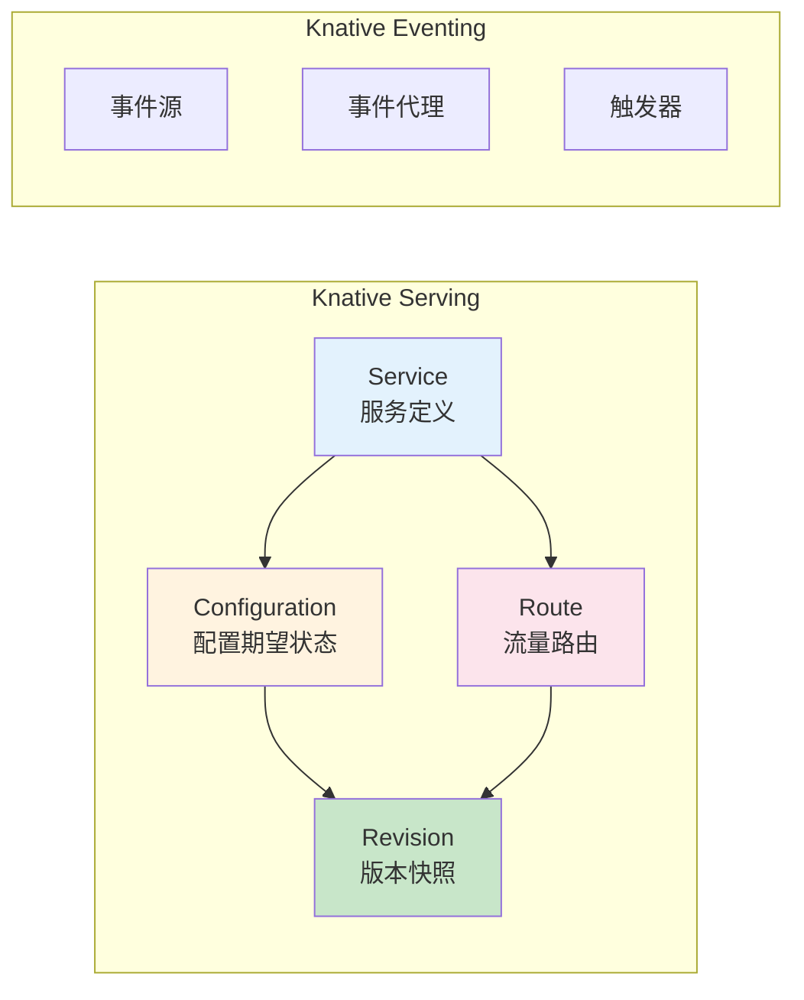

**核心能力:**

| 能力 | 说明 |
|------|------|
| **Scale-to-Zero** | 无请求时缩容到 0 个副本 |
| **自动缩放** | 基于并发/请求数/RPS 动态调整 |
| **流量分割** | 百分比路由到不同版本 |
| **Revision 管理** | 每次配置变更生成新版本快照 |

### 1.3 为什么需要组合使用

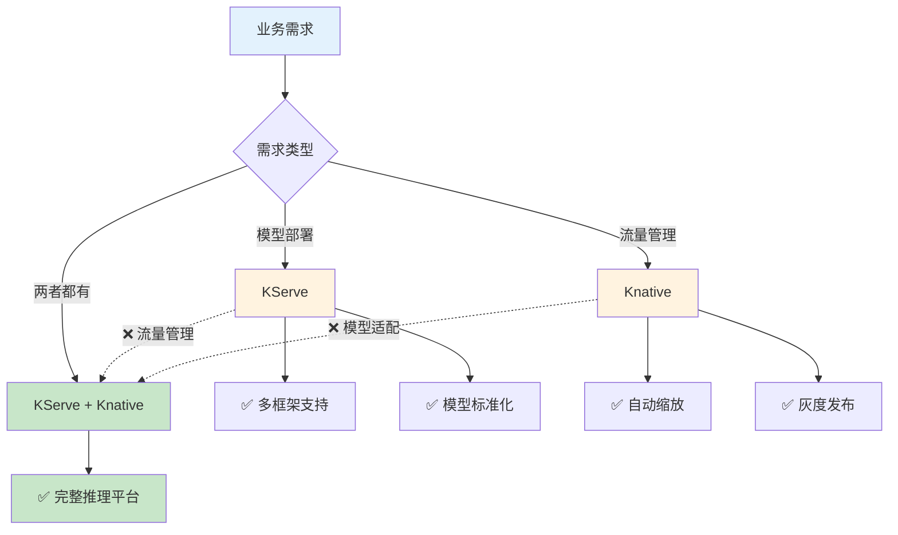

**组合优势:**

| 维度 | 仅 KServe | 仅 Knative | KServe + Knative |
|------|-----------|------------|------------------|
| 模型部署 | ✅ 优秀 | ❌ 需手动配置 | ✅ 自动化 |
| 自动缩放 | ❌ 需手动 HPA | ✅ 内置 | ✅ 内置 |
| 流量路由 | ⚠️ 基础 | ✅ 强大 | ✅ 强大 |
| 版本管理 | ⚠️ 有限 | ✅ 完善 | ✅ 完善 |
| 生产就绪 | ⚠️ 部分 | ⚠️ 部分 | ✅ 完整 |

---

## 2. KServe 解决的业务需求

### 2.1 模型部署复杂性抽象

**业务场景:**

某 AI 平台需要部署多种模型:
- PyTorch 图像分类模型
- TensorFlow 文本情感分析模型
- ONNX 语音识别模型

**传统方式的问题:**

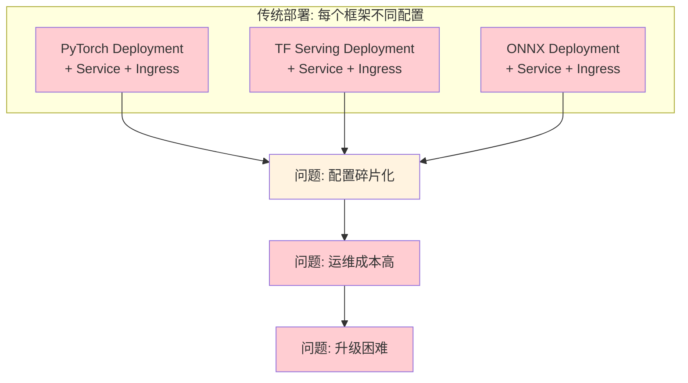

**KServe 解决方案:**

```yaml
# ============================================================
# 示例: 统一使用 InferenceService 部署不同框架
# ============================================================

# PyTorch 模型
apiVersion: serving.kserve.io/v1beta1
kind: InferenceService
metadata:
  name: pytorch-model
spec:
  predictor:
    pytorch:                        # 自动选择 PyTorch 处理器
      storageUri: gs://models/pytorch-v1

---
# TensorFlow 模型
apiVersion: serving.kserve.io/v1beta1
kind: InferenceService
metadata:
  name: tf-model
spec:
  predictor:
    tensorflow:                     # 自动选择 TF Serving
      storageUri: gs://models/tf-v2

---
# ONNX 模型
apiVersion: serving.kserve.io/v1beta1
kind: InferenceService
metadata:
  name: onnx-model
spec:
  predictor:
    onnx:                           # 自动选择 ONNX Runtime
      storageUri: gs://models/onnx-v1
```

**对比分析:**

| 维度 | 传统 Deployment | KServe InferenceService |
|------|----------------|------------------------|
| YAML 行数 | 80-120 行/模型 | 10-15 行/模型 |
| 框架适配 | 手动配置容器 | 自动选择处理器 |
| 存储配置 | 手动挂载 Volume | 统一 storageUri |
| 健康检查 | 手动配置 Probe | 自动推断 |
| API 端点 | 手动配置 Ingress | 自动生成 |

### 2.2 预测器标准化

**InferenceService CRD 核心字段:**

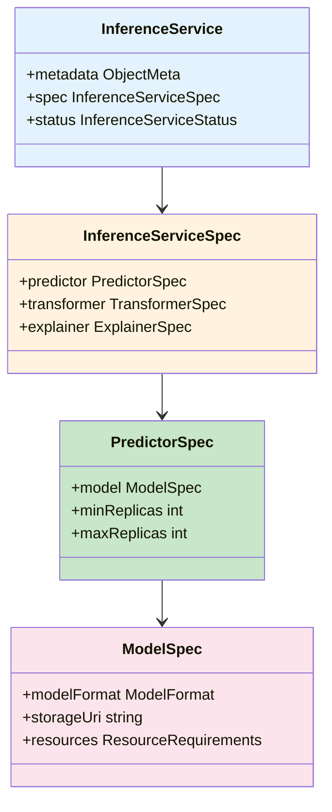

**核心字段说明:**

| 字段 | 类型 | 说明 |
|------|------|------|
| `predictor` | PredictorSpec | 定义推理模型配置 |
| `transformer` | TransformerSpec | 可选的前后处理逻辑 |
| `explainer` | ExplainerSpec | 可选的模型解释器 (Alibi) |
| `modelFormat` | ModelFormat | 模型格式 (pytorch/tensorflow/onnx) |
| `storageUri` | string | 模型存储路径 (支持 gs://, s3://, file://) |
| `minReplicas` | int | 最小副本数 |
| `maxReplicas` | int | 最大副本数 (配合 HPA) |

### 2.3 模型格式自动适配

**支持的模型格式:**

| 框架 | 模型格式 | 推理容器 | 使用场景 |
|------|---------|---------|---------|
| **PyTorch** | TorchScript, PT | TorchServe | 图像分类、目标检测 |
| **TensorFlow** | SavedModel | TF Serving | NLP、推荐系统 |
| **ONNX** | .onnx | ONNX Runtime | 跨框架部署 |
| **SKLearn** | .joblib, .pkl | SKLearn Server | 传统机器学习 |
| **XGBoost** | .bst, .json | XGBoost Server | 表格数据预测 |
| **Triton** | 多格式 | Triton Inference Server | 高性能推理 |
| **PMML** | .pmml | PMML Server | 规则引擎 |
| **LightGBM** | .txt, .gbm | LightGBM Server | 大规模特征训练 |

---

## 3. Knative 解决的业务需求

### 3.1 自动扩缩容 Scale-to-Zero

**业务场景:**

某内部 AI 助手:
- 工作时间 (9:00-18:00): 高并发请求
- 非工作时间: 几乎无请求
- 目标: 节省计算资源,降低云成本

**Knative 自动缩放流程:**

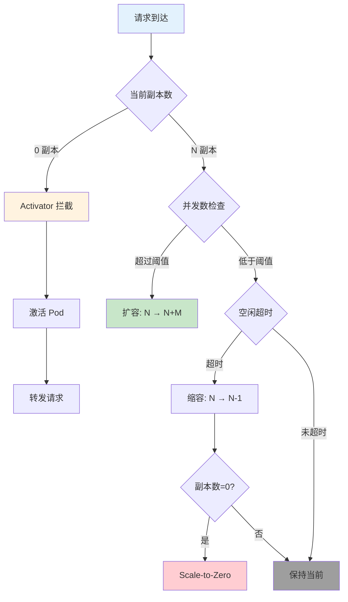

**KPA vs HPA 对比:**

| 特性 | KPA (Knative Pod Autoscaler) | HPA (Horizontal Pod Autoscaler) |
|------|------------------------------|--------------------------------|
| **缩放依据** | 并发请求数 (Concurrent Requests) | CPU/内存利用率 |
| **Scale-to-Zero** | ✅ 支持 | ❌ 不支持 |
| **缩放速度** | 快速 (秒级) | 较慢 (分钟级) |
| **适用场景** | 请求驱动的服务 | 资源密集型服务 |
| **最小副本** | 0 | 1 |
| **配置字段** | `containerConcurrency` | `targetCPUUtilizationPercentage` |

**配置示例:**

```yaml
# ============================================================
# 示例: Knative 自动缩放配置
# ============================================================
apiVersion: serving.knative.dev/v1
kind: Service
metadata:
  name: ai-inference
spec:
  template:
    metadata:
      annotations:
        # 【核心字段】
        # 目标并发数: 每个 Pod 最多处理 10 个并发请求
        autoscaling.knative.dev/target: "10"
        
        # 最小副本数: 允许缩容到 0
        autoscaling.knative.dev/min-scale: "0"
        
        # 最大副本数: 限制最多 50 个 Pod
        autoscaling.knative.dev/max-scale: "50"
        
        # 缩放算法: panic (快速响应) 或 stable (平稳)
        autoscaling.knative.dev/class: "kpa.autoscaling.knative.dev"
        
        # 稳定窗口: 缩容前等待 60 秒
        autoscaling.knative.dev/window: "60s"
    spec:
      containerConcurrency: 10  # 硬限制: Pod 最多接受 10 并发
      containers:
      - name: model
        image: my-model:v1
```

### 3.2 流量路由与灰度发布

**业务场景:**

某推荐系统需要更新模型:
- 当前版本: v1 (准确率 92%)
- 新版本: v2 (准确率 94%)
- 策略: 逐步切换流量,观察指标后全量

**Knative 流量路由流程:**

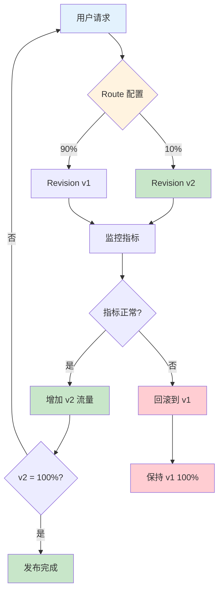

**流量分割配置:**

```yaml
# ============================================================
# 示例: Canary 灰度发布流量配置
# ============================================================
apiVersion: serving.knative.dev/v1
kind: Service
metadata:
  name: recommendation-model
spec:
  template:
    metadata:
      name: recommendation-v2      # 新版本 Revision
    spec:
      containers:
      - image: my-model:v2
  
  # ============================================================
  # 流量路由配置
  # ============================================================
  traffic:
  - revisionName: recommendation-v2
    percent: 10                    # 10% 流量到新版本
  - latestRevision: true
    percent: 90                    # 90% 流量到当前稳定版
```

### 3.3 Revision 版本管理

**Revision 生命周期:**

```mermaid
stateDiagram-v2
    [*] --> 创建中: 配置变更
    创建中 --> 就绪: Pod 健康检查通过
    就绪 --> 活跃: Route 指向此版本
    活跃 --> 保留: 新版本接管流量
    保留 --> [*]: 手动删除
    
    创建中 --> 失败: 健康检查失败
    失败 --> [*]: 自动清理
    
    style 创建中 fill:#fff3e0
    style 就绪 fill:#c8e6c9
    style 活跃 fill:#e3f2fd
    style 保留 fill:#fce4ec
    style 失败 fill:#ffcdd2
```

**Revision 核心概念:**

| 概念 | 说明 | 示例 |
|------|------|------|
| **创建触发** | 配置变更 (镜像/环境变量/资源) | 更新 `image: my-model:v2` |
| **命名规则** | `<service>-<hash>` | `ai-model-00001-abc` |
| **不可变性** | Revision 创建后不可修改 | 保证回滚一致性 |
| **流量接管** | Route 配置决定哪个 Revision 接收流量 | `percent: 100` |
| **自动清理** | 保留策略控制 Revision 数量 | `revisionHistoryLimit: 10` |

---

## 4. KServe + Knative 组合架构

### 4.1 架构集成原理

**完整架构图:**

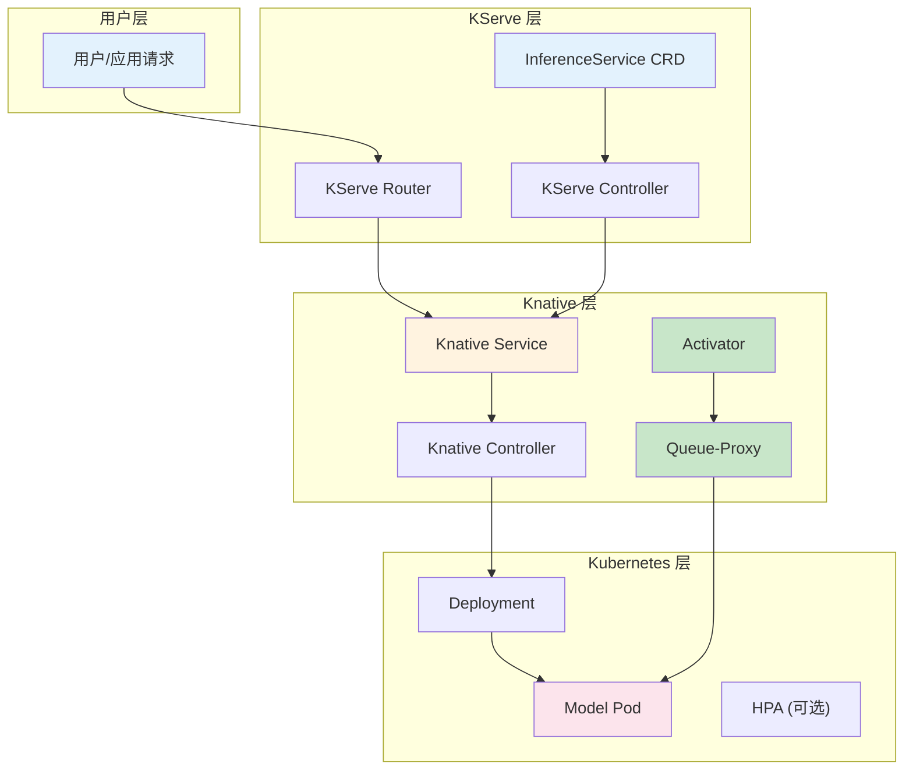

**组件职责:**

| 组件 | 所属 | 职责 |
|------|------|------|
| **InferenceService** | KServe | 声明式定义模型服务 |
| **KServe Controller** | KServe | 监听 CRD,生成 Knative Service |
| **Knative Service** | Knative | 定义期望状态和流量路由 |
| **Activator** | Knative | Scale-to-Zero 时拦截请求 |
| **Queue-Proxy** | Knative | 每个 Pod 侧车,上报指标 |
| **Deployment** | Kubernetes | 管理 Pod 生命周期 |

### 4.2 完整部署流程

**从 InferenceService 到 Pod 运行的完整流程:**

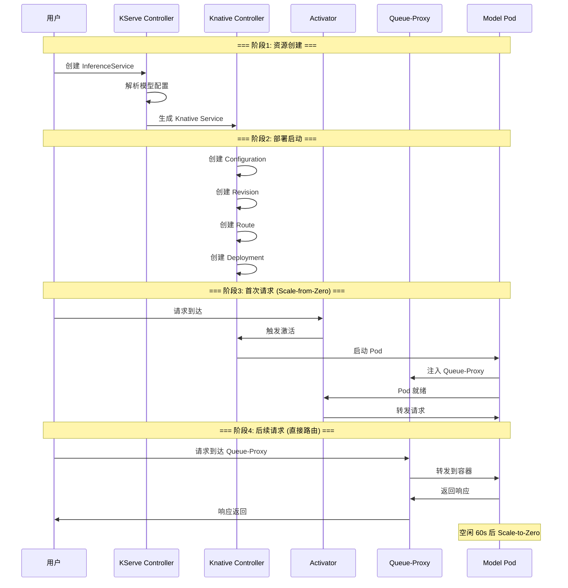

**关键步骤说明:**

| 步骤 | 触发条件 | 耗时 | 说明 |
|------|---------|------|------|
| **CRD 解析** | 创建 InferenceService | < 1s | KServe Controller 处理 |
| **Service 生成** | CRD 解析完成 | < 1s | 生成 Knative Service YAML |
| **首次激活** | 首次请求 (0 副本) | 10-30s | Activator 等待 Pod 启动 |
| **直接路由** | Pod 已存在 | < 100ms | 直接路由到 Queue-Proxy |
| **扩容** | 并发超过阈值 | 5-15s | 新增 Pod |
| **缩容** | 空闲超时 | 60s (可配置) | 逐步减少副本 |

---

## 5. 核心业务场景实战

### 5.1 场景一:简单模型部署

**需求:** 快速部署单个推理模型,支持基础自动缩放

**方案:** InferenceService + Knative 自动缩放

**部署流程:**

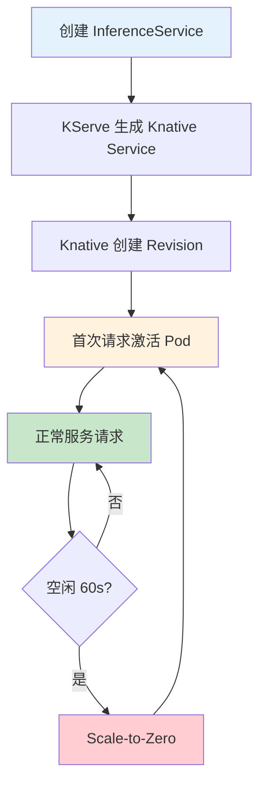

**YAML 配置:**

```yaml
# ============================================================
# 示例: 简单模型部署 - PyTorch 图像分类
# ============================================================
apiVersion: serving.kserve.io/v1beta1
kind: InferenceService
metadata:
  name: image-classifier
  annotations:
    # Knative 自动缩放配置
    autoscaling.knative.dev/target: "5"        # 目标并发 5
    autoscaling.knative.dev/min-scale: "0"     # 允许缩容到 0
    autoscaling.knative.dev/max-scale: "10"    # 最多 10 副本
spec:
  predictor:
    pytorch:
      storageUri: gs://my-models/resnet50-v1
      resources:
        requests:
          cpu: "500m"
          memory: 1Gi
        limits:
          cpu: "2"
          memory: 4Gi
          nvidia.com/gpu: "1"
```

**验证命令:**

```bash
# 1. 查看 InferenceService 状态
kubectl get inferenceservice image-classifier

# 2. 查看生成的 Knative Service
kubectl get ksvc image-classifier-predictor-default

# 3. 查看 Revision
kubectl get revisions -l serving.kserve.io/inferenceservice=image-classifier

# 4. 测试推理
curl -X POST http://<gateway-url>/v1/models/image-classifier:predict \
  -d '{"instances": [[...]]}'
```

### 5.2 场景二:Canary 灰度发布

**需求:** 10% 流量测试新模型,逐步扩大至全量

**方案:** Knative 流量分割 + KServe 多版本

**Canary 发布流程:**

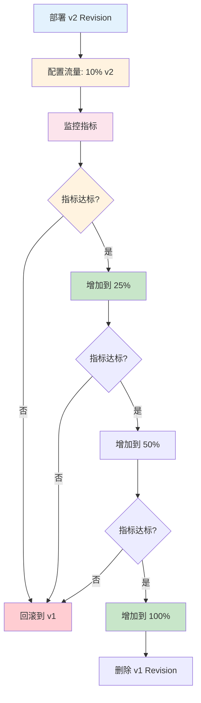

**YAML 配置:**

```yaml
# ============================================================
# 示例: Canary 灰度发布 - 分阶段流量切换
# ============================================================

# === 阶段1: 10% 流量到 v2 ===
apiVersion: serving.kserve.io/v1beta1
kind: InferenceService
metadata:
  name: canary-model
spec:
  predictor:
    pytorch:
      storageUri: gs://models/canary-v1
---
# 流量配置 (通过 Knative Service 补丁)
apiVersion: serving.knative.dev/v1
kind: Service
metadata:
  name: canary-model-predictor-default
spec:
  traffic:
  - revisionName: canary-model-predictor-v2
    percent: 10
  - latestRevision: true
    percent: 90

---
# === 阶段2: 50% 流量到 v2 (指标正常后) ===
# 修改 traffic.percent: 50/50

---
# === 阶段3: 100% 流量到 v2 (全量发布) ===
# 修改 traffic.percent: 100/0
```

**监控指标建议:**

| 指标 | 阈值 | 说明 |
|------|------|------|
| **延迟 P99** | < 500ms | 确保新模型性能 |
| **错误率** | < 0.1% | 确保推理正确性 |
| **GPU 利用率** | < 85% | 确保资源充足 |
| **吞吐量** | > v1 的 90% | 确保处理能力 |

### 5.3 场景三:A/B 测试对比

**需求:** 同时运行两个模型版本,对比业务效果

**方案:** KServe 多预测器 + Knative 流量路由

**A/B 测试架构:**

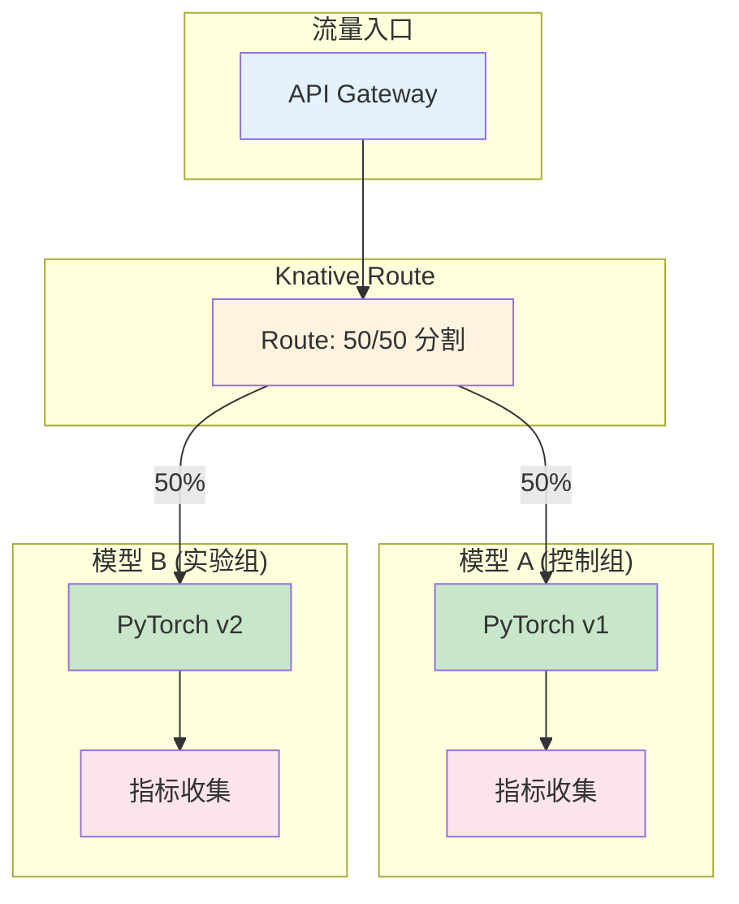

**YAML 配置:**

```yaml
# ============================================================
# 示例: A/B 测试配置 - 50/50 流量分割
# ============================================================
apiVersion: serving.kserve.io/v1beta1
kind: InferenceService
metadata:
  name: ab-test-model
spec:
  predictor:
    pytorch:
      storageUri: gs://models/ab-v1
---
# A/B 测试流量配置
apiVersion: serving.knative.dev/v1
kind: Service
metadata:
  name: ab-test-model-predictor-default
spec:
  traffic:
  - revisionName: ab-test-model-predictor-v1
    percent: 50
    tag: control                    # 控制组标签
  - revisionName: ab-test-model-predictor-v2
    percent: 50
    tag: experiment                 # 实验组标签
```

**对比分析表:**

| 维度 | 模型 A (v1) | 模型 B (v2) |
|------|------------|------------|
| **架构** | ResNet-50 | ResNet-101 |
| **准确率** | 92.3% | 94.1% |
| **延迟 P50** | 45ms | 68ms |
| **延迟 P99** | 120ms | 185ms |
| **GPU 内存** | 2.1 GB | 3.4 GB |
| **吞吐量** | 220 req/s | 147 req/s |

### 5.4 场景四:高并发弹性伸缩

**需求:** 突发流量下自动扩容,空闲时缩容到零

**方案:** Knative KPA 配置 + 并发阈值调整

**弹性伸缩流程:**

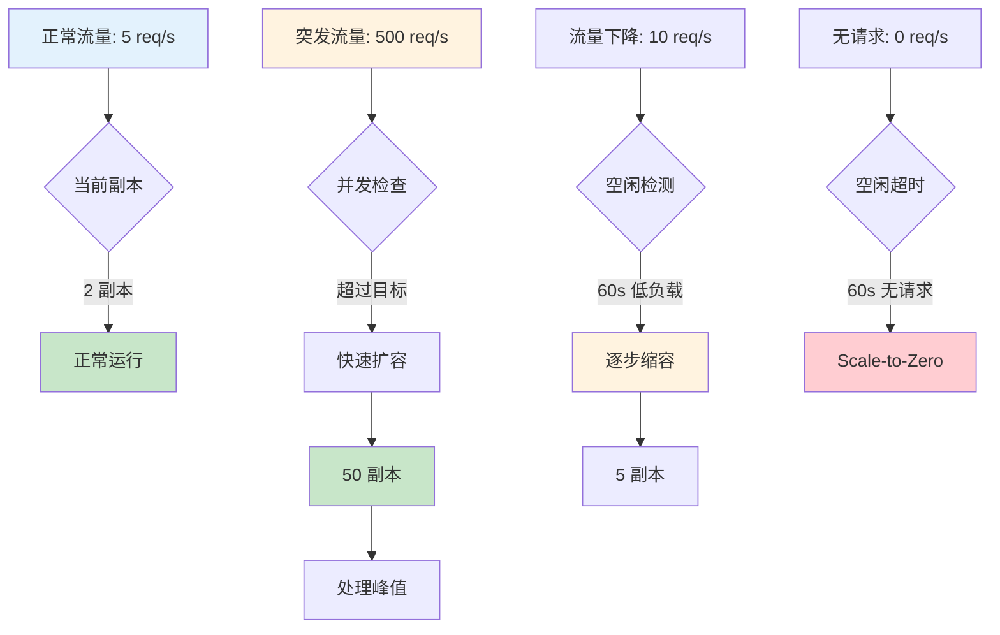

**扩缩容策略配置:**

```yaml
# ============================================================
# 示例: 高并发弹性伸缩配置
# ============================================================
apiVersion: serving.kserve.io/v1beta1
kind: InferenceService
metadata:
  name: elastic-model
  annotations:
    # === 自动缩放配置 ===
    # 目标并发: 每个 Pod 处理 20 个并发请求
    autoscaling.knative.dev/target: "20"
    
    # 最小副本: 允许缩容到 0
    autoscaling.knative.dev/min-scale: "0"
    
    # 最大副本: 限制最多 100 个 Pod
    autoscaling.knative.dev/max-scale: "100"
    
    # 缩放窗口: 60 秒稳定期
    autoscaling.knative.dev/window: "60s"
    
    # 缩放算法: panic (快速响应突发流量)
    autoscaling.knative.dev/class: "kpa.autoscaling.knative.dev"
    
    # 扩容速率: 每秒最多新增 10 个 Pod
    autoscaling.knative.dev/scale-up-rate: "10"
    
    # 缩容速率: 每秒最多减少 5 个 Pod
    autoscaling.knative.dev/scale-down-rate: "5"
spec:
  predictor:
    minReplicas: 0                 # KServe 层最小副本
    maxReplicas: 100               # KServe 层最大副本
    pytorch:
      storageUri: gs://models/elastic-v1
      resources:
        requests:
          cpu: "500m"
          memory: 1Gi
        limits:
          cpu: "4"
          memory: 8Gi
          nvidia.com/gpu: "1"
```

**扩缩容策略对比:**

| 策略 | 配置 | 适用场景 | 优缺点 |
|------|------|---------|--------|
| **激进扩容** | `scale-up-rate: 20` | 突发流量频繁 | ✅ 快速响应 ❌ 可能过度扩容 |
| **保守扩容** | `scale-up-rate: 2` | 稳定流量 | ✅ 资源节约 ❌ 可能响应慢 |
| **激进缩容** | `scale-down-rate: 10` | 波谷明显 | ✅ 快速释放 ❌ 可能频繁启停 |
| **保守缩容** | `scale-down-rate: 1` | 流量平稳 | ✅ 稳定运行 ❌ 资源浪费 |

---

## 6. 对比分析

### 6.1 KServe vs 传统 Deployment

| 维度 | 传统 Deployment | KServe InferenceService |
|------|----------------|------------------------|
| **配置复杂度** | 高 (需手动配置 Deployment/Service/Ingress) | 低 (单一 CRD 声明) |
| **模型适配** | 手动选择容器和启动命令 | 自动根据 modelFormat 选择 |
| **存储配置** | 手动挂载 PVC/ConfigMap | 统一 storageUri 抽象 |
| **健康检查** | 手动配置 readiness/liveness probe | 自动推断推理端点 |
| **批量推理** | 需额外实现 | 内置 Batch Transformer |
| **模型解释** | 需额外部署 | 内置 Alibi Explainer |
| **多版本** | 手动管理多个 Deployment | 配合 Knative Revision |
| **生态集成** | 需手动集成 | 原生集成 Prometheus/Istio |

### 6.2 Knative vs 手动 HPA

| 维度 | Knative KPA | 手动 HPA |
|------|------------|---------|
| **缩放依据** | 并发请求数 | CPU/内存利用率 |
| **Scale-to-Zero** | ✅ 支持 | ❌ 不支持 (需 KEDA) |
| **流量管理** | ✅ 内置灰度发布 | ❌ 需手动配置 Ingress |
| **版本控制** | ✅ 自动 Revision 管理 | ❌ 需手动管理 |
| **首次请求延迟** | ⚠️ 10-30s (冷启动) | ✅ 无延迟 (始终有副本) |
| **配置复杂度** | 中等 (Annotations) | 低 (HPA YAML) |
| **适用场景** | 请求驱动、波峰波谷明显 | 资源密集型、稳定流量 |

### 6.3 适用场景矩阵

| 场景 | 仅 KServe | 仅 Knative | KServe + Knative |
|------|-----------|------------|------------------|
| **固定流量模型服务** | ✅ 适合 | ❌ 需手动配置模型 | ✅ 适合 |
| **自动扩缩容** | ❌ 需手动 HPA | ✅ 原生支持 | ✅ 原生支持 |
| **Canary 灰度发布** | ⚠️ 需手动配置 | ✅ 原生支持 | ✅ 原生支持 |
| **A/B 测试** | ⚠️ 需额外配置 | ✅ 流量分割支持 | ✅ 完整支持 |
| **模型版本管理** | ✅ 内置 | ⚠️ 需手动适配 | ✅ 完整支持 |
| **批量推理任务** | ✅ 内置 Transformer | ❌ 不支持 | ✅ 支持 |
| **Scale-to-Zero** | ❌ 不支持 | ✅ 原生支持 | ✅ 原生支持 |
| **多框架统一接口** | ✅ 核心能力 | ❌ 不支持 | ✅ 核心能力 |

**选择建议:**

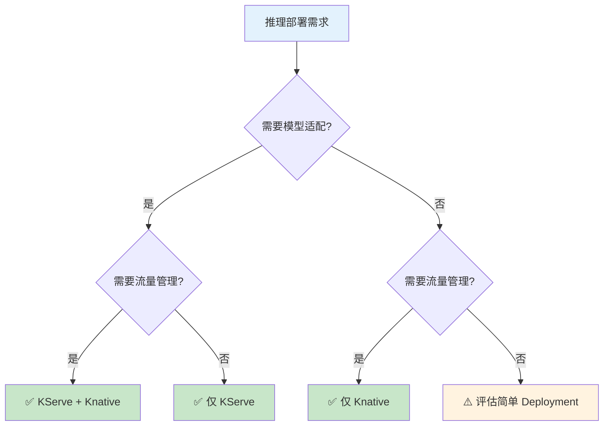

---

## 7. 最佳实践

### 7.1 模型部署检查清单

| 检查项 | 说明 | 优先级 |
|--------|------|--------|
| **模型格式正确** | 确保模型导出为支持的格式 (TorchScript/SavedModel/.onnx) | 🔴 必须 |
| **存储路径可达** | 验证 storageUri 可访问 (权限/网络) | 🔴 必须 |
| **资源请求合理** | CPU/GPU/Memory 符合模型需求 | 🔴 必须 |
| **健康检查通过** | 验证推理端点返回 200 | 🔴 必须 |
| **并发阈值配置** | 根据模型性能设置 target/max-scale | 🟡 建议 |
| **监控指标接入** | Prometheus/Grafana 监控延迟/错误率 | 🟡 建议 |
| **日志级别配置** | 生产环境设置为 WARN/ERROR | 🟡 建议 |
| **资源限制配置** | 设置 limits 防止资源耗尽 | 🟡 建议 |
| **回滚策略准备** | 保留旧 Revision 以备回滚 | 🟢 可选 |
| **模型预热** | 首次推理前预热减少冷启动延迟 | 🟢 可选 |

### 7.2 流量配置注意事项

| 注意事项 | 说明 | 示例 |
|----------|------|------|
| **渐进式流量切换** | 不要直接从 0% → 100%,分阶段验证 | 10% → 25% → 50% → 100% |
| **监控先行** | 流量切换前确保监控就绪 | 延迟/错误率/GPU 利用率 |
| **回滚预案** | 准备快速回滚脚本 | `kubectl patch ksvc ...` |
| **流量标签** | 使用 tag 区分版本便于调试 | `tag: canary/stable` |
| **会话保持** | 需要会话保持时使用 cookie/hash | `cookie: user-id` |

### 7.3 性能调优建议

| 调优项 | 建议值 | 说明 |
|--------|--------|------|
| **containerConcurrency** | 5-20 | 根据模型推理时间调整 |
| **target** | containerConcurrency 的 70-80% | 预留缓冲 |
| **window** | 60s (默认) | 短窗口敏感,长窗口稳定 |
| **scale-up-rate** | 5-10 | 突发流量场景调高 |
| **scale-down-rate** | 1-3 | 避免频繁启停 |
| **min-scale** | 1-2 (生产) | 减少冷启动延迟 |
| **initialScale** | 1 | 首次部署副本数 |

### 7.4 常见问题排查

| 问题 | 可能原因 | 排查命令 |
|------|---------|---------|
| **InferenceService 不就绪** | 存储不可达/资源不足 | `kubectl describe inferenceservice <name>` |
| **首次请求超时** | Activator 配置问题 | `kubectl logs -l app=activator` |
| **Pod 不缩容** | 指标未上报/窗口过长 | `kubectl get podautoscaler` |
| **流量不生效** | Revision 名称不匹配 | `kubectl get revisions` |
| **推理延迟高** | GPU 不足/并发过高 | `kubectl top pod` + Grafana |
| **模型加载失败** | 格式不兼容/权限不足 | `kubectl logs <pod> -c kserve-container` |

---

## 附录:参考资料

### A. 官方文档

- [KServe 官方文档](https://kserve.github.io/website/)
- [Knative Serving 文档](https://knative.dev/docs/serving/)
- [InferenceService API 参考](https://kserve.github.io/website/master/reference/api/)

### B. 相关项目

- [Week4: KVCache 推理部署调优](../week4-kvcache推理部署调优)
- [Week7: LLM-D Inference](../week7-llm-d-inference)
- [Week6: Envoy AI Gateway](../week6-envoy-ai-gateway)

### C. 扩展阅读

- [Knative Autoscaling 深度解析](https://knative.dev/docs/serving/autoscaling/)
- [KServe Transformer 使用指南](https://kserve.github.io/website/master/modelserving/transformation/)
- [云原生 AI 推理最佳实践](https://github.com/kubeflow/kserve)
