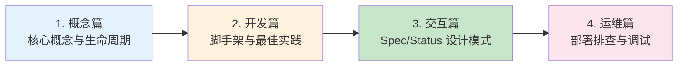

# Week9 CRD & Controller 开发最佳实践

> 系统学习 Kubernetes 自定义资源定义 (CRD) 和控制器开发的完整指南，从核心概念到生产部署。

## 快速导航

| 文件 | 说明 |
|------|------|
| [docs/01-CRD与Controller核心概念.md](docs/01-CRD与Controller核心概念.md) | 📖 **概念篇** - CRD/Controller 核心概念与生命周期 |
| [docs/02-控制器开发最佳实践.md](docs/02-控制器开发最佳实践.md) | 🔧 **开发篇** - 脚手架工具、最佳实践与调谐机制 |
| [docs/03-CR资源交互模式.md](docs/03-CR资源交互模式.md) | 🔄 **交互篇** - Spec/Status/Annotations 设计模式 |
| [docs/04-部署与问题排查.md](docs/04-部署与问题排查.md) | 🚀 **运维篇** - 部署流程、问题排查与调试技巧 |
| [cmd/controller/main.go](cmd/controller/main.go) | 控制器入口程序 |
| [pkg/controller/sample_controller.go](pkg/controller/sample_controller.go) | 控制器核心实现 |
| [pkg/apis/sample/v1alpha1/types.go](pkg/apis/sample/v1alpha1/types.go) | CRD 类型定义 |
| [manifests/01-crd.yaml](manifests/01-crd.yaml) | CRD 部署清单 |
| [manifests/02-rbac.yaml](manifests/02-rbac.yaml) | RBAC 权限配置 |
| [manifests/03-deployment.yaml](manifests/03-deployment.yaml) | 控制器 Deployment |
| [manifests/04-sample-cr.yaml](manifests/04-sample-cr.yaml) | CR 示例 |

## 核心特性

```
┌─────────────────────────────────────────────┐
│          CRD & Controller 学习路径           │
├─────────────────────────────────────────────┤
│  ✅ 概念篇  - CRD/Controller 核心机制        │
│  ✅ 开发篇  - 脚手架工具与最佳实践           │
│  ✅ 交互篇  - Spec/Status/Metadata 设计      │
│  ✅ 运维篇  - 部署排查与调试技巧             │
│  ✅ 代码示例 - 完整控制器实现框架            │
│  ✅ 部署清单 - RBAC/Deployment/CRD 示例      │
└─────────────────────────────────────────────┘
```

## 学习路径



## 项目结构

```
week9-crd-controller/
├── README.md                          # 概览层文档（本文件）
├── go.mod                             # Go 模块定义
│
├── cmd/
│   └── controller/
│       └── main.go                    # 控制器入口程序
│
├── pkg/
│   ├── apis/
│   │   └── sample/
│   │       ├── v1alpha1/
│   │       │   ├── types.go           # CRD 类型定义
│   │       │   └── register.go        # 注册逻辑
│   │       └── register.go
│   │
│   └── controller/
│       └── sample_controller.go       # 控制器核心实现
│
├── config/
│   └── crd/
│       └── sample-crd.yaml            # CRD 原始定义
│
├── manifests/
│   ├── 01-crd.yaml                    # CRD 部署清单
│   ├── 02-rbac.yaml                   # RBAC 权限配置
│   ├── 03-deployment.yaml             # 控制器 Deployment
│   └── 04-sample-cr.yaml              # CR 使用示例
│
├── scripts/
│   ├── codegen.sh                     # 代码生成脚本
│   └── local-debug.sh                 # 本地调试脚本
│
└── docs/
    ├── 01-CRD与Controller核心概念.md   # 概念详解
    ├── 02-控制器开发最佳实践.md        # 开发详解
    ├── 03-CR资源交互模式.md            # 交互模式
    └── 04-部署与问题排查.md            # 运维排查
```

## 使用示例

```yaml
# 创建自定义资源
apiVersion: sample.ai-infra/v1alpha1
kind: SampleResource
metadata:
  name: my-sample
  namespace: default
spec:
  replicas: 3
  feature: "advanced-scheduling"
status:
  conditions:
    - type: Ready
      status: "True"
      reason: "ReconcileSuccess"
```

详见各章节文档获取完整实现细节。