# CRD 与 Controller 核心概念详解

> 系统学习 Kubernetes 自定义资源定义和控制器的工作机制，理解资源在整个生命周期内的流转过程。

---

## 目录

- [1. 概述](#1-概述)
- [2. CRD 核心概念](#2-crd-核心概念)
- [3. Controller 核心组件](#3-controller-核心组件)
- [4. CR 资源生命周期流转](#4-cr-资源生命周期流转)
- [5. 对比分析](#5-对比分析)
- [6. 最佳实践](#6-最佳实践)

---

## 1. 概述

### 1.1 什么是 CRD 和 Controller

**CRD（Custom Resource Definition）** 是 Kubernetes 提供的扩展机制，允许用户自定义资源类型，使其像原生资源（Pod、Deployment 等）一样被 API Server 管理。

**Controller** 是实际业务逻辑的实现者，通过监听 CR 的变化，调谐实际状态以匹配期望状态。

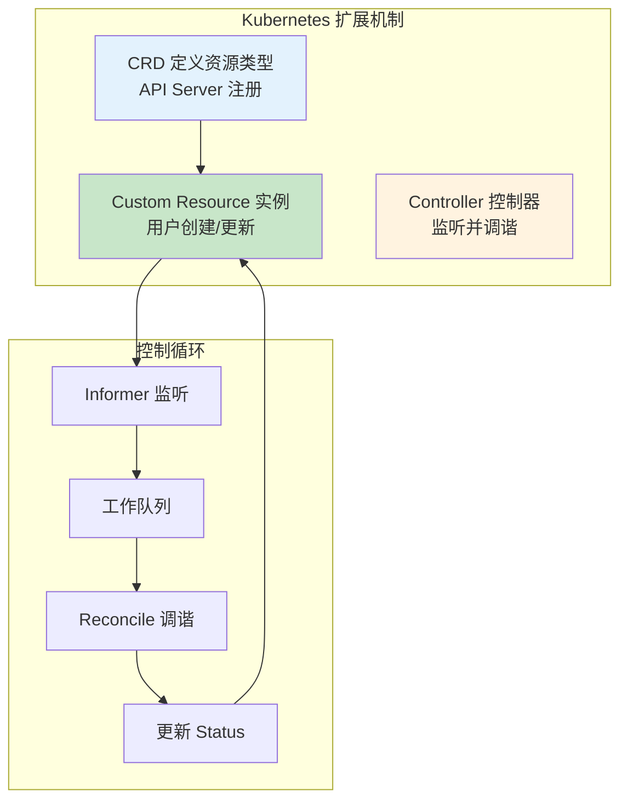

### 1.2 为什么需要 CRD

| 场景 | 原生资源局限性 | CRD 解决方案 |
|------|---------------|-------------|
| AI 训练任务 | Job 无法表达复杂调度策略 | 自定义 TrainingJob 资源 |
| 模型部署 | Deployment 缺乏模型版本管理 | ModelDeployment 资源 |
| 资源配额 | ResourceQuota 不支持异构资源 | 自定义 Quota 资源 |
| 多集群管理 | 原生资源仅限单集群 | MultiClusterResource 资源 |

### 1.3 Kubernetes 扩展机制演进

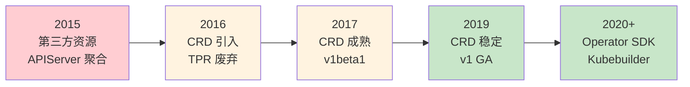

---

## 2. CRD 核心概念

### 2.1 CRD 结构详解

CRD 是集群级别的资源，定义了一个新的资源类型及其 Schema：

```yaml
apiVersion: apiextensions.k8s.io/v1
kind: CustomResourceDefinition
metadata:
  name: sampleresources.sample.ai-infra  # 格式：<复数名称>.<组名>
spec:
  group: sample.ai-infra                 # API 组
  versions:
    - name: v1alpha1                     # 版本号
      served: true                       # 是否可通过 API 访问
      storage: true                      # 是否持久化到 etcd
      schema:
        openAPIV3Schema:
          type: object
          properties:
            spec:
              type: object
              properties:
                replicas:
                  type: integer
                feature:
                  type: string
            status:
              type: object
              properties:
                conditions:
                  type: array
                  items:
                    type: object
                    properties:
                      type:
                        type: string
                      status:
                        type: string
                      reason:
                        type: string
                      message:
                        type: string
  scope: Namespaced                      # Namespaced 或 Cluster
  names:
    plural: sampleresources              # URL 路径中的复数形式
    singular: sampleresource             # 单数形式
    kind: SampleResource                 # kind 值
    shortNames:                          # kubectl 使用的短名称
      - sr
```

### 2.2 OpenAPI v3 Schema 验证

Schema 定义了 CR 的字段验证规则，确保用户输入的数据符合预期：

| 验证类型 | 示例 | 说明 |
|----------|------|------|
| **类型检查** | `type: integer` | 字段类型验证 |
| **必填字段** | `required: [replicas]` | 标记必需字段 |
| **范围限制** | `minimum: 1, maximum: 100` | 数值范围 |
| **枚举值** | `enum: ["High", "Medium", "Low"]` | 枚举选项 |
| **格式验证** | `format: date-time` | 特殊格式验证 |
| **默认值** | `default: 3` | 字段默认值 |

### 2.3 CRD 版本管理

CRD 支持多版本共存，便于平滑升级：

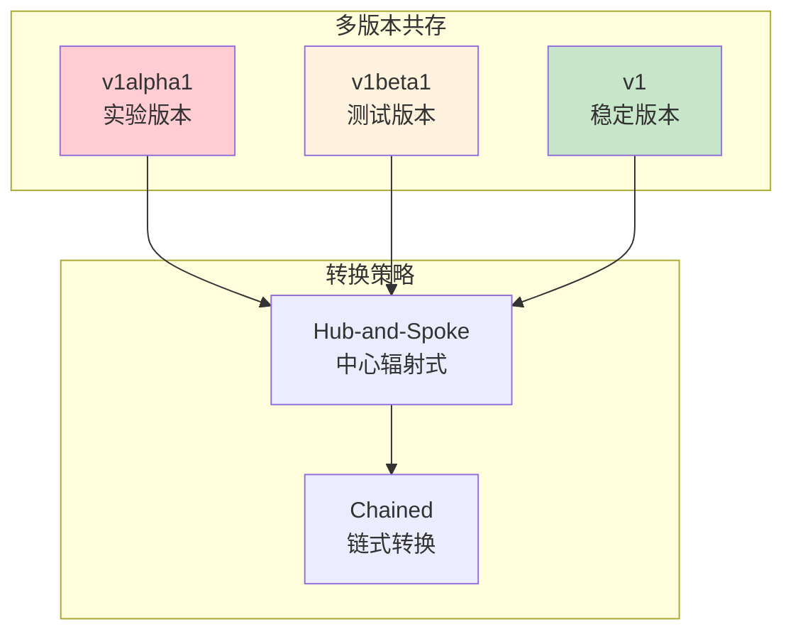

**版本升级最佳实践：**

| 阶段 | 操作 | 说明 |
|------|------|------|
| **1. 添加新版本** | 创建 v1beta1 | 与 v1alpha1 共存 |
| **2. 数据迁移** | 转换存储版本 | 使用存储版本转换 |
| **3. 切换流量** | 用户迁移到新版本 | 更新 YAML 清单 |
| **4. 废弃旧版本** | 标记 served: false | 禁止新创建 |
| **5. 清理旧版本** | 删除旧版本定义 | 完全移除 |

### 2.4 CR 与原生资源的关系

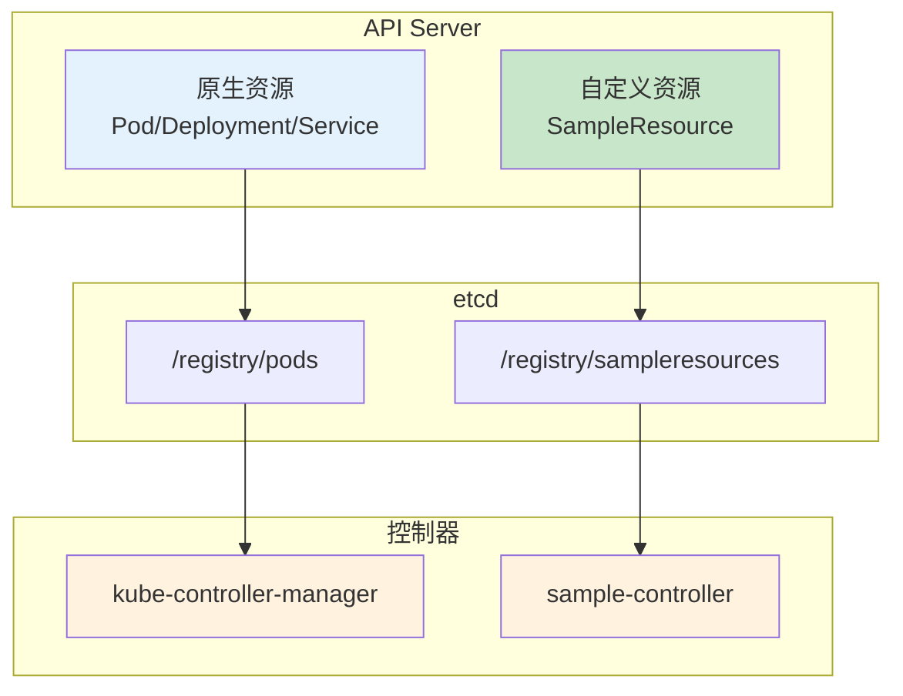

**关键差异：**

| 维度 | 原生资源 | CRD 资源 |
|------|----------|----------|
| **内置控制器** | ✅ kube-controller-manager | ❌ 需自行实现 |
| **API 注册** | 编译时内置 | 运行时动态注册 |
| **存储路径** | `/registry/<resource>` | `/registry/<group>/<resource>` |
| **版本管理** | 代码发布周期 | 可热更新 |

---

## 3. Controller 核心组件

### 3.1 Controller 架构总览

Controller 遵循 **声明式 API** 和 **最终一致性** 原则，通过控制循环不断调谐实际状态与期望状态一致。

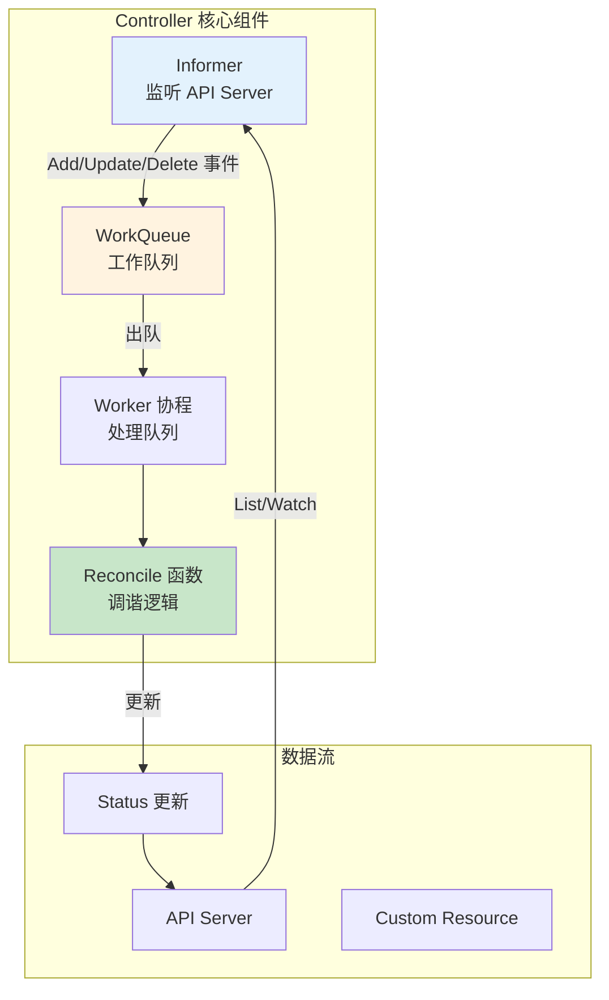

### 3.2 Informer 机制详解

Informer 是 Controller 与 API Server 之间的桥梁，提供本地缓存和事件通知：

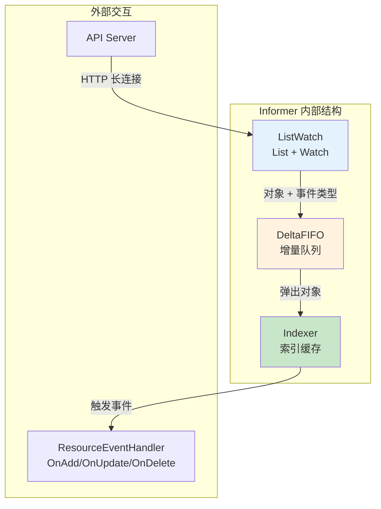

**Informer 工作流程：**

| 步骤 | 组件 | 说明 |
|------|------|------|
| **1. 全量拉取** | ListWatch.List | 首次获取所有资源 |
| **2. 建立监听** | ListWatch.Watch | 建立 HTTP 长连接 |
| **3. 增量更新** | DeltaFIFO | 接收 Add/Update/Delete 事件 |
| **4. 本地缓存** | Indexer | 存储对象副本 |
| **5. 事件分发** | ResourceEventHandler | 触发入队操作 |

### 3.3 WorkQueue 工作队列

WorkQueue 提供异步处理和速率限制：

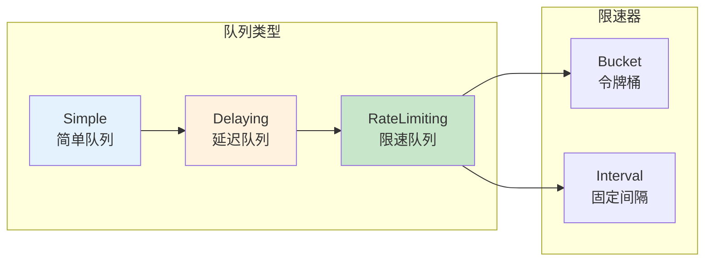

**速率限制策略：**

| 策略 | 算法 | 适用场景 |
|------|------|----------|
| **指数退避** | 1s → 2s → 4s → 8s... | 错误重试 |
| **固定间隔** | 每 5 分钟检查一次 | 周期性同步 |
| **令牌桶** | 限制 QPS | 高频操作限流 |

### 3.4 Reconcile 调谐函数

Reconcile 是控制器的核心逻辑，负责将实际状态调谐到期望状态：

```go
// Reconcile 函数签名
func (r *SampleReconciler) Reconcile(ctx context.Context, req ctrl.Request) (ctrl.Result, error) {
    // 1. 获取 CR 实例
    // 2. 检查删除标记（DeletionTimestamp）
    // 3. 执行业务逻辑
    // 4. 更新 Status
    // 5. 返回 Result 控制下次调谐时机
}
```

**调谐原则：**

| 原则 | 说明 | 示例 |
|------|------|------|
| **幂等性** | 多次执行结果相同 | 创建资源前检查是否存在 |
| **非阻塞** | 避免长时间阻塞 | 使用异步操作 |
| **快速失败** | 错误快速返回重试 | 不吞异常 |
| **最终一致** | 允许短暂不一致 | 依赖最终会创建 |

---

## 4. CR 资源生命周期流转

### 4.1 完整生命周期流程图

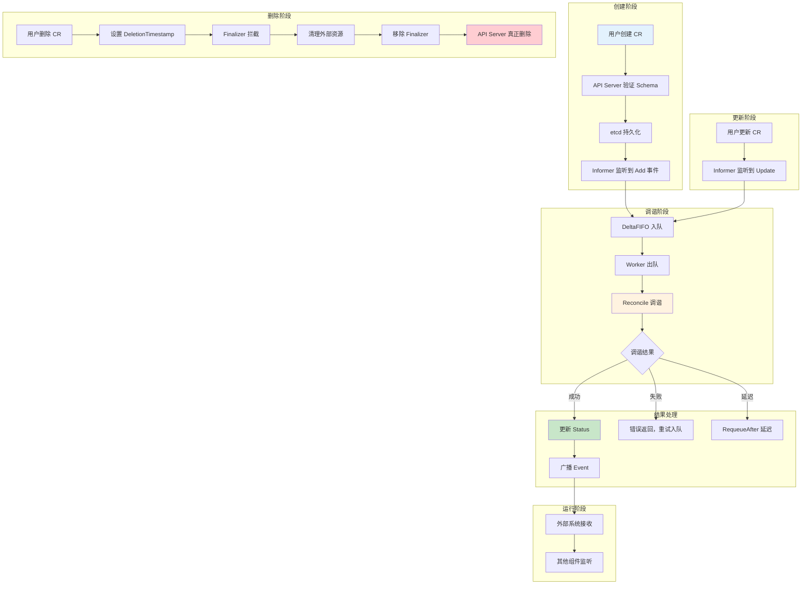

### 4.2 创建阶段详细流程

| 步骤 | 组件 | 操作 | 说明 |
|------|------|------|------|
| **1** | 用户 | `kubectl apply -f cr.yaml` | 提交创建请求 |
| **2** | API Server | Schema 验证 | 检查字段是否符合 CRD 定义 |
| **3** | API Server | 准入控制 | 执行 ValidatingWebhook（如有） |
| **4** | etcd | 持久化存储 | `/registry/<group>/<resource>/<name>` |
| **5** | API Server | 返回成功 | HTTP 201 Created |
| **6** | Informer | Watch 接收 Add 事件 | ResourceVersion 记录 |

### 4.3 更新阶段详细流程

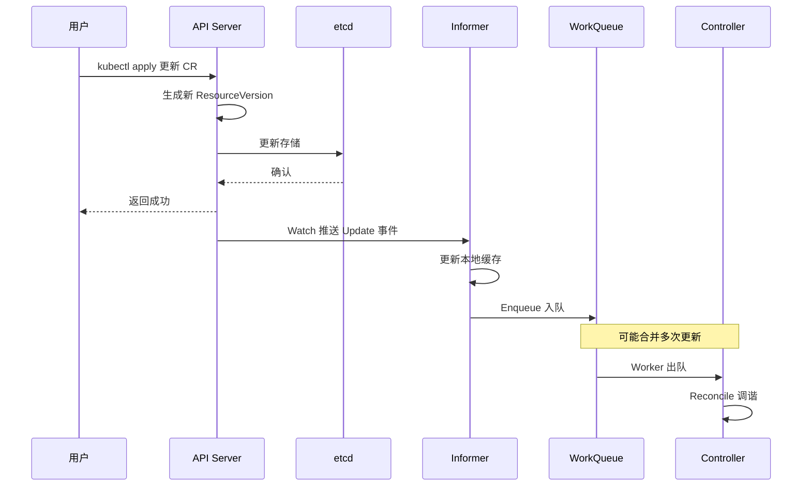

**更新合并优化：**

Informer 会将短时间内的多次更新合并为一次，避免频繁调谐：

| 场景 | 行为 | 说明 |
|------|------|------|
| 快速连续更新 | 合并为一次调谐 | 仅处理最新版本 |
| 乱序到达 | 基于 ResourceVersion | 丢弃旧版本事件 |

### 4.4 删除阶段详细流程（Finalizer 机制）

Finalizer 是删除前的拦截机制，用于清理外部资源：

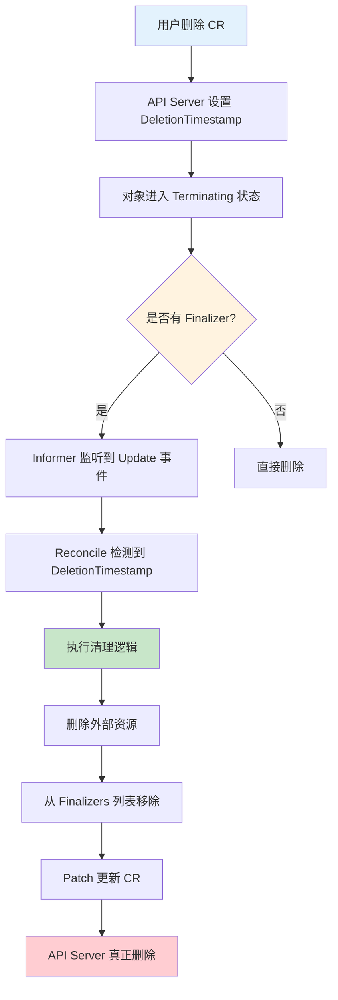

**Finalizer 工作流程：**

| 步骤 | 操作 | 代码示意 |
|------|------|----------|
| **1. 添加 Finalizer** | 创建 CR 时添加 | `finalizers: ["sample.ai-infra/cleanup"]` |
| **2. 检测删除** | Reconcile 检查 DeletionTimestamp | `if !cr.DeletionTimestamp.IsZero()` |
| **3. 执行清理** | 删除外部资源 | `deleteExternalResources(cr)` |
| **4. 移除 Finalizer** | Patch 移除 Finalizer | `controllerutil.RemoveFinalizer(cr, finalizerName)` |
| **5. 完成删除** | API Server 自动删除 | 无需额外操作 |

### 4.5 异常处理流程

| 异常类型 | 返回方式 | 重试策略 | 说明 |
|----------|----------|----------|------|
| **临时错误** | `return ctrl.Result{}, err` | 指数退避 | 网络超时、API 调用失败 |
| **需要等待** | `return ctrl.Result{RequeueAfter: 5s}, nil` | 固定延迟 | 等待外部依赖就绪 |
| **立即重试** | `return ctrl.Result{Requeue: true}, nil` | 立即入队 | 条件未满足但需快速重试 |
| **成功** | `return ctrl.Result{}, nil` | 无 | 调谐完成 |

---

## 5. 对比分析

### 5.1 控制器开发框架对比

| 维度 | client-go | controller-runtime | Kubebuilder |
|------|-----------|-------------------|-------------|
| **抽象层级** | 低层 API | 高层封装 | 脚手架 + 封装 |
| **代码量** | 多（需手写 Informer/Queue） | 少（声明式注册） | 最少（代码生成） |
| **灵活性** | 最高 | 高 | 中 |
| **学习曲线** | 陡峭 | 适中 | 平缓 |
| **生产使用** | 老项目 | 主流选择 | 新项目推荐 |
| **测试支持** | 需自行搭建 | 内置 EnvTest | 内置 EnvTest |

### 5.2 不同返回结果的调谐行为对比

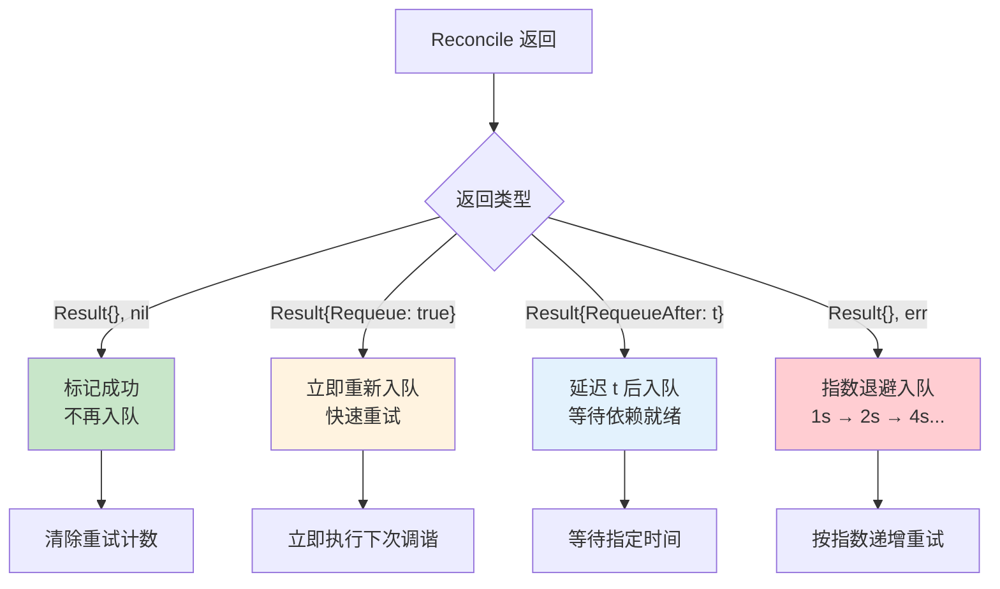

### 5.3 CRD 与其他扩展方式对比

| 方式 | 适用场景 | 优点 | 缺点 |
|------|----------|------|------|
| **CRD** | 自定义资源管理 | 原生 API 体验 | 需自行实现控制器 |
| **Aggregated API** | 复杂业务逻辑 | 完全自定义 | 开发成本高 |
| **Admission Webhook** | 准入控制/修改 | 轻量级 | 仅拦截/修改 |
| **Scheduler Plugin** | 调度策略扩展 | 与调度器集成 | 仅限调度场景 |

---

## 6. 最佳实践

### 6.1 CRD 设计原则

| 原则 | 说明 | 示例 |
|------|------|------|
| **声明式** | 表达期望状态，而非操作步骤 | `spec.replicas: 3` 而非 `spec.action: scale` |
| **幂等性** | 多次应用结果相同 | 创建前检查是否存在 |
| **最终一致性** | 允许短暂不一致 | 依赖资源异步创建 |
| **版本兼容** | 支持平滑升级 | 多版本共存 + 转换 |

### 6.2 何时选择 CRD

| 场景 | 推荐 | 原因 |
|------|------|------|
| 简单配置 | ❌ ConfigMap | 无需自定义控制器 |
| 标准部署 | ❌ Deployment | 原生资源足够 |
| 复杂编排 | ✅ CRD | 需自定义逻辑 |
| 领域特定 | ✅ CRD | 原生资源无法表达 |
| 多资源协调 | ✅ CRD | 统一管理界面 |

### 6.3 控制器开发检查清单

| 检查项 | 要求 |
|--------|------|
| **幂等性** | Reconcile 可安全重复执行 |
| **错误处理** | 所有错误都返回，不吞异常 |
| **Finalizer** | 正确添加和清理 |
| **Status 更新** | 使用 Subresource 模式 |
| **事件上报** | 关键操作都广播 Event |
| **RBAC** | 最小权限原则 |
| **日志** | 结构化日志，包含关键 ID |
| **测试** | 单元测试 + 集成测试 |

---

## 附录

### A. 核心术语表

| 术语 | 全称 | 说明 |
|------|------|------|
| **CRD** | Custom Resource Definition | 自定义资源定义 |
| **CR** | Custom Resource | 自定义资源实例 |
| **Informer** | - | 本地缓存 + 事件监听 |
| **Reconcile** | - | 调谐函数 |
| **Finalizer** | - | 删除前拦截器 |
| **OwnerReference** | - | 资源归属关系 |
| **ResourceVersion** | - | 资源版本号 |

### B. 参考资料

- [Kubernetes CRD 官方文档](https://kubernetes.io/docs/tasks/extend-kubernetes/custom-resources/custom-resource-definitions/)
- [Controller Runtime 文档](https://pkg.go.dev/sigs.k8s.io/controller-runtime)
- [Kubebuilder 书籍](https://book.kubebuilder.io/)
