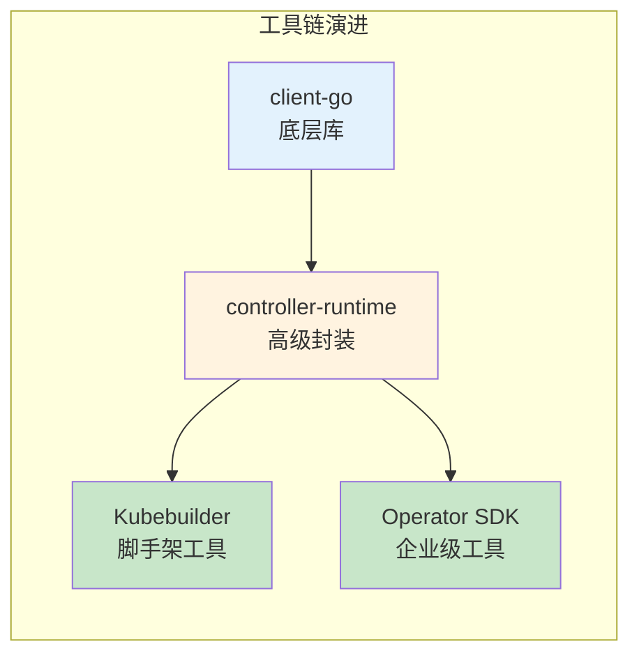
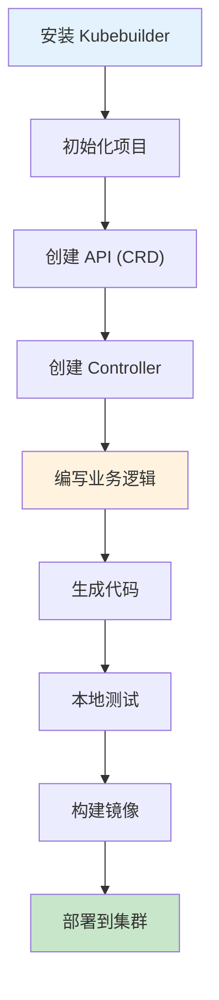
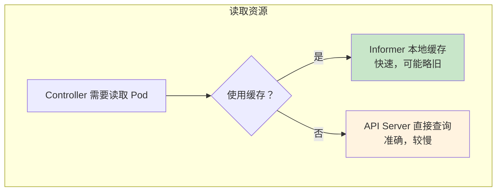
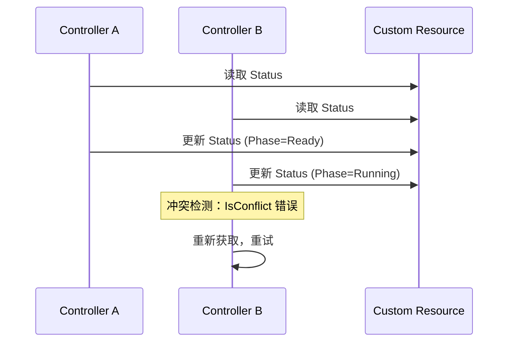
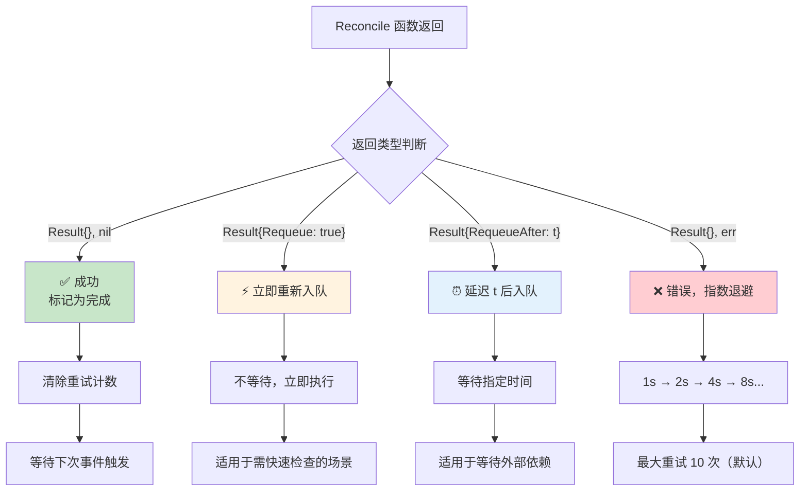
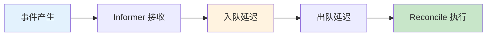
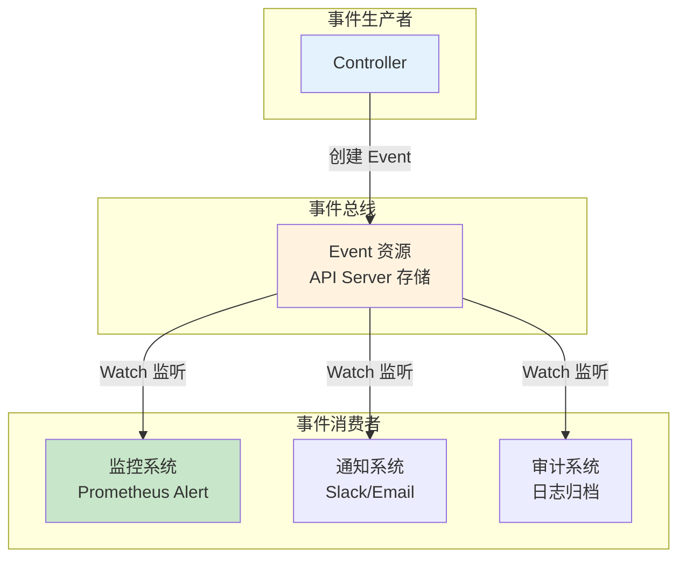

# 控制器开发最佳实践

> 掌握脚手架工具使用、控制器开发最佳实践、性能优化和调谐机制，避开常见陷阱。

---

## 目录

- [1. 概述](#1-概述)
- [2. 脚手架工具使用](#2-脚手架工具使用)
- [3. 控制器开发最佳实践](#3-控制器开发最佳实践)
- [4. 调谐机制详解](#4-调谐机制详解)
- [5. 性能优化](#5-性能优化)
- [6. 避坑指南](#6-避坑指南)
- [7. 事件驱动架构](#7-事件驱动架构)

---

## 1. 概述

### 1.1 控制器开发工具链选择



**本专题选择：controller-runtime + Kubebuilder**

| 工具 | 定位 | 适用场景 |
|------|------|----------|
| **client-go** | 底层库 | 深入学习/老项目维护 |
| **controller-runtime** | 高级封装 | 生产主流选择 |
| **Kubebuilder** | 脚手架 + 代码生成 | 新项目快速启动 |

### 1.2 开发流程概览



---

## 2. 脚手架工具使用

### 2.1 Kubebuilder 安装

```bash
# 下载 Kubebuilder（Linux/macOS）
curl -L https://go.kubebuilder.io/dl/latest/$(go env GOOS)/$(go env GOARCH) | tar -xz -C /tmp/
sudo mv /tmp/kubebuilder_* /usr/local/kubebuilder

# 添加到 PATH
export PATH=$PATH:/usr/local/kubebuilder/bin

# 验证安装
kubebuilder version
```

### 2.2 项目初始化

```bash
# 创建项目目录
mkdir my-controller && cd my-controller
go mod init example.com/my-controller

# 初始化 Kubebuilder 项目
kubebuilder init --domain ai-infra --repo example.com/my-controller
```

**生成的项目结构：**

```
my-controller/
├── PROJECT                  # Kubebuilder 项目元数据
├── Makefile                 # 构建和部署命令
├── Dockerfile               # 容器镜像构建
├── go.mod                   # Go 模块依赖
├── go.sum
│
├── cmd/
│   └── main.go              # 入口程序
│
├── config/                  # Kustomize 配置
│   ├── crd/                 # CRD 配置
│   ├── default/             # 默认配置
│   ├── manager/             # 控制器 Deployment
│   ├── rbac/                # RBAC 配置
│   └── samples/             # CR 示例
│
└── api/                     # API 定义
    └── v1alpha1/
        ├── sample_types.go  # 类型定义
        ├── groupversion_info.go
        └── zz_generated.deepcopy.go
```

### 2.3 创建 API 和 Controller

```bash
# 创建 API（CRD 类型）
kubebuilder create api --group sample --version v1alpha1 --kind SampleResource

# 选择：
# Create Resource [y/n]: y    # 创建 CRD
# Create Controller [y/n]: y  # 创建 Controller
```

**生成的文件：**

```
api/v1alpha1/
├── sample_types.go          # CRD 的 Spec 和 Status 定义
└── groupversion_info.go     # 组版本信息

controllers/
└── sampleresource_controller.go  # Controller 骨架代码
```

### 2.4 代码生成器

Kubebuilder 使用 controller-gen 工具生成代码：

```bash
# 生成 deepcopy 代码
make generate

# 生成 CRD YAML 清单
make manifests
```

**生成内容：**

| 生成命令 | 生成文件 | 说明 |
|----------|----------|------|
| `make generate` | `zz_generated.deepcopy.go` | DeepCopy 方法 |
| `make manifests` | `config/crd/bases/*.yaml` | CRD YAML 文件 |
| `make manifests` | `config/rbac/*.yaml` | RBAC 配置 |

### 2.5 本地运行

```bash
# 安装 CRD 到集群
make install

# 本地运行控制器（便于调试）
make run

# 或使用 go run
go run ./cmd/main.go
```

---

## 3. 控制器开发最佳实践

### 3.1 Reconcile 函数设计

#### 3.1.1 幂等性原则

Reconcile 函数必须支持安全重复执行：

```go
func (r *SampleResourceReconciler) Reconcile(ctx context.Context, req ctrl.Request) (ctrl.Result, error) {
    // === 步骤1: 获取 CR 实例 ===
    var sr samplev1alpha1.SampleResource
    if err := r.Get(ctx, req.NamespacedName, &sr); err != nil {
        if apierrors.IsNotFound(err) {
            // CR 已被删除，不再重试
            return ctrl.Result{}, nil
        }
        // 其他错误，返回重试
        return ctrl.Result{}, err
    }
    
    // === 步骤2: 检查删除标记 ===
    if !sr.DeletionTimestamp.IsZero() {
        // 处理 Finalizer 清理
        return r.handleDeletion(ctx, &sr)
    }
    
    // === 步骤3: 执行业务逻辑（幂等） ===
    // 创建资源前先检查是否存在
    existing := &appsv1.Deployment{}
    err := r.Get(ctx, types.NamespacedName{
        Name:      sr.Name,
        Namespace: sr.Namespace,
    }, existing)
    
    if apierrors.IsNotFound(err) {
        // 不存在，创建
        if err := r.createDeployment(ctx, &sr); err != nil {
            return ctrl.Result{}, err
        }
    } else if err != nil {
        return ctrl.Result{}, err
    } else {
        // 已存在，更新（如需）
        if needUpdate(existing, &sr) {
            if err := r.updateDeployment(ctx, existing); err != nil {
                return ctrl.Result{}, err
            }
        }
    }
    
    // === 步骤4: 更新 Status ===
    return r.updateStatus(ctx, &sr)
}
```

**幂等性检查清单：**

| 操作 | 非幂等（错误） | 幂等（正确） |
|------|---------------|-------------|
| **创建资源** | 直接创建 | 先检查是否存在 |
| **更新资源** | 直接覆盖 | 比较后更新 |
| **删除外部资源** | 直接删除 | 检查是否已删除 |

#### 3.1.2 避免阻塞操作

Reconcile 函数不应长时间阻塞：

```go
// ❌ 错误：阻塞等待
func (r *SampleResourceReconciler) Reconcile(...) {
    // 同步等待外部操作完成（可能阻塞数分钟）
    waitForExternalSystem()  // 阻塞！
}

// ✅ 正确：异步处理 + 状态轮询
func (r *SampleResourceReconciler) Reconcile(...) {
    // 发起异步操作
    startAsyncOperation()
    
    // 返回，等待下次调谐检查状态
    return ctrl.Result{RequeueAfter: 5 * time.Second}, nil
}
```

#### 3.1.3 错误处理和重试策略

| 错误类型 | 返回方式 | 说明 |
|----------|----------|------|
| **瞬时错误** | `return ctrl.Result{}, err` | 网络超时，指数退避重试 |
| **等待依赖** | `return ctrl.Result{RequeueAfter: 5s}, nil` | 等待外部就绪 |
| **配置错误** | `return ctrl.Result{}, nil` + 更新 Status | 用户输入错误，不重试 |
| **成功** | `return ctrl.Result{}, nil` | 完成调谐 |

### 3.2 资源获取和更新

#### 3.2.1 使用 Get/List 而非直接操作

```go
// ❌ 错误：直接创建，可能导致重复资源
func (r *Reconciler) createDeployment(ctx context.Context, sr *SampleResource) error {
    return r.Create(ctx, deployment)  // 多次调用会创建多个！
}

// ✅ 正确：先检查再创建
func (r *Reconciler) createDeployment(ctx context.Context, sr *SampleResource) error {
    existing := &appsv1.Deployment{}
    err := r.Get(ctx, types.NamespacedName{Name: sr.Name}, existing)
    if apierrors.IsNotFound(err) {
        return r.Create(ctx, deployment)
    }
    return err  // 已存在或其他错误
}
```

#### 3.2.2 乐观锁和冲突处理

Kubernetes 使用 ResourceVersion 实现乐观锁：

```go
func (r *Reconciler) updateStatus(ctx context.Context, sr *SampleResource) (ctrl.Result, error) {
    // 更新 Status
    sr.Status.Phase = "Ready"
    
    if err := r.Status().Update(ctx, sr); err != nil {
        if apierrors.IsConflict(err) {
            // 冲突：其他协程已更新
            // 策略：重新获取最新对象，重试
            log.Info("Conflict detected, will retry")
            return ctrl.Result{Requeue: true}, nil
        }
        return ctrl.Result{}, err
    }
    
    return ctrl.Result{}, nil
}
```

**冲突处理策略：**

| 策略 | 适用场景 | 实现方式 |
|------|----------|----------|
| **立即重试** | 高并发更新 | `Requeue: true` |
| **重新获取** | 数据可能被修改 | Get 最新对象后重试 |
| **放弃更新** | 配置错误 | 更新 Status 标记错误 |

#### 3.2.3 批量更新 vs 单条更新

```go
// ✅ 推荐：合并更新，减少 API 调用
func (r *Reconciler) updateStatus(ctx context.Context, sr *SampleResource) error {
    // 在一次 Patch 中更新多个字段
    patch := client.MergeFrom(sr.DeepCopy())
    sr.Status.Phase = "Ready"
    sr.Status.Replicas = 3
    return r.Status().Patch(ctx, sr, patch)
}
```

### 3.3 缓存和性能优化

#### 3.3.1 Informer 缓存 vs 直接 API 调用



**缓存使用建议：**

| 场景 | 推荐方式 | 原因 |
|------|----------|------|
| **读取自身管理的资源** | Informer 缓存 | 最终一致，快速 |
| **读取其他控制器的资源** | API 直接查询 | 需要最新状态 |
| **List 大量资源** | Informer 缓存 | 减少 API 压力 |
| **关键决策依赖最新状态** | API 直接查询 | 避免脏读 |

#### 3.3.2 避免 List 全量查询

```go
// ❌ 错误：List 所有资源，性能差
func (r *Reconciler) findRelated(sr *SampleResource) ([]SampleResource, error) {
    var list samplev1alpha1.SampleResourceList
    if err := r.List(ctx, &list); err != nil {  // 查询所有！
        return nil, err
    }
    // 过滤...
}

// ✅ 正确：使用 Label 过滤
func (r *Reconciler) findRelated(sr *SampleResource) ([]SampleResource, error) {
    var list samplev1alpha1.SampleResourceList
    if err := r.List(ctx, &list, client.MatchingLabels{
        "app.kubernetes.io/instance": sr.Name,
    }); err != nil {
        return nil, err
    }
    return list.Items, nil
}
```

### 3.4 并发安全

#### 3.4.1 Controller 内部并发模型

```go
// Kubebuilder 默认并发控制
opts := controller.Options{
    MaxConcurrentReconciles: 1,  // 默认：单并发
}

// 多并发配置
opts := controller.Options{
    MaxConcurrentReconciles: 5,  // 最多 5 个 Reconcile 同时执行
}
```

**并发安全注意事项：**

| 风险点 | 防护措施 | 说明 |
|--------|----------|------|
| **Status 并发更新** | 冲突检测 + 重试 | 多个协程更新同一对象 |
| **外部系统并发调用** | 锁/信号量 | 避免重复创建 |
| **共享状态访问** | 互斥锁 | 保护计数器/缓存 |

#### 3.4.2 跨控制器资源竞争



**避免竞争的策略：**

| 策略 | 实现方式 | 适用场景 |
|------|----------|----------|
| **字段分离** | 每个控制器更新不同字段 | 明确职责边界 |
| **条件类型分离** | 使用不同 Condition Type | 多控制器协作 |
| **乐观锁重试** | Conflict 错误重试 | 高并发场景 |

---

## 4. 调谐机制详解

### 4.1 不同返回结果的调谐行为



### 4.2 实际场景示例

#### 场景 1：等待外部依赖就绪

```go
func (r *Reconciler) Reconcile(ctx context.Context, req ctrl.Request) (ctrl.Result, error) {
    // 检查外部依赖
    if !isExternalSystemReady(sr) {
        // 依赖未就绪，5 秒后重试
        log.Info("External system not ready, requeue after 5s")
        return ctrl.Result{RequeueAfter: 5 * time.Second}, nil
    }
    
    // 依赖就绪，继续执行
    // ...
}
```

#### 场景 2：子资源创建失败

```go
func (r *Reconciler) Reconcile(ctx context.Context, req ctrl.Request) (ctrl.Result, error) {
    // 创建 Deployment
    if err := r.Create(ctx, deployment); err != nil {
        // 返回错误，触发指数退避重试
        log.Error(err, "Failed to create deployment")
        return ctrl.Result{}, err
    }
    
    // ...
}
```

#### 场景 3：条件满足继续执行

```go
func (r *Reconciler) Reconcile(ctx context.Context, req ctrl.Request) (ctrl.Result, error) {
    // 所有步骤完成
    if isFullyReady(sr) {
        // 更新 Status 为 Ready
        sr.Status.Phase = "Ready"
        r.Status().Update(ctx, sr)
        
        // 返回成功，不再入队
        return ctrl.Result{}, nil
    }
    
    // 部分就绪，继续调谐
    return ctrl.Result{Requeue: true}, nil
}
```

### 4.3 调谐流程图

```mermaid
flowchart TB
    subgraph "Reconcile 执行"
        A["事件触发"] --> B["从队列出队"]
        B --> C["Reconcile 调谐"]
    end
    
    subgraph "返回处理"
        C --> D{返回类型}
        
        D -->|Result{}, nil| E["✅ 成功"]
        D -->|Result{Requeue: true}| F["⚡ 立即重新入队"]
        D -->|Result{RequeueAfter: t}| G["⏰ 延迟入队"]
        D -->|Result{}, err| H["❌ 错误入队"]
    end
    
    subgraph "后续动作"
        E --> I["等待下次事件"]
        F --> B
        G --> J["等待 t 时间"]
        J --> B
        H --> K["指数退避"]
        K --> B
    end
    
    style A fill:#e3f2fd
    style C fill:#fff3e0
    style E fill:#c8e6c9
    style F fill:#fff3e0
    style G fill:#e3f2fd
    style H fill:#ffcdd2
```

---

## 5. 性能优化

### 5.1 缓存优化

| 优化项 | 方法 | 效果 |
|--------|------|------|
| **预热缓存** | 等待 Informer 同步 | 避免启动时脏读 |
| **选择性缓存** | 只缓存需要的资源 | 减少内存占用 |
| **索引优化** | 添加自定义索引 | 加速查询 |

```go
// 等待缓存同步
if !cache.WaitForCacheSync(stopCh, informer.HasSynced) {
    return fmt.Errorf("failed to wait for caches to sync")
}

// 添加自定义索引
func (r *Reconciler) SetupWithManager(mgr ctrl.Manager) error {
    return ctrl.NewControllerManagedBy(mgr).
        For(&samplev1alpha1.SampleResource{}).
        WithOptions(controller.Options{
            MaxConcurrentReconciles: 5,
        }).
        Complete(r)
}
```

### 5.2 减少 API Server 压力

| 策略 | 实现 | 说明 |
|------|------|------|
| **批量操作** | 合并更新 | 减少 PATCH 次数 |
| **本地缓存** | 使用 Informer | 避免重复查询 |
| **限流** | RateLimiter 配置 | 控制 QPS |
| **分页查询** | List 使用 Limit/Continue | 避免大 List |

### 5.3 调谐延迟优化



**优化手段：**

| 阶段 | 优化方法 | 效果 |
|------|----------|------|
| **入队** | 合并重复事件 | 减少冗余调谐 |
| **出队** | 增加 Worker 数量 | 提高并发度 |
| **执行** | 异步操作 | 减少阻塞时间 |

---

## 6. 避坑指南

### 6.1 常见错误场景

#### 坑 1："the object has been modified" 冲突

**原因：** 多个协程同时更新同一对象

**解决方案：**

```go
func (r *Reconciler) updateWithRetry(ctx context.Context, sr *SampleResource, updateFunc func(*SampleResource)) error {
    for i := 0; i < 3; i++ {
        latest := &SampleResource{}
        if err := r.Get(ctx, client.ObjectKeyFromObject(sr), latest); err != nil {
            return err
        }
        
        updateFunc(latest)
        
        if err := r.Status().Update(ctx, latest); err != nil {
            if apierrors.IsConflict(err) {
                continue  // 冲突，重试
            }
            return err
        }
        return nil
    }
    return fmt.Errorf("max retries exceeded")
}
```

#### 坑 2：Informer 缓存不同步

**原因：** 缓存尚未完成首次同步

**解决方案：**

```go
// 等待缓存同步后再启动控制器
if !mgr.GetCache().WaitForCacheSync(context.Background()) {
    return fmt.Errorf("cache not synced")
}
```

#### 坑 3：Reconcile 阻塞导致队列堆积

**原因：** 同步等待外部操作完成

**解决方案：** 使用 `RequeueAfter` 异步轮询

#### 坑 4：Finalizer 忘记清理

**原因：** 删除逻辑未移除 Finalizer

**解决方案：**

```go
if !sr.DeletionTimestamp.IsZero() {
    // 清理外部资源
    if err := r.cleanupExternalResources(ctx, sr); err != nil {
        return ctrl.Result{}, err
    }
    
    // 移除 Finalizer
    controllerutil.RemoveFinalizer(sr, finalizerName)
    if err := r.Update(ctx, sr); err != nil {
        return ctrl.Result{}, err
    }
    return ctrl.Result{}, nil
}
```

### 6.2 性能陷阱

| 陷阱 | 表现 | 解决方案 |
|------|------|----------|
| **过度 List** | API Server 慢查询 | 使用 Label 过滤 |
| **无 OwnerReference** | 孤儿资源累积 | 设置级联删除 |
| **事件广播过频** | etcd 写入压力大 | 合并关键事件 |

### 6.3 调试技巧

| 技巧 | 方法 | 说明 |
|------|------|------|
| **增加日志** | `log.V(1).Info("debug")` | 分级日志 |
| **kubectl describe** | 查看 Event | 快速定位问题 |
| **本地运行** | `make run` | 断点调试 |
| **指标暴露** | Prometheus Metrics | 监控调谐延迟 |

---

## 7. 事件驱动架构

### 7.1 事件上报机制

Controller 通过 Event 上报关键状态变更：

```go
// 事件上报示例
func (r *Reconciler) reportEvent(sr *SampleResource, eventType, reason, message string) {
    r.Recorder.Event(sr, eventType, reason, message)
}

// 使用
r.reportEvent(sr, "Normal", "Created", "Deployment created successfully")
r.reportEvent(sr, "Warning", "FailedSync", "Failed to create deployment: timeout")
```

**事件类型：**

| 类型 | 说明 | 示例 |
|------|------|------|
| **Normal** | 正常操作 | Created, Updated, Synced |
| **Warning** | 警告/错误 | FailedSync, ConfigurationError |

### 7.2 事件驱动集成



**监听事件的示例：**

```go
// 监听 Event 资源变化
func (w *EventWatcher) Start(ctx context.Context) error {
    informer := w.factory.Core().V1().Events().Informer()
    informer.AddEventHandler(cache.ResourceEventHandlerFuncs{
        AddFunc: func(obj interface{}) {
            event := obj.(*corev1.Event)
            if event.Type == "Warning" {
                // 处理警告事件
                w.handleWarning(event)
            }
        },
    })
    <-ctx.Done()
    return nil
}
```

### 7.3 与 Prometheus 指标结合

```go
// 暴露控制器指标
var (
    reconcileTotal = prometheus.NewCounterVec(
        prometheus.CounterOpts{Name: "controller_reconcile_total"},
        []string{"result"},  // success/error
    )
    reconcileDuration = prometheus.NewHistogram(
        prometheus.HistogramOpts{Name: "controller_reconcile_duration_seconds"},
    )
)

// 在 Reconcile 中记录
func (r *Reconciler) Reconcile(ctx context.Context, req ctrl.Request) (ctrl.Result, error) {
    start := time.Now()
    defer func() {
        duration := time.Since(start)
        reconcileDuration.Observe(duration.Seconds())
    }()
    
    // ... 业务逻辑
    
    if err != nil {
        reconcileTotal.WithLabelValues("error").Inc()
        return ctrl.Result{}, err
    }
    
    reconcileTotal.WithLabelValues("success").Inc()
    return ctrl.Result{}, nil
}
```

---

## 附录

### A. 开发检查清单

| 检查项 | 要求 |
|--------|------|
| **Reconcile 幂等** | 可安全重复执行 |
| **错误处理** | 所有错误都返回，不吞异常 |
| **Finalizer 清理** | 正确添加和移除 |
| **Status 更新** | 使用 Subresource 模式 |
| **事件上报** | 关键操作广播 Event |
| **RBAC 权限** | 最小权限原则 |
| **缓存同步等待** | 启动时等待 Informer 同步 |
| **冲突处理** | 检测 Conflict 错误并重试 |
| **指标暴露** | 记录调谐次数/延迟 |
| **日志** | 结构化，包含关键 ID |

### B. 参考资料

- [Kubebuilder 官方文档](https://book.kubebuilder.io/)
- [Controller Runtime API](https://pkg.go.dev/sigs.k8s.io/controller-runtime)
- [Client-go 源码](https://github.com/kubernetes/client-go)
