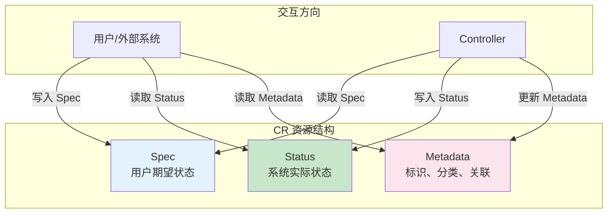
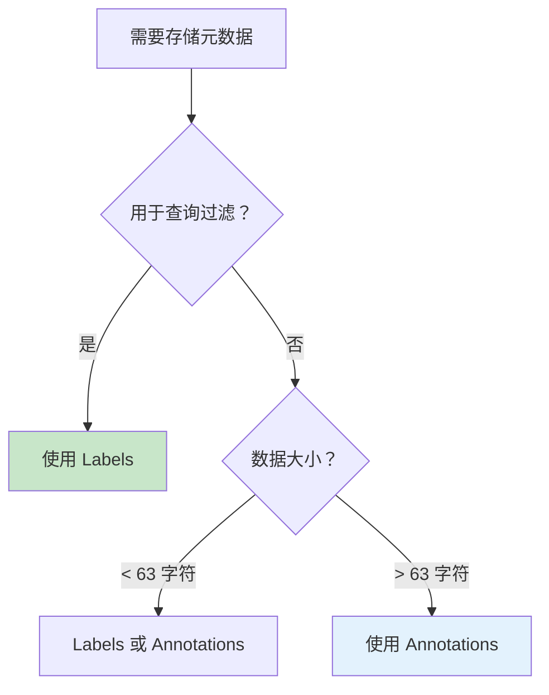
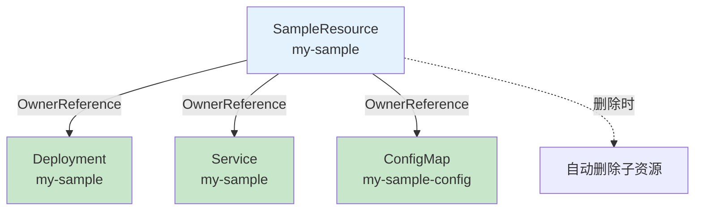
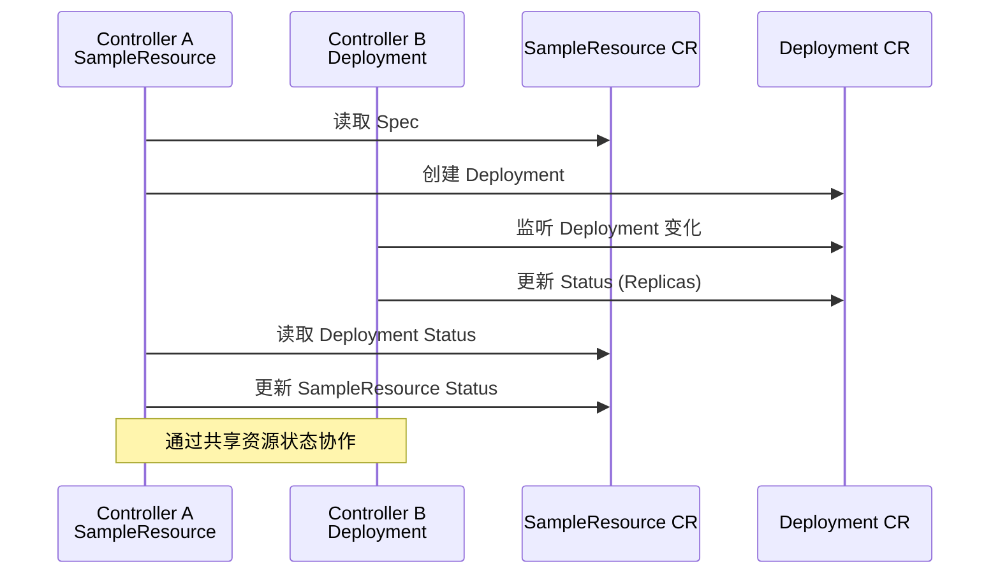
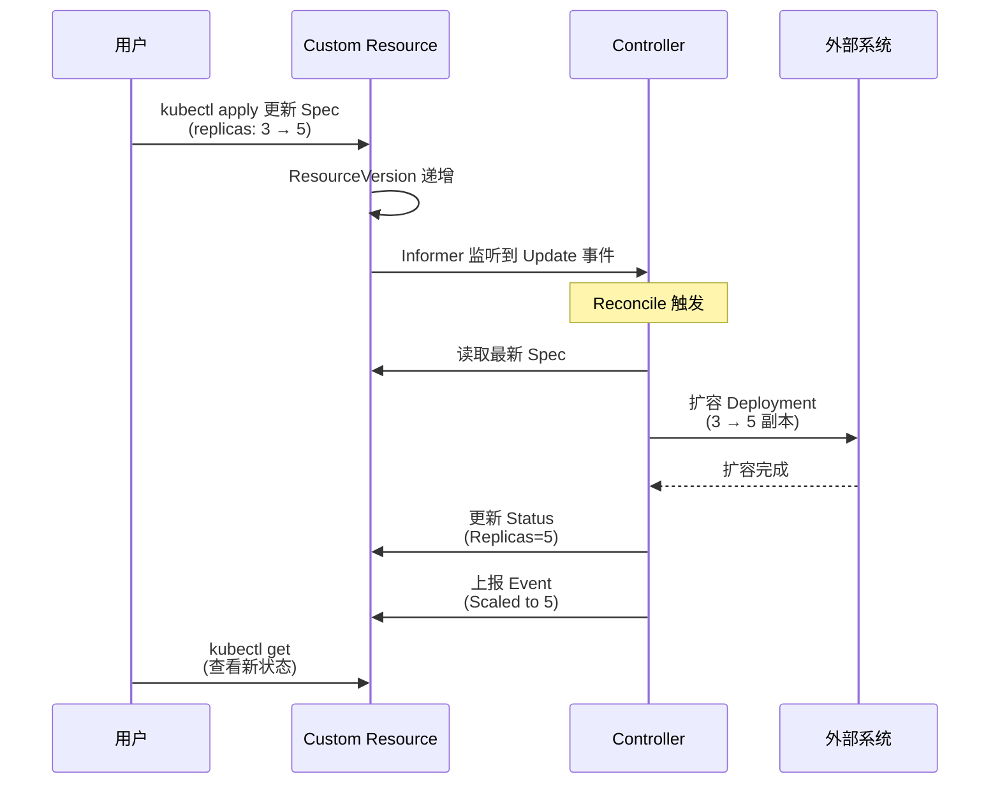
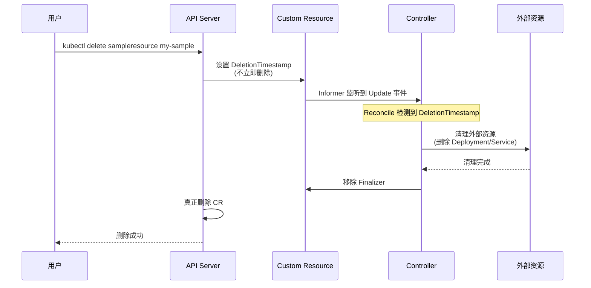
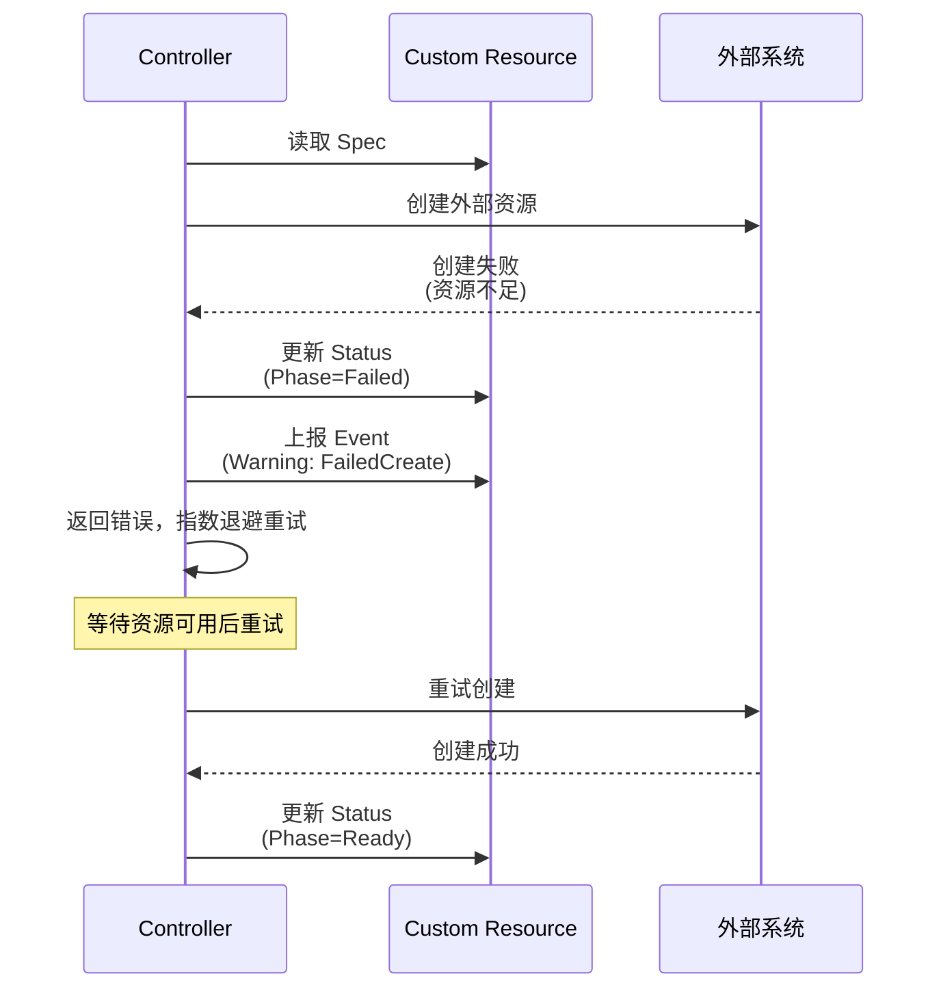

# CR 资源交互模式

> 深入理解 Spec、Status、Metadata 三部分的职责分离和设计模式，掌握控制器与外部交互的典型做法。

---

## 目录

- [1. 概述](#1-概述)
- [2. Spec 设计模式](#2-spec-设计模式)
- [3. Status 设计模式](#3-status-设计模式)
- [4. Metadata 交互模式](#4-metadata-交互模式)
- [5. 控制器对外交互模式](#5-控制器对外交互模式)
- [6. 典型交互流程](#6-典型交互流程)

---

## 1. 概述

### 1.1 CR 资源作为交互媒介

Custom Resource 是控制器与用户、外部系统之间的核心交互媒介：



### 1.2 三部分职责分离

| 部分 | 职责 | 写入者 | 读取者 | 说明 |
|------|------|--------|--------|------|
| **Spec** | 期望状态 | 用户 | 控制器 | 声明式配置，用户意图 |
| **Status** | 实际状态 | 控制器 | 用户/其他系统 | 反映当前真实状态 |
| **Metadata** | 元数据 | 用户/控制器 | 所有 | Labels/Annotations/Finalizers |

**核心原则：** 控制器只写 Status，不修改 Spec；用户只写 Spec，不修改 Status。

---

## 2. Spec 设计模式

### 2.1 声明式配置

Spec 表达用户的期望状态，而非操作步骤：

```yaml
# ✅ 正确：声明式
apiVersion: sample.ai-infra/v1alpha1
kind: SampleResource
spec:
  replicas: 3                    # 期望副本数
  feature: "advanced-scheduling" # 期望启用的特性
  resources:
    requests:
      cpu: "100m"
      memory: "128Mi"

# ❌ 错误：命令式
spec:
  action: "scale"                # 操作命令
  target: 3                      # 操作参数
```

### 2.2 Spec 字段设计原则

```go
// SampleResourceSpec 定义用户期望状态
type SampleResourceSpec struct {
    // ============================================================
    // 必需字段：核心配置，用户必须提供
    // ============================================================
    
    // Replicas 期望副本数
    // +kubebuilder:validation:Minimum=1
    // +kubebuilder:validation:Maximum=100
    Replicas int32 `json:"replicas"`
    
    // Feature 启用的特性名称
    // +kubebuilder:validation:Enum=advanced-scheduling;basic;none
    Feature string `json:"feature"`
    
    // ============================================================
    // 可选字段：有默认值，用户可覆盖
    // ============================================================
    
    // Image 使用的容器镜像
    // +optional
    // +kubebuilder:default="nginx:latest"
    Image string `json:"image,omitempty"`
    
    // Resources 资源请求/限制
    // +optional
    Resources *ResourceRequirements `json:"resources,omitempty"`
    
    // ============================================================
    // 复杂字段：嵌套结构体
    // ============================================================
    
    // Schedule 调度策略配置
    // +optional
    Schedule *ScheduleConfig `json:"schedule,omitempty"`
}

// ResourceRequirements 资源需求
type ResourceRequirements struct {
    // Requests 资源请求
    Requests corev1.ResourceList `json:"requests,omitempty"`
    // Limits 资源限制
    Limits corev1.ResourceList `json:"limits,omitempty"`
}

// ScheduleConfig 调度配置
type ScheduleConfig struct {
    // Priority 优先级
    // +kubebuilder:validation:Enum=High;Medium;Low
    Priority string `json:"priority,omitempty"`
    // Affinity 亲和性规则
    Affinity *corev1.Affinity `json:"affinity,omitempty"`
}
```

**设计原则：**

| 原则 | 说明 | 示例 |
|------|------|------|
| **最小化必需字段** | 降低用户负担 | 只要求核心配置 |
| **提供合理默认值** | 简化使用 | `+kubebuilder:default` |
| **枚举约束** | 防止无效值 | `+kubebuilder:validation:Enum` |
| **范围限制** | 防止极端配置 | `Minimum/Maximum` |
| **嵌套结构体** | 组织复杂配置 | 按功能分组 |

### 2.3 枚举和校验规则

```go
// 使用 kubebuilder 标记生成 OpenAPI 校验
type SampleResourceSpec struct {
    // 枚举值约束
    // +kubebuilder:validation:Enum=Running;Stopped;Paused
    Phase string `json:"phase"`
    
    // 数值范围
    // +kubebuilder:validation:Minimum=0
    // +kubebuilder:validation:Maximum=1000
    Retries int `json:"retries"`
    
    // 正则表达式
    // +kubebuilder:validation:Pattern=`^[a-z0-9-]+$`
    Name string `json:"name"`
    
    // 格式验证
    // +kubebuilder:validation:Format=date-time
    Deadline metav1.Time `json:"deadline"`
}
```

---

## 3. Status 设计模式

### 3.1 状态上报

Status 反映系统的真实状态，由控制器写入：

```go
// SampleResourceStatus 定义实际状态
type SampleResourceStatus struct {
    // Phase 当前阶段
    // 可能值：Pending, Creating, Running, Failed, Terminating
    Phase string `json:"phase,omitempty"`
    
    // Replicas 实际副本数
    Replicas int32 `json:"replicas,omitempty"`
    
    // AvailableReplicas 可用副本数
    AvailableReplicas int32 `json:"availableReplicas,omitempty"`
    
    // ObservedGeneration 最后处理的 Generation
    // 用于判断 Status 是否对应最新 Spec
    ObservedGeneration int64 `json:"observedGeneration,omitempty"`
    
    // Conditions 详细条件
    // +optional
    Conditions []metav1.Condition `json:"conditions,omitempty"`
    
    // LastTransitionTime 最后状态转换时间
    LastTransitionTime metav1.Time `json:"lastTransitionTime,omitempty"`
}
```

### 3.2 Conditions 设计

Conditions 是 Status 的核心，提供细粒度的状态信息：

```go
// 标准 Condition 结构
type Condition struct {
    // Type 条件类型
    // 如：Ready, Progressing, Available
    Type string `json:"type"`
    
    // Status 条件状态
    // True, False, Unknown
    Status metav1.ConditionStatus `json:"status"`
    
    // Reason 机器可读的原因
    // 如：MinimumReplicasUnavailable, DeploymentAvailable
    Reason string `json:"reason"`
    
    // Message 人类可读的消息
    // 如：Deployment has minimum availability.
    Message string `json:"message"`
    
    // LastTransitionTime 最后转换时间
    LastTransitionTime metav1.Time `json:"lastTransitionTime"`
    
    // ObservedGeneration 触发条件的 Generation
    ObservedGeneration int64 `json:"observedGeneration,omitempty"`
}
```

**标准 Condition 类型：**

| Type | 说明 | Status=True 含义 |
|------|------|------------------|
| **Ready** | 是否就绪 | 资源可正常使用 |
| **Progressing** | 是否进行中 | 正在创建/更新 |
| **Available** | 是否可用 | 满足最小可用性 |
| **Degraded** | 是否降级 | 功能受损 |

### 3.3 Status 更新策略

#### 3.3.1 Subresource 模式

使用 `/status` 子资源，避免覆盖 Spec：

```go
// ✅ 正确：使用 Status 子资源
func (r *Reconciler) updateStatus(ctx context.Context, sr *SampleResource) error {
    sr.Status.Phase = "Ready"
    sr.Status.Replicas = 3
    
    // 只更新 Status 子资源
    return r.Status().Update(ctx, sr)
}

// ❌ 错误：直接 Update 会覆盖整个对象
func (r *Reconciler) updateStatus(ctx context.Context, sr *SampleResource) error {
    return r.Update(ctx, sr)  // 可能覆盖用户的 Spec！
}
```

#### 3.3.2 使用 Patch 合并更新

```go
func (r *Reconciler) updateStatusWithPatch(ctx context.Context, sr *SampleResource) error {
    // 记录原始状态
    patch := client.MergeFrom(sr.DeepCopy())
    
    // 修改 Status
    sr.Status.Phase = "Ready"
    sr.Status.Conditions = append(sr.Status.Conditions, metav1.Condition{
        Type:   "Ready",
        Status: metav1.ConditionTrue,
        Reason: "ReconcileSuccess",
    })
    
    // Patch 更新，仅修改变化字段
    return r.Status().Patch(ctx, sr, patch)
}
```

#### 3.3.3 冲突处理

```go
func (r *Reconciler) updateStatusWithRetry(ctx context.Context, sr *SampleResource) error {
    for i := 0; i < 3; i++ {
        // 获取最新对象
        latest := &SampleResource{}
        if err := r.Get(ctx, client.ObjectKeyFromObject(sr), latest); err != nil {
            return err
        }
        
        // 修改 Status
        latest.Status.Phase = "Ready"
        
        // 更新
        if err := r.Status().Update(ctx, latest); err != nil {
            if apierrors.IsConflict(err) {
                // 冲突，重试
                continue
            }
            return err
        }
        return nil
    }
    return fmt.Errorf("max retries exceeded")
}
```

---

## 4. Metadata 交互模式

### 4.1 Labels 使用

Labels 用于资源的分类和选择：

```yaml
metadata:
  name: my-sample
  labels:
    # ============================================================
    # 推荐：标准 Kubernetes Labels
    # ============================================================
    app.kubernetes.io/name: sample-resource
    app.kubernetes.io/instance: my-sample
    app.kubernetes.io/version: v1alpha1
    app.kubernetes.io/managed-by: sample-controller
    
    # ============================================================
    # 自定义：业务分类
    # ============================================================
    ai-infra/type: training
    ai-infra/priority: high
```

**控制器关联标记：**

```go
// 控制器添加关联 Label
func (r *Reconciler) addLabels(sr *SampleResource) {
    if sr.Labels == nil {
        sr.Labels = make(map[string]string)
    }
    sr.Labels["sample.ai-infra/managed"] = "true"
    sr.Labels["sample.ai-infra/controller"] = sr.Name
}
```

**查询过滤优化：**

```go
// 使用 Label 过滤，避免全量 List
var list samplev1alpha1.SampleResourceList
err := r.List(ctx, &list, client.MatchingLabels{
    "sample.ai-infra/managed": "true",
})
```

### 4.2 Annotations 使用

Annotations 存储非标识性元数据：

```yaml
metadata:
  annotations:
    # ============================================================
    # 控制器添加的元信息
    # ============================================================
    sample.ai-infra/last-applied-config: '{"replicas":3,"feature":"advanced"}'
    sample.ai-infra/created-by: "user@example.com"
    sample.ai-infra/external-id: "ext-12345"
    
    # ============================================================
    # 大字段存储（可达 256KB）
    # ============================================================
    sample.ai-infra/complex-config: |
      {
        "schedule": {...},
        "resources": {...},
        "network": {...}
      }
```

**Annotations 使用场景：**

| 场景 | 使用 Annotations | 原因 |
|------|------------------|------|
| **最后配置信息** | ✅ | 非标识性，用于审计 |
| **外部系统关联** | ✅ | 记录外部资源 ID |
| **大字段存储** | ✅ | 超过 Label 大小限制 |
| **kubectl 跟踪** | ✅ | last-applied-configuration |

### 4.3 Labels vs Annotations 对比

| 维度 | Labels | Annotations |
|------|--------|-------------|
| **用途** | 分类和选择 | 元数据存储 |
| **查询** | 支持选择器（LabelSelector） | 不支持选择器 |
| **大小限制** | 较小（单个 63 字符） | 可达 256KB |
| **格式** | key=value（严格格式） | 任意字符串/JSON |
| **索引** | 有索引，查询快速 | 无索引，需遍历 |
| **示例** | `app=nginx, env=prod` | `last-applied-config: {...}` |

**选择建议：**



---

## 5. 控制器对外交互模式

### 5.1 OwnerReference 机制

OwnerReference 建立资源间的归属关系，实现级联删除：

```go
// 设置 OwnerReference
func (r *Reconciler) setOwnerReference(obj metav1.Object, owner metav1.Object) {
    gvk := owner.GetObjectKind().GroupVersionKind()
    ownerRef := metav1.OwnerReference{
        APIVersion: gvk.GroupVersion().String(),
        Kind:       gvk.Kind,
        Name:       owner.GetName(),
        UID:        owner.GetUID(),
    }
    obj.SetOwnerReferences(append(obj.GetOwnerReferences(), ownerRef))
}

// 使用：创建子资源时设置
func (r *Reconciler) createDeployment(ctx context.Context, sr *SampleResource) error {
    deployment := &appsv1.Deployment{
        // ... 配置
    }
    
    // 设置 CR 为 Owner
    r.setOwnerReference(deployment, sr)
    
    return r.Create(ctx, deployment)
}
```

**级联删除效果：**



### 5.2 Finalizer 机制

Finalizer 拦截删除操作，用于清理外部资源：

```go
// Finalizer 名称
const SampleFinalizer = "sample.ai-infra/cleanup"

// 添加 Finalizer
func (r *Reconciler) addFinalizer(ctx context.Context, sr *SampleResource) error {
    if !controllerutil.ContainsFinalizer(sr, SampleFinalizer) {
        controllerutil.AddFinalizer(sr, SampleFinalizer)
        return r.Update(ctx, sr)
    }
    return nil
}

// 处理删除
func (r *Reconciler) handleDeletion(ctx context.Context, sr *SampleResource) (ctrl.Result, error) {
    if controllerutil.ContainsFinalizer(sr, SampleFinalizer) {
        // 执行清理逻辑
        if err := r.cleanupExternalResources(ctx, sr); err != nil {
            return ctrl.Result{}, err
        }
        
        // 移除 Finalizer
        controllerutil.RemoveFinalizer(sr, SampleFinalizer)
        if err := r.Update(ctx, sr); err != nil {
            return ctrl.Result{}, err
        }
    }
    return ctrl.Result{}, nil
}
```

**Finalizer 工作流程：**

| 步骤 | 操作 | 状态 |
|------|------|------|
| **1. 创建 CR** | 添加 Finalizer | `finalizers: ["sample.ai-infra/cleanup"]` |
| **2. 用户删除** | 设置 DeletionTimestamp | `deletionTimestamp: "2024-01-01T00:00:00Z"` |
| **3. Reconcile 检测** | 发现 DeletionTimestamp | 进入删除处理分支 |
| **4. 清理外部资源** | 删除 Deployment/Service 等 | 执行清理逻辑 |
| **5. 移除 Finalizer** | Patch 移除 Finalizer | `finalizers: []` |
| **6. API Server 删除** | 自动完成删除 | 资源从 etcd 移除 |

### 5.3 事件上报模式

```go
// 事件上报封装
func (r *Reconciler) recordEvent(sr *SampleResource, eventType, reason, message string) {
    r.Recorder.Eventf(sr, corev1.EventTypeNormal, reason, message)
}

// 使用场景
r.recordEvent(sr, "Normal", "Created", "Deployment %s created", sr.Name)
r.recordEvent(sr, "Warning", "FailedCreate", "Failed to create deployment: %v", err)
r.recordEvent(sr, "Normal", "Synced", "Status updated to Ready")
```

**事件类型和级别：**

| 类型 | 级别 | 示例场景 |
|------|------|----------|
| **Normal** | 信息 | Created, Updated, Synced, Scaled |
| **Warning** | 警告 | FailedCreate, FailedSync, ConfigurationError |

### 5.4 与其他控制器协作



**避免循环调谐：**

| 风险 | 防护 | 说明 |
|------|------|------|
| **A 更新 B，B 更新 A** | 设置 ObservedGeneration | 避免处理旧 Spec |
| **状态反复翻转** | 设置稳定条件 | 达到阈值后停止更新 |
| **无限循环** | 检测 Generation 变化 | 仅处理新 Spec |

---

## 6. 典型交互流程

### 6.1 完整交互流程图

```mermaid
sequenceDiagram
    participant User as 用户
    participant CR as Custom Resource
    participant Ctrl as Controller
    participant Ext as 外部系统
    
    rect rgb(227, 242, 253)
        Note over User,CR: === 创建阶段 ===
        User->>CR: kubectl apply -f cr.yaml<br/>(写入 Spec)
        CR->>Ctrl: Informer 监听到 Add 事件
    end
    
    rect rgb(255, 243, 224)
        Note over Ctrl,Ext: === 调谐阶段 ===
        Ctrl->>CR: 读取 Spec (期望状态)
        Ctrl->>Ext: 创建外部资源<br/>(Deployment/Service 等)
        Ext-->>Ctrl: 返回创建结果
        Ctrl->>CR: 设置 OwnerReference<br/>(级联删除)
    end
    
    rect rgb(200, 230, 201)
        Note over Ctrl,CR: === 状态上报 ===
        Ctrl->>CR: 更新 Status<br/>(Phase=Ready, Conditions)
        Ctrl->>CR: 上报 Event<br/>(Created successfully)
    end
    
    rect rgb(252, 228, 236)
        Note over User,CR: === 用户查看 ===
        User->>CR: kubectl get sampleresource
        User->>CR: kubectl describe sampleresource<br/>(查看 Status + Events)
    end
    
    style User fill:#e3f2fd
    style Ctrl fill:#fff3e0
    style Ext fill:#c8e6c9
```

### 6.2 更新场景交互



### 6.3 删除场景交互



### 6.4 错误场景交互



---

## 附录

### A. Spec/Status 设计检查清单

| 检查项 | Spec | Status |
|--------|------|--------|
| **声明式** | ✅ 表达期望状态 | N/A |
| **幂等性** | ✅ 多次应用结果相同 | N/A |
| **必填字段** | ✅ 最小化必需字段 | N/A |
| **默认值** | ✅ 提供合理默认 | N/A |
| **校验规则** | ✅ 枚举/范围/格式 | N/A |
| **Conditions** | N/A | ✅ 提供细粒度状态 |
| **ObservedGeneration** | N/A | ✅ 判断是否对应最新 Spec |
| **Subresource** | N/A | ✅ 使用 /status 更新 |

### B. Metadata 使用指南

| 场景 | 推荐方式 | 示例 |
|------|----------|------|
| **分类查询** | Labels | `app=nginx, env=prod` |
| **外部关联** | Annotations | `external-id: ext-12345` |
| **审计信息** | Annotations | `created-by: user@example.com` |
| **大字段存储** | Annotations | `complex-config: {...}` |
| **删除拦截** | Finalizers | `sample.ai-infra/cleanup` |
| **级联删除** | OwnerReferences | 设置父资源 |

### C. 参考资料

- [Kubernetes API Conventions](https://github.com/kubernetes/community/blob/master/contributors/devel/sig-architecture/api-conventions.md)
- [Conditions 设计模式](https://github.com/kubernetes/community/blob/master/contributors/devel/sig-architecture/api-conventions.md#typical-status-properties)
