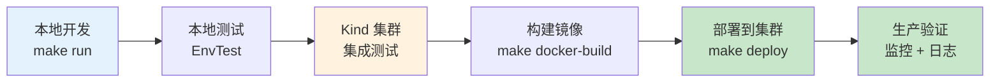
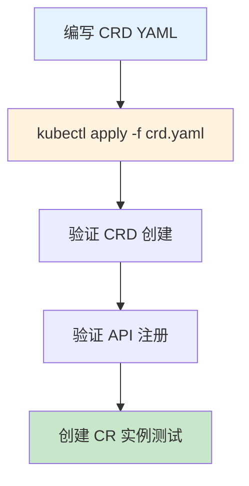
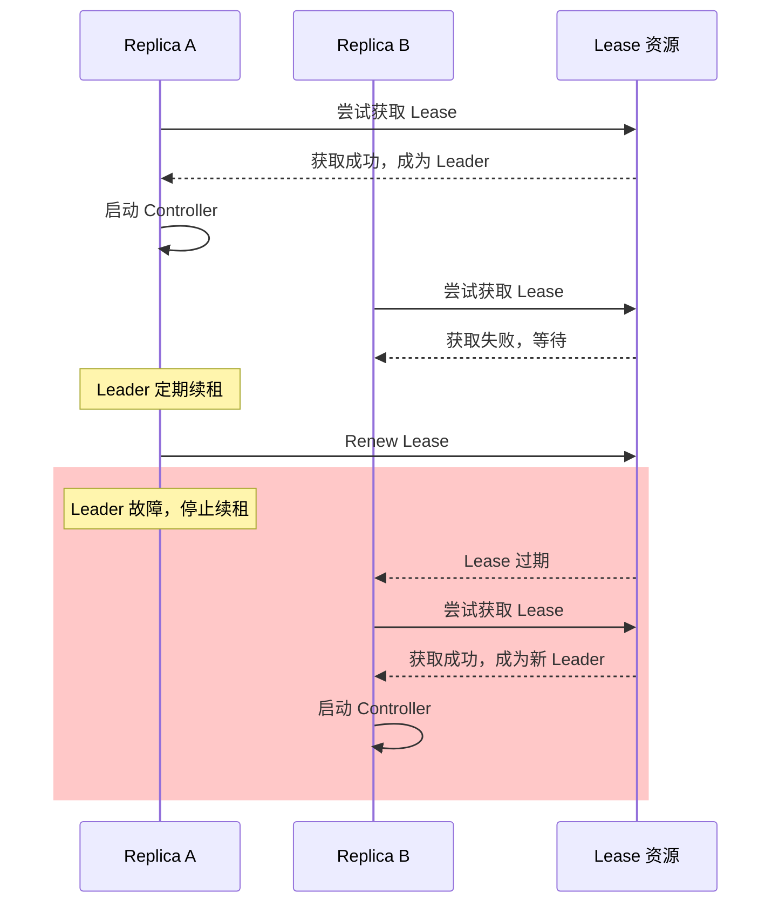
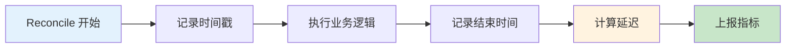
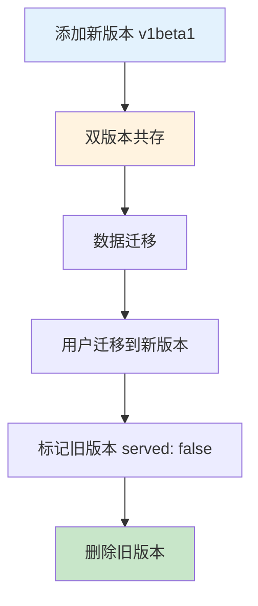
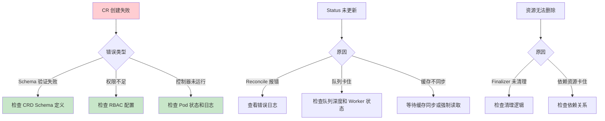

# 部署与问题排查

> 掌握从开发到生产的部署流程、问题排查方法论和调试技巧，确保控制器稳定运行。

---

## 目录

- [1. 概述](#1-概述)
- [2. CRD 部署](#2-crd-部署)
- [3. 控制器部署](#3-控制器部署)
- [4. 问题排查方法论](#4-问题排查方法论)
- [5. 开发调试技巧](#5-开发调试技巧)
- [6. 生产最佳实践](#6-生产最佳实践)

---

## 1. 概述

### 1.1 从开发到生产的部署流程



### 1.2 部署环境对比

| 环境 | 用途 | 特点 | 工具 |
|------|------|------|------|
| **本地运行** | 开发调试 | 快速迭代，断点调试 | `make run` |
| **Kind 集群** | 集成测试 | 本地完整模拟 | `kind create cluster` |
| **Minikube** | 功能验证 | 单节点集群 | `minikube start` |
| **测试集群** | CI/CD | 自动化测试 | GitHub Actions |
| **生产集群** | 正式运行 | 高可用，监控 | Helm/Kustomize |

---

## 2. CRD 部署

### 2.1 环境准备

```bash
# 创建 Kind 本地集群
kind create cluster --name dev

# 验证 kubectl 连接
kubectl cluster-info
kubectl get nodes

# 预期输出：
# NAME                 STATUS   ROLES           AGE   VERSION
# dev-control-plane   Ready    control-plane   10s   v1.28.0
```

### 2.2 CRD 部署流程



**步骤详解：**

| 步骤 | 命令 | 验证 |
|------|------|------|
| **1. 部署 CRD** | `kubectl apply -f config/crd/bases/sample.ai-infra_sampleresources.yaml` | 检查输出 |
| **2. 验证 CRD** | `kubectl get crd sampleresources.sample.ai-infra` | 状态为 Established |
| **3. 查看 CRD 详情** | `kubectl describe crd sampleresources.sample.ai-infra` | 检查 Schema |
| **4. 验证 API** | `kubectl api-resources \| grep sampleresource` | 出现在列表中 |
| **5. 创建 CR 测试** | `kubectl apply -f config/samples/sample_v1alpha1_sampleresource.yaml` | 创建成功 |

### 2.3 CRD 部署示例

```yaml
# ============================================================
# CRD: 自定义资源定义
# ============================================================
#
# 【核心字段】
# - group: API 组名称
# - versions: 支持的版本列表
# - scope: Namespaced 或 Cluster
# - names: 资源名称定义
#
# 【使用方式】
# kubectl apply -f 01-crd.yaml
# kubectl get crd sampleresources.sample.ai-infra

apiVersion: apiextensions.k8s.io/v1
kind: CustomResourceDefinition
metadata:
  name: sampleresources.sample.ai-infra
spec:
  group: sample.ai-infra
  versions:
    - name: v1alpha1
      served: true
      storage: true
      schema:
        openAPIV3Schema:
          type: object
          properties:
            spec:
              type: object
              properties:
                replicas:
                  type: integer
                  minimum: 1
                  maximum: 100
                feature:
                  type: string
                  enum:
                    - advanced-scheduling
                    - basic
                    - none
            status:
              type: object
              properties:
                phase:
                  type: string
                conditions:
                  type: array
                  items:
                    type: object
                    properties:
                      type:
                        type: string
                      status:
                        type: string
                      reason:
                        type: string
                      message:
                        type: string
  scope: Namespaced
  names:
    plural: sampleresources
    singular: sampleresource
    kind: SampleResource
    shortNames:
      - sr
```

### 2.4 权限配置（RBAC）

控制器需要适当的 RBAC 权限才能工作：

```yaml
# ============================================================
# RBAC: ClusterRole + ClusterRoleBinding
# ============================================================
#
# 【核心字段】
# - rules: 权限规则列表
# - subjects: 绑定对象（ServiceAccount）
#
# 【最小权限原则】
# 只授予必要的资源和操作权限

apiVersion: rbac.authorization.k8s.io/v1
kind: ClusterRole
metadata:
  name: sample-controller-role
rules:
  # ============================================================
  # 规则1: 管理 SampleResource 资源
  # ============================================================
  # 需要 get/list/watch 用于读取 CR
  # 需要 update/patch 用于更新 Status
  - apiGroups: ["sample.ai-infra"]
    resources: ["sampleresources"]
    verbs: ["get", "list", "watch", "update", "patch"]
  
  # 允许更新 status 子资源
  - apiGroups: ["sample.ai-infra"]
    resources: ["sampleresources/status"]
    verbs: ["get", "update", "patch"]
  
  # ============================================================
  # 规则2: 管理最终资源（Deployment/Service 等）
  # ============================================================
  - apiGroups: ["apps"]
    resources: ["deployments"]
    verbs: ["get", "list", "watch", "create", "update", "patch", "delete"]
  
  - apiGroups: [""]
    resources: ["services", "configmaps"]
    verbs: ["get", "list", "watch", "create", "update", "patch", "delete"]
  
  # ============================================================
  # 规则3: 事件上报
  # ============================================================
  - apiGroups: [""]
    resources: ["events"]
    verbs: ["create", "patch"]

---
apiVersion: rbac.authorization.k8s.io/v1
kind: ClusterRoleBinding
metadata:
  name: sample-controller-rolebinding
roleRef:
  apiGroup: rbac.authorization.k8s.io
  kind: ClusterRole
  name: sample-controller-role
subjects:
  - kind: ServiceAccount
    name: sample-controller-sa
    namespace: default
```

---

## 3. 控制器部署

### 3.1 本地运行模式

本地运行便于开发调试，无需构建镜像：

```bash
# 安装 CRD 到集群
make install

# 本地运行控制器
make run

# 预期输出：
# 2024-01-01T00:00:00Z    INFO    controller-runtime.controller   Starting Controller
# 2024-01-01T00:00:00Z    INFO    controller-runtime.controller   Starting workers    {"worker count": 1}
```

**本地运行优势：**

| 优势 | 说明 |
|------|------|
| **快速迭代** | 修改代码后直接 `go run` |
| **断点调试** | 使用 Delve 或 IDE 调试器 |
| **日志实时** | 直接查看控制台输出 |
| **无需构建** | 跳过 Docker 构建步骤 |

### 3.2 集群内运行

生产环境需要将控制器部署为集群内的 Deployment：

```yaml
# ============================================================
# ServiceAccount: 控制器身份
# ============================================================
apiVersion: v1
kind: ServiceAccount
metadata:
  name: sample-controller-sa
  namespace: default

---
# ============================================================
# Deployment: 控制器部署
# ============================================================
#
# 【核心配置】
# - replicas: 1（单实例，Leader Election 保证高可用）
# - resources: 资源限制
# - env: 环境变量

apiVersion: apps/v1
kind: Deployment
metadata:
  name: sample-controller
  namespace: default
  labels:
    app: sample-controller
spec:
  replicas: 1
  selector:
    matchLabels:
      app: sample-controller
  template:
    metadata:
      labels:
        app: sample-controller
    spec:
      serviceAccountName: sample-controller-sa
      containers:
        - name: controller
          image: sample-controller:latest
          command: ["/manager"]
          args:
            - --leader-elect
            - --metrics-bind-address=:8080
          resources:
            requests:
              cpu: 100m
              memory: 128Mi
            limits:
              cpu: 500m
              memory: 256Mi
          env:
            - name: POD_NAMESPACE
              valueFrom:
                fieldRef:
                  fieldPath: metadata.namespace
          ports:
            - name: metrics
              containerPort: 8080
              protocol: TCP
```

### 3.3 高可用配置

多副本部署时，使用 Leader Election 避免冲突：

```go
// main.go 中启用 Leader Election
mgr, err := ctrl.NewManager(ctrl.GetConfigOrDie(), ctrl.Options{
    Scheme:                 scheme,
    MetricsBindAddress:     ":8080",
    LeaderElection:         true,
    LeaderElectionID:       "sample-controller-leader",
    LeaderElectionNamespace: "default",
})
```

**Leader Election 机制：**



---

## 4. 问题排查方法论

### 4.1 分层排查框架

```mermaid
flowchart TB
    subgraph "第一层：CRD 检查"
        L1["CRD 是否正确注册？"]
        L1 --> L1A["kubectl get crd"]
        L1A --> L1B["kubectl describe crd"]
    end
    
    subgraph "第二层：权限检查"
        L2["RBAC 权限是否足够？"]
        L2 --> L2A["kubectl auth can-i --list"]
    end
    
    subgraph "第三层：控制器状态"
        L3["Controller 是否运行？"]
        L3 --> L3A["kubectl get pods"]
        L3A --> L3B["kubectl logs"]
    end
    
    subgraph "第四层：Informer 同步"
        L4["Informer 是否同步？"]
        L4 --> L4A["检查日志同步消息"]
    end
    
    subgraph "第五层：Reconcile 错误"
        L5["Reconcile 是否报错？"]
        L5 --> L5A["查看错误日志"]
        L5A --> L5B["kubectl get events"]
    end
    
    style L1 fill:#e3f2fd
    style L2 fill:#fff3e0
    style L3 fill:#c8e6c9
    style L4 fill:#fce4ec
    style L5 fill:#ffcdd2
```



### 4.2 常见错误类型

#### 错误 1：CRD 创建失败（Schema 错误）

**表现：**

```bash
Error from server (Invalid): error when creating "cr.yaml": 
CustomResource.sample.ai-infra "my-sample" is invalid: 
spec.replicas: Invalid value: 0: spec.replicas in body should be greater than or equal to 1
```

**排查步骤：**

```bash
# 1. 查看 CRD Schema
kubectl get crd sampleresources.sample.ai-infra -o jsonpath='{.spec.versions[0].schema}'

# 2. 验证 CR 是否符合 Schema
kubectl apply -f cr.yaml --dry-run=client -o yaml
```

**常见原因：**

| 原因 | 解决 |
|------|------|
| 字段类型不匹配 | 检查 CRD Schema |
| 必填字段缺失 | 添加 required 字段 |
| 值超出范围 | 调整 Minimum/Maximum |
| 枚举值错误 | 使用合法枚举值 |

#### 错误 2：控制器启动失败（权限不足）

**表现：**

```bash
E0101 00:00:00.000000 1 leaderelection.go:330] error retrieving resource lock default/sample-controller-leader: 
leases.coordination.k8s.io is forbidden: User "system:serviceaccount:default:sample-controller-sa" cannot get resource "leases"
```

**排查步骤：**

```bash
# 1. 检查 ServiceAccount
kubectl get sa sample-controller-sa

# 2. 检查 ClusterRoleBinding
kubectl get clusterrolebinding sample-controller-rolebinding

# 3. 验证权限
kubectl auth can-i --list --as=system:serviceaccount:default:sample-controller-sa

# 4. 查看 Controller 日志
kubectl logs deployment/sample-controller
```

**解决方案：**

```yaml
# 添加 Leases 权限
rules:
  - apiGroups: ["coordination.k8s.io"]
    resources: ["leases"]
    verbs: ["get", "list", "watch", "create", "update"]
```

#### 错误 3：Reconcile 卡住（死锁/阻塞）

**表现：** CR 长时间处于 Pending 状态，无错误日志

**排查步骤：**

```bash
# 1. 查看 CR 状态
kubectl get sampleresource my-sample -o yaml

# 2. 查看 ObservedGeneration
kubectl get sampleresource my-sample -o jsonpath='{.status.observedGeneration}'

# 3. 查看 Controller 日志
kubectl logs deployment/sample-controller --tail=100

# 4. 检查 Finalizer
kubectl get sampleresource my-sample -o jsonpath='{.metadata.finalizers}'
```

**常见原因：**

| 原因 | 解决 |
|------|------|
| 外部依赖不可用 | 检查依赖服务 |
| Finalizer 未清理 | 手动移除或修复清理逻辑 |
| 并发死锁 | 检查 Reconcile 是否有阻塞调用 |

#### 错误 4：资源无法删除（Finalizer 未清理）

**表现：**

```bash
kubectl delete sampleresource my-sample
# 命令卡住，资源处于 Terminating 状态
```

**排查步骤：**

```bash
# 1. 查看 Finalizer
kubectl get sampleresource my-sample -o jsonpath='{.metadata.finalizers}'

# 2. 查看 Controller 日志（查找清理相关错误）
kubectl logs deployment/sample-controller | grep my-sample

# 3. 强制移除 Finalizer（紧急情况下）
kubectl patch sampleresource my-sample -p '{"metadata":{"finalizers":[]}}' --type=merge
```

### 4.3 排查工具和命令

```bash
# ============================================================
# 查看 CRD
# ============================================================
kubectl get crd
kubectl describe crd sampleresources.sample.ai-infra
kubectl get crd sampleresources.sample.ai-infra -o yaml

# ============================================================
# 查看 CR 状态
# ============================================================
kubectl get sampleresource
kubectl get sampleresource my-sample -o yaml
kubectl describe sampleresource my-sample

# ============================================================
# 查看控制器日志
# ============================================================
kubectl logs deployment/sample-controller
kubectl logs deployment/sample-controller --tail=100
kubectl logs deployment/sample-controller -f

# ============================================================
# 查看事件
# ============================================================
kubectl get events --sort-by='.lastTimestamp'
kubectl get events --field-selector involvedObject.name=my-sample

# ============================================================
# 验证权限
# ============================================================
kubectl auth can-i --list --as=system:serviceaccount:default:sample-controller-sa
kubectl auth can-i create deployments --as=system:serviceaccount:default:sample-controller-sa
```

---

## 5. 开发调试技巧

### 5.1 本地调试

#### 5.1.1 使用 KUBECONFIG 连接集群

```bash
# 导出 Kind 集群 KUBECONFIG
export KUBECONFIG=$(kind get kubeconfig --name dev)

# 验证连接
kubectl get nodes

# 运行控制器
make run
```

#### 5.1.2 断点调试（Go Delve）

```bash
# 安装 Delve
go install github.com/go-delve/delve/cmd/dlv@latest

# 使用 Delve 启动
dlv debug ./cmd/main.go

# 或使用 IDE（如 GoLand）配置远程调试
```

#### 5.1.3 日志级别调整

```go
// 增加详细日志
log.V(1).Info("Debug message", "key", value)  // -v=1 时显示
log.V(2).Info("More detailed", "key", value)  // -v=2 时显示

// 运行时调整
// 启动参数：--v=2
```

### 5.2 常见问题定位

#### 问题 1：Informer 缓存问题

**表现：** 读取到的对象状态不是最新的

**排查：**

```bash
# 1. 查看 Informer 同步日志
kubectl logs deployment/sample-controller | grep "cache synced"

# 2. 强制从 API Server 读取（绕过缓存）
# 在代码中添加：
opts := client.GetOptions{Raw: &metav1.GetOptions{ResourceVersion: "0"}}
```

**解决方案：**

```go
// 等待缓存同步
if !mgr.GetCache().WaitForCacheSync(ctx) {
    return fmt.Errorf("cache not synced")
}

// 或直接读取 API Server
client.Get(ctx, key, obj, &client.GetOptions{Raw: &metav1.GetOptions{
    ResourceVersion: "0",  // "0" 表示从 etcd 读取
}})
```

#### 问题 2：Reconcile 循环问题

**表现：** 同一对象被反复调谐

**排查：**

```bash
# 查看调谐频率
kubectl logs deployment/sample-controller | grep "Reconciling" | wc -l
```

**常见原因：**

| 原因 | 解决 |
|------|------|
| Status 更新触发新事件 | 使用 ObservedGeneration 过滤 |
| 外部资源状态变化 | 减少轮询频率 |
| 错误返回导致重试 | 修复错误处理逻辑 |

#### 问题 3：资源冲突问题

**表现：** `the object has been modified` 错误

**排查：**

```bash
# 查看冲突日志
kubectl logs deployment/sample-controller | grep "Conflict"
```

**解决方案：** 参考[开发篇 - 冲突处理](02-控制器开发最佳实践.md#322-乐观锁和冲突处理)

### 5.3 测试策略

#### 5.3.1 单元测试（EnvTest）

```go
// 使用 EnvTest 启动轻量级 API Server
var _ = BeforeSuite(func() {
    testEnv = &envtest.Environment{}
    cfg, err = testEnv.Start()
    Expect(err).NotTo(HaveOccurred())
})

var _ = Describe("SampleResource Controller", func() {
    It("should create deployment when SampleResource is created", func() {
        // 创建测试 CR
        sr := &samplev1alpha1.SampleResource{...}
        Expect(k8sClient.Create(ctx, sr)).To(Succeed())
        
        // 验证 Deployment 被创建
        dep := &appsv1.Deployment{}
        Eventually(func() error {
            return k8sClient.Get(ctx, key, dep)
        }, timeout).Should(Succeed())
    })
})
```

#### 5.3.2 集成测试（Kind 集群）

```bash
# 创建 Kind 集群
kind create cluster --name test

# 部署 CRD
make install

# 部署控制器
make deploy

# 运行集成测试
kubectl apply -f test/
kubectl wait --for=condition=Ready sampleresource/test-sample --timeout=60s
```

#### 5.3.3 E2E 测试

```go
// E2E 测试完整流程
var _ = Describe("SampleResource E2E", func() {
    It("should handle full lifecycle", func() {
        // 1. 创建
        createSampleResource()
        
        // 2. 验证状态
        waitForReady()
        
        // 3. 更新 Spec
        updateSpec()
        
        // 4. 验证重新调谐
        waitForReconciled()
        
        // 5. 删除
        deleteSampleResource()
        
        // 6. 验证清理
        waitForCleanup()
    })
})
```

---

## 6. 生产最佳实践

### 6.1 监控和告警

#### 6.1.1 控制器指标暴露

```go
// 暴露 Prometheus 指标
var (
    reconcileTotal = prometheus.NewCounterVec(
        prometheus.CounterOpts{
            Name: "sample_controller_reconcile_total",
            Help: "Total number of reconciliations",
        },
        []string{"result"}, // success, error
    )
    
    reconcileDuration = prometheus.NewHistogram(
        prometheus.HistogramOpts{
            Name:    "sample_controller_reconcile_duration_seconds",
            Help:    "Reconciliation duration",
            Buckets: prometheus.DefBuckets,
        },
    )
)

// 注册指标
func init() {
    metrics.Registry.MustRegister(reconcileTotal, reconcileDuration)
}
```

#### 6.1.2 调谐延迟监控



**关键指标：**

| 指标 | 含义 | 告警阈值 |
|------|------|----------|
| `reconcile_total{result="error"}` | 错误次数 | > 10/min |
| `reconcile_duration_seconds` | 调谐延迟 | P99 > 30s |
| `workqueue_depth` | 队列深度 | > 100 |
| `workqueue_longest_running_processor_seconds` | 最长处理时间 | > 60s |

#### 6.1.3 告警规则（Prometheus）

```yaml
groups:
  - name: sample-controller
    rules:
      - alert: HighReconcileErrorRate
        expr: rate(sample_controller_reconcile_total{result="error"}[5m]) > 0.1
        for: 5m
        annotations:
          summary: "High reconcile error rate"
          description: "Error rate is {{ $value }} errors/sec"
      
      - alert: HighReconcileLatency
        expr: histogram_quantile(0.99, rate(sample_controller_reconcile_duration_seconds_bucket[5m])) > 30
        for: 5m
        annotations:
          summary: "High reconcile latency"
          description: "P99 latency is {{ $value }}s"
```

### 6.2 日志规范

#### 6.2.1 结构化日志

```go
// 使用结构化日志
log.Info("Reconciling SampleResource",
    "name", req.Name,
    "namespace", req.Namespace,
    "generation", sr.Generation,
)

// 错误日志
log.Error(err, "Failed to create deployment",
    "deployment", deploymentName,
    "namespace", sr.Namespace,
)

// 详细日志
log.V(1).Info("Deployment already exists, skipping creation",
    "deployment", deploymentName,
)
```

#### 6.2.2 日志级别使用

| 级别 | 用途 | 示例 |
|------|------|------|
| **Error** | 错误/异常 | 创建失败、API 调用错误 |
| **Info** | 关键操作 | 资源创建/删除、状态变更 |
| **V(1)** | 调试信息 | 调谐开始/结束、条件检查 |
| **V(2)** | 详细信息 | 缓存读取、队列操作 |

### 6.3 版本管理

#### 6.3.1 CRD 版本升级策略



**升级检查清单：**

| 检查项 | 说明 |
|--------|------|
| **向后兼容** | 新版本必须兼容旧数据 |
| **存储版本** | 只设置一个 storage: true |
| **转换 Webhook** | 需要时实现 Conversion Webhook |
| **滚动升级** | 逐步替换，观察指标 |
| **回滚计划** | 准备回滚脚本 |

#### 6.3.2 回滚流程

```bash
# 1. 停止新版本控制器
kubectl scale deployment/sample-controller --replicas=0

# 2. 部署旧版本
kubectl apply -f config/manager/manager-old.yaml

# 3. 验证旧版本
kubectl logs deployment/sample-controller

# 4. 恢复 CRD（如需）
kubectl apply -f config/crd/bases/old-version.yaml
```

---

## 附录

### A. 常用排查命令速查

```bash
# ============================================================
# CRD 相关
# ============================================================
kubectl get crd
kubectl describe crd <name>
kubectl get crd <name> -o yaml

# ============================================================
# CR 相关
# ============================================================
kubectl get <crd-name>
kubectl get <crd-name> <name> -o yaml
kubectl describe <crd-name> <name>

# ============================================================
# 控制器相关
# ============================================================
kubectl get pods -l app=sample-controller
kubectl logs deployment/sample-controller
kubectl logs deployment/sample-controller -f

# ============================================================
# 事件相关
# ============================================================
kubectl get events --sort-by='.lastTimestamp'
kubectl get events --field-selector involvedObject.name=<name>

# ============================================================
# 权限相关
# ============================================================
kubectl auth can-i --list --as=system:serviceaccount:<ns>:<sa>
kubectl get clusterrolebinding <name> -o yaml
```

### B. 问题排查决策树



### C. 参考资料

- [Kubernetes 调试指南](https://kubernetes.io/docs/tasks/debug/)
- [Controller Runtime 日志配置](https://pkg.go.dev/sigs.k8s.io/controller-runtime/pkg/log)
- [Prometheus 监控最佳实践](https://prometheus.io/docs/practices/)
